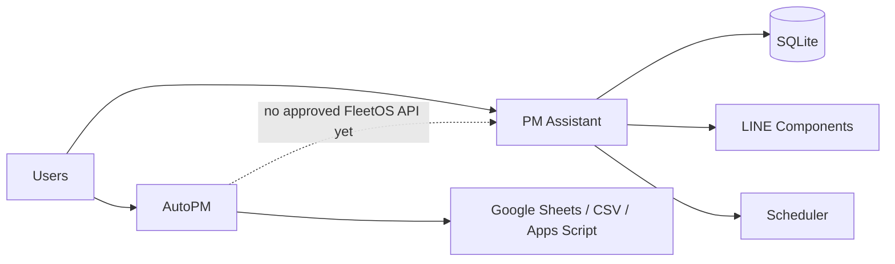
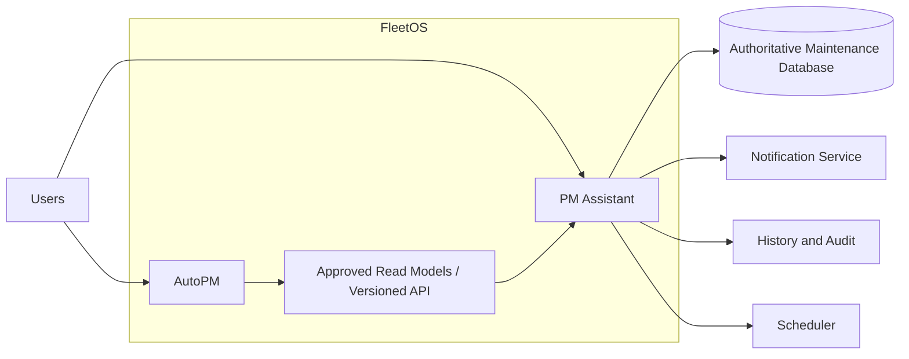
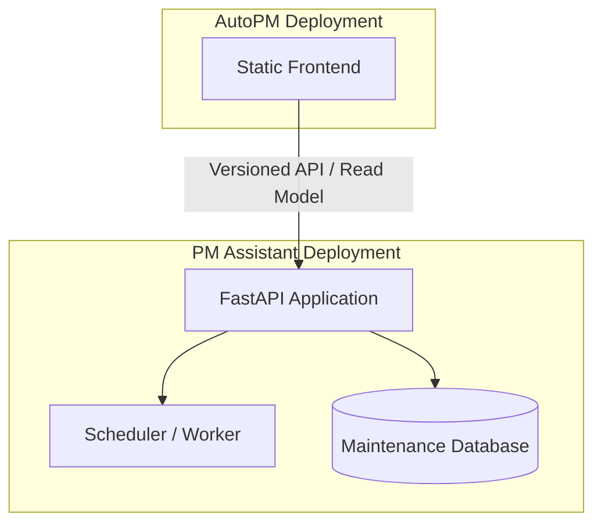

# FleetOS Architecture

## Purpose
This document records the high-level architecture baseline for **FleetOS — Fleet Operating System**. Its architecture guardrails apply with the acceptance status of their controlling sources preserved; ADRs and contracts marked `Proposed` remain proposed until separately accepted.

FleetOS is the parent platform for:
- **AutoPM**
- **PM Assistant**

This document defines module boundaries, ownership, integration principles, deployment boundaries, and target direction. It does not authorize deployment, database migration, or source-code changes.

## Architecture principles
1. Preserve AutoPM and PM Assistant as separate bounded modules.
2. Keep both modules independently deployable and reversible.
3. PM Assistant owns authoritative maintenance workflow data.
4. AutoPM consumes approved read models or versioned APIs.
5. Direct shared-database access is prohibited.
6. Shared identifiers must be defined before integration.
7. Separate current state from target state.
8. Do not claim infrastructure is operational unless verified.
9. Record major decisions through ADRs.
10. Follow FleetOS approval gates before implementation.

## Current state

### AutoPM
Role:
- Dashboard and reporting
- KPI and executive views
- PM calendar and fleet tracking
- Google Sheets / CSV / Apps Script consumption
- Fleet-facing user experience

Technology:
- HTML
- CSS
- JavaScript
- Google Apps Script
- Static hosting / Netlify-oriented deployment

Limitation:
- No formally approved versioned FleetOS integration API yet.

### PM Assistant
Role:
- PM planning
- Maintenance workflow
- Weekly PM control
- Vehicle and location masters
- PM history
- LINE notifications
- Scheduler
- Import / export
- Maintenance persistence

Technology:
- Python
- FastAPI
- SQLAlchemy
- SQLite
- APScheduler

Limitation:
- SQLite remains current persistence.
- Railway and PostgreSQL are planned, not yet verified production-ready.
- Authentication and authorization are not yet approved as operational controls.

## Current-state context

## Target state

## Module responsibilities

### AutoPM
Owns:
- Dashboard and reporting experience
- KPI and executive presentation
- Fleet-facing read views

Must not:
- Read PM Assistant database tables directly
- Write directly to PM Assistant persistence
- Duplicate PM Assistant business rules
- Become authoritative for maintenance workflow state

### PM Assistant
Owns:
- PM plan lifecycle
- Completion status
- PM history
- Notification orchestration
- Scheduler behavior
- Maintenance persistence
- Versioned integration interface

Must not:
- Depend on AutoPM frontend implementation
- Import AutoPM source code
- Require AutoPM availability for core workflows

## Authoritative ownership

| Concept | Proposed owner | Notes |
|---|---|---|
| PM plan | PM Assistant | Lifecycle and status |
| Completion status | PM Assistant | AutoPM may display |
| PM history | PM Assistant | Auditable record |
| Notification state | PM Assistant | Includes scheduler results |
| Dashboard presentation | AutoPM | Presentation only |
| KPI visualization | AutoPM | Derived from approved data |
| Vehicle identity | Pending approval | Standardization required |
| Location identity | Pending approval | Standardization required |
| Fleet/business grouping | Pending approval | Mapping contract required |

## Integration principles
1. Prefer versioned HTTP APIs or approved read models.
2. Prohibit direct database coupling.
3. Require stable shared identifiers.
4. Approve authentication and authorization before production use.
5. Define idempotency for write operations.
6. Define timeout, retry, and error behavior.
7. Use correlation IDs across modules.
8. Maintain backwards compatibility for approved versions.
9. Isolate integration failures from core availability.
10. Preserve rollback without changing authoritative ownership.

## Deployment boundaries

Rules:
- AutoPM and PM Assistant remain separate deployment units.
- AutoPM failure must not corrupt PM Assistant data.
- PM Assistant failure must not force AutoPM rollback unless an approved contract changed.
- Database migrations must be versioned and reversible.
- Scheduler design must prevent duplicate jobs in hosted or multi-process execution.

## Security baseline
Before production integration:
- Never commit secrets.
- Use deployment environment variables.
- Approve API authentication.
- Define authorization scope.
- Restrict CORS in production.
- Prevent credential leakage in logs.
- Verify webhook signatures.
- Define audit retention.

## Observability baseline
Future implementation should include:
- health endpoint
- readiness endpoint
- structured logs
- correlation IDs
- scheduler logs
- notification delivery logs
- import/export audit logs
- API error metrics
- migration logs
- integration failure visibility

## Out of scope for Phase 3.1
- Production APIs
- SQLite to PostgreSQL migration
- Railway deployment
- Netlify changes
- Authentication implementation
- LINE credential changes
- AutoPM source changes
- PM Assistant source changes
- Renaming folders, modules, URLs, tables, or screens

## Approval gates
1. Module boundaries
2. Authoritative data ownership
3. Shared identifiers
4. API direction and versioning
5. Authentication and authorization
6. PostgreSQL migration design
7. Deployment topology
8. Scheduler and notification behavior
9. Rollback procedures
10. Staging validation evidence

## Definition of done
Phase 3.1 is complete when:
- This architecture document is approved.
- ADR-0001 is approved.
- Module boundaries are accepted.
- PM Assistant is accepted as authoritative for maintenance workflow data.
- Shared-database access is prohibited.
- Current and target states are separated.
- No production code or deployment settings changed.
