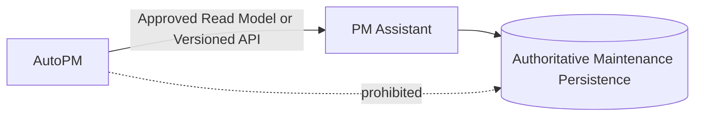

# ADR-0001: Preserve AutoPM and PM Assistant Module Boundaries

- Status: Proposed
- Date: 2026-07-11
- Decision owner: FleetOS Product Owner
- Scope: FleetOS architecture foundation

## Context
FleetOS contains two existing modules:
- AutoPM
- PM Assistant

AutoPM is primarily a dashboard and reporting experience.

PM Assistant is primarily a maintenance workflow system with planning, history, notifications, scheduling, and persistence.

Without explicit boundaries, the systems could become tightly coupled through shared database access, duplicated business rules, or deployment dependencies.

## Decision
FleetOS will preserve AutoPM and PM Assistant as separate bounded modules.

- AutoPM owns dashboard, reporting, and fleet-facing presentation.
- PM Assistant owns authoritative maintenance workflow data and persistence.
- AutoPM may consume approved read models or versioned APIs.
- Direct shared-database access is prohibited.
- Both modules remain independently deployable and reversible.

## Current-state interpretation
Repository evidence shows:
- AutoPM is frontend-oriented.
- PM Assistant contains FastAPI, SQLAlchemy, SQLite, scheduler, and notification responsibilities.
- A formal versioned FleetOS integration contract is not yet implemented.

This ADR does not claim Railway, PostgreSQL, authentication, or a production FleetOS API are operational.

## Target-state interpretation

## Consequences

### Positive
- Clear ownership
- Safer deployments
- Easier rollback
- Lower corruption risk
- Better API evolution
- Cleaner testing boundaries
- Better auditability

### Negative
- Requires explicit integration contract
- Requires shared identifier governance
- May introduce API latency
- Requires authentication design
- Requires compatibility management
- May require purpose-built read models

## Risks
- Vehicle identifiers may not match.
- Duplicate fields may cause ambiguity.
- AutoPM may temporarily use legacy sources.
- API failures may reduce dashboard freshness.
- Poor retries may duplicate write actions.
- Incomplete ownership rules may create conflicting statuses.

## Mitigations
- Define shared identity before integration.
- Keep PM Assistant authoritative for workflow state.
- Use versioned APIs.
- Use idempotency for writes.
- Use correlation IDs and structured logs.
- Validate in staging.
- Retain rollback paths.
- Keep legacy data paths until reconciliation is verified.

## Alternatives considered

### Shared database
Rejected because it couples deployments, weakens ownership, increases corruption risk, and makes rollback unsafe.

### Immediate codebase merge
Rejected because migration risk and rollback scope are too large.

### Manual synchronization only
Not selected as target architecture because it is difficult to audit, prone to stale data, and hard to scale.

## Rollback
For this documentation-only ADR:
1. Revert the documentation commit.
2. Restore the previous architecture statement.
3. Do not change source code or data during rollback.

For future implementation:
- AutoPM retains a last-known-good data path until cutover approval.
- PM Assistant retains authoritative data and backups.
- API rollout remains reversible by version or feature flag.
- Database changes use approved migration and rollback procedures.

## Approval conditions
This ADR may become Accepted when:
- Product Owner approves module responsibilities.
- Vehicle identity ownership is defined.
- Maintenance status ownership is approved.
- API-based integration is approved.
- Shared-database access is formally prohibited.
- No production code change is included.

## Result
Once accepted, future FleetOS changes must preserve these boundaries unless a later ADR explicitly supersedes this decision.
