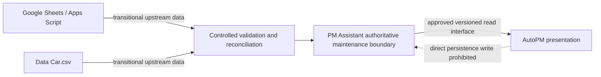

# ADR-0002: Authoritative FleetOS Data Ownership

- Status: Proposed
- Date: 2026-07-11
- Decision owner: FleetOS Product Owner
- Scope: Phase 3.2 — source of truth, identity and synchronization boundaries

## Context

FleetOS contains two bounded modules. AutoPM currently reads Google Sheets/Apps Script/CSV data and derives dashboard mileage status. PM Assistant currently persists maintenance plans, workflow status, completion, history, notification state, imports and related records in SQLite.

Without an explicit ownership decision, duplicated statuses, text-based vehicle/location matching, stale browser cache, and direct persistence coupling could corrupt or obscure maintenance truth.

This ADR does not claim that PostgreSQL, Railway, authentication, a production FleetOS API, `fleetos_vehicle_id`, or a stable location identifier is operational.

## Decision

1. PM Assistant is authoritative for:
   - PM plan;
   - `pm_workflow_status`;
   - `completion_status`;
   - PM history;
   - `notification_status`;
   - controlled import and synchronization audit.
2. AutoPM is read-only for maintenance workflow information and owns only dashboard presentation, KPI visualization, filters, presentation labels, and temporary read cache.
3. AutoPM must not write directly to PM Assistant persistence, and direct shared-database access is prohibited.
4. Google Sheets and `Data Car.csv` remain transitional upstream sources only. They are not authoritative for completion, maintenance history, or notification delivery.
5. `vehicle_no` is the transitional cross-system matching key only. It is not accepted as a permanently immutable enterprise identifier.
6. `fleetos_vehicle_id` is reserved as a proposed future canonical internal identifier. It does not exist yet and requires a later approved design.
7. `pm_mileage_status`, `pm_workflow_status`, `completion_status`, and `notification_status` are distinct concepts and must not overwrite one another.
8. Enterprise Vehicle Master ownership remains pending. The target direction is a FleetOS registry with approved ownership and provenance.
9. Location identity remains unresolved. Current text references are transitional and risky; a future stable location identity requires approval.
10. Odometer source ownership remains unresolved. Google Sheets/API is the observed current source for AutoPM. PM Assistant is the proposed future owner of accepted maintenance-mileage records after validation.

## State interpretation

### Current

- AutoPM consumes legacy upstream data and may use browser cache or local CSV fallback.
- PM Assistant owns persisted workflow state in SQLite.
- Vehicle and location references are not governed by an operational cross-system identity contract.

### Transitional

- Existing AutoPM reads may remain available as a labeled last-known-good path.
- Controlled imports reconcile upstream data without changing maintenance workflow authority.
- `vehicle_no` is used for matching with versioned normalization, provenance and exception quarantine.

### Target

- AutoPM consumes approved versioned PM Assistant read interfaces/read models.
- PM Assistant publishes authoritative workflow and accepted maintenance-mileage information.
- FleetOS registries provide stable vehicle, location and organizational identities after later approval.

## Synchronization direction

AutoPM cache is never a source for reverse synchronization. Future AutoPM commands, if any, require a separate authenticated and authorized API decision.

## Conflict resolution

- Domain ownership outranks timestamps.
- PM Assistant workflow/completion/history/notification values win over Sheet, CSV or AutoPM values.
- Mileage, workflow, completion and notification statuses remain separate.
- Identity ambiguities, duplicate rows, mismatched registrations/codes and invalid odometer sequences are quarantined.
- Imports must be idempotent and auditable; partial outcomes remain visible.
- Historical source labels and aliases are preserved.

## Consequences

### Positive

- A single authoritative maintenance workflow boundary.
- AutoPM remains independently deployable and reversible.
- Transitional sources can remain available without receiving workflow authority.
- Status semantics and stale-cache behavior become explicit.
- Future identity and integration work has defined approval gates.

### Negative

- Vehicle, location, organizational and odometer ownership gaps remain to be resolved.
- Reconciliation and alias governance add implementation effort.
- AutoPM may temporarily show differences between legacy mileage views and PM Assistant workflow state.
- A target read interface requires versioning, security, observability and compatibility design.

## Risks and mitigations

| Risk | Mitigation |
|---|---|
| `vehicle_no` collision or change | Transitional use only; retain provenance; quarantine ambiguity; reserve future canonical ID. |
| Registration/code mismatch | Treat as aliases in distinct namespaces; never auto-merge. |
| Text location rename | Preserve historical text; use reviewed aliases; design future stable ID. |
| Stale AutoPM cache | Display source/age; never reverse-sync cache. |
| Duplicate/replayed imports | Batch audit and idempotency controls. |
| Conflicting mileage | Validate measurement time, source and monotonicity; quarantine exceptions. |
| Status overwrites | Maintain four separately named status concepts. |
| Premature infrastructure assumptions | Keep the decision independent of database engine, hosting and authentication implementation. |

## Audit requirements

- Identity and mapping decisions record raw/normalized values, source, rule version, reviewer and time.
- Workflow, completion and notification transitions record actor, before/after, reason, time and correlation.
- Accepted mileage records retain raw reading, normalized reading, source, measured/received times and validation result.
- Import/sync batches retain counts, row errors, provenance, replay status and contract version.
- Audit data excludes secrets.

## Migration and reconciliation

- Inventory and classify shared identities before cutover.
- Preserve reversible source-to-canonical crosswalks.
- Reconcile master, plan, completion, history, notification and mileage domains independently.
- Shadow-test read models and compare counts/status/KPIs.
- Keep transitional reads until acceptance and rollback evidence are approved.
- Do not interpret a database migration as a transfer of data ownership.

## Rollback

- AutoPM may switch to its last-known-good read contract through a later approved feature flag/version rollback while showing staleness.
- PM Assistant retains authority for workflow changes already accepted.
- Do not reverse-sync workflow data into Google Sheets.
- Revert mapping/calculation versions while retaining raw records and audit evidence.
- Documentation-only changes can be reverted as an isolated change set.

## Alternatives considered

### Shared database

Rejected because it violates module boundaries, couples deployments, obscures ownership and makes rollback unsafe.

### Google Sheets as authoritative maintenance system

Rejected for completion, history and notification delivery because repository evidence establishes those responsibilities in PM Assistant and Sheet audit/identity controls are insufficient.

### AutoPM-calculated status as the only PM status

Rejected because mileage condition, workflow progress, completion and notification delivery are different business concepts.

### Permanently standardize on `vehicle_no`

Not accepted. It is approved only as a transitional match key; enterprise uniqueness and immutability are unproven.

## Unresolved decisions and approval gates

- Enterprise Vehicle Master owner and future registry governance.
- `fleetos_vehicle_id` design and lifecycle.
- Stable location identity and ownership.
- Odometer producer, priority, correction and reset rules.
- Fleet/business-unit hierarchy and responsibility identity.
- Status transition vocabulary, mileage thresholds and completion evidence.
- API authentication/authorization, versioning and idempotency.
- Audit retention, import atomicity and reconciliation acceptance thresholds.

## Result

If accepted, all later FleetOS work must preserve these ownership and synchronization boundaries unless a superseding ADR is approved.
