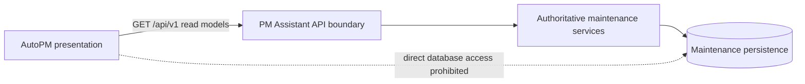

# ADR-0003 Versioned Read-Only API Boundary

- Status Proposed
- Date 2026-07-12
- Decision owner FleetOS Product Owner
- Scope Phase 3.3 — AutoPM consumption of PM Assistant maintenance information

## Context

FleetOS preserves AutoPM and PM Assistant as separate bounded modules. PM Assistant owns authoritative maintenance workflow information, while AutoPM owns dashboard and reporting presentation. Direct shared-database access is prohibited.

Repository evidence shows that PM Assistant currently exposes unversioned FastAPI routes and persists maintenance records locally, while AutoPM currently consumes Google Sheets CSV or Apps Script JSON with browser and local-file fallbacks. There is no approved versioned FleetOS integration contract.

The existing application routes, database models, and AutoPM-derived statuses are implementation evidence. They are not automatically a stable cross-module contract. Authentication, PostgreSQL, Railway, a production API, a canonical FleetOS vehicle identifier, and a stable FleetOS location identifier are not proven operational.

## Decision

FleetOS will introduce a proposed read-only HTTP boundary under `/api/v1` through which AutoPM may consume approved maintenance information from PM Assistant.

1. PM Assistant remains authoritative for PM plans, `pm_workflow_status`, `completion_status`, PM history, `notification_status`, and controlled import and synchronization audit.
2. AutoPM remains a read-only consumer and does not gain maintenance workflow authority.
3. Direct shared-database access is prohibited.
4. V1 exposes purpose-built read models rather than persistence tables, ORM objects, or current mutable CRUD schemas.
5. V1 operations are `GET`, safe, and idempotent.
6. The initial inventory covers liveness, readiness, vehicle lookup and list, PM plan list and detail, PM history, locations, dashboard summary, mileage status summary, and synchronization metadata.
7. Success and error responses use common envelopes and correlation IDs.
8. `pm_mileage_status`, `pm_workflow_status`, `completion_status`, and `notification_status` remain distinct fields and domains.
9. `vehicle_no` remains a transitional matching key only.
10. `fleetos_vehicle_id` remains a proposed future canonical identifier and must not be presented as implemented.
11. The contract remains independent of database engine, hosting provider, and authentication implementation.

Detailed endpoint and error behavior is specified in the proposed [FleetOS API Contract](../API_CONTRACT.md) and [FleetOS API Error Model](../API_ERROR_MODEL.md).

## Proposed boundary

The diagram is logical and does not claim a deployed topology.

## Versioning decision

The major API version appears in the path. Compatible v1 evolution may add endpoints, optional fields, optional filters, or error metadata. Removing or renaming fields; changing field types, nullability, identity meaning, enum semantics, status ownership, or default sorting; or otherwise changing established meaning requires `/api/v2`.

Existing unversioned `/api/...` endpoints remain internal or legacy until individually assessed. This ADR does not rename or remove them and does not declare them compatible with v1.

Deprecation requires a documented replacement, response deprecation metadata, an approved sunset date, a migration guide, and a consumer migration window. A 90-day minimum is proposed for later approval. An active version must not be retired while an approved AutoPM deployment depends on it without tested fallback and rollback evidence.

## Identity consequences

- API resource IDs are opaque strings even where current persistence uses integers.
- A local `vehicle_id`, `pm_plan_id`, or `location_id` is not promoted to an enterprise identity by exposure through the API.
- `vehicle_no` comparison uses only approved normalization rules and retains original values and provenance.
- Ambiguous or conflicting vehicle matches are quarantined or returned as explicit conflicts; the API never selects a match by timestamp or row order.
- Registration, vehicle code, fleet, business unit, and location names remain attributes or labels unless a later identity decision establishes otherwise.

## Status consequences

The versioned boundary prevents one generic `status` field from carrying unrelated meanings. Mileage condition, workflow progression, explicit completion, and notification delivery are published separately.

The current PM Assistant behavior that derives `Overdue` in the plan status requires reconciliation with the proposed workflow vocabulary. The recommended direction is to retain workflow progression separately from a derived schedule condition. No source-code or data-model change is authorized by this ADR.

Current AutoPM mileage thresholds and Thai labels remain observed behavior, not approved authoritative rules. PM Assistant may publish mileage status only after accepted input ownership, threshold behavior, reset/correction policy, and rule version are approved.

## Security and operations assumptions

- Anonymous production access is not approved.
- Authentication and authorization design remains a later gate.
- The target direction is least-privilege read-only service authorization.
- Current permissive development CORS is not a production policy.
- Health and readiness responses disclose only minimal coarse state.
- Secrets, credentials, raw webhook payloads, notification targets, and sensitive audit contents are excluded from the default contract.
- Correlation IDs support diagnostics but do not authenticate or authorize callers.
- Timeout, retry, caching, rate limiting, and staleness behavior are explicit contract concerns even though implementations are not yet operational.

## Consequences

### Positive

- Preserves module boundaries and authoritative ownership.
- Removes the need for direct shared-database access.
- Decouples AutoPM from PM Assistant tables and ORM shapes.
- Makes identity ambiguity, freshness, status semantics, and errors explicit.
- Allows PM Assistant persistence and hosting to evolve behind a stable representation.
- Supports independent deployment and rollback.
- Provides a controlled path away from legacy AutoPM feeds without making them authoritative.

### Negative

- Requires dedicated read models and compatibility tests.
- Introduces API latency, availability, caching, and operational responsibilities.
- Requires authentication, authorization, CORS, and rate-limit decisions before production use.
- Leaves vehicle, location, grouping, and odometer ownership gaps unresolved.
- Requires reconciliation between current generic status fields and separate contract domains.
- May temporarily expose differences between legacy AutoPM calculations and authoritative PM Assistant values.

## Risks and mitigations

| Risk | Mitigation |
| --- | --- |
| Current local IDs are mistaken for canonical identities | Document them as opaque local resource IDs; do not fabricate `fleetos_vehicle_id`. |
| `vehicle_no` collision or reuse | Transitional use only; retain provenance; use explicit ambiguity errors and quarantine. |
| Status domains overwrite one another | Publish four separately named fields and contract-test them. |
| Legacy `Overdue` changes workflow meaning | Approve a separate schedule-condition direction before implementation. |
| Mileage thresholds become authoritative accidentally | Require accepted input ownership and a versioned approved rule. |
| Naive timestamps cause ordering errors | Serialize only explicit RFC 3339 instants and resolve source timezone during ingestion. |
| Dashboard summaries duplicate or drift from business rules | Assign each metric definition and calculation version to the authoritative read model. |
| API failure makes AutoPM appear current | Include freshness and allow only a labeled last-known-good presentation cache. |
| Sensitive history or synchronization data leaks | Use dedicated projections, authorization scopes, and error/log redaction. |
| Unversioned routes are treated as stable | Keep them outside the v1 guarantee until reviewed. |
| Consumer and provider deployments become coupled | Use compatibility tests, overlapping versions, and a consumer feature flag or configuration switch. |

## Alternatives considered

### Direct shared database

Rejected because it violates module boundaries, exposes persistence details, couples deployments, weakens authorization, and makes rollback unsafe.

### Reuse current unversioned routes as the FleetOS contract

Rejected as the default because current routes mix read and write responsibilities, return inconsistent shapes, expose current schema vocabulary, and lack common version, pagination, freshness, correlation, and error semantics.

### Continue Google Sheets as the permanent integration boundary

Rejected as the target for authoritative workflow information. Google Sheets and Apps Script may remain transitional sources, but they are not authoritative for completion, PM history, notification delivery, or controlled synchronization audit.

### AutoPM computes every status and KPI

Rejected for authoritative maintenance meanings. AutoPM may present and filter approved data, but it must not duplicate PM Assistant workflow, completion, history, notification, or approved mileage business rules.

### Event or write API in Phase 3.3

Not selected. This phase establishes only a read-only boundary. Commands, events, webhooks, and import writes require separate authorization, idempotency, audit, and failure-semantics decisions.

## Rollout direction

1. Approve the contract, error model, identity behavior, and status vocabularies.
2. Approve authentication topology and exposure rules.
3. Build dedicated v1 response models without altering authoritative ownership.
4. Add contract and security tests.
5. Shadow-test counts, identities, statuses, timestamps, and freshness against reviewed evidence.
6. Introduce the AutoPM consumer behind an approved feature flag or configuration switch.
7. Retain and clearly label the last-known-good transitional path until cutover acceptance.
8. Observe errors, latency, cache age, identity exceptions, and summary differences before promotion.

This direction is not implementation authorization.

## Rollback

- Disable the new AutoPM consumer path through the approved feature flag or configuration.
- Restore the last-known-good read contract while visibly reporting staleness.
- Keep PM Assistant authoritative for all accepted workflow changes.
- Never reverse-synchronize AutoPM cache or legacy data into PM Assistant.
- Keep v1 available during a consumer rollback unless the provider itself is unsafe.
- Preserve issued identifiers, raw source values, reconciliation decisions, audit records, and history.
- Roll back mapping or calculation versions without rewriting source evidence.
- Database or hosting rollback, if later required, follows separate approved procedures and does not transfer ownership.

For this documentation-only decision, rollback is limited to reverting the three Phase 3.3 documentation files. No source code, database, deployment, or external service is changed.

## Approval conditions

This ADR may become Accepted when the Product Owner approves

- the `/api/v1` read-only direction and endpoint inventory;
- identity representation and transitional match behavior;
- separate status vocabularies and mileage-rule gate;
- authentication and authorization direction;
- compatibility, deprecation, caching, retry, and rate-limit direction;
- sensitive-field and audit-retention rules;
- rollout, fallback, and rollback acceptance criteria.

## Result

If accepted, future AutoPM consumption of PM Assistant maintenance information must use an approved versioned read boundary or another explicitly approved read model. It must not use direct shared-database access or transfer authoritative maintenance ownership to AutoPM.
