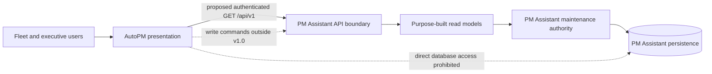
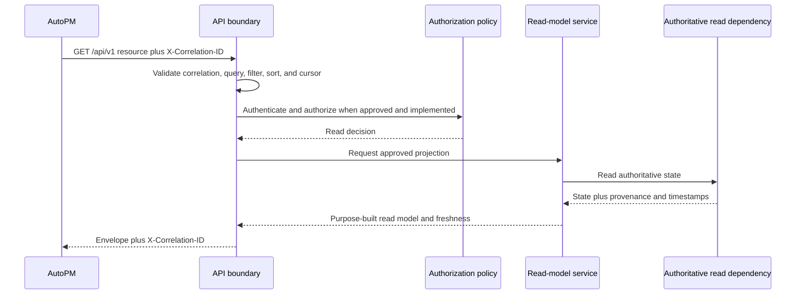
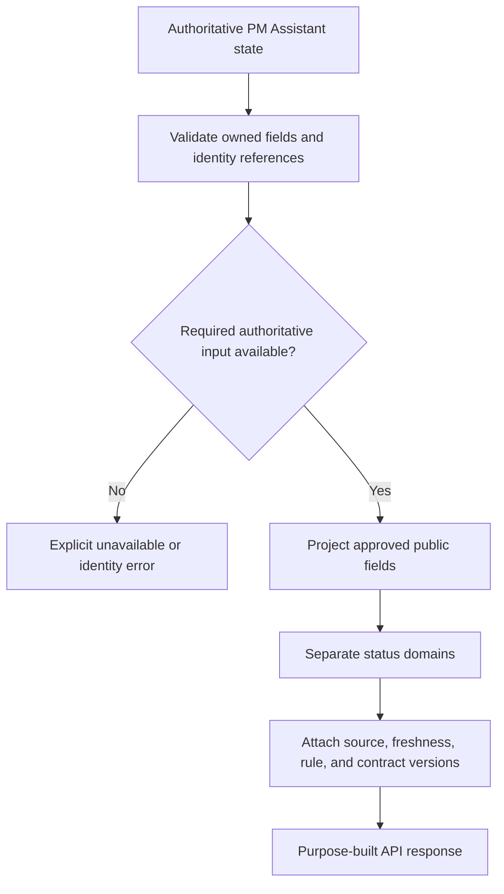

# FleetOS API Blueprint v1.0

## 1. Purpose

This document defines the proposed implementation direction for read-only integration from AutoPM to PM Assistant. It consolidates repository evidence and existing proposed contracts without changing their approval status.

The API exists to publish authoritative, purpose-built maintenance read models to AutoPM while keeping module ownership, persistence, security, deployment, and rollback boundaries explicit.

## 2. Scope

### In scope

- Proposed `/api/v1` resource and endpoint inventory.
- Provider and consumer responsibilities.
- Public request, response, error, identity, status, time, freshness, pagination, filter, sort, cache, compatibility, observability, and rollout direction.
- Safe visibility direction for notification outcomes, imports, synchronization, and audit.
- Decisions and validation gates required before implementation or production use.

### Out of scope

- Application code, database schema, data migration, deployment, or configuration changes.
- AutoPM commands or any other cross-module write API.
- Direct table, ORM, or shared-database integration.
- Approval of mileage thresholds, permissions, credentials, notification recipients, retention periods, or business KPI definitions.
- Claims that target infrastructure or controls are operational.

## 3. Consumer and provider context

The diagram is conceptual. It does not claim a deployed network, authentication mechanism, database engine, hosting provider, or production service.

## 4. Responsibilities

### PM Assistant provider

PM Assistant:

- remains authoritative for PM plans, `pm_workflow_status`, `completion_status`, PM history, `notification_status`, and controlled import and synchronization audit;
- may publish `pm_mileage_status` only after accepted mileage ownership and a versioned calculation rule are approved;
- validates request shape and identity matching;
- generates purpose-built read models instead of exposing persistence objects;
- returns explicit source, freshness, rule, and contract metadata;
- applies approved authentication, authorization, redaction, rate, cache, and observability controls when implemented;
- never treats a missing authoritative dataset as a successful zero result.

### AutoPM consumer

AutoPM:

- remains read-only for maintenance workflow information;
- owns dashboard layout, KPI visualization, filters, labels, and user interaction;
- consumes canonical API fields without recomputing PM Assistant workflow, completion, notification, or approved mileage rules;
- tolerates documented optional fields and safely renders unknown enum values;
- displays source, age, stale state, and fallback use;
- uses only a bounded last-known-good presentation cache;
- never reverse-synchronizes cache, Sheet, CSV, or display state into PM Assistant.

## 5. Current unversioned implementation evidence

Current repository evidence includes:

- PM Assistant FastAPI routes under unversioned `/api/...` paths for plans, locations, summaries, vehicle data, history, import logs, notification logs, settings, reports, diagnostics, and workflow actions.
- A mixture of `GET`, `POST`, `PUT`, `PATCH`, and `DELETE` operations under the same unversioned surface.
- Pydantic responses closely aligned with current SQLAlchemy fields and local integer identifiers.
- Generic plan `status`, including current behavior that may derive `Overdue` from dates.
- Unpaginated lists, endpoint-specific response shapes, default FastAPI error behavior, and no common success/error envelope.
- A development CORS policy permitting all origins, methods, and headers.
- A diagnostic `/api/system/health` route that checks implementation-specific dependencies and is not the proposed minimal health contract.
- AutoPM ingestion from Apps Script/Google Sheets CSV, browser cache, and local `data.csv`, with browser-side mileage categorization.

These observations explain current behavior only. They do not approve the current paths, response shapes, IDs, status semantics, diagnostics, or security behavior as FleetOS v1.0.

### Current route inventory

The current `pm-assistant/main.py` evidence contains 58 FastAPI route declarations: 29 `GET`, 23 `POST`, two `PUT`, one `PATCH`, and three `DELETE`. This inventory is a point-in-time code observation, not an endorsement, completeness guarantee for deployed environments, or public contract.

| Area | Observed current routes |
| --- | --- |
| PM plans | `GET /api/plans`; `POST /api/plans`; `PUT /api/plans/{plan_id}`; `POST /api/plans/bulk-delete`; `DELETE /api/plans/{plan_id}`; `GET /api/plans/export`; `GET /api/plans/export-xlsx`; `POST /api/plans/import`; `GET /api/plans/{plan_id}/history`; `POST /api/plans/import/preview`; `POST /api/plans/import/confirm` |
| Locations | `GET /api/locations`; `POST /api/locations`; `PUT /api/locations/{loc_id}`; `DELETE /api/locations/{loc_id}`; `GET /api/locations/export`; `GET /api/locations/export-xlsx`; `POST /api/locations/import` |
| Vehicles and summaries | `GET /api/vehicles`; `POST /api/vehicles/sync-data-car`; `GET /api/cars`; `GET /api/summary` |
| Settings and scheduler | `GET /api/settings`; `POST /api/settings`; `POST /api/settings/test-line`; `POST /api/settings/trigger-daily`; `POST /api/assistant/scheduler/enable` |
| LINE and notification diagnostics | `POST /line/webhook`; `GET /api/line/targets`; `POST /api/line/targets/use`; `GET /api/line/webhook-info`; `GET /api/line/debug/status`; `GET /api/line/inspector`; `GET /api/line/request-history`; `GET /api/line/webhook-events`; `GET /api/line/error-analyzer`; `POST /api/line/simulator`; `GET /api/notification-logs` |
| System and developer diagnostics | `GET /api/system/health`; `GET /api/system/logs/{log_name}`; `POST /api/dev/api-test`; `GET /api/system/snapshot` |
| Import visibility | `GET /api/import-logs` |
| Assistant workflow | `GET /api/assistant/today`; `POST /api/assistant/plans/{plan_id}/complete`; `POST /api/assistant/plans/{plan_id}/pause`; `POST /api/assistant/plans/{plan_id}/resume`; `POST /api/assistant/plans/{plan_id}/followup`; `GET /api/assistant/weekly-summary` |
| Reports | `GET /api/reports/preview`; `POST /api/reports/send` |
| Weekly control | `GET /api/weekly-control`; `PATCH /api/weekly-control/items/{item_id}`; `DELETE /api/weekly-control/items/{item_id}`; `POST /api/weekly-control/import`; `GET /api/weekly-control/template`; `POST /api/weekly-control/send-line` |
| Application root | `GET /` |

The inventory demonstrates why simple path-prefixing is insufficient: current routes mix reads, writes, exports, imports, diagnostics, settings, notifications, and UI behavior. Only individually specified `EP-*` read models can enter the proposed v1 boundary.

## 6. Transitional API and read-model direction

The transition is reversible and comparison-driven:

1. Inventory legacy source fields and current PM Assistant fields without declaring either a public model.
2. Resolve or quarantine identity matches using an approved, versioned `vehicle_no` normalization rule.
3. Project dedicated read models alongside current behavior without changing authoritative writes.
4. Publish the proposed `/api/v1` path in shadow mode only after applicable decisions are approved.
5. Compare legacy and target identities, counts, status distributions, dates, timestamps, KPI inputs, errors, and freshness.
6. Keep differences visible and assign an approved disposition; do not auto-merge by timestamp or row order.
7. Introduce the AutoPM consumer through an approved configuration or feature switch.
8. Preserve a clearly labeled last-known-good read path until cutover acceptance.

## 7. FleetOS v1.0 target API

The target is a JSON HTTP API under `/api/v1` using only safe, read-only `GET` operations. It contains the core resources `RES-001` through `RES-008`. Directional visibility resources `RES-009` through `RES-011` require additional exposure decisions before they enter an implementation baseline.

The target contract uses:

- lowercase plural kebab-case resource paths;
- `snake_case` fields and query parameters;
- opaque string resource identifiers;
- common `data` and `meta` envelopes;
- explicit correlation and freshness metadata;
- cursor pagination for lists;
- allowlisted filters and sorts;
- ISO 8601 dates and RFC 3339 datetimes with explicit offsets;
- preserved Unicode and Thai text;
- four explicitly separate status domains;
- stable error codes and safe redacted details;
- purpose-built projections independent of ORM and database changes.

See the [Resource and Endpoint Catalog](RESOURCE_AND_ENDPOINT_CATALOG.md) and [Request and Response Models](REQUEST_RESPONSE_MODELS.md).

## 8. Request flow

Authentication and authorization in the diagram are target responsibilities, not current operational evidence.

## 9. Read-model generation

Projection must not infer missing ownership, fabricate canonical identity, leak persistence fields, or serialize raw legacy audit payloads.

## 10. Health and readiness

- `EP-001` reports process liveness only.
- `EP-002` reports whether essential authoritative read dependencies can serve the API.
- Both expose coarse state, use `Cache-Control: no-store`, and disclose no host, engine, schema, path, credential, target, or provider topology.
- Probe exposure and authentication remain `DEC-009`.
- Essential readiness dependencies remain `DEC-015`.

## 11. Synchronization and freshness

Every business response identifies response-generation time separately from represented-data time. The common metadata distinguishes:

- `generated_at`: when the response was generated;
- `freshness.as_of`: newest authoritative state represented by the read model;
- `freshness.is_stale`: result of an approved staleness rule;
- optional `freshness.stale_reason` and source timestamps when safe;
- contract, mapping, normalization, and calculation versions when applicable.

`EP-011` exposes safe run-level synchronization metadata. AutoPM browser timestamps are not authoritative synchronization audit.

## 12. Notification, import, and audit visibility

- `EP-012` is a proposed aggregate notification-status read direction. It must not expose recipients, message bodies, tokens, or raw provider responses.
- `EP-013` is proposed import-batch visibility with counts, safe provenance, replay disposition, versions, timing, and a redacted error summary.
- `EP-014` is a proposed restricted audit projection. It is not approved for implementation until access, privacy, retention, actor visibility, and before/after redaction are resolved.
- These three endpoints are gated candidates beyond the current proposed endpoint contract and require `DEC-012` and `DEC-013` before implementation.

## 13. Future capabilities outside v1.0

The following require separate contracts and approval:

- AutoPM create, update, cancel, complete, import, or notification commands;
- write APIs, webhooks, event distribution, or bidirectional synchronization;
- enterprise vehicle, location, organization, or person registries;
- direct telematics ingestion;
- additional notification channels or user-configurable routing;
- cross-module bulk exports containing sensitive audit detail;
- public or partner API access;
- a new major API version.

Future commands require explicit authorization, concurrency, idempotency, replay, audit, validation, error, and rollback semantics.

## 14. Architecture and implementation impact

This Phase 4.2 change is documentation-only. It changes no runtime component.

A later approved implementation would add a logical projection/read-model boundary within PM Assistant and a read adapter within AutoPM. It would not transfer authority, merge modules, or require a particular persistence engine or hosting provider. Current writes remain within PM Assistant. Current unversioned routes remain unchanged and outside the v1 compatibility guarantee unless separately assessed.

## 15. Risk and rollback direction

Primary design risks are mistaken operational claims, accidental promotion of local IDs, status conflation, unsafe history exposure, stale data presented as current, contract drift, and premature coupling to current tables or infrastructure. The model, compatibility, security, and validation documents define mitigations.

For Phase 4.2 documentation, rollback is an isolated revert of the seven `docs/api/` files by the Product Owner. A later implementation rollback must disable the AutoPM target consumer path, retain PM Assistant authority, preserve raw source and audit evidence, show fallback staleness, and never reverse-synchronize AutoPM cache.

## 16. Definition of API Blueprint complete

The Blueprint is documentation-complete when:

1. All seven approved documents exist and their links resolve.
2. Every required `RES-*`, `EP-*`, `REQ-*`, `RSP-*`, `ERR-*`, `COMP-*`, `VAL-*`, and `DEC-*` identifier is unique and cross-referenced.
3. Current, transitional, target, and future states remain distinguishable.
4. Ownership, read-only behavior, identity, status separation, security direction, compatibility, and rollback comply with governing documents.
5. Examples contain no secret or sensitive operational data.
6. Markdown, Mermaid, terminology, dates, Unicode, and Thai text pass the documentation validation plan.
7. The exact changed-file set contains only the approved `docs/api/` files.

Blueprint completion does not mean the API is implemented, accepted for production, deployed, or operational.
