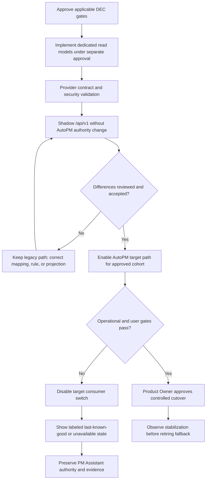

# FleetOS API Validation and Rollout

## Purpose and status

This document defines validation gates, unresolved Product Owner decisions, shadow rollout, rollback, and the completion criteria for the proposed FleetOS API Blueprint.

It authorizes no source-code change, API exposure, data migration, deployment, notification, credential, or external-service action. Implementation and production rollout require later approvals.

## Validation principles

1. Documentation evidence does not prove runtime behavior.
2. Provider, consumer, security, data, and operational validation are separate gates.
3. A missing authoritative dataset is not a successful empty result.
4. Differences found in shadow mode remain visible until reviewed; they are not normalized away to make counts match.
5. Validation uses synthetic or approved sanitized data, including Thai Unicode and date-boundary cases.
6. No production credential, target, raw webhook, database, or sensitive record is copied into a fixture or report.
7. A pass supports review but never substitutes for Product Owner approval.

## Validation gate registry

| ID | Gate | Required evidence |
| --- | --- | --- |
| `VAL-001` | Governance and scope | Correct approved branch; exact approved file list; clean baseline; no prohibited Git, source, database, deployment, or external action. |
| `VAL-002` | Markdown structure | Valid headings, lists, tables, code fences, examples, and readable document hierarchy. |
| `VAL-003` | Link integrity | Every local relative link resolves with correct case and no unapproved external dependency. |
| `VAL-004` | Mermaid integrity | Balanced Mermaid fences, valid conceptual syntax, and no diagram presented as operational topology. |
| `VAL-005` | Identifier integrity | Every `RES-*`, `EP-*`, `REQ-*`, `RSP-*`, `ERR-*`, `COMP-*`, `VAL-*`, and `DEC-*` is unique, defined once in its registry, and cross-referenced consistently. |
| `VAL-006` | State and terminology | Current evidence, transitional direction, v1 target, and future scope are distinct; FleetOS, AutoPM, PM Assistant, and canonical terms match governing documents. |
| `VAL-007` | Architecture and ownership | PM Assistant authority, AutoPM read-only behavior, module separation, no shared database, and no v1 writes are preserved. |
| `VAL-008` | Public model contract | Purpose-built models, opaque IDs, null/empty semantics, envelopes, dates, freshness, pagination, filter, sort, and four-status separation are internally consistent. |
| `VAL-009` | Provider contract | Later PM Assistant tests verify path/method, schemas, error mapping, correlation, authorization, pagination, cache/freshness, redaction, and unavailable behavior. |
| `VAL-010` | Consumer compatibility | Later AutoPM tests verify unknown fields/enums, nullable values, error classes, cursors, stale/fallback display, retry bounds, and no authoritative rule duplication. |
| `VAL-011` | Error and correlation | Every failure maps to a stable safe error; response/header correlation matches; invalid inbound IDs are replaced; logs remain redacted. |
| `VAL-012` | Security and secret safety | Operational-claim review, least-privilege design, sensitive-field review, restricted CORS direction, safe probes, and scans for secrets/tokens/paths/targets. |
| `VAL-013` | Unicode and time | UTF-8 Thai preservation, normalization non-destruction, Gregorian/Buddhist Era cases, explicit-offset datetimes, timezone boundaries, and ambiguous-date rejection. |
| `VAL-014` | Shadow reconciliation | Reviewed comparisons of identities, counts, statuses, dates, KPI inputs, freshness, errors, latency, and missing/ambiguous cases with documented dispositions. |
| `VAL-015` | Rollout and rollback rehearsal | Approved consumer switch, last-known-good behavior, stale labeling, provider continuity, failure triggers, evidence retention, and no reverse synchronization are demonstrated. |
| `VAL-016` | Product Owner acceptance | Required decisions are approved or explicitly deferred, residual risk is accepted, and implementation/cutover scope receives separate approval. |

For Phase 4.2 documentation completion, `VAL-001` through `VAL-008`, the documentation portions of `VAL-011` through `VAL-013`, and identifier/secret review are applicable. Runtime gates remain future requirements and must be reported as not run, not passed.

## Documentation validation procedure

After creating or changing this Blueprint:

1. Confirm the active branch and exact `git status` file set.
2. Check Markdown structure and code-fence balance.
3. Resolve every relative link from its owning file.
4. Check Mermaid blocks structurally and render them if an already-approved local tool exists.
5. Extract identifier definitions and references; verify uniqueness, ranges, and orphan references.
6. Search for prohibited generic status use, fabricated identity, write authorization, direct database access, and unsupported operational claims.
7. Check UTF-8 decoding and representative Thai text.
8. Scan examples and prose for secret-like patterns, credentials, target identifiers, connection strings, paths in response models, and unsafe raw data.
9. Review the diff against the approved seven-file scope.
10. Record passes, failures, warnings, unavailable tools, remaining decisions, and tests not run.

Tool absence is a limitation, not a successful validation result. No new repository dependency is added solely to validate Phase 4.2 without approval.

## Future provider validation strategy

Before any endpoint is implementation-ready, tests must cover:

- endpoint method, versioned path, media type, and common envelopes;
- request allowlists, length/format bounds, invalid combinations, and redaction;
- deterministic ordering, tie-breakers, cursor binding, expiry, and pagination continuity;
- list empty, summary zero, singular not-found, ambiguous identity, conflict, and unavailable-data behavior;
- public field types, requiredness, nullability, enum behavior, and ORM/table isolation;
- all four status domains and absence of generic status conflation;
- correlation generation, validation, propagation, header/envelope equality, and safe logs;
- authentication and authorization failures after `DEC-009` is resolved;
- cache validators, cache-control, freshness, timeout, retry, and rate behavior;
- Thai Unicode, combining characters, normalized comparison, explicit offsets, and date boundaries;
- dependency failure, recovery, readiness, latency, and safe observability;
- notification, import, synchronization, history, and audit projections against redaction rules.

## Future consumer validation strategy

AutoPM must be tested against provider fixtures and failure simulations for:

- ignored unknown fields and safely displayed unknown enums;
- `null`, omitted authorized expansions, and empty collections;
- independent presentation of mileage, workflow, completion, and notification status;
- no browser recalculation of authoritative PM Assistant meanings;
- valid cursor following and reset when filters/sorts change;
- `400`, `401`, `403`, `404`, `409`, `429`, `500`, `503`, and `504` classes;
- bounded retry and `Retry-After` handling;
- target, stale target, last-known-good, and unavailable UI states;
- source, `as_of`, age, rule version, and fallback labels;
- feature/configuration switch behavior and rollback;
- Thai text, locale presentation, accessibility, responsive behavior, and keyboard use.

## Shadow validation

Shadow reads do not change authoritative state and do not authorize AutoPM writes.

Compare by domain rather than forcing one combined total:

| Domain | Minimum comparison |
| --- | --- |
| Identity | Exact, normalized, missing, ambiguous, conflicting, duplicate, and changed `vehicle_no`; aliases remain namespaced. |
| PM plans | Counts, vehicle reference, planned/deadline/actual dates, location snapshot, workflow and completion values. |
| Mileage | Accepted input presence, reading time, source class, remaining-distance input, rule version, status, unknown/stale distribution. |
| Dashboard | Population definition, filters, grouped counts, zero behavior, calculation version. |
| Notification | Intent/attempt distinction, status counts, last attempt, redaction, duplicates, retry outcome. |
| Import/sync | Batch/run counts, accepted/rejected/ambiguous outcomes, replay disposition, versions, timestamps, last success, stale state. |
| History/audit | Event ordering, actor/process safety, correlation, redaction, retention boundary, missing evidence. |
| Operations | Latency, timeouts, error classes, readiness, cache age, and fallback duration. |

Acceptance thresholds are not invented here; they are `DEC-018` where related to deletion/tombstones and otherwise part of `VAL-016` rollout approval. Any quantitative reconciliation threshold must be proposed with evidence and approved before use.

## Shadow rollout and rollback flow

The flow is conceptual and vendor-neutral. It does not claim that feature flags, environments, monitoring, or deployment automation currently exist.

## Rollout stages

### Stage 0 — Decision baseline

- Resolve the decisions required by the selected endpoints.
- Confirm Proposed ADR/API status and obtain separate implementation approval.
- Freeze initial provider/consumer fixtures and compatibility expectations.

### Stage 1 — Provider read models

- Implement dedicated projections without changing AutoPM or exposing ORM/table objects.
- Preserve PM Assistant write authority and current unversioned behavior unless separately scoped.
- Pass provider, security, identity, time, and error tests.

### Stage 2 — Shadow API

- Serve approved non-production or controlled shadow requests.
- Compare data domains and record safe reconciliation evidence.
- Do not expose directional candidates until their decisions and contract expansion are approved.

### Stage 3 — AutoPM shadow consumer

- Add the target adapter behind an approved switch.
- Keep legacy display/fallback available and labeled.
- Measure differences, latency, failures, cache age, and unknown values.

### Stage 4 — Controlled cohort

- Enable only for the approved environment/cohort.
- Confirm user interpretation of status separation, stale data, and failure states.
- Exercise rollback without changing authoritative data.

### Stage 5 — Product Owner cutover

- Require `VAL-009` through `VAL-016` and no open stop condition.
- Retain provider/consumer overlap for the approved stabilization period.
- Retire legacy consumption only under separate approval and `COMP-012`.

## Stop and rollback triggers

Rollback or stop promotion when any of the following occurs:

- identity ambiguity is auto-resolved, silently merged, or materially above an approved threshold;
- status domains are conflated or an unapproved rule changes counts;
- missing authoritative input appears as current zero or empty success;
- Thai text, dates, offsets, or normalization are corrupted;
- sensitive fields, credentials, targets, raw payloads, paths, or topology are exposed;
- authorization, CORS, cache isolation, or scope behavior violates the approved design;
- pagination duplicates/omits resources or changes query meaning;
- stale/fallback data is displayed as current;
- latency, timeout, readiness, or error behavior exceeds approved gates;
- reconciliation evidence is incomplete or unexplained;
- provider and consumer versions are incompatible;
- rollback cannot preserve PM Assistant authority and audit evidence.

## Rollback procedure direction

1. Disable the AutoPM target consumer through the approved switch.
2. Display a labeled last-known-good representation only within its approved age; otherwise show unavailable.
3. Keep PM Assistant authoritative for all accepted workflow, completion, notification, import, and history state.
4. Never reverse-synchronize AutoPM cache, Sheet, CSV, or legacy display data.
5. Keep the provider version available when it remains safe and is needed to diagnose or support consumer rollback.
6. Preserve issued resource references, raw source values, mapping decisions, rule versions, history, and audit evidence.
7. Roll back a mapping or calculation version without rewriting raw accepted inputs.
8. Reconcile identities, counts, statuses, timestamps, and access after rollback.
9. For a security incident, revoke/rotate affected credentials forward; never restore compromised values.

Database or hosting rollback follows separate approved procedures and does not transfer data ownership.

## Unresolved Product Owner decision register

| ID | Decision required | Blocks |
| --- | --- | --- |
| `DEC-001` | Enterprise Vehicle Master owner; `fleetos_vehicle_id` representation, generation, merge/split, and retirement. | Canonical identity and enterprise joins. |
| `DEC-002` | `vehicle_no` normalization version, exact-match rules, ambiguity/conflict policy, alias governance, and lookup exposure. | `EP-003`, identity filtering, reconciliation. |
| `DEC-003` | Location, fleet, business-unit, and responsibility ownership; stable location identity, aliases, renames, and safe attributes. | `EP-008` and grouping consistency. |
| `DEC-004` | Odometer producer/owner, source priority, measured/received time, reset/replacement, correction, monotonicity, and freshness policy. | `EP-010` and mileage fields elsewhere. |
| `DEC-005` | Final workflow, completion, mileage, notification vocabularies; mileage thresholds/boundaries; schedule-condition model; completion evidence/reopen/backdating. | Status publication and calculations. |
| `DEC-006` | Dashboard KPI definitions, counted population, exclusions, grouping semantics, historical `as_of`, and calculation versions. | `EP-009`. |
| `DEC-007` | Import/sync batch identity, checksum, idempotency, replay window, atomicity/partial success, resume, confirmation, and source retention. | `EP-011` and `EP-013`. |
| `DEC-008` | Notification intent/attempt model, recipient authorization, duplicate suppression, retry classification, channel grouping, and status derivation. | `EP-012` and notification expansions. |
| `DEC-009` | Authentication/proxy topology, service/human identities, scopes, credential lifecycle, TLS, CORS, probe exposure, and existence-disclosure policy. | Any production exposure. |
| `DEC-010` | Freshness and staleness rules per resource, stale reason vocabulary, source timestamp precedence, and unavailable threshold. | All business responses and fallback UI. |
| `DEC-011` | Cache lifetimes, `ETag` generation, cursor lifetime/snapshot semantics, timeouts, retry bounds, and stale-if-error behavior. | Performance and compatibility acceptance. |
| `DEC-012` | Public/sensitive field classification, history actor visibility, description/address/note exposure, notification/import redaction, and field-level authorization. | `EP-006` through `EP-014` as applicable. |
| `DEC-013` | API/log/audit/import/history retention, access, privacy, correction/deletion obligations, and safe operational review. | History, synchronization, import, notification, and audit visibility. |
| `DEC-014` | Correlation-ID format, character/length limits, trusted proxy behavior, invalid-input handling, and propagation scope. | Common success/error behavior and observability. |
| `DEC-015` | Essential readiness dependencies, coarse dependency names, readiness ownership, and alert/escalation behavior. | `EP-002` and operational acceptance. |
| `DEC-016` | Rate-limit identity, sustained/burst limits, route weights, probe policy, response metadata, and environment differences. | Production load/security gate. |
| `DEC-017` | Deprecation metadata, minimum migration window, sunset authority, overlap, and legacy-path retirement criteria. | Version retirement and `COMP-012`. |
| `DEC-018` | Deleted-resource/tombstone visibility, plan/history retention after deletion, correction semantics, and quantitative reconciliation/cutover thresholds. | `EP-006`, history continuity, and final cutover acceptance. |

An unresolved decision is not permission to select a convenient default. Decisions may be explicitly deferred only when the affected endpoint or field remains gated and the remaining implemented contract is coherent.

## Definition of API Blueprint complete

Phase 4.2 is complete when:

- all seven approved `docs/api/` files exist and no unapproved file changed;
- `VAL-001` through `VAL-008` and applicable documentation checks in `VAL-011` through `VAL-013` pass or have explicit reported limitations;
- identifier definitions and references are unique and complete;
- all required content is covered without operational overclaim;
- the exact changed-file list, diff summary, validation results, residual risks, and decisions are handed to the Product Owner;
- no commit, push, pull, PR, merge, deployment, migration, or external write occurs.

This definition completes the documentation Blueprint only. Runtime gates `VAL-009` through `VAL-016` remain future work until implementation and rollout are separately approved.
