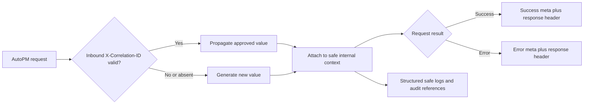

# FleetOS Error, Pagination, and Filtering Model

## Purpose and status

This document assigns stable `ERR-*` identifiers to the error cases in the existing Proposed API Error Model and defines consistent list-query behavior. It does not claim that custom errors, correlation middleware, authentication, rate limiting, or the versioned API are implemented.

## Common error envelope

```json
{
  "error": {
    "code": "IDENTITY_AMBIGUOUS",
    "message": "The transitional vehicle number does not identify one vehicle.",
    "details": [
      {
        "field": "vehicle_no",
        "reason": "multiple_matches"
      }
    ],
    "retryable": false
  },
  "meta": {
    "api_version": "v1",
    "generated_at": "2026-07-16T08:15:30Z",
    "correlation_id": "01J00000000000000000000000"
  }
}
```

Rules:

- `code` is stable `UPPER_SNAKE_CASE` machine-readable text.
- `message` is a safe human-readable summary and is not program logic.
- `details` is optional structured context using public field names only.
- `retryable` classifies the error; it is not a promise that retry succeeds.
- `meta` and the `X-Correlation-ID` response header carry the same correlation ID.
- Errors never expose stack traces, SQL, engine/connection details, hosts, schemas, filesystem paths, credentials, tokens, raw webhooks, notification targets, raw provider responses, or unrestricted source rows.

## Error registry

| ID | HTTP | Code | Meaning | Retryable |
| --- | --- | --- | --- | --- |
| `ERR-001` | `400` | `INVALID_REQUEST` | Request syntax, parameter, or combination is invalid. | No |
| `ERR-002` | `400` | `INVALID_FILTER` | Filter name or value is unsupported. | No |
| `ERR-003` | `400` | `INVALID_SORT` | Sort field or direction is unsupported. | No |
| `ERR-004` | `400` | `INVALID_CURSOR` | Cursor is malformed, expired, or incompatible with the query. | No |
| `ERR-005` | `400` | `INVALID_DATE_RANGE` | Date/time range is invalid or ambiguous. | No |
| `ERR-006` | `401` | `AUTHENTICATION_REQUIRED` | Approved authentication is required but absent. | No |
| `ERR-007` | `401` | `INVALID_CREDENTIALS` | Supplied credentials cannot be accepted. | No |
| `ERR-008` | `403` | `INSUFFICIENT_SCOPE` | Authenticated caller lacks the required read scope. | No |
| `ERR-009` | `404` | `VEHICLE_NOT_FOUND` | Singular vehicle lookup has no match. | No |
| `ERR-010` | `404` | `PM_PLAN_NOT_FOUND` | Requested plan does not exist or is not visible. | No |
| `ERR-011` | `404` | `LOCATION_NOT_FOUND` | Requested location does not exist or is not visible. | No |
| `ERR-012` | `409` | `IDENTITY_AMBIGUOUS` | Transitional identity matches multiple candidates. | No |
| `ERR-013` | `409` | `IDENTITY_CONFLICT` | Source identities or attributes are incompatible. | No |
| `ERR-014` | `429` | `RATE_LIMITED` | Caller exceeded an approved limit. | Yes, after `Retry-After` |
| `ERR-015` | `500` | `INTERNAL_ERROR` | Unexpected failure not represented by a safer specific code. | Conditional |
| `ERR-016` | `503` | `SERVICE_NOT_READY` | The read boundary is not ready. | Yes |
| `ERR-017` | `503` | `DEPENDENCY_UNAVAILABLE` | An essential authoritative read dependency is unavailable. | Yes |
| `ERR-018` | `503` | `READ_MODEL_UNAVAILABLE` | Required accepted data or an approved calculation cannot be supplied. | Yes |
| `ERR-019` | `504` | `DEPENDENCY_TIMEOUT` | An internal dependency exceeded its deadline. | Yes |

`ERR-006` through `ERR-008` and `ERR-014` reserve target behavior. Their presence is not evidence that authentication, authorization, or rate limiting currently exists.

## Validation details

A safe detail may contain:

```json
{
  "field": "planned_from",
  "reason": "must_not_be_after_planned_to",
  "value": "2026-07-31"
}
```

`value` must be omitted or redacted for credentials, authorization material, personal data, notification targets, free text, source rows, raw payloads, or other sensitive input. Multiple details may be returned, but order is not a compatibility guarantee.

## Correlation flow



Correlation rules:

- Exact format, allowed characters, maximum length, and trusted-proxy behavior are `DEC-014`.
- Invalid inbound values are not echoed; the service generates a new value.
- Free text, secrets, personal data, and notification targets are forbidden in a correlation ID.
- Correlation supports diagnostics only. It does not authenticate, authorize, establish causation or ordering, or make a request idempotent.

## Empty result versus error

| Condition | Result |
| --- | --- |
| Valid list query with no matches | `200`, `data: []`, `next_cursor: null` |
| Valid summary over an authoritative empty population | `200` with all defined counts explicitly zero |
| Missing singular vehicle | `ERR-009` |
| Missing singular plan | `ERR-010` |
| Missing singular location if a later detail endpoint is approved | `ERR-011` |
| Ambiguous transitional identity | `ERR-012`; never auto-select |
| Conflicting identity attributes | `ERR-013`; never auto-merge |
| Required authoritative data or approved rule absent | `ERR-018`; never fabricate a zero result |
| Unsupported filter or sort | `ERR-002` or `ERR-003`; never ignore silently |

Authorization may intentionally return `404` rather than `403` when resource-existence disclosure is unsafe. That policy must be consistent after `DEC-009` is approved.

## Cursor pagination

All list endpoints use opaque cursor pagination.

1. Default `page_size` is 50; maximum is 200.
2. `page_size` must be a positive integer within the approved limit.
3. `cursor` is server-issued opaque text. Clients do not inspect, construct, or modify it.
4. A cursor is bound to endpoint, filters, sort, authorization context where applicable, and snapshot/freshness semantics.
5. Changing a bound input invalidates the cursor and returns `ERR-004`.
6. Cursor expiry is allowed but must be documented; duration remains `DEC-011`.
7. Every sort includes a stable unique resource-ID tie-breaker to prevent omission or duplication among equal values.
8. `next_cursor: null` means the current result is the final page.
9. Total counts are omitted by default because computing them may be costly or inconsistent with snapshot semantics; a total is returned only when the endpoint explicitly defines it.
10. The provider must document whether a cursor represents a stable snapshot or best-effort continuation before implementation.

## Filtering

- Each `REQ-*` model is the allowlist for its endpoint.
- Filter names and values use public contract vocabulary, never ORM or table names.
- Repeated values or comma-separated multi-values are unsupported until one representation is explicitly selected.
- Exact, prefix, case, whitespace, and Unicode normalization behavior must be documented per filter.
- Vehicle identity comparison follows `DEC-002`; generic case folding or digit stripping is not assumed.
- Status filters belong to exactly one named status domain.
- Date ranges are inclusive unless an endpoint explicitly documents otherwise; implementation must use one consistent boundary model.
- `from` after `to`, ambiguous source timezone, invalid calendar values, or mixed unsupported date forms return `ERR-005`.
- Unknown filters return `ERR-002` even if the provider could ignore them.
- Sensitive free-text, message-content, raw-payload, and raw-row filters are excluded.

## Sorting

Syntax is `sort=field,-other_field`, where `-` means descending.

- Each endpoint defines an explicit sort allowlist in `REQ-*`.
- The provider appends the documented resource-ID tie-breaker if the client omits it.
- Default sorting is part of the v1 contract.
- Null placement must be defined before implementation and remain stable within v1.
- Locale-aware display sorting may differ from canonical API order; AutoPM may reorder presentation locally only when doing so does not change pagination semantics.
- Unknown fields, repeated direction markers, or invalid combinations return `ERR-003`.
- Changing default sort, null placement, or established collation semantics is compatibility-sensitive under `COMP-006`.

## Retry direction

AutoPM may retry connection failures and `ERR-014`, `ERR-016`, `ERR-017`, `ERR-018`, or `ERR-019` at most twice with exponential backoff and jitter. It must honor `Retry-After`. A gateway `502` without a FleetOS JSON envelope may be treated as a transient transport failure using the same bound.

AutoPM must not automatically retry `ERR-001` through `ERR-013`. `ERR-015` is retried only if a later approved classification explicitly marks that occurrence retryable.

All v1 operations are safe `GET` operations, but a retry may observe newer data and is not guaranteed to return an identical representation.

## Error compatibility

- An existing code retains its meaning for the lifetime of v1.
- Reusing a code for a different condition is breaking.
- Removing a required envelope field or changing its type is breaking.
- Adding optional safe detail members is compatible.
- Adding a new code for a previously undocumented condition is normally additive, but clients retain an HTTP-class fallback.
- Human-readable messages may change and may be localized; clients branch only on HTTP status and `code`.
