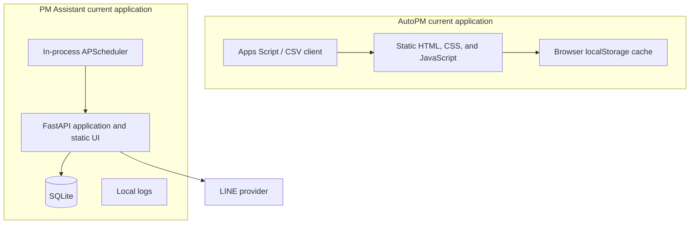
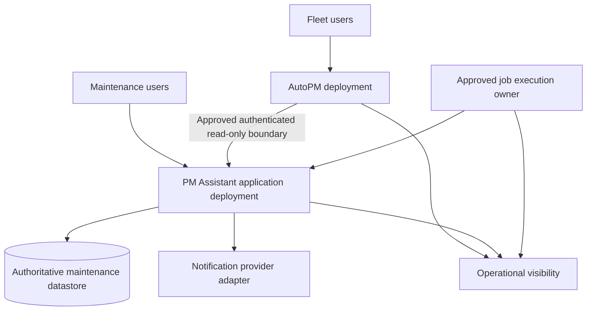

# FleetOS Application Deployment

## Purpose

This document specializes the FleetOS deployment Blueprint for application packaging, configuration, startup, readiness, shutdown, rollout, and rollback. It does not deploy anything or select Netlify, Railway, containers, PostgreSQL, a process manager, or a worker platform.

## Deployment principles

1. AutoPM and PM Assistant remain separate deployment and rollback units.
2. Application packaging does not change domain ownership.
3. AutoPM has no direct connection to PM Assistant persistence.
4. Browser-delivered assets contain no privileged service credentials.
5. PM Assistant core workflows remain independent of AutoPM availability.
6. Only one approved execution owner actively runs each background-job class.
7. Configuration and secrets are separated by environment.
8. Provider compatibility precedes consumer enablement.
9. Rollout is observable and reversible.

## Current evidence

Repository evidence does not prove a production deployment manifest, container definition, CI/CD workflow, approved hosted datastore, production authentication, or safe multi-replica scheduler topology.

## Target logical deployment

The topology is logical and vendor-neutral. The job owner may be colocated or separate only after the selected topology proves single execution and safe lifecycle behavior.

## AutoPM application unit

The deployment must:

- serve approved static presentation assets;
- identify the FleetOS/AutoPM module clearly;
- use an approved browser-to-API or trusted-proxy design;
- keep privileged credentials out of assets, URLs, browser storage, and logs;
- support explicit endpoint, timeout, cache, and fallback configuration through an approved safe mechanism;
- display source, freshness, stale, fallback, and failure state;
- roll back independently without changing PM Assistant data.

## PM Assistant application unit

The deployment must:

- expose only approved UI, application, API, health, and operational boundaries;
- validate required configuration before accepting work;
- separate process liveness from dependency readiness;
- use an approved persistence connection boundary;
- apply bounded dependency deadlines;
- support graceful shutdown and interrupted-work reconciliation;
- preserve current maintenance workflows during a compatible rollout;
- avoid enabling duplicate scheduler owners.

## Job execution unit

The Product Owner must approve one execution model. Whether colocated or separate, the unit must:

- register or receive deterministic job definitions;
- identify job occurrences and attempts;
- enforce approved single execution;
- stop safely during deployment;
- expose safe execution and failure evidence;
- prevent non-production execution against production recipients or data.

## Configuration boundary

| Area | Required direction |
| --- | --- |
| Application | Environment, application version, public paths, safe feature selection. |
| API client | Approved base reference, contract version, timeouts, retry, cache, stale policy. |
| Persistence | Secret connection reference, migration compatibility, timeout and pool direction if applicable. |
| Security | Trust topology, origins, credential references, authorization policies, proxy behavior. |
| Jobs | Enablement, timezone, triggers, concurrency, misfire, retry, and execution owner. |
| Notifications | Provider reference, secret reference, approved routing, timeout, retry, and safe test mode. |
| Observability | Service identity, safe log level, correlation, metrics and alert destinations. |

No actual secret values belong in documentation, source, static assets, logs, or validation output.

## Startup order

1. Load and validate non-secret and secret references without echoing values.
2. Establish application identity and version.
3. Initialize required adapters with bounded failure behavior.
4. Verify schema or migration compatibility under the approved database process.
5. Register routes and application services.
6. Register jobs without enabling an unapproved duplicate owner.
7. Report liveness.
8. Report readiness only when essential approved dependencies can serve work.

Exact ordering may vary by implementation, but readiness must not precede essential dependency validation.

## Shutdown behavior

1. Stop accepting new work where the runtime supports it.
2. Mark readiness unavailable.
3. Stop new job acquisition.
4. Complete, cancel, or checkpoint active work under bounded policy.
5. Flush required safe evidence.
6. Close provider and persistence connections.
7. Terminate without claiming uncertain outcomes succeeded.

## Rollout sequence

1. Approve application, security, persistence, job, and observability decisions.
2. Validate an isolated environment and safe configuration.
3. Deploy compatible PM Assistant provider behavior without AutoPM cutover.
4. Validate read projections, application services, and failure paths.
5. Shadow the AutoPM client and reconcile differences.
6. Enable the target path for a controlled audience.
7. Observe correctness, freshness, latency, errors, jobs, and notifications.
8. Promote only after approved acceptance thresholds pass.
9. Retain the approved fallback during the stabilization window.
10. Retire transitional behavior only through separate approval.

## Rollback

### AutoPM

- Disable the target read path through approved configuration.
- Restore the last-known-good compatible client and labeled fallback.
- Do not write cached or legacy data into PM Assistant.

### PM Assistant

- Maintain provider compatibility during consumer rollback.
- Roll back application behavior only when persistence remains compatible.
- Preserve accepted maintenance state, identifiers, history, and audit.

### Jobs and notifications

- Stop unsafe acquisition before changing execution owners.
- Prevent simultaneous old and new owners.
- Preserve job and provider-attempt evidence.
- Reconcile uncertain outcomes before retry.

### Security and configuration

- Revoke exposed credentials and move forward safely.
- Never restore a revoked credential merely to match an older deployment.
- Preserve incident evidence without exposing secret material.

## Deployment gates

- Approved hosting, network, and trust topology.
- Approved persistence and migration compatibility.
- Environment and secret separation validated.
- Health, readiness, logging, correlation, and alert behavior demonstrated.
- Scheduler single execution and shutdown/restart recovery proven.
- Notification safe-target, timeout, retry, redaction, and duplicate controls proven.
- Contract, integration, security, operational, recovery, and rollback tests pass.

See [Deployment and Runtime Blueprint](../blueprint/DEPLOYMENT_AND_RUNTIME_BLUEPRINT.md) for platform-level requirements.
