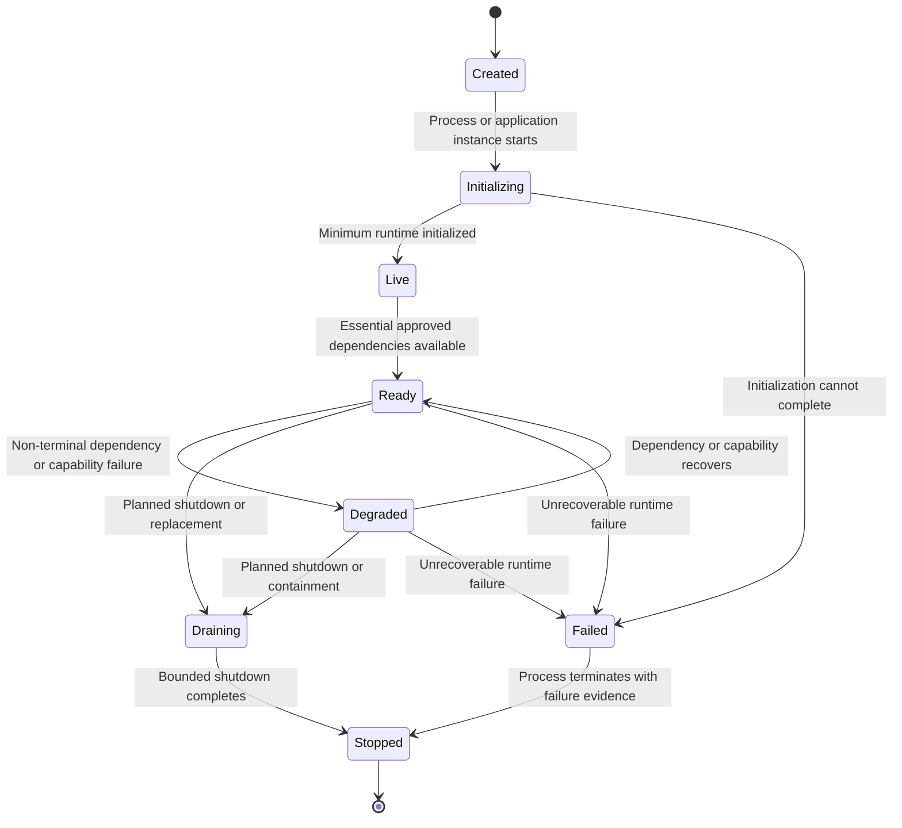
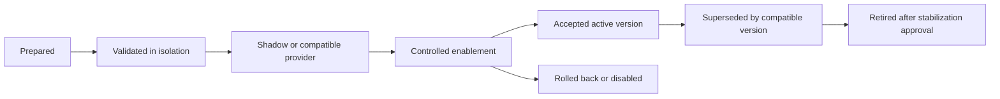
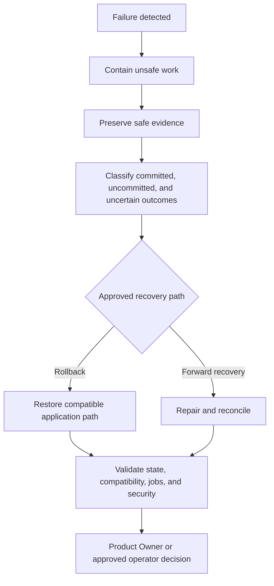

# FleetOS Application Lifecycle

## Purpose

This document defines the lifecycle of FleetOS application runtimes and deployed application versions. It does not redefine PM plan, completion, notification, import, scheduler, or mileage domain transitions, which remain governed by the [State and Lifecycle Model](../domain/STATE_AND_LIFECYCLE_MODEL.md).

## Runtime lifecycle

These labels describe application runtime condition, not business entity state.

## Created

An application version or instance has been selected for execution but has not accepted work.

Required direction:

- identify application, module, version, and environment safely;
- load approved configuration references;
- prevent secret values from appearing in logs or errors;
- ensure AutoPM and PM Assistant versions remain independently selectable.

## Initializing

The runtime validates configuration and constructs required application boundaries and adapters.

Initialization may include:

- route and UI registration;
- application-service construction;
- persistence compatibility checks;
- external-adapter setup with bounded deadlines;
- background-job registration;
- logging and correlation setup.

Invalid essential configuration fails safely. Job registration must not create a second active execution owner.

## Live

Liveness means the process can run its minimal execution loop. It does not mean:

- authoritative data is available;
- the application is ready for business traffic;
- scheduled jobs are enabled;
- external providers are healthy;
- authentication or production controls are operational.

Liveness output is coarse and discloses no topology or secret information.

## Ready

Readiness means the application can serve its approved essential responsibilities.

For PM Assistant, readiness may require the authoritative read dependency and other approved essentials. For AutoPM, readiness direction depends on the selected static-hosting and API topology.

A missing authoritative dataset is not represented as a ready zero-result state.

## Serving interactions

While Ready, the application:

1. accepts work at an approved boundary;
2. validates request shape, trust, authorization, and correlation;
3. invokes one owning application use case;
4. applies domain rules or read-projection behavior;
5. uses bounded adapters;
6. records required history, audit, and operational evidence;
7. returns a safe explicit outcome.

Work that continues beyond the request lifecycle requires approved background identity, durability, cancellation, and recovery behavior.

## Degraded

Degraded means some capability is impaired while the runtime remains able to provide a defined subset safely.

Examples:

- AutoPM uses an approved labeled last-known-good response.
- A non-essential notification provider is unavailable while core maintenance workflows continue.
- A non-essential report capability is unavailable.
- A read projection is stale but permitted for bounded display.

Degradation must be visible. It must not:

- convert unavailable authority into valid empty state;
- report an unsent notification as successful;
- permit unsafe maintenance mutation;
- hide stale or fallback data;
- bypass authorization or validation.

The exact boundary between Ready, Degraded, and Not Ready is an approved operational decision.

## Draining

During planned replacement or shutdown:

- readiness is withdrawn before termination where supported;
- new work and job acquisition stop;
- active requests receive bounded completion time;
- background work completes, checkpoints, or stops under approved policy;
- uncertain outcomes are recorded for reconciliation;
- adapters close safely;
- AutoPM and PM Assistant remain independently drainable.

## Failed

A runtime enters Failed when it cannot initialize or safely continue its approved responsibility.

Failure evidence includes:

- module and application version;
- explicit timestamp and environment;
- safe failure classification;
- affected capability;
- validated correlation where applicable;
- recovery or containment disposition.

It excludes secrets, raw credentials, connection strings, internal stack traces at public boundaries, notification targets, and sensitive payloads.

## Stopped

Stopped means the instance accepts no work. Stopping an application does not:

- delete authoritative maintenance state;
- mark incomplete work successful;
- transfer PM Assistant authority to AutoPM;
- clear job, import, notification, history, or audit evidence required for recovery.

## Application version lifecycle

Documentation does not authorize any stage. Each deployment, enablement, rollback, or retirement requires its applicable approval.

## Compatibility during replacement

- Provider compatibility is established before enabling a new consumer.
- Database compatibility is established before changing application versions.
- Old and new scheduler owners do not execute simultaneously.
- Additive contract changes remain safe for the approved overlap window.
- A consumer rollback does not require reverting accepted maintenance data.
- Transitional fallback is retired only after acceptance and separate approval.

## Recovery lifecycle

Recovery preserves raw sources and authoritative facts. It never reconstructs PM Assistant authority from AutoPM cache.

## Lifecycle observability

Required target visibility includes:

- startup and configuration validation result;
- liveness and readiness changes;
- degraded capability and recovery;
- request and dependency latency;
- active and interrupted background work;
- job-owner enablement;
- shutdown start, drain result, and forced termination;
- application version and rollback state.

Exact metrics, thresholds, alert routing, and retention remain unresolved.

## Lifecycle acceptance direction

Before production operation:

1. Startup succeeds and fails safely under tested configuration cases.
2. Liveness and readiness reflect their distinct meanings.
3. Essential dependency loss produces the approved readiness/degraded behavior.
4. Graceful shutdown handles requests and background work safely.
5. Restart reconciles uncertain work without duplicate accepted outcomes.
6. Old and new versions coexist only under proven compatibility rules.
7. Rollback preserves authority, data, history, audit, and security.
8. Operational owners can detect and act on every lifecycle state.
