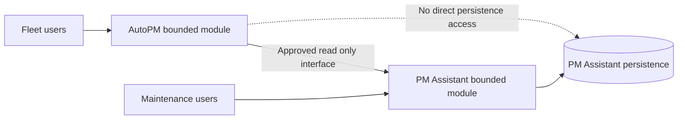
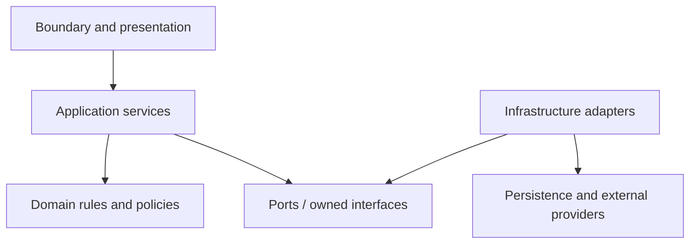

# FleetOS Application Modules

## Purpose

This document defines logical application responsibilities within AutoPM and PM Assistant. It preserves the existing bounded modules and clarifies dependency direction without prescribing source folders, classes, processes, or deployment count.

## Module boundary

AutoPM and PM Assistant remain the only application-level bounded modules defined by the existing architecture. The logical components below exist within those boundaries.

## AutoPM logical components

| Component | Responsibility | Boundary |
| --- | --- | --- |
| Presentation shell | Navigation, layout, accessibility, responsive behavior, module identity. | Does not contain maintenance workflow rules. |
| Dashboard and reporting views | KPIs, calendars, filters, detail views, exports, and executive presentation. | Uses approved meanings and counted populations. |
| Read client | Calls the approved versioned read boundary and interprets contract errors. | Read-only; no maintenance commands. |
| View-model mapping | Converts contract fields into display-ready structures and safe unknown states. | Does not rename or merge authoritative status domains. |
| Freshness and fallback controller | Tracks source, `as_of`, age, stale state, fallback use, and last-known-good cache. | Cache is presentation-only and never an upstream source. |
| Local interaction state | Filters, selection, pagination, expanded rows, and temporary UI state. | Must not be represented as authoritative server state. |

## PM Assistant logical components

| Component | Responsibility | Boundary |
| --- | --- | --- |
| HTTP and UI boundary | Parse requests, validate boundary shape, invoke application services, serialize safe results. | Does not expose ORM entities as public contracts. |
| Planning and workflow service | Coordinate plan creation/change, workflow actions, schedule condition, and related audit. | Owns maintenance workflow behavior. |
| Completion and history service | Coordinate explicit completion, correction/reopen, and history projection. | Completion remains separate from workflow and mileage. |
| Mileage acceptance and assessment service | Validate accepted mileage inputs and calculate approved PM condition. | Conditional on unresolved source and rule decisions. |
| Vehicle and location application service | Coordinate local master behavior and transitional identity classification. | Does not invent enterprise ownership or identifiers. |
| Import and reconciliation service | Preview, validate, classify, confirm, write, and report batch outcomes. | Ambiguity is quarantined; replay behavior is explicit. |
| Read projection service | Publish purpose-built maintenance read models with provenance and freshness. | Read models are not persistence models. |
| Scheduler orchestration | Register or receive approved triggers and coordinate business jobs. | One accepted outcome per approved job identity. |
| Notification orchestration | Create intents, authorize routing, deduplicate, render, send through an adapter, and record attempts. | Provider outcome does not alter other status domains. |
| Reporting service | Produce approved maintenance reports from authoritative state. | Report presentation does not create new authority. |
| Persistence adapters | Read and write owned state under approved transaction behavior. | Hidden from AutoPM and external public contracts. |
| External provider adapters | Isolate LINE, files, clocks, and future approved providers. | Provider-specific shapes do not become domain models. |
| History, audit, and operational evidence | Preserve business facts and safe diagnostic evidence. | Excludes secrets and unsafe payloads. |

## Dependency direction

The diagram expresses conceptual dependency direction:

- boundaries invoke application services;
- application services coordinate domain rules and owned interfaces;
- infrastructure implements those interfaces;
- domain meaning does not depend on HTTP, browser storage, SQLAlchemy, SQLite, LINE, APScheduler, or a hosting vendor.

Current code need not already follow this shape. Any source restructuring requires separate approval.

## Responsibility matrix

| Capability | AutoPM | PM Assistant | Shared contract or gate |
| --- | --- | --- | --- |
| Dashboard presentation | Owner | Supplies approved projections | KPI and field exposure decisions. |
| PM plan lifecycle | Read-only display | Authoritative owner | Versioned read contract. |
| Workflow and completion | Read-only display | Authoritative owner | Approved vocabulary and transitions. |
| Maintenance history | Safe projection | Authoritative owner | Access, redaction, and retention. |
| Mileage condition | Display only | Conditional target owner | Producer, acceptance, and calculation decisions. |
| Vehicle identity | Transitional consumer | Transitional publisher/classifier | Enterprise owner unresolved. |
| Location identity | Consumer | Transitional local owner | Stable identity and enterprise owner unresolved. |
| Import and reconciliation | Safe summary if authorized | Authoritative owner | Replay, atomicity, retention, thresholds. |
| Scheduler execution | None | Authoritative owner | Execution topology unresolved. |
| Notification delivery | Read-only safe status if authorized | Authoritative owner | Recipients, retry, retention, redaction. |
| Browser cache | Owner for presentation | No dependency | Never reverse-synchronized. |
| Maintenance persistence | No access | Owner | Engine and migration unresolved. |

## Prohibited coupling

- AutoPM importing PM Assistant source code.
- PM Assistant depending on AutoPM DOM, assets, browser cache, or availability.
- Direct shared-database reads or writes.
- Sharing ORM entities, table rows, or local integer IDs as application contracts.
- Reimplementing PM Assistant lifecycle rules in AutoPM.
- Treating Google Sheets, CSV, browser state, or provider responses as automatic maintenance authority.
- Making application services depend directly on concrete infrastructure where an owned boundary is required.
- Creating circular application dependencies between the bounded modules.

## Current, transitional, and target interpretation

| State | Interpretation |
| --- | --- |
| Current evidence | Responsibilities may be colocated in existing files and processes. |
| Transitional direction | Introduce testable seams and projections while preserving behavior and rollback. |
| FleetOS v1.0 target | Responsibilities are explicit, dependency direction is controlled, and boundaries are contract-tested. |
| Future outside v1.0 | Additional bounded contexts, mobile applications, general integration services, or distributed microservices. |

## Acceptance direction

Before implementation is accepted:

1. Every changed responsibility has one owning bounded module.
2. Cross-module calls use an approved contract.
3. Business rules remain within the authoritative module.
4. Logical components can be tested at owned boundaries.
5. Failure of AutoPM does not block PM Assistant core workflows.
6. Infrastructure adapters can fail without leaking unsafe details or changing domain meaning.
