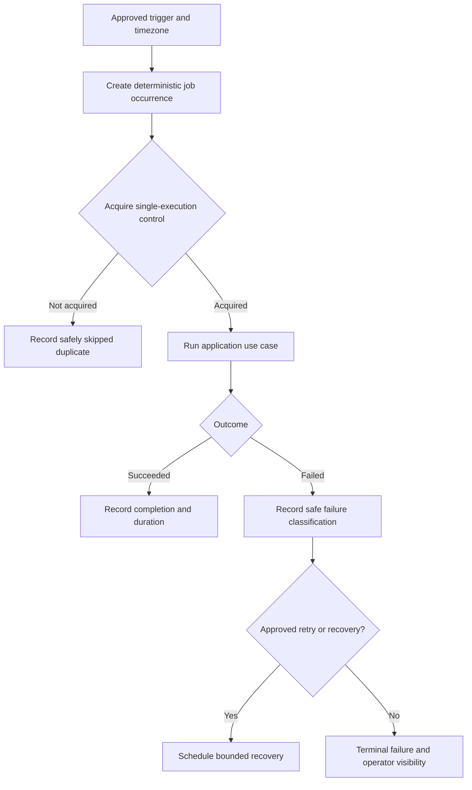

# FleetOS Background Jobs

## Purpose and status

This document defines application-level background-job direction for FleetOS v1.0. It covers logical job ownership and execution safety without selecting APScheduler, a separate worker, a queue, distributed locks, or any hosting topology.

## Current evidence

PM Assistant currently registers APScheduler work inside the application process. Repository documentation identifies daily, assistant, weekly, report, and notification-related behavior. This proves current implementation behavior only.

Current evidence does not prove:

- safe multi-process or multi-replica execution;
- distributed locking or durable queue behavior;
- approved job identity, overlap, misfire, retry, or recovery semantics;
- production monitoring or alerting;
- operationally approved notification recipients or retention.

## Job categories

| Category | Logical purpose | Authority |
| --- | --- | --- |
| Planning and reminder evaluation | Evaluate approved maintenance conditions and due work. | PM Assistant. |
| Notification dispatch | Process an approved notification intent through a provider adapter. | PM Assistant. |
| Scheduled reporting | Produce and optionally deliver an approved maintenance report. | PM Assistant. |
| Import or synchronization | Process an explicitly approved asynchronous batch or feed. | PM Assistant. |
| Reconciliation and projection | Refresh controlled mappings or read projections if the implementation requires it. | PM Assistant. |
| Operational maintenance | Approved cleanup or verification under defined retention and safety rules. | PM Assistant or approved operator. |

This catalog is logical. It does not authorize a new job or assert that every category is currently implemented.

## Target execution model

One approved execution owner must produce at most one accepted business outcome for an approved job occurrence. The implementation mechanism remains unresolved.

## Job identity

A job model distinguishes:

- job definition: the stable business purpose;
- job occurrence: the intended scheduled or requested occurrence;
- execution attempt: one attempt to process the occurrence;
- business outcome: the accepted domain result;
- notification intent and provider attempt: separate downstream records.

Timestamp alone, process ID, random retry ID, or correlation ID is insufficient business identity. Exact formats require approval.

## Trigger and time rules

- Business timezone is explicit; existing direction uses `Asia/Bangkok` where approved.
- Scheduled time, acquisition time, start time, finish time, and effective business time remain distinct.
- Clock changes, delayed startup, downtime, and missed triggers follow an approved misfire policy.
- Manual trigger, startup catch-up, and scheduled trigger must not create duplicate accepted outcomes.
- Timezone conversion never silently changes a maintenance effective date.

## Concurrency, overlap, and retry

- Maximum concurrency is explicit per job definition.
- Overlap is rejected, queued, or coalesced only under an approved policy.
- A lost lock or lease causes safe stop or protected recovery; it must not permit two accepted outcomes.
- Retry applies only to classified transient failures.
- Retry delay, maximum attempts, expiry, and terminal outcome are bounded.
- Business validation failures and authorization failures are not automatically retried.
- Notification retry does not rerun the originating maintenance action.

## Job application boundary

The scheduler or worker invokes an application service. It must not:

- write tables directly while bypassing domain rules;
- embed browser presentation logic;
- depend on AutoPM availability;
- silently use production recipients in non-production environments;
- treat a provider success as proof of maintenance completion;
- expose secrets or raw payloads in job metadata.

## Observability

Each execution records safe evidence appropriate to the job:

- job definition and occurrence reference;
- attempt number and acquisition outcome;
- explicit-timezone start and finish;
- duration and result;
- safe input or resource reference;
- application and rule version where applicable;
- validated correlation and causation references;
- resulting domain fact or notification intent reference;
- safe failure classification and recovery disposition.

Logs, metrics, and audit have different purposes. None contains credentials, connection strings, raw notification targets, full message bodies, raw webhook payloads, or sensitive import rows.

## Startup and shutdown

- Job registration is deterministic and observable.
- Application readiness does not imply that every scheduled job is enabled unless the deployment contract says so.
- Only the approved execution owner enables active scheduling.
- Graceful shutdown stops new acquisition and handles active work under a bounded policy.
- Forced termination leaves enough durable evidence to classify and recover interrupted work.
- Restart reconciliation identifies uncertain attempts before retrying them.

## Failure and recovery

| Failure | Required direction |
| --- | --- |
| Dependency unavailable | Fail or defer explicitly; do not report success. |
| Duplicate acquisition | Skip safely and record duplicate prevention. |
| Process termination | Reconcile uncertain work before recovery. |
| Provider timeout | Record unknown/failed attempt under provider policy; do not assume delivery. |
| Invalid configuration | Fail safely without echoing values. |
| Persistent business error | Stop bounded retry and expose operator action. |
| Partial batch outcome | Preserve row outcomes and report partial status. |

## Deployment alternatives

An approved implementation may use:

- one deliberately single application process that owns jobs;
- a dedicated scheduler or worker deployment;
- distributed single-execution control;
- another evidenced design.

This Blueprint selects none. The chosen design must pass restart, overlap, misfire, concurrency, timezone, dependency-failure, retry, duplicate-prevention, shutdown, and recovery tests.

## Rollback direction

- Disable unsafe job acquisition without deleting prior outcomes.
- Prevent an old and new execution owner from running simultaneously.
- Preserve accepted domain facts, job evidence, notification intents, and attempts.
- Reconcile in-flight or uncertain executions before re-enablement.
- Do not restore revoked credentials or unsafe recipient configuration.

## Unresolved decisions

- Job catalog and enablement by environment.
- Execution topology and single-execution mechanism.
- Job and occurrence identifier formats.
- Timezone, overlap, misfire, concurrency, timeout, retry, and expiry policies.
- Durable state, lock/lease behavior, and interrupted-work recovery.
- Notification recipient, provider, retry, redaction, and retention policies.
- Metrics, alerts, operator ownership, and operational service levels.
