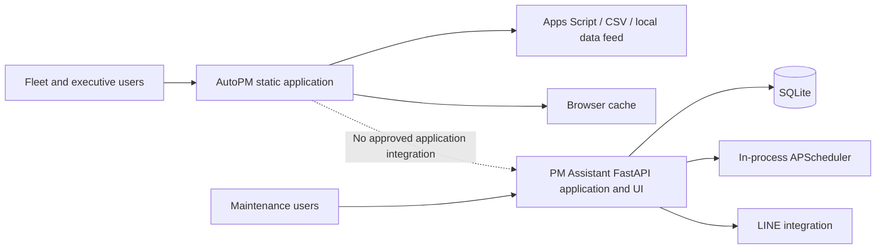
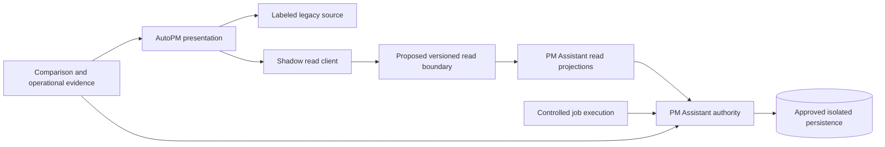
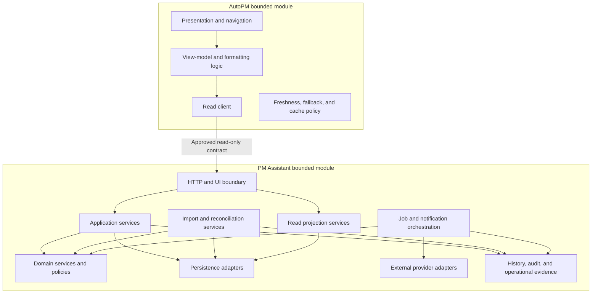

# FleetOS Application Blueprint v1.0

## 1. Purpose

This document defines the proposed FleetOS v1.0 application-layer architecture. It connects the approved platform boundaries, product requirements, domain model, database direction, and API Blueprint into a coherent application design without changing their authority or implementation status.

The application layer coordinates user intent, domain rules, persistence boundaries, read projections, imports, scheduled work, notifications, and operational evidence. It does not transfer business authority between modules or make infrastructure decisions that remain unresolved.

## 2. Scope

### In scope

- Logical application modules and dependency direction.
- AutoPM presentation and read-client responsibilities.
- PM Assistant application services and adapters.
- Cross-module and internal service interactions.
- Background-job execution direction.
- Application and presentation state boundaries.
- Application deployment and runtime lifecycle direction.
- Failure isolation, observability, rollout, and rollback expectations.

### Out of scope

- Source code, API implementation, database schema, migration, deployment, or configuration changes.
- New application screens, routes, tables, queues, workers, packages, or services.
- Selection of authentication, hosting, persistence, scheduler, queue, or monitoring technology.
- Approval of unresolved business rules, permissions, identities, retention, or operational thresholds.
- AutoPM maintenance commands or any cross-module write interface.

## 3. Application principles

1. Keep business authority in its owning module.
2. Keep presentation concerns separate from authoritative domain rules.
3. Coordinate use cases through explicit application services and adapters.
4. Depend on approved contracts rather than persistence details.
5. Make state ownership, freshness, failure, and fallback explicit.
6. Treat retries, scheduled work, and imports as duplicate-sensitive operations.
7. Keep external providers replaceable behind application-owned adapters.
8. Preserve independent module deployment and rollback.
9. Keep current evidence, transitional direction, and target design distinguishable.
10. Treat unresolved decisions as gates, not implementation defaults.

## 4. Current evidence

Repository evidence indicates:

- AutoPM combines static presentation, feed parsing, browser-side filtering, cache behavior, and mileage-oriented calculations.
- PM Assistant combines HTTP routes, UI delivery, application workflows, SQLAlchemy persistence, imports, scheduler registration, reports, notifications, and diagnostics.
- Current PM Assistant routes are unversioned and mix reads, writes, administration, imports, exports, and diagnostics.
- Current application packaging is implementation evidence, not a required target decomposition.
- No approved production authentication, hosted datastore, worker topology, queue, or production FleetOS API is proven operational.

## 5. Transitional direction

The transition:

- preserves current core workflows while target application boundaries are validated;
- introduces purpose-built read projections without exposing ORM or table structures;
- compares legacy and target identities, status, counts, time, and freshness;
- keeps AutoPM fallback labeled and prevents reverse synchronization;
- establishes explicit application-service seams before any physical decomposition;
- controls scheduler execution for the selected non-production topology;
- keeps every new consumer path reversible.

## 6. FleetOS v1.0 target

The boxes are logical responsibilities. The target does not require a microservice architecture, a repository restructuring, or one runtime per box. Physical packaging remains an implementation decision within the fixed bounded-module and deployment rules.

## 7. Layer responsibilities

| Layer | Primary responsibility | Must not |
| --- | --- | --- |
| Presentation | Render views, collect user intent, show source/freshness/failure, support accessibility. | Become maintenance authority or hide stale/unknown state. |
| Application | Coordinate an approved use case, authorization decision, transaction boundary, result, and audit. | Embed provider-specific transport or expose persistence entities. |
| Domain | Enforce owned business rules, invariants, lifecycle transitions, and status meaning. | Depend on AutoPM, HTTP, browser storage, or provider response shapes. |
| Projection | Publish purpose-built, safe read models with freshness and provenance. | Expose tables, ORM objects, secrets, or ambiguous identity as settled fact. |
| Infrastructure adapters | Implement persistence, files, clocks, notifications, and approved external boundaries. | Change domain ownership or leak vendor behavior into public contracts. |
| Operational support | Provide safe health, logs, correlation, metrics direction, and recovery evidence. | Disclose credentials, topology, raw sensitive payloads, or internal exceptions. |

## 8. Primary application flows

### Read flow

AutoPM requests an approved read projection. PM Assistant validates the request and access decision, retrieves authoritative state through its own application boundary, projects approved fields, and returns explicit freshness and errors. AutoPM formats the result without recalculating authoritative workflow, completion, notification, or approved mileage rules.

### Command flow

Maintenance commands originate only at an approved PM Assistant boundary in v1. The application service validates identity, authorization, input, lifecycle rules, and concurrency; performs the authoritative change; records required history/audit; and returns an explicit result. AutoPM does not issue these commands.

### Import flow

An approved file or feed receives a batch identity, parsing, validation, normalization, row classification, preview, confirmation, controlled mutation, and retained outcome evidence. Ambiguous identity is quarantined. Replayed input must not silently duplicate business outcomes.

### Scheduled and notification flow

An approved trigger attempts to acquire one business-job execution. The job coordinates an application use case and may create a notification intent. The notification adapter records each provider attempt separately from the business intent and applies only the approved bounded retry policy.

## 9. State boundaries

Application behavior must distinguish:

- authoritative domain state in PM Assistant;
- application request and operation state;
- AutoPM presentation and interaction state;
- bounded last-known-good cache and freshness state;
- configuration and feature-selection state;
- background-job execution state;
- external-provider attempt state;
- history and audit evidence.

No browser cache, loading flag, provider result, elapsed deadline, or display label may overwrite authoritative maintenance state.

## 10. Failure and degradation model

- AutoPM may display a labeled bounded fallback when the authoritative read boundary is unavailable.
- A valid empty result, stale result, unknown value, ambiguous identity, authorization failure, dependency failure, and unavailable authoritative dataset remain different outcomes.
- PM Assistant core workflows do not require AutoPM availability.
- External notification failure does not roll back a separately committed maintenance fact unless an approved use case explicitly requires atomic behavior.
- Duplicate scheduler acquisition is safely skipped and observed.
- Partial import success remains visible and is never reported as full reconciliation.
- Unhandled internal errors are converted to safe boundary errors and retain protected diagnostic evidence.

## 11. Security and observability direction

The application design requires:

- deny-by-default protected boundaries after an authentication design is approved;
- least-privilege application operations and read projections;
- input validation at every untrusted boundary;
- no privileged secrets in browser assets or storage;
- safe correlation across requests, jobs, notifications, imports, and audit;
- structured operational evidence with explicit time, module, event, result, duration, and safe error classification;
- redaction of credentials, connection strings, targets, raw provider payloads, sensitive import rows, and unnecessary personal data;
- coarse liveness and readiness without topology disclosure.

These are target controls, not claims of current implementation.

## 12. Architecture impact

Phase 4.3 changes documentation only. It does not change module ownership, API behavior, database design, source packaging, scheduler behavior, deployment topology, or external services.

A later approved implementation may introduce clearer service and adapter seams inside each existing bounded module. It must not merge AutoPM and PM Assistant, create shared persistence, or require a particular infrastructure vendor. A decision that changes an accepted boundary or selects a materially new architecture requires ADR review.

## 13. Risks and rollback

Design risks include accidental operational claims, logical-service over-decomposition, duplicated business rules, status conflation, persistence leakage, unsafe cache use, hidden partial failure, duplicate side effects, and coupling to unresolved infrastructure.

Mitigation is provided by the fixed guardrails, specialized documents in this directory, governing cross-references, explicit decision gates, and later contract and failure testing.

Documentation rollback is an isolated Product Owner revert of the Phase 4.3 files. A future implementation rollback must preserve PM Assistant authority and accepted business/audit evidence, disable the new consumer or job path safely, and never reverse-synchronize AutoPM presentation state.

## 14. Unresolved implementation gates

- Authentication, authorization, user identity, and browser/proxy trust topology.
- Physical packaging of logical PM Assistant responsibilities.
- Persistence engine, transaction behavior, migration, backup, and recovery.
- Scheduler execution owner, lock/lease mechanism, misfire, overlap, retry, and stop behavior.
- Notification recipients, idempotency, retry, redaction, and retention.
- Import replay identity, atomicity, resume, retention, and acceptance thresholds.
- Cache duration, stale thresholds, fallback stabilization window, and KPI definitions.
- Operational service levels, load targets, alert thresholds, and evidence retention.

## 15. Definition of Application Blueprint complete

The Blueprint is documentation-complete when:

1. All eight approved application documents exist and their links resolve.
2. Current, transitional, target, and future states remain distinguishable.
3. Module ownership, read-only behavior, identity, and status separation match governing documents.
4. Logical responsibilities do not silently prescribe physical services or vendors.
5. Background, state, deployment, lifecycle, security, and rollback direction are coherent.
6. Examples contain no secrets or sensitive operational values.
7. Markdown, links, Mermaid, UTF-8, terminology, and cross-references pass validation.

Documentation completion does not mean the application design is implemented, deployed, accepted for production, or operational.
