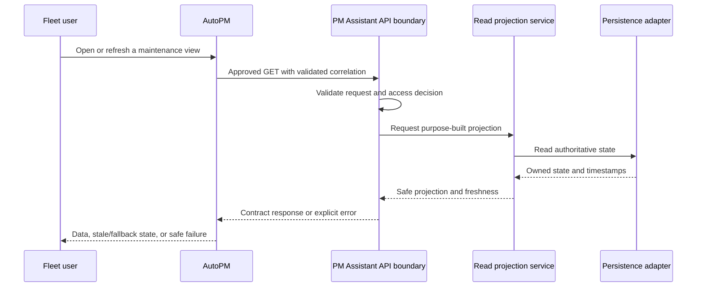
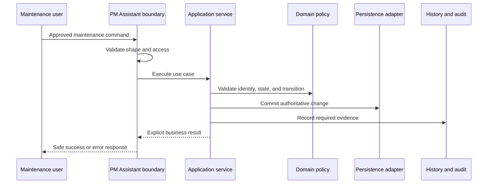
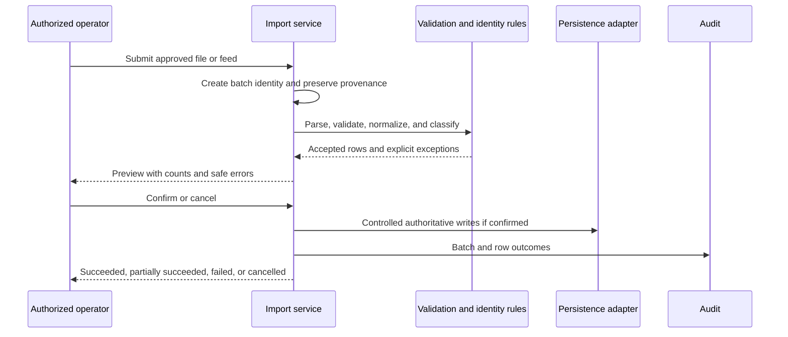
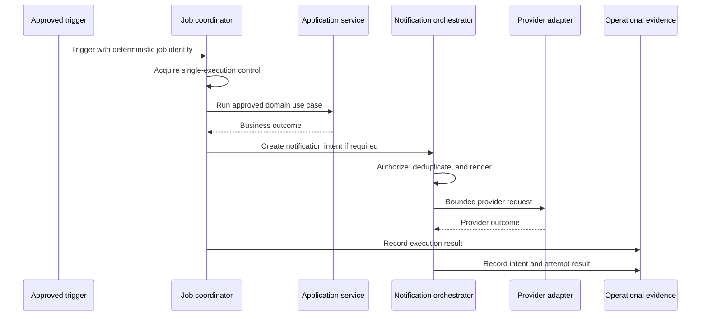

# FleetOS Service Interactions

## Purpose

This document defines interaction rules among FleetOS presentation boundaries, application services, domain rules, persistence adapters, background execution, and external providers. It does not define new API endpoints or select a transport, queue, or runtime topology.

## Interaction principles

1. An interaction begins at an explicit trusted or untrusted boundary.
2. The receiving application service owns use-case coordination.
3. Domain rules validate business meaning inside the authoritative module.
4. Persistence and external systems are reached through owned adapters.
5. Cross-module maintenance interaction is read-only in FleetOS v1.0.
6. Timeout, retry, idempotency, correlation, and error behavior are explicit.
7. Failure must not be converted silently into valid empty or successful state.
8. Sensitive provider and persistence details do not cross public boundaries.

## AutoPM read interaction

Rules:

- AutoPM does not infer success from transport success alone.
- PM Assistant does not return a zero population when an essential authoritative dependency is unavailable.
- AutoPM safely handles optional fields and unknown future enum values.
- A retry is limited to approved transient, safe, idempotent reads.
- AutoPM cache use is bounded, labeled, and never written back.

## PM Assistant command interaction

Exact transaction consistency between authoritative state and audit evidence is an implementation decision governed by the Domain and Database Blueprints. A command must not report success before its approved durable outcome exists.

## Import interaction

Preview performs no business mutation. Ambiguous records are never guessed. Replayed input follows an approved batch and business-idempotency policy.

## Background and notification interaction

The business job, notification intent, and provider attempt have separate identities and results. Retrying a provider attempt must not rerun the business job unless an approved recovery design explicitly requires it.

## Interaction policy matrix

| Interaction | Timeout | Retry | Idempotency or duplicate control |
| --- | --- | --- | --- |
| AutoPM read | Bounded client and server deadlines. | Approved transient failures only; bounded backoff. | HTTP read semantics plus cache validator where approved. |
| PM Assistant command | Bounded request and dependency deadlines. | No blind client retry of mutation. | Approved business command identity where required. |
| Persistence operation | Bounded according to selected engine and transaction. | Controlled by use case; never duplicate a committed fact. | Transaction, constraint, and business policy. |
| Import | Bounded parsing and write stages with visible interruption. | Resume or replay only under approved batch policy. | Batch identity plus row/business disposition. |
| Scheduled job | Bounded execution or explicit long-running policy. | Approved job recovery only. | Deterministic job occurrence and single execution. |
| Notification attempt | Bounded provider timeout. | Approved transient classes and maximum attempts. | Notification intent and provider-attempt policy. |

Exact durations and attempt counts are unresolved Product Owner decisions.

## Correlation and causation

- A validated correlation reference may connect a request, job, import, notification, and audit evidence.
- Correlation is diagnostic and does not authenticate, authorize, order, or deduplicate work.
- Causation references identify the preceding business fact when required.
- User-supplied identifiers are length- and character-validated before logging or propagation.
- No correlation value contains secrets, personal data, filenames, or free-form payloads.

## Error propagation

Internal failures are translated at the owning boundary:

- validation and business-rule failures return stable safe classifications;
- identity ambiguity remains explicit;
- dependency unavailability remains different from not found or empty;
- persistence and provider internals are protected;
- retry guidance is returned only for safe, approved transient cases;
- internal evidence retains enough safe context for diagnosis.

The [API Error Model](../API_ERROR_MODEL.md) and [API Blueprint](../api/README.md) govern public API behavior.

## Interaction compatibility

- Provider behavior compatible with the approved contract is available before consumer enablement.
- Optional additive fields do not require immediate consumer use.
- Removed or reinterpreted fields follow the approved versioning policy.
- Current unversioned PM Assistant routes remain outside the v1 compatibility guarantee.
- Internal service refactoring must not silently change public meaning or authoritative ownership.

## Future outside v1.0

- AutoPM maintenance commands.
- General event publication or message-broker integration.
- Bidirectional synchronization.
- Distributed sagas or workflow orchestration.
- Public partner APIs.

Each requires separate security, ordering, delivery, replay, compatibility, audit, and rollback decisions.
