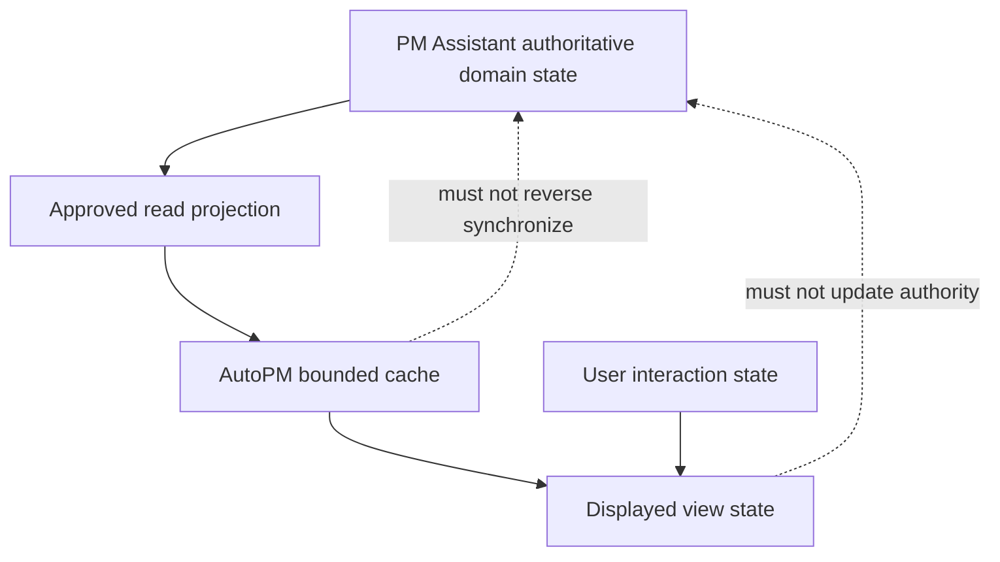

# FleetOS State Management

## Purpose

This document defines how FleetOS application state is classified, owned, changed, cached, projected, and discarded. It prevents presentation state, operational state, and provider outcomes from being confused with authoritative maintenance state.

## State classes

| State class | Owner | Examples | Durability direction |
| --- | --- | --- | --- |
| Authoritative domain state | PM Assistant | Plans, workflow, completion, history, accepted mileage, notification intent/outcome, import results. | Durable according to approved persistence and retention. |
| Application operation state | Owning application service | Validation progress, command result, import stage, request context. | Usually scoped; durable where recovery or audit requires it. |
| Read-projection state | PM Assistant | Purpose-built API models, summary projections, freshness metadata. | Rebuildable or durable according to approved design. |
| Presentation state | AutoPM or PM Assistant UI | Active view, selected vehicle, expanded panel, form state. | Ephemeral unless an approved user preference. |
| Cache and fallback state | AutoPM | Last-known-good response, source, age, validator, stale reason. | Bounded presentation-only storage. |
| Configuration state | Approved environment/operator | Endpoint references, enabled features/jobs, timeouts, safe policy selection. | Environment-controlled; secrets stored outside source. |
| Background execution state | PM Assistant | Triggered, running, skipped duplicate, succeeded, failed. | Durable enough for duplicate prevention and recovery. |
| External attempt state | PM Assistant | Notification provider attempt and safe result. | Retained under approved audit and privacy policy. |

## Authority hierarchy

When values conflict, the owning authoritative domain and approved reconciliation decision outrank timestamps, browser cache, local display calculations, and provider results.

## Four status domains

| Status | Meaning | Authority |
| --- | --- | --- |
| `pm_mileage_status` | Maintenance condition derived from an accepted mileage input and approved rule. | PM Assistant after applicable decisions. |
| `pm_workflow_status` | Progress through the PM planning workflow. | PM Assistant. |
| `completion_status` | Explicit completion, correction, or reopen state. | PM Assistant. |
| `notification_status` | Notification intent or delivery outcome. | PM Assistant. |

No status overwrites, implies, or substitutes for another. A display badge may combine information visually only when the underlying fields remain separately available and its meaning is approved.

## AutoPM state direction

AutoPM may own:

- navigation and active-view state;
- filters, sorting, pagination, selection, and expanded detail;
- accessible focus and temporary interaction feedback;
- request loading and error presentation;
- safe response mapping and unknown-enum presentation;
- bounded last-known-good cache metadata;
- source, freshness, stale, fallback, and unavailable indicators.

AutoPM must not:

- persist a maintenance command;
- modify PM Assistant domain state;
- infer completion from dates, mileage, notification, or UI action;
- convert missing authoritative data into zero;
- use cache as an import or synchronization source;
- hide fallback age or source;
- store privileged service credentials in browser state.

## PM Assistant state direction

PM Assistant application services coordinate:

- loading owned state;
- validating identity, input, authorization, and expected lifecycle;
- applying domain rules;
- committing the approved authoritative outcome;
- recording history, audit, and operation evidence;
- publishing safe read projections.

Transaction and concurrency behavior must prevent lost updates and duplicate accepted outcomes under the approved database and application design.

## Request and form state

- Request identifiers and correlation values are validated.
- Loading, submitted, succeeded, failed, and validation-error UI states are explicit.
- A double submission must not create duplicate business outcomes.
- Optimistic presentation, if approved, is visibly provisional and reconciled with the authoritative result.
- Unsaved form state is not audit evidence.
- Validation errors preserve safe user input where appropriate but never echo secrets.

## Cache and freshness

A cached read includes enough metadata to determine:

- contract version;
- resource or query identity;
- authoritative `as_of` time;
- cache storage time;
- stale status and reason;
- source and fallback state;
- validator such as an approved `ETag`, when available.

Cache expiry, maximum age, size, invalidation, storage mechanism, and privacy controls are unresolved. Authorization-sensitive responses must not enter shared caches without an approved design.

## Unknown, empty, stale, and unavailable

| Condition | Required presentation |
| --- | --- |
| Valid empty | Show an explicit empty state. |
| Unknown field or enum | Preserve safe operation and show a neutral unknown state. |
| Stale authoritative projection | Show data with age and stale reason if permitted. |
| Labeled fallback | Show fallback source and age. |
| Ambiguous identity | Show an explicit conflict/review state. |
| Missing singular resource | Show not found according to the contract. |
| Authoritative dependency unavailable | Show unavailable; do not show zero or current. |
| Unauthorized | Show a safe access failure without leaking resource details. |

## Configuration and feature state

- Environment-specific values remain outside source where appropriate.
- Feature switches select reversible behavior; they do not redefine business authority.
- Configuration is validated at startup without echoing secret values.
- Staging does not silently use production data, credentials, recipients, or callbacks.
- Configuration changes are versioned or auditable according to their risk.
- A rollback must not restore a revoked secret.

## Background state

Job definition, occurrence, execution attempt, business outcome, notification intent, and provider attempt remain separate. A process restart must not erase the evidence required to prevent or reconcile duplicate work.

## State transition rules

1. Only the owning application boundary accepts a state-changing request.
2. Authorization and expected current state are checked before mutation.
3. Domain invariants are evaluated using authoritative inputs.
4. The approved transaction commits the business outcome.
5. Required history and audit evidence is retained.
6. Read projections and caches are refreshed or invalidated through approved behavior.
7. Consumers reconcile to the authoritative result.

Domain transition vocabulary remains governed by [State and Lifecycle Model](../domain/STATE_AND_LIFECYCLE_MODEL.md).

## Recovery and rollback

- Preserve raw sources, accepted facts, history, and audit.
- Rebuild derived projections where supported rather than rewriting authoritative evidence.
- Invalidate unsafe cache while retaining a labeled last-known-good path only when approved.
- Reconcile uncertain background attempts before retry.
- Roll back rule or mapping versions without erasing facts created under prior versions.
- Never use AutoPM cache to reconstruct PM Assistant authority.
