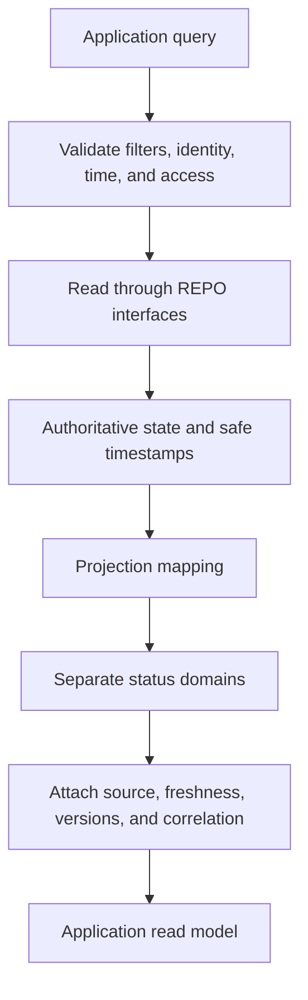
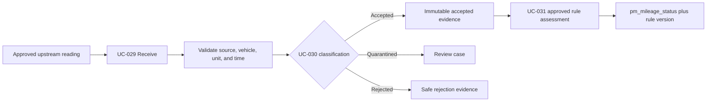
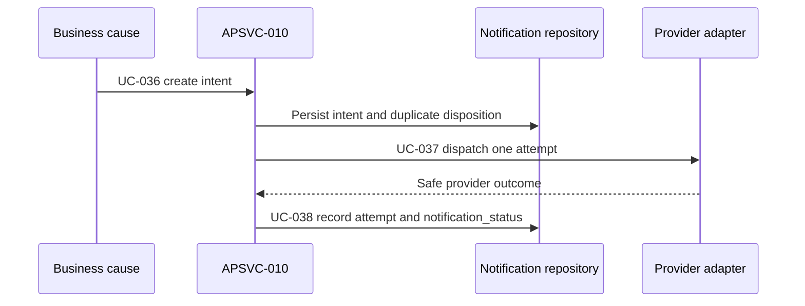
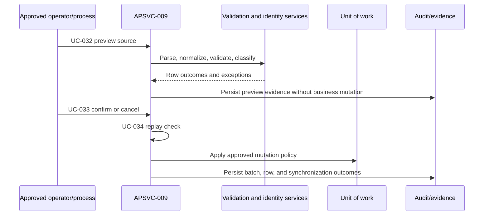

# FleetOS Application Services and Use Cases

## Purpose

This document defines the application-service and use-case catalog for the FleetOS v1.0 backend. It describes orchestration boundaries, not Python classes, routes, packages, endpoints, permissions, or implementation status.

Each use case has one owning `APSVC-*`. A use case may collaborate with other services through explicit application contracts, but it has one transaction and result owner.

## Application-service catalog

| ID | Application service | Primary responsibility |
| --- | --- | --- |
| `APSVC-001` | Plan Command Service | Create, change, cancel, or otherwise control PM plans under approved rules. |
| `APSVC-002` | Workflow Control Service | Coordinate `pm_workflow_status`, task controls, expected-state checks, and schedule-condition behavior. |
| `APSVC-003` | Completion Service | Record, correct, reopen, and re-record explicit completion evidence. |
| `APSVC-004` | History Query Service | Produce ordered, redacted maintenance-history projections. |
| `APSVC-005` | Vehicle Lookup and Reconciliation Service | Lookup and classify transitional vehicle identity and reviewed reconciliation decisions. |
| `APSVC-006` | Location Service | Query and manage transitional PM Assistant location records while preserving historical labels. |
| `APSVC-007` | Mileage Ingestion and Assessment Service | Conditionally receive, validate, accept, quarantine, and assess maintenance-mileage evidence. |
| `APSVC-008` | Read-Model Query Service | Generate purpose-built vehicle, plan, dashboard, mileage, notification, import, and synchronization projections. |
| `APSVC-009` | Import and Synchronization Service | Preview, classify, confirm, cancel, replay-check, and summarize controlled imports/synchronization. |
| `APSVC-010` | Notification Orchestration Service | Create intents, dispatch attempts, classify results, and coordinate approved retry/suppression. |
| `APSVC-011` | Scheduler Execution Service | Identify and execute one logical scheduled occurrence and record its outcome. |
| `APSVC-012` | Reporting Service | Generate approved maintenance reports and report previews from authoritative data. |
| `APSVC-013` | Audit Service | Record and query safe domain audit and correction evidence. |
| `APSVC-014` | Runtime Health and Readiness Service | Evaluate coarse runtime liveness and essential dependency readiness. |

Services do not imply one class each. An implementation may use functions, objects, modules, or another maintainable structure after approval.

## Use-case catalog

### Query use cases

| ID | Use case | Owner | State and result direction |
| --- | --- | --- | --- |
| `UC-001` | Lookup Vehicle by Transitional Vehicle Number | `APSVC-005` | Exact/normalized match or explicit not-found, ambiguous, conflict, or rejected result. |
| `UC-002` | List Vehicle Representations | `APSVC-008` | Purpose-built vehicle list with identity status, source, freshness, and deterministic ordering. |
| `UC-003` | List PM Plans | `APSVC-008` | Approved filters/sorts, separate status domains, source, and freshness. |
| `UC-004` | Get PM Plan Detail | `APSVC-008` | One plan projection with safe task, completion, mileage, notification, and sync fields when approved. |
| `UC-005` | Get PM Plan History | `APSVC-004` | Existing plan with no events returns empty history; missing/unauthorized plan remains distinct. |
| `UC-006` | List Locations | `APSVC-006` | Transitional location representations with identity status and preserved names. |
| `UC-007` | Get Dashboard Summary | `APSVC-008` | Approved counted population and independent status counts; unavailable is not zero. |
| `UC-008` | Get Mileage Status Summary | `APSVC-007` | Conditional on accepted mileage and rule approval; includes rule version and freshness. |
| `UC-009` | Get Synchronization Status | `APSVC-008` | Safe run-level source, counts, versions, timing, freshness, and error classification. |
| `UC-010` | Get Notification Status Summary | `APSVC-008` | Safe intent/attempt outcomes without targets, message bodies, tokens, or raw provider responses. |
| `UC-011` | Get Import Batch Status | `APSVC-009` | Batch and row outcome counts, confirmation/replay state, and safe errors. |
| `UC-012` | Get Restricted Audit Projection | `APSVC-013` | Conditional on access, privacy, redaction, and retention decisions. |
| `UC-013` | Get Today Work Queue | `APSVC-008` | Authoritative due/priority presentation under approved schedule and workflow definitions. |
| `UC-014` | Get Weekly Summary or Report Preview | `APSVC-012` | Approved report definition, population, `as_of`, source, and calculation version. |

### Command use cases

| ID | Use case | Owner | State and result direction |
| --- | --- | --- | --- |
| `UC-015` | Create PM Plan | `APSVC-001` | Validate identity/reference handling, dates, location, initial state, and required evidence. |
| `UC-016` | Change PM Plan | `APSVC-001` | Validate expected state and concurrency; preserve safe before/after evidence. |
| `UC-017` | Cancel PM Plan | `APSVC-001` | Preserve plan, reason, history, and downstream evidence; exact cancellation policy is unresolved. |
| `UC-018` | Transition PM Workflow | `APSVC-002` | Change only `pm_workflow_status` under an approved transition graph. |
| `UC-019` | Pause PM Task | `APSVC-002` | Record task-control state and reason without changing completion. |
| `UC-020` | Resume PM Task | `APSVC-002` | Restore task-control state under approved expected-state rules. |
| `UC-021` | Record PM Follow-up | `APSVC-002` | Record controlled follow-up state/note without inferring completion or notification success. |
| `UC-022` | Record PM Completion | `APSVC-003` | Explicit completion with evidence, effective/recorded time, history, audit, and expected-state validation. |
| `UC-023` | Reopen or Correct PM Completion | `APSVC-003` | Append superseding evidence; never conceal the original completion. |
| `UC-024` | Create Location | `APSVC-006` | Transitional PM Assistant location creation under approved identity/authorization rules. |
| `UC-025` | Change Location | `APSVC-006` | Preserve historical plan labels and alias/rename evidence. |
| `UC-026` | Retire or Delete Location | `APSVC-006` | Conditional; referential, history, tombstone, and retention behavior remains unresolved. |
| `UC-027` | Classify Vehicle Match | `APSVC-005` | Record exact, normalized, ambiguous, conflicting, missing, or rejected classification. |
| `UC-028` | Record Vehicle Reconciliation Decision | `APSVC-005` | Preserve original/normalized values, reviewer/process, versions, and supersession. |
| `UC-029` | Receive Mileage Reading | `APSVC-007` | Conditional receipt with source, raw/parsed value, measured/received time, and vehicle-match state. |
| `UC-030` | Accept, Quarantine, or Reject Mileage Reading | `APSVC-007` | Conditional validation outcome; ambiguous identity cannot be accepted silently. |
| `UC-031` | Assess Accepted Mileage | `APSVC-007` | Conditional versioned calculation producing only `pm_mileage_status`. |
| `UC-032` | Preview Import Batch | `APSVC-009` | Parse, validate, normalize, and classify without business mutation. |
| `UC-033` | Confirm or Cancel Import Batch | `APSVC-009` | Explicit authorized disposition with visible partial/failure behavior. |
| `UC-034` | Detect or Process Import Replay | `APSVC-009` | Conditional on approved batch identity, scope, and retention; correlation is insufficient. |
| `UC-035` | Run Controlled Synchronization | `APSVC-009` | Reconcile approved upstream evidence and publish run outcomes without changing ownership. |
| `UC-036` | Create Notification Intent | `APSVC-010` | Record authorized business cause, safe recipient reference, template/version, and duplicate policy. |
| `UC-037` | Dispatch Notification Attempt | `APSVC-010` | Invoke provider adapter after intent exists and record one attempt. |
| `UC-038` | Record Notification Provider Outcome | `APSVC-010` | Classify success, failed, skipped, or retry direction without changing plan/completion. |
| `UC-039` | Execute Scheduled Job Occurrence | `APSVC-011` | Acquire one logical occurrence, invoke the use case, and record acquired/skipped/result evidence. |
| `UC-040` | Generate Maintenance Report | `APSVC-012` | Produce report content separately from optional notification delivery. |
| `UC-041` | Record Audit Correction | `APSVC-013` | Add correction/supersession evidence without deleting the original record. |

## Query versus command rules

| Characteristic | Query | Command |
| --- | --- | --- |
| Primary purpose | Return a representation without authoritative mutation. | Attempt an authoritative state change. |
| Transaction | Read-only scope; no hidden writes. | One application-owned unit of work under `TX-001`. |
| Retry | Safe only under the approved read policy. | No blind retry; requires explicit idempotency/concurrency behavior. |
| Result | Purpose-built read/application model. | Authoritative command result and required evidence reference. |
| AutoPM | May invoke approved read queries. | Must not invoke v1 maintenance commands. |

Operational logging must not turn a query into a business mutation. Read-projection bookkeeping, if implemented, remains infrastructure behavior with its own explicit scope and must not alter maintenance facts.

## Read-model generation

`UC-002` through `UC-014` use purpose-built models:

Read models:

- do not expose ORM objects;
- use opaque boundary identifiers where required by the API contract;
- include `fleetos_vehicle_id` only as `null` or unavailable where the approved model includes it;
- preserve explicit null, empty, stale, ambiguity, and unavailable semantics;
- avoid raw legacy history, webhook, notification, or import payloads;
- carry rule, contract, normalization, and mapping versions when applicable.

## PM plan use cases

`UC-015` and `UC-016` coordinate:

1. boundary and application validation;
2. vehicle/location reference classification;
3. expected current state and concurrency check;
4. domain invariant evaluation;
5. authoritative plan persistence;
6. required history/audit evidence;
7. read-projection invalidation or refresh direction;
8. an explicit success or typed failure.

`UC-017` uses cancellation direction rather than assuming current hard deletion is the target. Deletion/tombstone policy remains `DEC-013`.

`UC-018` changes only workflow progression. A schedule condition such as overdue-by-date may be calculated for queries but must not overwrite `pm_workflow_status`.

## Completion use cases

`UC-022` is an explicit PM Assistant command. It must not infer completion from:

- mileage;
- a deadline or actual date alone;
- workflow state;
- an AutoPM or Sheet label;
- weekly-control state;
- notification success;
- elapsed time.

`UC-023` preserves the original completion and appends correction/reopen evidence. Evidence, backdating, linked-task effects, and allowed transitions remain `DEC-006`.

## History use cases

`UC-005` produces an ordered safe projection from authoritative history/completion/workflow evidence. It distinguishes:

- existing plan with no events;
- missing plan;
- unauthorized plan;
- redacted fields;
- superseded/corrected events;
- unavailable history dependency.

History is not replaced by general audit and must not expose raw ORM snapshots without an approved safe projection.

## Vehicle lookup and reconciliation use cases

`UC-001`, `UC-027`, and `UC-028` enforce:

- `vehicle_no` as the only approved transitional cross-system match key;
- original source value plus versioned normalized comparison value;
- no implicit substitution of registration or vehicle code;
- exact, normalized, ambiguous, conflicting, missing, and rejected classifications;
- quarantine instead of guessed selection;
- ownership over timestamp during conflicts;
- no creation of `fleetos_vehicle_id`;
- reversible mapping and supersession evidence.

## Mileage ingestion and assessment direction

`UC-029` through `UC-031` are conditional and remain unimplemented direction.

The Blueprint does not select source priority, duplicate policy, reset/replacement behavior, stale threshold, unit policy, or mileage boundaries.

## Location use cases

`UC-006` and `UC-024` through `UC-026` preserve current local location capability without claiming an enterprise registry:

- local identifiers are not FleetOS enterprise identities;
- exact names or approved aliases are transitional matching evidence;
- historical plan labels remain available after rename or correction;
- similar Thai/English names are not merged automatically;
- delete/retire behavior remains conditional.

## Notification use cases

The provider attempt is separate from the business intent. A retry does not rerun the originating maintenance command. Exact recipients, idempotency, retry, redaction, and retention remain `DEC-009`.

## Scheduler use cases

`UC-039`:

1. receives an approved trigger;
2. derives the logical job occurrence under an approved rule;
3. acquires single-execution control;
4. records a skipped duplicate when acquisition fails;
5. invokes an application use case when acquired;
6. records result, duration, safe error, correlation, and recovery state;
7. creates notification intent only when the business use case requires it.

Scheduler callbacks must not contain direct ORM business logic or provider-specific domain rules.

## Import and synchronization use cases

Filename, timestamp, and correlation ID alone are not approved replay identities. Partial success must remain visible.

## Audit use cases

`UC-041` is owned by `APSVC-013`, which supports domain audit without replacing specialized domain evidence. Required safe fields include:

- event/domain classification;
- safe resource reference;
- actor or process reference;
- effective/event and recorded time;
- result and safe reason;
- validated correlation where available;
- relevant contract, rule, normalization, configuration, and mapping versions;
- correction/supersession reference.

Audit excludes secrets, credentials, authorization material, raw targets, raw webhook/provider payloads, SQL, stack traces, filesystem paths, and unnecessary personal data.

## Use-case error and transaction references

- Commands follow `TX-001` through `TX-011`.
- Validation responsibilities follow `BVAL-001` through `BVAL-012`.
- Typed failures use `BEERR-001` through `BEERR-014`.
- Persistence uses `REPO-001` through `REPO-014`.
- Runtime behavior follows `RUNTIME-001` through `RUNTIME-014`.

## Completion criteria

This catalog is complete when every required backend workflow has an owning service and use case, queries and commands remain distinct, conditional behavior cites the applicable decision, and no use case grants AutoPM write authority or invents unresolved policy.
