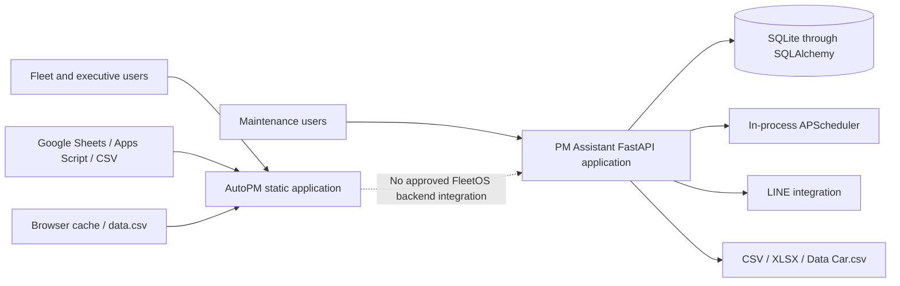
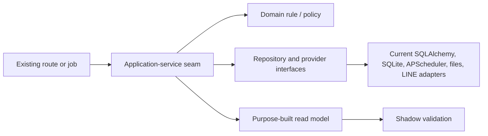
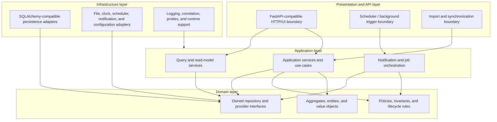
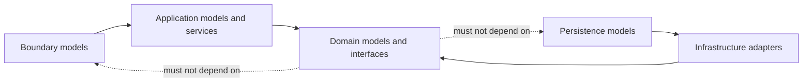
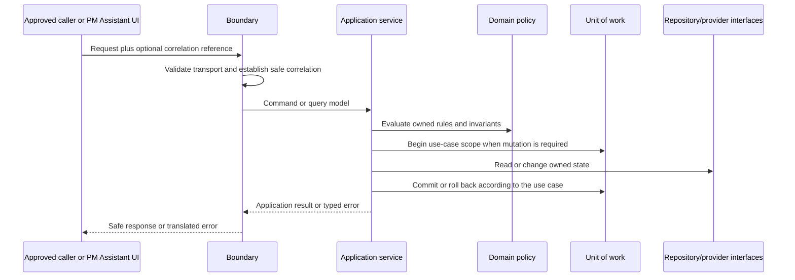
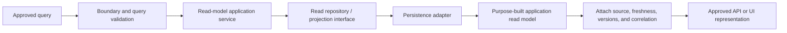
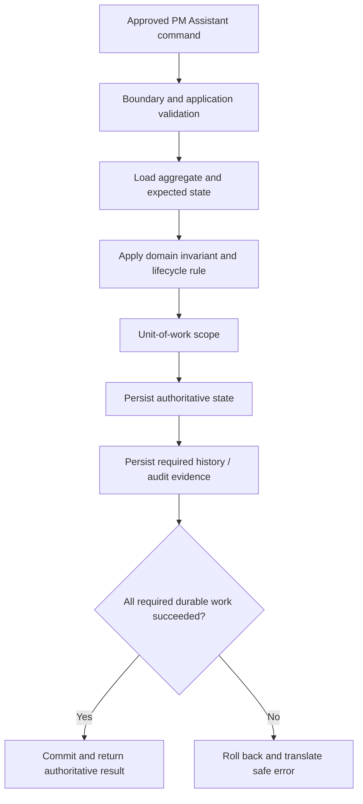
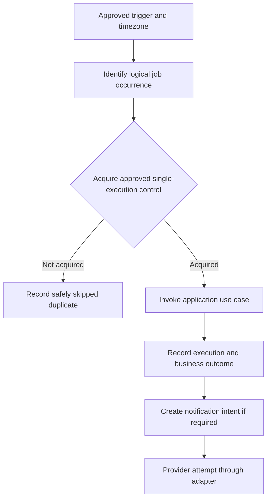
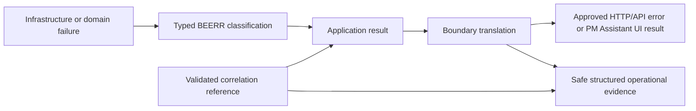

# FleetOS Backend Blueprint v1.0

## 1. Purpose

This document defines how the FleetOS backend should be structured for PM Assistant and future FleetOS platform capabilities without implementing backend source code.

The backend exists to coordinate authoritative maintenance use cases, enforce domain rules, isolate persistence and providers, publish safe read models, and produce traceable operational evidence while preserving AutoPM as a read-only consumer.

## 2. Scope

### In scope

- Current PM Assistant and AutoPM backend-support implementation evidence.
- Transitional backend direction that does not require a full rewrite.
- FleetOS v1.0 logical backend modules and layers.
- Dependency direction and model separation.
- Application-service and use-case direction.
- Repository, persistence-adapter, transaction, concurrency, and idempotency direction.
- Validation, domain invariants, error translation, API mapping, and correlation.
- Configuration, dependency injection, startup, health, readiness, background work, and shutdown.
- Testing, performance, observability, shadow rollout, rollback, and Product Owner decisions.

### Out of scope

- Source code, database, environment, deployment, or external-service changes.
- A new web framework, ORM, database engine, worker platform, queue, or hosting provider.
- A mandatory microservice architecture or physical package layout.
- AutoPM maintenance commands or direct persistence access.
- Approval of permissions, authentication, KPI rules, mileage thresholds, retry values, retention periods, or infrastructure.
- Presenting proposed controls as implemented or operational.

## 3. Current PM Assistant backend evidence

Repository evidence shows a Python backend using FastAPI, Pydantic, SQLAlchemy, SQLite, APScheduler, file import/export, and LINE integration.

Observed characteristics include:

- unversioned FastAPI routes combining queries, commands, administration, settings, imports, exports, reports, diagnostics, and static delivery;
- Pydantic request and response models closely aligned with current SQLAlchemy fields and local identifiers;
- route and helper functions that query ORM models and commit database sessions directly;
- additional commits inside notifier and initialization behavior rather than one explicit application unit of work;
- startup-time table creation, limited legacy-table copying, default-data creation, and `Data Car.csv` ingestion;
- an in-process scheduler started and configured by application code;
- PM plans, vehicle/location records, history, task state, weekly control, notification logs, import logs, settings, users, LINE targets, and webhook events in SQLite;
- generic plan `status` behavior that includes workflow-like values and may derive `Overdue` from dates;
- current completion, pause, resume, follow-up, weekly-control, notification, report, and import behavior;
- direct `HTTPException` usage and framework-default errors rather than one application error taxonomy;
- permissive development CORS and implementation-specific diagnostic routes;
- local logs and diagnostic evidence that require future redaction and access controls;
- sensitive configuration categories stored through current settings behavior;
- local integer and text relationships without demonstrated target foreign-key, concurrency, or enterprise identity guarantees.

This evidence describes current behavior only. Current routes, commits, schemas, defaults, identifiers, diagnostics, and state meanings are not automatically FleetOS v1.0 contracts.

## 4. Current AutoPM backend-support evidence

AutoPM is primarily a static frontend with read-oriented backend support:

- Google Apps Script can publish Google Sheet rows as JSON or JSONP.
- The browser reads Apps Script JSON or Google Sheets CSV.
- Browser storage and local `data.csv` provide fallback behavior.
- Source, version, timestamps, counts, and cache state are tracked for presentation.
- Mileage values, dashboard counts, filters, and mileage-oriented status are calculated in browser code.

Apps Script, Google Sheets, browser cache, and `data.csv` are transitional data paths. They are not authoritative PM Assistant persistence, do not provide an approved FleetOS backend contract, and must never be reverse-synchronized into PM Assistant as maintenance truth.

## 5. Current-state architecture

The diagram is observed logical behavior, not proof of a production deployment.

## 6. Transitional backend direction

The transition introduces explicit seams without requiring a wholesale rewrite:

1. Keep existing PM Assistant workflows and current routes operational unless a later task explicitly changes them.
2. Introduce application-service boundaries behind selected current routes.
3. Move transaction ownership from individual route/repository helpers toward one approved application use case.
4. Introduce repository and provider interfaces around current SQLAlchemy, file, scheduler, clock, and LINE behavior.
5. Create purpose-built read models alongside current ORM-aligned responses.
6. Separate validation, domain errors, and boundary error translation.
7. Add correlation and safe operational evidence without treating correlation as authentication or idempotency.
8. Shadow-test target read models before AutoPM consumes them.
9. Preserve a labeled last-known-good AutoPM read path and independent rollback.

The transition may be incremental by use case. It does not require moving every route or model at once.

## 7. FleetOS v1.0 target backend architecture

Infrastructure implements inward-owned interfaces. Domain meaning does not depend on FastAPI, SQLAlchemy, SQLite, APScheduler, LINE, files, browser storage, or a hosting vendor.

## 8. Layer responsibilities

| Layer | Responsibility | Must not |
| --- | --- | --- |
| Presentation/API | Parse transport input, validate boundary shape, establish safe correlation, invoke one use case, and translate results. | Contain authoritative business rules, commit transactions, or expose ORM objects. |
| Application | Coordinate authorization when approved, validation, domain behavior, transaction scope, repositories, providers, audit, and result models. | Depend on AutoPM presentation or provider-specific response shapes. |
| Domain | Define maintenance meaning, invariants, lifecycle transitions, value semantics, and owned interfaces. | Depend on HTTP, SQLAlchemy, SQLite, APScheduler, LINE, files, or environment variables. |
| Infrastructure | Implement persistence, configuration, clock, files, scheduler, notification, logging, and other adapters. | Change domain ownership, silently choose unresolved policy, or leak persistence models outward. |

Read-model generation is an application/query responsibility implemented through owned interfaces and safe projections. A read model may combine several aggregates but does not become an aggregate or persistence contract.

## 9. Model separation

The target keeps four model categories distinct:

1. Boundary models describe HTTP, import, job, or provider input/output.
2. Application models describe use-case commands, queries, and results.
3. Domain models describe authoritative concepts and rules.
4. Persistence models describe adapter-specific storage.

Mapping between categories is explicit. Existing SQLAlchemy classes may remain inside a persistence adapter, but they must not be returned as public FleetOS models or treated as canonical domain entities.

## 10. Dependency direction

Rules:

- presentation depends on application contracts;
- application depends on domain meaning and owned interfaces;
- infrastructure depends on and implements those interfaces;
- domain code remains independently unit-testable;
- AutoPM depends only on an approved read contract, never on application internals or persistence.

## 11. Backend boundary and ownership

PM Assistant owns:

- PM plan lifecycle;
- `pm_workflow_status`;
- `completion_status`;
- PM history;
- `notification_status`;
- controlled import and synchronization audit;
- scheduler behavior for maintenance actions;
- authoritative maintenance persistence;
- accepted maintenance-mileage records and `pm_mileage_status` only after the applicable decisions are approved.

AutoPM owns presentation, filters, navigation, KPI visualization, and bounded read cache. It cannot:

- invoke maintenance commands in v1;
- access PM Assistant repositories, tables, sessions, or ORM entities;
- declare completion or notification delivery;
- duplicate approved maintenance rules;
- reverse-synchronize its cache or legacy feed.

## 12. Status and identity constraints

The backend must keep these concepts independent:

| Field | Meaning |
| --- | --- |
| `pm_mileage_status` | Condition derived from accepted mileage evidence and an approved versioned rule. |
| `pm_workflow_status` | Progress through the maintenance planning workflow. |
| `completion_status` | Explicit completion, correction, or reopen state. |
| `notification_status` | Notification intent and delivery outcome. |

A schedule condition such as overdue-by-date remains separate from workflow progression.

`vehicle_no` is used only for approved transitional matching with original value, normalized comparison value, rule version, provenance, and explicit classification. `fleetos_vehicle_id` remains proposed and unimplemented. Local database IDs, registrations, vehicle codes, location names, and row positions must not be promoted to enterprise identity by convenience.

## 13. Request-to-use-case flow

Authentication and authorization remain target responsibilities pending an approved design.

## 14. Query and read-model flow

The flow must distinguish valid empty, missing, ambiguous, conflicting, stale, unauthorized, and unavailable outcomes.

## 15. Command and transaction flow

External notification delivery is not performed inside the authoritative database transaction. The notification domain records intent and attempts separately as defined by `TX-004`.

## 16. Background-job execution

The diagram is conceptual. It does not select APScheduler, a worker, a queue, a database lock, or a distributed lease.

## 17. Error translation and correlation

Correlation is diagnostic only. It does not authenticate, authorize, order, prove causation, or prevent duplicate outcomes.

## 18. Future capabilities outside v1.0

- An operational enterprise vehicle registry and `fleetos_vehicle_id`.
- Stable FleetOS identities for locations, organizations, people, and teams.
- AutoPM write commands or a general cross-module command API.
- Public domain-event distribution, event sourcing, or an enterprise event platform.
- Distributed queues or workflow orchestration.
- Telematics, predictive maintenance, ERP integration, or additional notification channels.
- Microservice decomposition solely because logical modules exist.
- Mandatory replacement of FastAPI, SQLAlchemy, or all current routes.

## 19. Architecture and implementation impact

Phase 4.5 changes documentation only.

A later approved implementation may introduce routers, application services, command/query models, domain policies, repositories, units of work, provider adapters, and composition-root behavior inside PM Assistant. That work can proceed incrementally behind current routes and does not require a repository restructure or full backend rewrite.

Any physical decomposition, new framework, new persistence engine, authentication architecture, worker topology, or materially changed module boundary requires separate analysis, approval, and ADR review where applicable.

## 20. Risks and rollback

Design risks include:

- mistaking the target design for implemented behavior;
- creating excessive logical or physical decomposition;
- moving business rules into route, ORM, or provider code;
- conflating the four status domains;
- promoting local identifiers to canonical identity;
- reporting transaction success before required evidence is durable;
- holding external side effects inside unsafe database transactions;
- inventing unresolved concurrency, idempotency, retry, permission, retention, or infrastructure policy;
- leaking current sensitive settings, targets, payloads, or diagnostics into examples.

Mitigation is provided by the specialized registries, governing references, backend `DEC-*` gates, conceptual diagrams, model separation, and validation plan.

Documentation rollback is an isolated Product Owner revert of the eight files in `docs/backend/`. A later implementation rollback must preserve PM Assistant authority, accepted business state, history, audit, issued identifiers, and raw source evidence; stop unsafe jobs or consumers; and never reverse-synchronize AutoPM cache.

## 21. Definition of Backend Blueprint complete

The Backend Blueprint is documentation-complete when:

1. all eight approved backend documents exist and their links resolve;
2. current evidence, transitional direction, FleetOS v1.0 target, and future scope remain distinguishable;
3. all `BEMOD-*`, `APSVC-*`, `UC-*`, `REPO-*`, `TX-*`, `BVAL-*`, `BEERR-*`, `RUNTIME-*`, backend `VAL-*`, and backend `DEC-*` identifiers are unique within this set and cross-referenced consistently;
4. layer and transaction directions are coherent;
5. purpose-built models remain separate from persistence;
6. module ownership, AutoPM read-only behavior, identity semantics, and status separation match governing documents;
7. unresolved policies remain explicit;
8. Markdown, links, Mermaid, Unicode, terminology, and secret-safety validation passes;
9. only the approved `docs/backend/` files changed;
10. the exact changed-file list, validation result, risks, and remaining decisions are reported without commit.

Documentation completion does not mean the backend is implemented, deployed, production-ready, or released.
