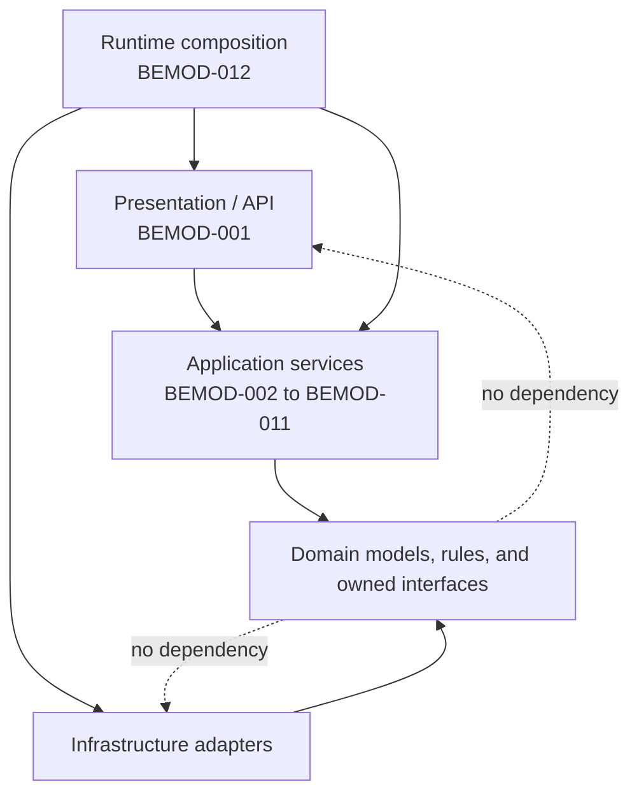
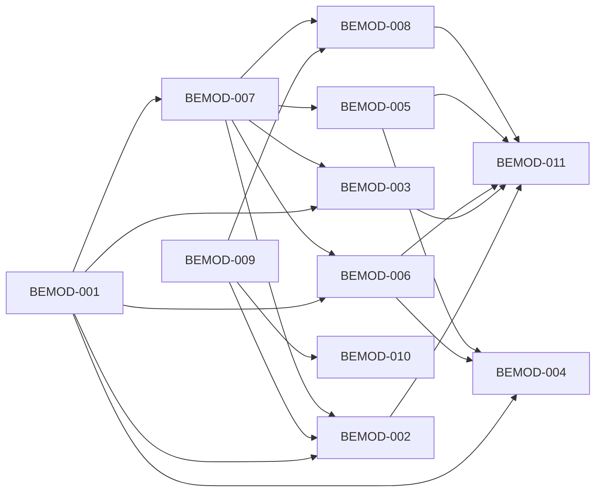

# FleetOS Backend Module and Layer Catalog

## Purpose

This document defines logical backend modules and layer ownership for FleetOS v1.0. The catalog does not prescribe folders, Python packages, processes, deployments, microservices, or team ownership.

The modules exist inside the PM Assistant bounded module unless explicitly described as a boundary or shared runtime concern. AutoPM remains an external read-only consumer of approved maintenance projections.

## Module catalog

| ID | Module | Primary responsibility | Key dependencies and constraints |
| --- | --- | --- | --- |
| `BEMOD-001` | Presentation and API Boundary | Parse HTTP/UI input, establish safe correlation, invoke one `APSVC-*`, and translate typed results to approved responses. | Depends on application contracts. Must not contain domain rules, commit transactions, or expose ORM models. |
| `BEMOD-002` | PM Planning and Workflow | Own PM plan commands, workflow progression, task controls, schedule-condition coordination, and related authoritative evidence. | PM Assistant authority. Exact workflow vocabulary and transitions remain `DEC-005`. |
| `BEMOD-003` | Completion and Maintenance History | Own explicit completion, correction/reopen direction, completion evidence, and ordered maintenance history. | Completion remains separate from workflow, mileage, and notification. Policy remains `DEC-006`. |
| `BEMOD-004` | Vehicle, Location, and Identity Reconciliation | Coordinate transitional `vehicle_no` classification, vehicle/location lookup, aliases, provenance, quarantine, and reviewed reconciliation. | Must not invent `fleetos_vehicle_id` or enterprise ownership. Blocked in part by `DEC-001` through `DEC-003`. |
| `BEMOD-005` | Mileage Acceptance and Assessment | Receive, validate, quarantine, accept, and assess maintenance-mileage evidence under approved source and calculation rules. | Conditional on `DEC-004` and `DEC-007`; current AutoPM thresholds are evidence only. |
| `BEMOD-006` | Import, Synchronization, and Reconciliation | Coordinate file/feed receipt, preview, validation, classification, confirmation, replay disposition, controlled mutation, and run evidence. | AutoPM cache is never an input. Atomicity and replay policy remain `DEC-008`. |
| `BEMOD-007` | Query and Read-Model Generation | Produce purpose-built plan, vehicle, location, history, dashboard, mileage, notification, synchronization, and audit projections. | Must preserve source/freshness and never expose tables or ORM entities. |
| `BEMOD-008` | Notification Orchestration | Create notification intent, authorize routing when approved, suppress duplicates, render safe content, dispatch attempts, and record results. | Provider outcome does not change other status domains. Policy remains `DEC-009`. |
| `BEMOD-009` | Scheduler and Background Execution | Define logical jobs, identify occurrences, acquire one approved execution, invoke use cases, and record execution/recovery evidence. | Does not select APScheduler, worker, queue, lock, or lease. Policy remains `DEC-010`. |
| `BEMOD-010` | Reporting | Generate approved maintenance reports from authoritative state and approved calculation definitions. | Report presentation does not create authority. KPI definitions remain `DEC-011`. |
| `BEMOD-011` | Audit and Operational Evidence | Record safe domain audit, corrections, correlation, versions, outcomes, and operational classifications. | Does not replace specialized history, completion, import-row, job, or notification-attempt records. Retention remains `DEC-012`. |
| `BEMOD-012` | Runtime Health, Configuration, and Administration Support | Compose dependencies, validate configuration, expose coarse probes, coordinate startup/shutdown, and support safe administration. | Must keep secrets outside general models and avoid claiming authentication or production observability is operational. |

## Layer catalog

### Presentation and API layer

Owned responsibilities:

- HTTP path, method, query, header, body, content-type, and upload parsing.
- Boundary schema validation.
- Correlation-reference validation or generation.
- Authentication and authorization invocation after an approved design exists.
- Mapping boundary models to application commands and queries.
- Mapping application results to approved API or PM Assistant UI results.
- Safe status code, envelope, header, and cache behavior at the approved `/api/v1` boundary.

Prohibited responsibilities:

- ORM queries or persistence-session ownership.
- Domain transition decisions.
- Independent transaction commit or rollback.
- Provider-specific calls.
- Broad exception swallowing.
- Public exposure of stack traces, SQL, paths, topology, secrets, targets, or raw payloads.

Primary module: `BEMOD-001`.

### Application layer

Owned responsibilities:

- One use case per command/query invocation.
- Coordination of authorization decisions when approved.
- Application validation and precondition checks.
- Loading and saving domain state through `REPO-*`.
- Transaction ownership through `TX-*`.
- Invocation of domain policies and invariants.
- Required history, audit, notification-intent, import, scheduler, and operational evidence.
- Application result and `BEERR-*` classification.
- Read-model assembly and freshness/provenance metadata.

Primary modules: `BEMOD-002` through `BEMOD-011`.

### Domain layer

Owned responsibilities:

- Aggregate, entity, and value-object meaning from `docs/domain/`.
- Invariants and lifecycle transition validity.
- Separation of `pm_mileage_status`, `pm_workflow_status`, `completion_status`, and `notification_status`.
- Identity classification semantics.
- Business duplicate and idempotency meaning where approved.
- Repository and provider interfaces required by domain/application behavior.

The domain layer must not depend on:

- FastAPI or Pydantic transport objects;
- SQLAlchemy sessions, queries, or ORM classes;
- SQLite or another database engine;
- APScheduler, LINE, HTTP provider responses, files, or browser storage;
- environment-variable APIs or hosting-vendor SDKs.

### Infrastructure layer

Owned responsibilities:

- SQLAlchemy-compatible implementations of `REPO-*`.
- Persistence-session and unit-of-work implementation.
- File parsing/storage adapters.
- Clock and timezone adapters.
- Notification provider adapters.
- Scheduler/trigger adapters.
- Configuration and secret-provider adapters.
- Structured logging, correlation propagation, health dependency checks, and other runtime support.

Infrastructure adapters must translate implementation-specific exceptions to safe internal classifications without changing domain meaning.

## Layer dependency diagram

`BEMOD-012` wires components; it does not make infrastructure depend inward incorrectly. The runtime composition root may know concrete implementations while application/domain code depends on interfaces.

## Module interaction map

Arrows represent allowed application collaboration, not synchronous network calls or shared transactions.

## Module-specific boundaries

### `BEMOD-001` Presentation and API Boundary

Current evidence:

- FastAPI routes, static delivery, Pydantic schemas, direct `HTTPException`, permissive development CORS, and mixed diagnostics.

Target direction:

- thin routers or equivalent handlers;
- dedicated request/response models;
- common correlation and error translation;
- no ORM serialization as the public contract;
- current unversioned routes remain legacy/internal until individually assessed.

### `BEMOD-002` PM Planning and Workflow

Current evidence:

- plan CRUD, date-derived `Overdue`, My Today, pause, resume, follow-up, task state, and weekly-control behavior.

Target direction:

- authoritative plan command use cases;
- explicit workflow and schedule-condition separation;
- expected-state and concurrency checks;
- required history/audit persistence;
- cancellation or deletion behavior only after `DEC-005`, `DEC-006`, and `DEC-013`.

### `BEMOD-003` Completion and Maintenance History

Current evidence:

- completion changes plan status/actual date and creates PM history; history stores JSON-like before/after evidence.

Target direction:

- explicit `completion_status`;
- preserved completion, reopen, correction, and re-completion evidence;
- purpose-built safe history projection;
- no completion inference from workflow, mileage, date, Sheet label, or notification outcome.

### `BEMOD-004` Vehicle, Location, and Identity Reconciliation

Current evidence:

- local vehicle/location models, `vehicle_no` matching, plan-time text fields, `Data Car.csv`, and exact location names.

Target direction:

- approved normalization and explicit match classification;
- original and normalized values plus provenance;
- quarantine of ambiguous, conflicting, missing, or rejected identity;
- preserved plan-time snapshots;
- no automatic canonical creation or merge.

### `BEMOD-005` Mileage Acceptance and Assessment

Current evidence:

- AutoPM reads Sheet mileage fields and derives browser status; PM Assistant has no demonstrated accepted mileage aggregate.

Target direction:

- conditional receipt and validation of maintenance-mileage evidence;
- immutable accepted input and separate versioned assessments;
- explicit unknown/unavailable behavior;
- no threshold or producer assumption until decisions pass.

### `BEMOD-006` Import, Synchronization, and Reconciliation

Current evidence:

- plan/location/weekly-control imports, import logs, preview tokens, CSV/XLSX parsing, and vehicle synchronization from `Data Car.csv`.

Target direction:

- batch identity and source provenance;
- preview without mutation;
- row-level validation/classification;
- explicit confirmation/cancellation;
- visible partial success;
- approved replay/idempotency behavior;
- protected raw-source handling and safe audit.

### `BEMOD-007` Query and Read-Model Generation

Current evidence:

- direct ORM-backed list/summary/history/log responses and AutoPM browser-generated summaries.

Target direction:

- dedicated `UC-001` through `UC-014`;
- deterministic query behavior;
- public/application models independent of persistence;
- source, freshness, contract/rule/mapping versions;
- distinct empty, missing, stale, ambiguous, conflicting, unauthorized, and unavailable outcomes.

### `BEMOD-008` Notification Orchestration

Current evidence:

- LINE sends and `NotificationLog` success/failed/skipped results; intent and attempt are not fully separated.

Target direction:

- notification intent before provider delivery;
- separately recorded attempts;
- approved duplicate suppression and retry classification;
- safe recipient references and payload minimization;
- no secret, raw authorization header, or unrestricted provider response in general logs/audit.

### `BEMOD-009` Scheduler and Background Execution

Current evidence:

- in-process APScheduler jobs in the application process and several job-registration paths.

Target direction:

- deterministic logical job and occurrence identity;
- one execution owner;
- explicit acquired/skipped/result evidence;
- bounded interruption and recovery behavior;
- no provider or ORM business logic inside scheduler callbacks.

### `BEMOD-010` Reporting

Current evidence:

- dashboard summaries, alert summaries, report preview/send, weekly summary, and AutoPM browser KPIs.

Target direction:

- approved report queries and calculation versions;
- clear counted population, source, and `as_of`;
- report generation separated from optional notification delivery;
- no invented KPI definitions.

### `BEMOD-011` Audit and Operational Evidence

Current evidence:

- PM history, import logs, notification logs, webhook events, local logs, and diagnostic snapshots with differing shapes.

Target direction:

- safe event classification, actor/process reference, effective/recorded times, result, correlation, and relevant versions;
- correction and supersession without concealed rewriting;
- domain audit separated from operational logging;
- no secret or unnecessary sensitive content.

### `BEMOD-012` Runtime Health, Configuration, and Administration Support

Current evidence:

- import-time initialization, current settings persistence, scheduler startup, local logs, and implementation-specific health/diagnostic routes.

Target direction:

- one composition root;
- typed configuration and secret references;
- startup validation before readiness;
- coarse liveness/readiness;
- explicit job-owner activation;
- graceful shutdown and uncertain-work reconciliation;
- safe administration only after authorization is approved.

## Cross-module ownership matrix

| Capability | AutoPM | PM Assistant backend | Integration |
| --- | --- | --- | --- |
| PM plans and workflow | Read-only display | Authoritative owner through `BEMOD-002` | Approved read models/API |
| Completion and history | Read-only safe display | Authoritative owner through `BEMOD-003` | Approved projections |
| Mileage condition | Display only | Conditional target owner through `BEMOD-005` | Only after source/rule approval |
| Vehicle identity | Transitional consumer | Transitional classifier/publisher through `BEMOD-004` | `vehicle_no` only under approved matching |
| Locations | Read consumer | Transitional local owner through `BEMOD-004` | Stable identity unresolved |
| Imports/synchronization | Safe status display only | Authoritative controlled boundary through `BEMOD-006` | No browser-cache input |
| Notifications | Safe status display only | Authoritative orchestration through `BEMOD-008` | Targets/payloads redacted |
| Scheduler | No execution ownership | Authoritative orchestration through `BEMOD-009` | Topology unresolved |
| Reports/KPIs | Presentation | Authoritative maintenance inputs through `BEMOD-010` | Definitions require approval |
| Persistence | No access | Owned through infrastructure adapters | Direct sharing prohibited |

## Prohibited coupling

- AutoPM importing PM Assistant backend source.
- AutoPM calling PM Assistant repositories, sessions, ORM models, or database tables.
- PM Assistant depending on AutoPM DOM, browser storage, cache, or availability.
- Routes or scheduler callbacks becoming the only location of domain rules.
- Repositories committing independently of the use-case transaction.
- Domain models importing FastAPI, SQLAlchemy, APScheduler, or provider SDKs.
- A generic shared `status` replacing the four named status domains.
- A logical module being treated automatically as a microservice or deployment.
- A read projection being used as an authoritative write model.

## Completion criteria

This catalog is complete when every backend responsibility has one logical owner, allowed dependencies point inward, cross-module access is explicit, prohibited coupling is documented, and all unresolved physical or business design remains referenced through backend `DEC-*`.
