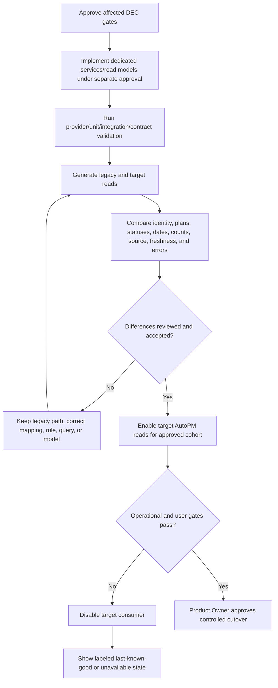
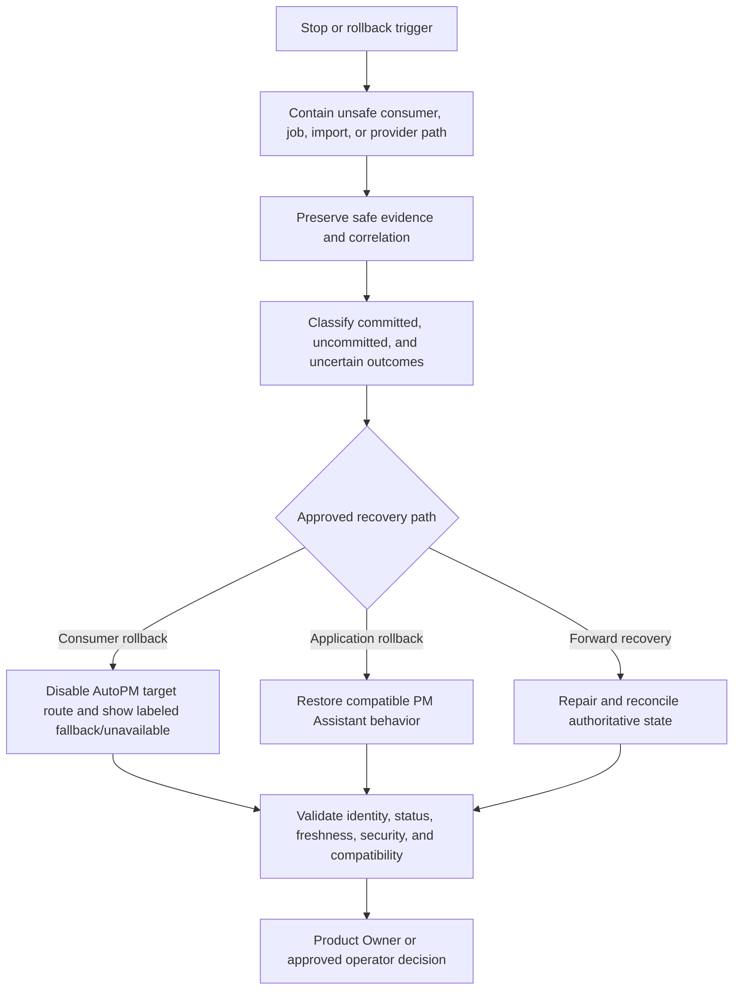

# FleetOS Backend Validation and Rollout

## Purpose and status

This document defines backend validation gates, testing boundaries, performance and observability direction, unresolved Product Owner decisions, shadow rollout, rollback, and completion criteria.

It authorizes no source-code change, database change, migration, deployment, credential action, notification, scheduler activation, external-service action, or production exposure.

## Validation principles

1. Documentation evidence does not prove runtime behavior.
2. Current implementation, transitional direction, v1 target, and future capabilities remain separate.
3. Tests support review but do not replace Product Owner decisions or approval.
4. Missing tools or runtime implementations are reported as not run, not passed.
5. Validation uses synthetic or approved sanitized data and never copies secrets, targets, raw webhook payloads, or production databases.
6. Identity, status, transaction, error, configuration, and rollback behavior are validated independently.
7. A valid empty result, missing resource, ambiguous identity, stale projection, and unavailable authority remain different outcomes.

## Validation gate registry

| ID | Gate | Required evidence |
| --- | --- | --- |
| `VAL-001` | Governance and scope | Correct branch, approved eight-file scope, clean baseline, and no prohibited source, database, environment, deployment, Git, or external action. |
| `VAL-002` | Markdown structure | Valid headings, tables, lists, code fences, readable hierarchy, and UTF-8 text. |
| `VAL-003` | Link integrity | Every local relative link resolves with correct case. |
| `VAL-004` | Mermaid integrity | Balanced fences, structurally valid conceptual diagrams, and no proposed topology presented as operational. |
| `VAL-005` | Identifier integrity | Every backend `BEMOD-*`, `APSVC-*`, `UC-*`, `REPO-*`, `TX-*`, `BVAL-*`, `BEERR-*`, `RUNTIME-*`, `VAL-*`, and `DEC-*` identifier is unique in this set, defined once, and referenced consistently. |
| `VAL-006` | State and terminology | Current, transitional, target, and future states are distinct; FleetOS, AutoPM, PM Assistant, identity, and status terms match governing documents. |
| `VAL-007` | Architecture and dependency direction | Layer dependencies point inward; AutoPM remains read-only; no shared database, microservice mandate, or framework rewrite is introduced. |
| `VAL-008` | Module and use-case ownership | Every required backend capability has one logical module/service/use-case owner and conditional behavior cites a decision. |
| `VAL-009` | Repository and model isolation | ORM/persistence models remain internal; repository interfaces, read models, and public models are separated; AutoPM has no persistence path. |
| `VAL-010` | Transaction and concurrency | Commands have one transaction owner; required evidence consistency, import preview, external side effects, scheduler acquisition, conflicts, and uncertain outcomes follow `TX-*`. |
| `VAL-011` | Validation and domain invariants | `BVAL-*`, ownership, identity, status separation, completion explicitness, and correction preservation are coherent. |
| `VAL-012` | Error and correlation | `BEERR-*` is complete, safe API mapping is accurate, write-specific gaps remain unresolved, and correlation is not treated as security or idempotency. |
| `VAL-013` | Configuration and secret safety | `RUNTIME-*` covers typed configuration, dependency injection, environment separation, probes, startup/shutdown, and no secret/target/raw payload exposure. |
| `VAL-014` | Testing boundaries | Unit, application-service, integration, contract, database, security, operational, and rollback tests have explicit ownership and no unsupported pass claim. |
| `VAL-015` | Performance and observability | Required signals and measurement dimensions are defined without invented thresholds, products, retention, or operational claims. |
| `VAL-016` | Shadow rollout | Legacy and target reads can be compared without mutation or authority transfer; differences remain visible and reviewed. |
| `VAL-017` | Rollback | Consumer, provider, job, notification, import, persistence, configuration, and security rollback preserve authority and evidence. |
| `VAL-018` | Product Owner acceptance | Applicable `DEC-*` items are resolved or explicitly deferred, residual risks are accepted, and later implementation receives separate file-level approval. |

For Phase 4.5 documentation completion, `VAL-001` through `VAL-013` and the documentation portions of `VAL-014` through `VAL-017` apply. Runtime implementation gates remain future requirements.

## Unit-test boundaries

Unit tests should isolate deterministic behavior:

- approved vehicle normalization and match classification;
- date parsing, explicit timezone interpretation, and Buddhist Era/Gregorian distinction;
- domain invariants and lifecycle transitions;
- separation of the four status domains;
- schedule-condition calculation after approval;
- completion explicitness and correction/reopen evidence;
- mileage validation/assessment after source and rule approval;
- import row classification and replay decision;
- notification duplicate/retry classification after approval;
- scheduler occurrence identity after approval;
- read-model mapping, null/empty/unavailable semantics, and error mapping;
- configuration validation that does not expose values.

Unit tests do not require FastAPI, SQLAlchemy, SQLite, APScheduler, LINE, files, or network calls.

## Application-service test boundaries

Application-service tests should verify:

- one `UC-*` owner and result;
- repository/provider collaboration;
- application validation and expected-state checks;
- transaction open/commit/rollback instruction;
- required history/audit staging;
- no provider call inside the authoritative transaction;
- no hidden mutation in query use cases;
- typed `BEERR-*` propagation;
- correlation propagation without using it as idempotency;
- conditional capabilities remain unavailable until decisions/configuration permit them.

## Integration-test boundaries

Integration tests should cover approved adapters:

- SQLAlchemy model mapping and repository behavior;
- unit-of-work commit/rollback;
- file parsing, encoding, safe temporary handling, and row outcomes;
- scheduler adapter registration, acquisition, duplicate skip, interruption, and restart;
- notification provider adapter timeout/failure/redaction using safe test doubles or isolated credentials;
- configuration/secret-provider integration;
- health/readiness dependency checks;
- structured logging and redaction;
- safe shutdown and connection closure.

External services use isolated non-production resources and credentials supplied outside the repository.

## Contract-test boundaries

Provider contract tests for the proposed `/api/v1` read boundary should verify:

- versioned paths, methods, media types, request allowlists, and common envelopes;
- purpose-built fields, types, requiredness, nullability, enums, and opaque IDs;
- identity ambiguity/conflict and `fleetos_vehicle_id` non-fabrication;
- separate status domains;
- deterministic pagination, filtering, and sorting;
- source, freshness, generated time, versions, and unavailable behavior;
- error codes, HTTP status, redaction, retry classification, and correlation equality;
- unknown future enum compatibility;
- proof that ORM/table details do not leak.

Consumer contract tests verify AutoPM remains read-only and safely handles unknown, empty, stale, fallback, conflict, and unavailable results.

Write/API contract tests are future-only until `DEC-015` is approved.

## Database-test direction

After a datastore and migration approach are approved, tests should verify:

- schema compatibility and migration sequencing;
- backup restoration and recovery;
- constraints, expected-version behavior, and concurrency conflicts;
- transaction consistency for authoritative state plus required evidence;
- import atomic or partial behavior according to `DEC-008`;
- notification intent/attempt separation;
- scheduler occurrence uniqueness;
- identity crosswalks and ambiguity preservation;
- Unicode/Thai values, dates, explicit offsets, nulls, and source snapshots;
- query determinism and representative plans;
- rollback or forward recovery with post-recovery reconciliation.

SQLite remains current evidence. PostgreSQL or another datastore is not selected or claimed operational.

## Security-test direction

Future implementation should test:

- authentication and authorization after `DEC-015`;
- direct-object and resource-existence behavior;
- CORS, TLS/proxy, upload, content-type, size, filename, and archive handling where applicable;
- secret and configuration redaction;
- webhook signature verification;
- no credentials or privileged targets in browser assets/storage;
- public response and log redaction;
- correlation validation;
- duplicate/replay protection for commands, imports, jobs, and notifications;
- least-privilege persistence/provider access;
- safe diagnostic and probe exposure.

## Performance direction

Performance must be measured against Product Owner-approved targets under `DEC-017`.

Candidate dimensions:

- API and application-service latency by use case;
- persistence query and transaction duration;
- read-model generation and freshness lag;
- import file/row volume and classification duration;
- scheduler execution duration and overlap;
- notification provider throughput and failure rate;
- concurrent command conflicts;
- memory and file handling for approved uploads/exports;
- AutoPM shadow-read latency and fallback age.

The Blueprint does not establish numeric latency, throughput, concurrency, rate, file-size, or availability targets.

Optimization rules:

- preserve correctness and audit before speed;
- measure representative approved access patterns;
- do not expose indexes/storage order as a contract;
- avoid unbounded lists and file loading;
- use purpose-built projections where justified;
- remeasure write cost, locks, and recovery after persistence optimization;
- do not add caches without freshness, privacy, invalidation, and rollback behavior.

## Observability direction

Target visibility should include:

- request/use-case count, result class, and duration;
- `BEERR-*` classification and safe correlation;
- liveness, readiness, degradation, startup, and shutdown;
- persistence readiness, transaction failure, conflict, and uncertain outcome;
- identity ambiguity, conflict, quarantine, and reconciliation counts;
- read-model source, `as_of`, stale state, build version, and generation failure;
- import batch/row outcomes and replay disposition;
- scheduler occurrence, acquisition, duplicate skip, duration, result, and recovery;
- notification intent, attempt, provider classification, retry direction, and final outcome;
- configuration validation result without values;
- shadow comparison and rollback state;
- security-relevant failures without sensitive detail.

Metrics, logs, traces, alert platform, thresholds, retention, access, and operational ownership remain `DEC-012` and `DEC-017`.

## Shadow-read strategy

Shadow reads compare legacy and target representations without changing authoritative state:

Shadow execution:

- is read-only;
- does not create workflow, completion, notification, or import outcomes;
- does not use AutoPM cache as an upstream source;
- keeps identity/status differences visible;
- preserves raw inputs and mapping/rule versions;
- does not force counts to match by silently discarding conflicts.

## Shadow comparison domains

| Domain | Minimum comparison |
| --- | --- |
| Vehicle identity | Exact, normalized, ambiguous, conflicting, missing, rejected, duplicate, alias namespace, and source. |
| PM plans | Counts, vehicle/location references and snapshots, planned/deadline/actual dates, workflow and completion. |
| Mileage | Accepted input availability, measured/received time, source, freshness, rule version, assessment, unknown/unavailable. |
| History | Event ordering, correction/supersession, safe actor/process, correlation, redaction, missing evidence. |
| Notifications | Intent/attempt separation, status counts, last attempt, duplicate behavior, redaction. |
| Import/synchronization | Batch/row counts, classifications, replay disposition, versions, last success, freshness. |
| Dashboard/report | Population, filters, independent status counts, zero/empty behavior, calculation version. |
| Operations | Latency, timeouts, dependency errors, readiness, cache/fallback age, and rollback state. |

Quantitative acceptance thresholds remain `DEC-018`.

## Rollout direction

1. Approve the affected backend decisions and exact implementation scope.
2. Introduce domain/application/repository seams for selected use cases.
3. Preserve current unversioned PM Assistant behavior unless separately scoped.
4. Validate provider behavior and safe failure paths.
5. Run shadow read models and reconciliation.
6. Make compatible provider behavior available before enabling AutoPM.
7. Enable target reads through an approved reversible configuration.
8. Observe correctness, freshness, errors, latency, identity exceptions, jobs, notifications, and imports.
9. Promote only when approved thresholds and user acceptance pass.
10. Retain the labeled fallback for the approved stabilization period.
11. Retire transitional paths only through separate approval.

## Rollback direction

### AutoPM rollback

- Disable target consumption through approved configuration.
- Restore only a labeled last-known-good compatible read path within approved age.
- Never write cache, Sheet, CSV, or display state into PM Assistant.

### PM Assistant/application rollback

- Preserve provider compatibility needed for consumer rollback where safe.
- Preserve accepted plans, completion, history, identifiers, audit, and raw source evidence.
- Roll back application behavior only when persistence remains compatible or follow approved recovery.

### Scheduler and notification rollback

- Stop new unsafe job acquisition.
- Prevent simultaneous old/new execution owners.
- Preserve occurrences, intents, attempts, and uncertain outcomes.
- Reconcile before retry; never report undelivered messages as success.

### Import and mapping rollback

- Stop unsafe mutation.
- Preserve preview, batch, row, raw-source, classification, and decision evidence.
- Revert active mapping/rule version without rewriting original values.
- Keep partial outcomes visible.

### Persistence rollback or recovery

- Follow approved backup/restore or forward-recovery procedures.
- Freeze unsafe writes when required.
- Reconcile identity, plan, status, history, import, scheduler, notification, and audit after recovery.
- A datastore rollback does not transfer ownership.

### Security/configuration rollback

- Disable unsafe exposure.
- Revoke/rotate affected credentials through separately approved external action.
- Do not restore compromised values.
- Preserve safe incident evidence and validate before re-enablement.

## Stop and rollback triggers

Stop promotion or invoke rollback for:

- direct AutoPM persistence access or an unauthorized write path;
- identity ambiguity silently resolved or merged;
- status-domain conflation or unapproved rule changes;
- completion or notification outcome reported inaccurately;
- required history/audit omitted after reported success;
- duplicate import, scheduled, command, or notification outcome outside approved policy;
- missing authority represented as valid zero/empty/current data;
- sensitive configuration, target, payload, path, SQL, topology, or credential exposure;
- unsafe authentication, authorization, CORS, webhook, upload, or cache behavior;
- incompatible provider/consumer or application/schema versions;
- unacceptable approved latency/error/freshness thresholds;
- failed backup, restore, reconciliation, recovery, or rollback rehearsal;
- an uncertain outcome that cannot be reconciled safely.

## Unresolved Product Owner decision register

| ID | Decision required | Blocks |
| --- | --- | --- |
| `DEC-001` | Enterprise Vehicle Master owner and future `fleetos_vehicle_id` type, generation, storage, merge/split, reuse, retirement, and API representation. | Canonical vehicle identity and enterprise joins. |
| `DEC-002` | `vehicle_no` normalization/version, ambiguity/conflict policy, alias rules, Thai/Arabic digit handling, and reuse/change behavior. | `UC-001`, `UC-027`, `UC-028`, reconciliation, and vehicle filtering. |
| `DEC-003` | Location, fleet, business-unit, person/team/responsibility ownership, stable identity, hierarchy, aliases, renames, and historical behavior. | Location/grouping commands, projections, and filters. |
| `DEC-004` | Odometer producer, source priority, unit, measured/received time, reset/replacement, correction, duplicates, monotonicity, timezone, and freshness. | `UC-029` and `UC-030`. |
| `DEC-005` | PM workflow vocabulary, transition graph, schedule-condition separation, task-control semantics, cancellation, and transition authority. | `UC-015` through `UC-021`. |
| `DEC-006` | Completion vocabulary, evidence, actual/effective time, backdating, correction, reopen, linked-task effects, and authorization. | `UC-022`, `UC-023`, completion/history projections. |
| `DEC-007` | Mileage calculation inputs, thresholds, boundary behavior, unknown/stale states, rule approval/versioning, and recalculation. | `UC-008` and `UC-031`. |
| `DEC-008` | Import batch/replay identity, checksum, scope, atomicity/partial success, confirmation, resume, source retention, row identity, and acceptance thresholds. | `UC-032` through `UC-035`, `TX-006`, import persistence/tests. |
| `DEC-009` | Notification recipients, authorization, intent identity, idempotency, duplicate suppression, templates, provider classification, timeout, retry, redaction, and retention. | `UC-036` through `UC-038`. |
| `DEC-010` | Scheduler owner/topology, job/occurrence identity, timezone, overlap, misfire, concurrency, lock/lease, timeout, retry, recovery, and shutdown. | `UC-039`, `RUNTIME-008`, scheduler tests. |
| `DEC-011` | KPI/report definitions, counted populations, filters, grouping semantics, historical `as_of`, calculation versions, and export scope. | `UC-007`, `UC-014`, `UC-040`. |
| `DEC-012` | Audit, history, import, notification, log, error, diagnostic, privacy, access, correction, deletion, and retention policies. | `UC-005`, `UC-010` through `UC-012`, observability and storage. |
| `DEC-013` | Plan/location deletion, cancellation versus tombstone, referential behavior, history continuity, archive, and privacy obligations. | `UC-017`, `UC-026`, plan/history compatibility. |
| `DEC-014` | Command concurrency, expected-version mechanism, transaction isolation direction, idempotency identity/retention, uncertain-outcome reconciliation, and safe retry. | All duplicate-sensitive commands and persistence behavior. |
| `DEC-015` | Authentication/proxy topology, service/human identities, roles/scopes, authorization, CORS, TLS, correlation format/trust, resource disclosure, and write/UI public error contract. | Protected production exposure and write-specific error mapping. |
| `DEC-016` | Hosting/process topology, persistence engine/migration mechanism, composition lifecycle, readiness dependencies, graceful shutdown, backup, restore, and recovery objectives. | Production runtime and persistence readiness. |
| `DEC-017` | Availability, latency, throughput, load, file size, timeout, rate, alert, freshness, recovery, stabilization, and observability retention targets. | Performance and operational acceptance. |
| `DEC-018` | Shadow reconciliation thresholds, exception ownership, cohort/promotion rules, fallback age, stabilization window, stop/go authority, and rollout acceptance. | Controlled cutover and release evidence. |

An unresolved decision is not permission to choose a convenient default. A decision may be deferred only when the affected use case, field, route, job, or rollout stage remains disabled or explicitly conditional.

## Documentation validation procedure

After creating or changing the Backend Blueprint:

1. confirm the branch and exact changed-file set;
2. validate Markdown hierarchy, tables, and fence balance;
3. resolve every relative link;
4. structurally check every Mermaid block and render when an already-approved local tool is available;
5. extract identifier definitions/references and check duplicates, ranges, and orphan references;
6. search for generic status conflation, fabricated identity, shared-database access, AutoPM writes, framework rewrite, and unsupported operational claims;
7. review transaction and dependency arrows;
8. cross-check API error mappings against governing error documents;
9. check UTF-8 and representative Thai/Unicode terminology;
10. scan safely for credentials, tokens, connection strings, target identifiers, raw payloads, `.env` values, and unsafe paths;
11. run whitespace/diff checks;
12. report pass, fail, warning, not-run, limitations, exact changed files, and remaining decisions.

No new dependency is added solely for documentation validation without approval.

## Definition of Backend Blueprint complete

Phase 4.5 is complete when:

- all eight approved `docs/backend/` files exist and no existing file changed;
- `VAL-001` through `VAL-013` and applicable documentation checks in `VAL-014` through `VAL-017` pass or have explicit reported limitations;
- identifier definitions and references are unique and complete within the backend namespace;
- all required backend content is covered without operational overclaim;
- transaction, validation, error, configuration, dependency, and rollback directions are coherent;
- examples contain no secret or sensitive operational data;
- the exact changed-file list, concise diff summary, validation results, risks, and unresolved decisions are handed to the Product Owner;
- `VAL-018` remains the required Product Owner acceptance gate for any later implementation or rollout;
- no commit, push, pull, PR, merge, deployment, migration, credential, database, or external-service action occurs.

This definition completes the documentation Blueprint only. Runtime validation and Product Owner acceptance gates remain future work until implementation is separately approved.
