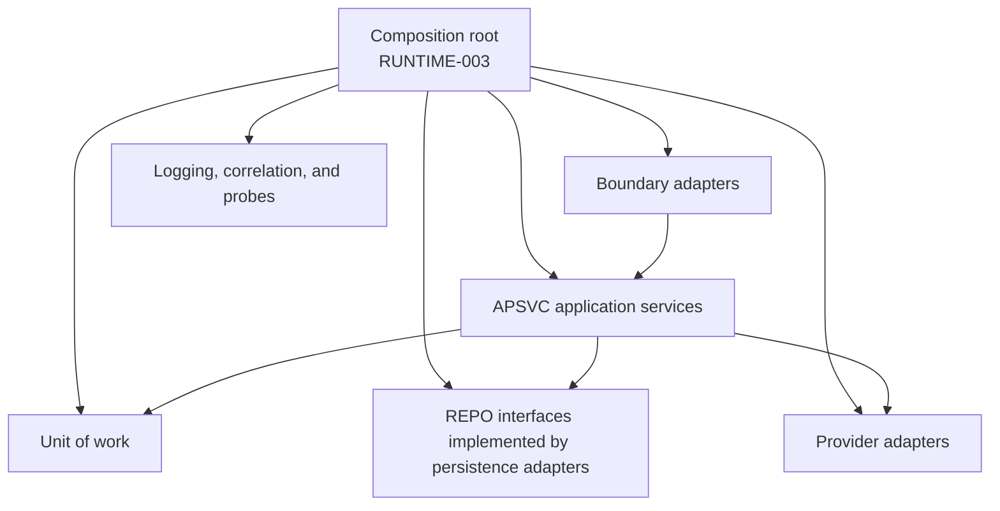
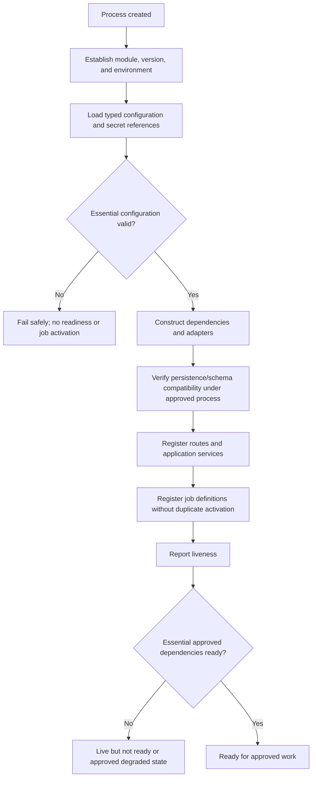
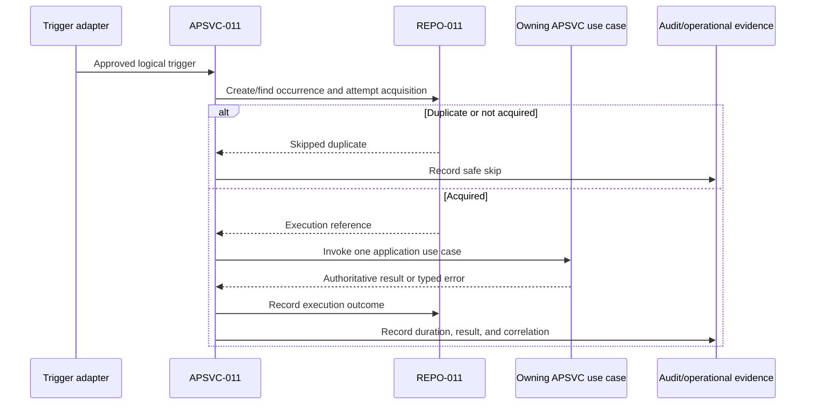
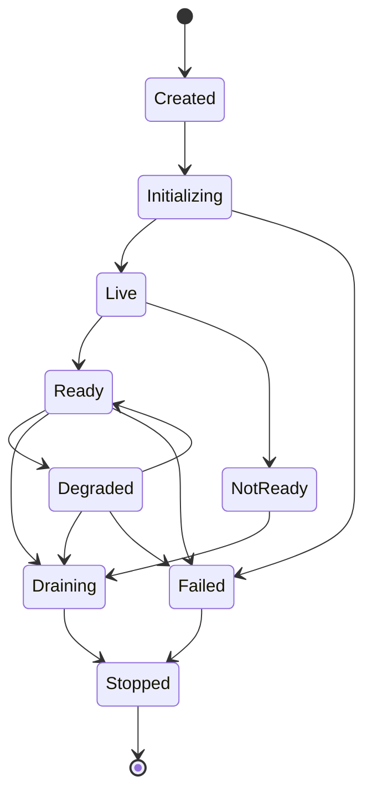
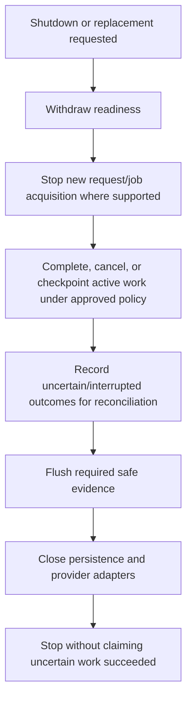

# FleetOS Configuration, Dependency, and Runtime

## Purpose

This document defines configuration, secret handling, dependency injection, composition, startup, health, readiness, background-job execution, logging, and shutdown direction for the FleetOS v1.0 backend.

It does not select hosting, process topology, containers, PostgreSQL, Railway, a worker platform, a queue, a secret manager, authentication, authorization, or an observability product.

## Current runtime evidence

Repository evidence shows:

- FastAPI application construction in `pm-assistant/main.py`;
- permissive development CORS;
- SQLite configuration hard-coded in current database implementation;
- table creation and default-data initialization during import/startup behavior;
- current settings persisted in a general settings table, including sensitive configuration categories;
- database-backed scheduler enablement and schedule values;
- an in-process APScheduler started in application code;
- several scheduler registration paths and startup behavior;
- direct construction of database sessions in request, scheduler, and helper code;
- direct notifier/provider calls using current settings;
- local file logs, implementation-specific health, logs, snapshot, and diagnostic routes;
- no evidenced production authentication, secret manager, multi-process scheduler control, or centralized observability.

These are current implementation facts, not target operational controls.

## Runtime requirement registry

| ID | Runtime requirement |
| --- | --- |
| `RUNTIME-001` | Runtime configuration is represented through typed, validated application settings rather than unstructured access throughout domain/application code. |
| `RUNTIME-002` | Secret values are loaded through an approved secret boundary and never exposed through general configuration models, public APIs, logs, audit, browser assets, or documentation. |
| `RUNTIME-003` | One composition root constructs concrete adapters and injects interfaces into application services; domain/application code does not construct infrastructure directly. |
| `RUNTIME-004` | Environment identity and application/module version are established safely at startup without exposing topology or secret values. |
| `RUNTIME-005` | Essential configuration is validated before readiness; invalid essential configuration fails safely and does not start unsafe work. |
| `RUNTIME-006` | FastAPI may remain the HTTP presentation adapter, and SQLAlchemy may remain a persistence adapter, without becoming domain dependencies or public model contracts. |
| `RUNTIME-007` | Liveness represents minimal process execution; readiness represents the ability of essential approved dependencies to serve the backend responsibility. |
| `RUNTIME-008` | Background-job definitions and triggers are registered without creating an unapproved second execution owner; activation is explicit and observable. |
| `RUNTIME-009` | Every job/provider/persistence operation uses approved bounded deadlines and cancellation/recovery behavior; exact values remain unresolved. |
| `RUNTIME-010` | Runtime logging and correlation use safe structured evidence and redact secrets, targets, raw payloads, paths, topology, and unnecessary personal data. |
| `RUNTIME-011` | Startup, readiness, degradation, draining, shutdown, and failed states are explicit and observable without being confused with business status. |
| `RUNTIME-012` | Graceful shutdown withdraws readiness, stops new job acquisition, handles active work under approved policy, flushes required safe evidence, and closes adapters. |
| `RUNTIME-013` | Development, test, staging, and production configuration remain separated; non-production must not silently use production data, credentials, recipients, or callbacks. |
| `RUNTIME-014` | Runtime and feature configuration can support reversible rollout but cannot redefine domain ownership, identity, status meaning, or business rules without an approved versioned decision. |

## Configuration model

Configuration categories include:

| Category | Direction |
| --- | --- |
| Application identity | FleetOS module, application version, environment, safe public paths. |
| API boundary | Approved version, exposure, origins, proxy/trust behavior, cache, and feature selection. |
| Persistence | Secret connection reference, compatibility version, deadline and pool direction if applicable. |
| Security | Authentication/authorization policy references, TLS/proxy behavior, origins, redaction, and disclosure controls after approval. |
| Jobs | Logical enablement, timezone, schedule reference, owner, concurrency, overlap, misfire, retry, and recovery policy references. |
| Notifications | Provider and secret references, approved routing, safe test mode, template/version, timeout, retry, and redaction policy references. |
| Imports | Approved source types, size/type limits, protected staging, replay policy reference, and retention reference. |
| Observability | Safe log level, service/module identity, correlation, metric/alert destinations, and retention reference. |
| Feature rollout | Read-model shadow mode, AutoPM consumer selection, compatible versions, and rollback selection. |

Exact values and mechanisms remain Product Owner decisions. Configuration must not silently substitute defaults for unresolved security or business policy.

## Secret handling

Required direction:

- documentation and examples use names or safe placeholders only;
- privileged secrets never enter AutoPM HTML, JavaScript, URLs, browser storage, or static assets;
- startup validates presence and relationships without echoing values;
- public settings responses exclude secret values;
- provider diagnostics use safe classifications rather than masked secrets as a general disclosure strategy;
- logs and audit do not contain authorization headers, tokens, signing secrets, database credentials, connection strings, or raw provider responses;
- secret rotation/revocation is an external action requiring separate approval;
- rollback never restores a revoked or compromised secret;
- test credentials and recipients are supplied outside the repository and isolated from production.

Current settings-table behavior remains evidence requiring later migration/design review. This Blueprint does not move or alter any value.

## Dependency injection direction

The target composition root wires:

- boundary/router dependencies;
- `APSVC-001` through `APSVC-014`;
- domain policies and validators;
- unit-of-work implementation;
- `REPO-001` through `REPO-014`;
- clock/timezone provider;
- correlation provider;
- configuration and secret providers;
- file/import adapters;
- scheduler/trigger adapter;
- notification provider adapter;
- structured logger and health dependency checks.

The composition root may know concrete classes. Application/domain code receives interfaces and typed configuration, not global infrastructure objects.

## Startup lifecycle

Target startup must avoid:

- provider sends during module import;
- multiple scheduler owners caused by application import or worker replication;
- readiness before essential persistence/read compatibility;
- database migration or destructive initialization without an approved migration process;
- logs containing configuration values.

Existing initialization behavior may remain during transition until separately refactored.

## Liveness and readiness

`APSVC-014` follows:

- liveness: the runtime can execute its minimal loop;
- readiness: essential approved dependencies can serve the intended work;
- degraded: an approved non-essential capability is impaired while safe core work remains possible;
- not ready: essential authoritative work cannot be served safely.

Probe output:

- is coarse and safe;
- identifies service/module and checked time where approved;
- does not expose hostnames, engine names, schemas, paths, connection details, credentials, provider targets, or internal stack traces;
- uses `Cache-Control: no-store` where governed by the API Blueprint;
- does not convert a missing authoritative dataset into a healthy zero result.

Essential dependency selection and probe exposure remain `DEC-015` and `DEC-016`.

## Background-job execution direction

The job runtime implements `BEMOD-009` and `APSVC-011`:

Requirements:

- one approved execution owner per job class;
- deterministic occurrence identity after `DEC-010`;
- duplicate acquisition is visible and harmless;
- scheduler callback delegates to an application service;
- business validation and authorization failures are not automatically retried;
- notification retry does not rerun the originating maintenance action;
- restart reconciles running/uncertain work before replay;
- shutdown stops new acquisition before adapter closure;
- non-production cannot target production recipients or data.

## Runtime lifecycle

These states describe runtime condition and must not be serialized as PM workflow, completion, notification, import, or scheduler business status.

## Shutdown lifecycle

Exact drain time, cancellation, checkpoint, and forced-termination behavior remain `DEC-016`.

## Logging and correlation direction

`RUNTIME-010` applies across requests, imports, jobs, notifications, readiness, and shutdown.

Record safe fields where applicable:

- timestamp with explicit timezone;
- severity;
- FleetOS module and backend component;
- application/configuration version;
- event name;
- result and duration;
- safe resource/operation reference;
- validated correlation;
- `BEERR-*` classification;
- readiness/degraded transition;
- job owner and duplicate-prevention result without topology leakage.

Avoid duplicate exception logs across layers. Log once where actionable context and safe classification meet.

## Dependency failure and degradation

- Persistence/read dependency loss normally removes readiness for authoritative work.
- Notification provider loss may degrade notification capability while separately accepted maintenance workflows continue.
- Report or optional projection failure may degrade that capability without representing authoritative data as zero.
- AutoPM may use only an approved labeled last-known-good response; PM Assistant does not consume that cache.
- A secret/configuration failure does not fall back to unsafe embedded defaults.
- Invalid essential configuration is classified as `BEERR-012` and prevents readiness or unsafe job activation.
- A scheduler ownership conflict stops or skips execution rather than running duplicates.

## Configuration and runtime testing direction

Later tests should cover:

- valid and invalid typed configuration;
- missing secret references without value disclosure;
- environment separation;
- dependency construction and replacement with test adapters;
- startup failure before readiness;
- liveness/readiness distinction;
- persistence and provider loss/recovery;
- single job-owner activation;
- restart and uncertain-work reconciliation;
- graceful draining and shutdown;
- correlation propagation and redaction;
- no privileged secret in public settings, errors, logs, snapshots, fixtures, or browser-delivered content.

## Completion criteria

This runtime model is complete when all `RUNTIME-*` requirements are defined, startup/readiness/shutdown direction is coherent, secrets remain protected, dependencies are injected rather than constructed in domain/application code, and background execution does not assume an unapproved topology.
