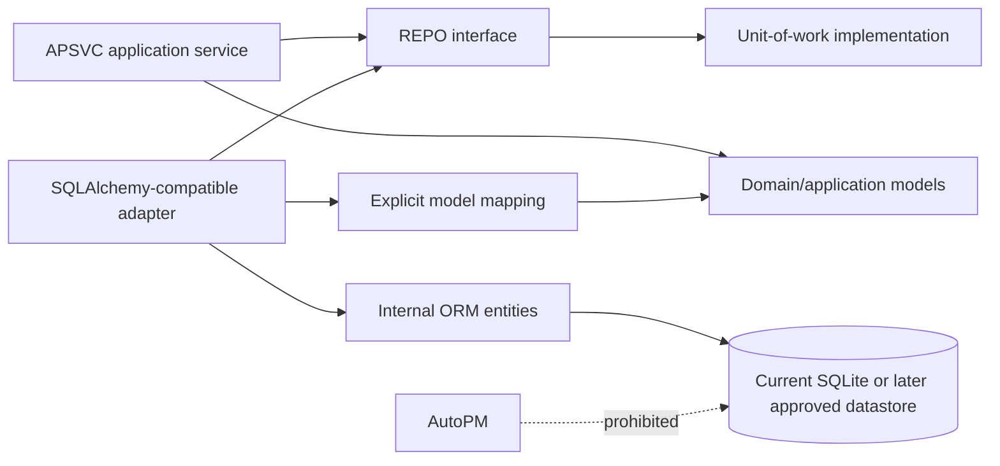
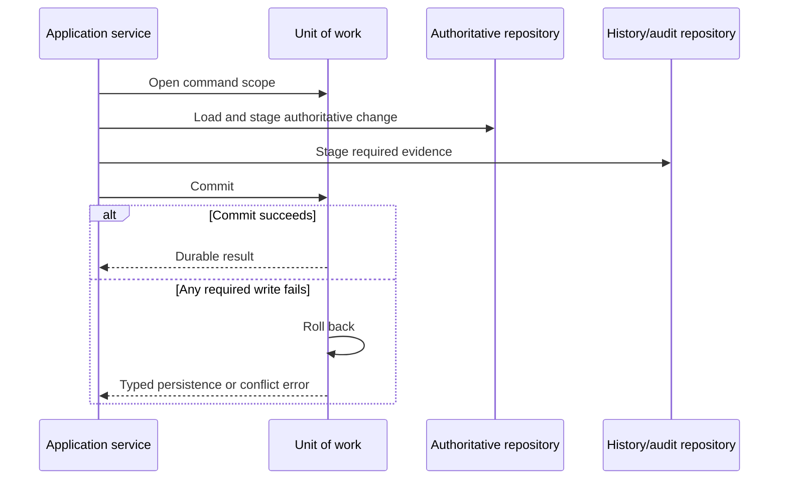

# FleetOS Repository and Persistence Boundaries

## Purpose

This document defines repository interfaces, persistence adapters, read-model boundaries, unit-of-work direction, concurrency, and idempotency for the FleetOS v1.0 backend.

It does not define executable interfaces, physical schemas, ORM mappings, migrations, a database engine, connection settings, or a production topology.

## Current persistence evidence

PM Assistant currently:

- uses SQLAlchemy with a local SQLite file;
- creates tables during application initialization;
- defines ORM models for vehicle, location, plan, history, LINE, notification, import, user, task-state, weekly-control, and settings behavior;
- creates database sessions through `SessionLocal`;
- performs queries and commits directly in routes, helpers, initialization, imports, scheduler behavior, and notifier behavior;
- stores several relationships as local integers or text without demonstrated target foreign-key enforcement;
- stores plan-time vehicle and location attributes directly on plan records;
- uses limited startup-time legacy table copying rather than a general approved migration mechanism.

This is current implementation evidence only. Current table names, ORM classes, commit placement, local identifiers, and startup behavior are not the target repository contract.

## Repository principles

1. Repository interfaces are owned by the application/domain side.
2. Infrastructure adapters implement the interfaces.
3. Repositories operate on domain or application models, not public API models.
4. ORM entities remain inside persistence adapters.
5. A repository never grants AutoPM persistence access.
6. Repository methods do not independently commit the application transaction.
7. Query interfaces may use optimized projections but do not expose storage structure.
8. Domain ownership outranks timestamps during conflict resolution.
9. A repository does not invent identity, transition, idempotency, retention, or retry policy.
10. Persistence exceptions are translated into typed internal errors before reaching the boundary.

## Repository interface catalog

| ID | Repository interface | Responsibility |
| --- | --- | --- |
| `REPO-001` | PM Plan Repository | Load, add, and persist PM plan aggregate state and expected-version evidence for `UC-015` through `UC-018`. |
| `REPO-002` | Task-State Repository | Load and persist current pause, resume, follow-up, snooze, reminder, and related task-control state. |
| `REPO-003` | Completion Repository | Append and query explicit completion, reopen, correction, and re-completion evidence. |
| `REPO-004` | PM History Repository | Append ordered maintenance-history entries and produce safe history source records. |
| `REPO-005` | Vehicle Reference Repository | Lookup transitional vehicle representations, aliases, provenance, and candidate matches without fabricating enterprise identity. Under ADR-0004, a later separately approved narrow write port may stage creation of one PM Assistant-local Vehicle reference without gaining update, delete, lifecycle, or enterprise-registry authority. |
| `REPO-006` | Location Repository | Load and persist transitional location records, names, aliases, lifecycle evidence, and historical-reference support. |
| `REPO-007` | Mileage Repository | Conditionally store received/accepted mileage evidence and versioned mileage assessments without rewriting raw accepted input. |
| `REPO-008` | Import Batch Repository | Store import batches, source references, preview/confirmation state, counts, replay disposition, and row outcomes. |
| `REPO-009` | Reconciliation Repository | Store identity/data-quality cases, classifications, reviewed decisions, mapping versions, and supersession. |
| `REPO-010` | Notification Repository | Store notification intents, duplicate dispositions, provider attempts, safe outcomes, and `notification_status`. |
| `REPO-011` | Scheduler Repository | Store logical job definitions, occurrences, acquisition outcomes, executions, retries/recovery, and safe results. |
| `REPO-012` | Audit Repository | Append safe domain audit and correction evidence under approved access and retention rules. |
| `REPO-013` | Read-Projection Repository | Read or maintain purpose-built projection state, freshness, generation version, and safe unavailable classification. |
| `REPO-014` | Reporting Read Repository | Execute approved report/summary queries with deterministic population, `as_of`, source, and calculation-version evidence. |

## Repository ownership and aggregate boundaries

Repositories align with domain consistency direction, not necessarily one table per interface:

- `REPO-001`, `REPO-002`, `REPO-003`, and `REPO-004` collaborate around PM plan, workflow, completion, and history without combining their status meanings.
- `REPO-005` and `REPO-009` collaborate for transitional identity and quarantine.
- `REPO-007` preserves accepted mileage separately from versioned assessment.
- `REPO-008` retains batch and row evidence even when mutation fails or is partial.
- `REPO-010` separates notification intent from attempts.
- `REPO-011` separates logical jobs from executions.
- `REPO-012` does not replace domain-specific history or evidence.
- `REPO-013` and `REPO-014` are read-oriented and do not become AutoPM database contracts.

An implementation may combine interfaces in one adapter or persistence module where maintainable. It must preserve the logical boundaries and test behavior.

### Phase 6.3 local Vehicle creation direction

ADR-0004 establishes architecture direction for a later narrow local Vehicle
creation port. That port, if separately approved for implementation:

- is owned by the application side and remains specific to local Vehicle
  creation;
- accepts no caller-supplied `local_vehicle_id`;
- permits persistence to allocate the positive local identifier inside the
  application-owned unit of work;
- stages creation without committing or rolling back independently;
- returns no successful application result before the unit of work confirms
  commit;
- participates in the required auditability of successful creation without this
  document choosing audit content or storage;
- implements no update, delete, matching, normalization, alias, grouping,
  reconciliation, event, API, or AutoPM behavior.

Exact Original Vehicle Number duplicate and uniqueness semantics remain pending.
The port and adapter must not infer them from a current database constraint.

## Repository and persistence adapter flow

The direction `P --> I` means the concrete adapter implements the inward-owned interface. The application receives the interface through dependency injection.

## Persistence adapter responsibilities

A persistence adapter may:

- translate domain/application references to internal persistence keys;
- issue engine-specific queries;
- map ORM records to domain/application models;
- enforce approved constraints and expected-version behavior;
- participate in an application-owned unit of work;
- translate unique, foreign-key, timeout, connection, serialization, and other persistence failures to `BEERR-*`;
- produce query projections optimized for approved access patterns;
- expose safe persistence readiness through `RUNTIME-007`.

A persistence adapter must not:

- return a live ORM object outside the adapter boundary;
- commit or roll back independently unless it is the unit-of-work implementation acting on application instruction;
- expose SQL, connection strings, engine names, paths, or schema details to public errors;
- resolve ambiguous identity by selecting the first, last, or newest row;
- combine the four status domains;
- use a database timestamp to override authoritative ownership;
- silently retry a transaction that may duplicate an accepted business outcome;
- turn a read replica, view, or table into an AutoPM integration contract.

## Unit-of-work direction

The unit of work is the application transaction boundary described by `TX-001` through `TX-011`.

Target responsibilities:

- open one persistence scope for an authoritative command;
- provide the repositories required by that use case;
- commit only after required authoritative state and required evidence are staged;
- roll back on typed or unexpected failure;
- prevent repository-level autonomous commits;
- expose no database session to presentation or AutoPM;
- close the persistence scope reliably;
- classify commit, rollback, and uncertain outcomes safely.

The exact SQLAlchemy session pattern and transaction API are future implementation details.

## Read persistence direction

Queries may use:

- aggregate repositories for simple reads;
- dedicated query repositories or `REPO-013`/`REPO-014` for complex projections;
- approved database views or materialized mechanisms only after separate physical design approval;
- cache or projection storage only when freshness, invalidation, privacy, and recovery behavior are approved.

Query models:

- are immutable application results where practical;
- contain only approved fields;
- preserve source and freshness;
- use deterministic ordering;
- distinguish empty, missing, ambiguous, stale, and unavailable;
- do not create maintenance truth.

## Current-to-target persistence mapping

| Current evidence | Target interpretation |
| --- | --- |
| `VehicleMaster` ORM | Candidate adapter source for `REPO-005`; not enterprise Vehicle Master or `fleetos_vehicle_id`. |
| `Location` ORM | Candidate adapter source for `REPO-006`; local ID is not a shared FleetOS identity. |
| `PMPlan` ORM | Candidate adapter source for `REPO-001`; generic `status` requires mapping and must not remain the only target status concept. |
| `PMTaskState` ORM | Candidate adapter source for `REPO-002`; task controls do not become completion authority. |
| `PMHistory` ORM | Candidate adapter source for `REPO-004`; legacy JSON-like snapshots require safe projection. |
| `NotificationLog` ORM | Partial candidate source for `REPO-010`; it does not establish a separate intent or approved retry policy. |
| `ImportLog` ORM | Partial candidate source for `REPO-008`; it does not establish row outcomes or replay safety. |
| Weekly campaign models | Candidate sources for planning/reporting use cases; target domain placement and status meaning require review. |
| `Setting` ORM | Current evidence only; secrets and typed configuration require the runtime boundary, not a generic public repository. |
| LINE target/webhook models | Current provider evidence requiring access, redaction, retention, and target redesign. |

This mapping does not authorize schema changes.

The current `VehicleMaster` primary-key and uniqueness behavior remains
implementation evidence. ADR-0004 accepts persistence ownership of local integer
identity allocation, but it does not accept the current Original Vehicle Number
constraint as business policy or select an audit persistence design.

## Transaction boundaries by use-case family

| Use-case family | Transaction direction |
| --- | --- |
| Plan/workflow commands | One application-owned transaction for authoritative plan/task state plus required history/audit. |
| Completion commands | One transaction for completion evidence, required plan projection/state, history, and audit under `TX-003`. |
| Vehicle/location reconciliation | One transaction per reviewed decision or controlled batch disposition; ambiguous input is not auto-committed as a match. |
| Mileage receipt/acceptance | Receipt evidence and acceptance disposition follow approved boundaries; assessment is separately versioned. |
| Import preview | No authoritative business mutation under `TX-005`. |
| Import confirmation | Batch/row evidence and business changes follow approved atomic or partial policy under `TX-006`. |
| Notification | Intent persistence and provider attempt are separate; provider calls occur outside a database transaction under `TX-004`. |
| Scheduler | Occurrence acquisition and execution result are durable steps; the invoked business use case owns its own transaction. |
| Query/read models | Read-only; no hidden authoritative mutation. |
| PM Assistant-local Vehicle creation | One application-owned transaction stages the local reference and satisfies the later approved audit consistency contract. Persistence allocates `local_vehicle_id`; caller-supplied IDs are prohibited. Duplicate policy remains pending. |

## Concurrency direction

Concurrent authoritative commands must not use latest timestamp or last-write-wins by default.

Target direction:

- commands carry or derive an expected state/version where required;
- `REPO-001`, `REPO-002`, `REPO-003`, and other mutable repositories participate in optimistic version checking or an equivalent approved mechanism;
- a stale expected version returns `BEERR-006`;
- uniqueness and integrity constraints support, but do not replace, domain concurrency rules;
- duplicate scheduler acquisition returns a recorded skip, not a second accepted business outcome;
- ambiguous identity and concurrent reconciliation remain explicit conflicts;
- a transaction retry is allowed only when the application can prove it cannot duplicate business outcomes.

Exact version fields, lock behavior, isolation level, retry policy, and user resolution experience remain `DEC-014`.

For local Vehicle creation, an allocated identifier is not proof of commit.
Automatic retry is prohibited when a repeated attempt could create another
accepted record, and an uncertain outcome requires reconciliation before retry.

## Idempotency direction

Idempotency is business-specific:

- `UC-015` through `UC-023` require explicit command behavior before any automatic replay is allowed.
- `UC-034` requires an approved import replay identity and scope.
- `UC-036` requires an approved notification-intent duplicate key.
- `UC-039` requires deterministic job occurrence identity.
- read-only `GET` behavior does not require an idempotency key.
- correlation IDs, filenames, timestamps, row order, and local database IDs are not automatically idempotency keys.

An idempotency record must retain the business scope, safe request identity/hash where approved, result disposition, time, and retention behavior. Exact formats and replay windows remain `DEC-008` through `DEC-010` and `DEC-014`.

## Persistence error direction

Adapters classify failures without leaking implementation:

| Adapter condition | Internal direction |
| --- | --- |
| Expected record missing | `BEERR-002` |
| Identity uniqueness exposes multiple candidates | `BEERR-003` or `BEERR-004` |
| Expected version changed | `BEERR-006` |
| Approved duplicate key already completed | `BEERR-007` |
| Essential connection unavailable | `BEERR-008` |
| Persistence deadline exceeded | `BEERR-009` |
| Constraint or commit failure not safely classified | `BEERR-010` |

Until Original Vehicle Number duplicate policy is approved, an adapter cannot
classify the current storage uniqueness constraint as `BEERR-007` merely because
the constraint exists. It must not invent domain duplicate semantics.

Public API translation remains governed by the API Blueprint and `TRANSACTION_ERROR_AND_VALIDATION_MODEL.md`.

## Persistence testing direction

Later implementation tests should cover:

- mapping between ORM and domain/application models;
- commit and rollback ownership;
- required state plus history/audit consistency;
- expected-version conflicts;
- uniqueness and ambiguity behavior;
- import preview with no mutation;
- partial/atomic import behavior after approval;
- notification intent/attempt separation;
- scheduler duplicate occurrence behavior;
- query determinism, pagination, freshness, and unavailable behavior;
- Unicode, Thai values, dates, explicit offsets, nulls, and long/sensitive text redaction;
- engine failure, timeout, interruption, recovery, and connection closure;
- proof that AutoPM has no persistence interface.

## Migration and engine neutrality

This Blueprint does not select PostgreSQL, Railway, Docker, migration tooling, pooling, replication, schema layout, or physical indexes.

A future engine or schema change requires:

- separate Product Owner approval;
- current data/query/writer inventory;
- versioned migration design;
- backup and restore rehearsal;
- application compatibility;
- identity, status, Unicode, time, history, and audit reconciliation;
- rollback or forward-recovery decision;
- proof that ownership and AutoPM boundaries remain unchanged.

## Completion criteria

This document is complete when all `REPO-*` interfaces have one responsibility, ORM and public models remain isolated, unit-of-work ownership is explicit, concurrency/idempotency direction does not invent policy, and no persistence path grants AutoPM direct access.
