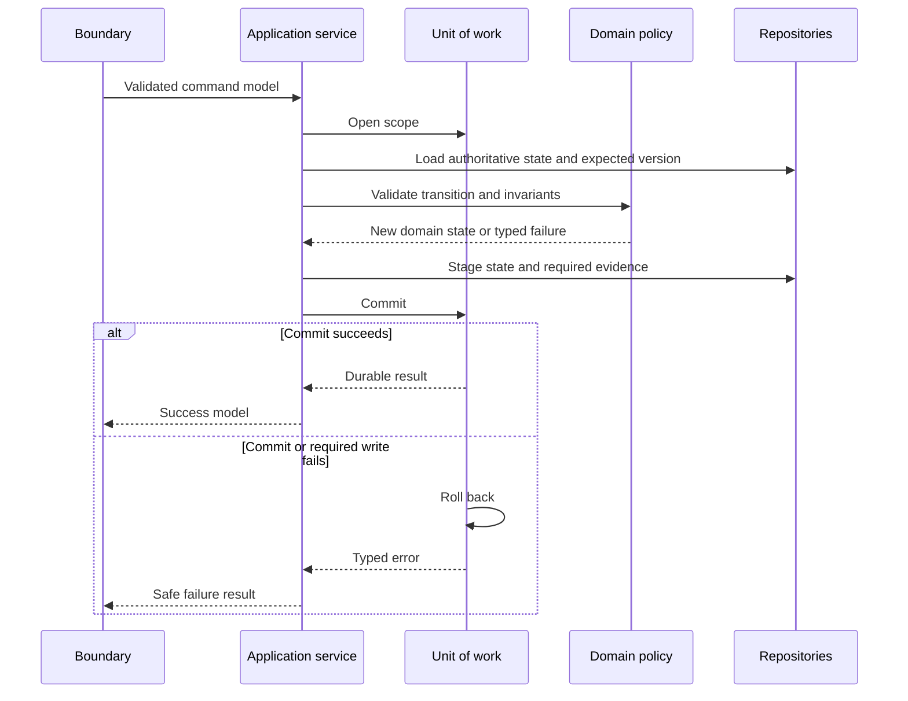
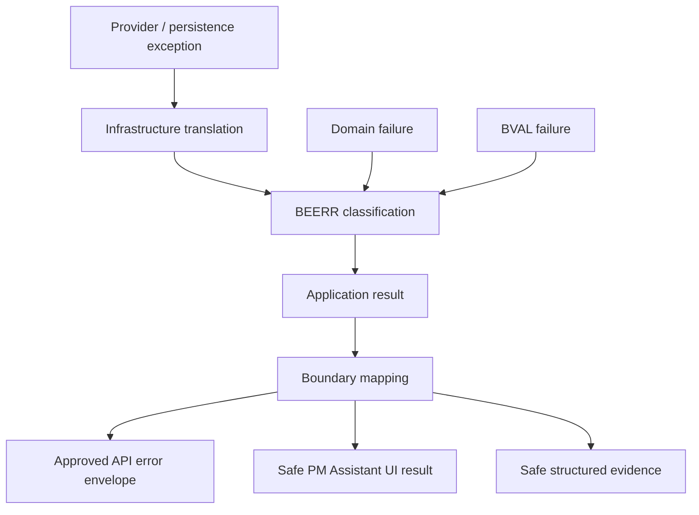

# FleetOS Transaction, Error, and Validation Model

## Purpose

This document defines transaction rules, validation responsibilities, domain-invariant enforcement, internal backend errors, public error translation, correlation, and rollback direction.

The rules are logical requirements. They do not select database isolation levels, lock mechanisms, retry counts, authentication, authorization, or a transaction library.

## Transaction rule registry

| ID | Transaction rule |
| --- | --- |
| `TX-001` | One authoritative command use case owns one explicit unit-of-work boundary. |
| `TX-002` | Presentation handlers and ordinary repository methods do not independently commit or roll back; they act through the application-owned unit of work. |
| `TX-003` | A successful authoritative mutation persists the required business state and required domain history/audit evidence under the approved consistency guarantee. |
| `TX-004` | External notification delivery occurs outside the authoritative database transaction; notification intent and each provider attempt are durable, distinct records. |
| `TX-005` | Import preview parses, validates, normalizes, and classifies without authoritative business mutation. |
| `TX-006` | Import confirmation follows an approved atomic or partial-success policy; batch and row outcomes remain visible in every case. |
| `TX-007` | A scheduled occurrence is acquired and recorded separately from the business use case it invokes; duplicate acquisition cannot create a second accepted business outcome. |
| `TX-008` | Read/query use cases do not perform hidden authoritative writes or commits. |
| `TX-009` | Concurrent commands use an approved expected-version or equivalent rule; clock time alone does not resolve conflicts. |
| `TX-010` | Automatic retry is prohibited when the backend cannot prove that a repeated transaction will not duplicate an accepted business outcome. |
| `TX-011` | Commit, rollback, interrupted, and uncertain outcomes are classified explicitly and never reported as success without durable evidence. |

## Command transaction direction

## Transaction responsibilities

### Presentation/API boundary

- does not open ORM sessions directly in the target direction;
- does not decide commit order;
- does not catch all exceptions and return success-like results;
- invokes one `APSVC-*`;
- translates the application result after the use case has completed.

### Application service

- defines the use-case transaction boundary;
- validates application preconditions;
- loads expected authoritative state;
- invokes domain rules;
- stages required history/audit;
- coordinates commit/rollback;
- returns a typed result.

### Domain layer

- validates invariants and transition meaning;
- remains unaware of commit mechanisms;
- does not call providers or persistence directly;
- returns domain results or typed domain failures.

### Infrastructure

- implements the unit of work and `REPO-*`;
- maps persistence exceptions safely;
- closes resources;
- never changes domain policy to accommodate provider behavior.

## Required consistency examples

### PM Assistant-local Vehicle creation

ADR-0004 authorizes architecture planning for one local Vehicle creation command.
The application service owns one explicit unit of work. Persistence allocates
`local_vehicle_id` while staging the record; callers cannot supply it, and an
allocated value is not a successful result until commit is confirmed.

Successful creation must be auditable. Phase 6.3 does not prescribe audit fields,
persistence shape, source references, access, retention, or storage. A later
approved contract must define the required consistency between the created
record and its audit evidence before implementation reports success.

Exact Original Vehicle Number duplicate and uniqueness behavior remains pending.
A storage uniqueness exception therefore has no approved duplicate-conflict
translation merely because the current constraint exists.

### Plan or workflow command

The authoritative plan/workflow state and required history/audit evidence must not diverge after a reported success. Exact physical storage may differ, but `TX-003` applies.

### Completion

`UC-022` must not report completion when required completion evidence, plan relationship, history, or audit failed to persist. External notifications caused by completion are separate under `TX-004`.

### Import

Preview is non-mutating under `TX-005`. Confirmation uses `TX-006`; the Product Owner must approve atomic versus partial behavior. Even when business changes roll back, batch/row failure evidence must remain available through a safe approved pattern.

### Scheduler

`UC-039` records acquisition and execution evidence under `TX-007`. The invoked business command owns its own `TX-001` scope. A scheduler retry cannot blindly replay an uncertain committed command.

## Validation rule registry

| ID | Validation rule |
| --- | --- |
| `BVAL-001` | Untrusted transport input is validated for type, shape, length, allowed fields, content type, and safe encoding before application use. |
| `BVAL-002` | Application preconditions validate required references, expected state, feature availability, and approved authorization decision before mutation. |
| `BVAL-003` | Vehicle identity validation preserves original and normalized `vehicle_no`, rule version, provenance, and explicit classification; ambiguity is never guessed. |
| `BVAL-004` | Location, fleet, business-unit, vehicle-code, registration, and responsibility namespaces remain distinct and are not merged by display equality. |
| `BVAL-005` | Date/time validation distinguishes dates from instants, requires explicit timezone interpretation where relevant, distinguishes Buddhist Era/Gregorian input, and rejects ambiguity. |
| `BVAL-006` | `pm_mileage_status`, `pm_workflow_status`, `completion_status`, and `notification_status` are validated independently; a generic status cannot substitute for them. |
| `BVAL-007` | Domain transitions and invariants are enforced by the owning domain policy, not only by UI, route, or ORM checks. |
| `BVAL-008` | Import/file validation covers approved type, size, filename handling, encoding, row shape, source reference, duplicate/replay classification, and safe error evidence. |
| `BVAL-009` | Concurrency and duplicate-sensitive commands validate expected version, business idempotency, or occurrence identity as applicable. |
| `BVAL-010` | Configuration validation checks required values and relationships without echoing secrets or accepting unsafe environment mixing. |
| `BVAL-011` | Public/output validation prevents ORM, persistence, secret, target, raw payload, path, topology, and unsafe diagnostic leakage. |
| `BVAL-012` | Validation failures use stable field names and safe structured reasons; human-readable messages are not used for program logic. |

## Validation responsibility matrix

| Concern | Boundary | Application | Domain | Infrastructure |
| --- | --- | --- | --- | --- |
| JSON/query/header/file shape | Owns | Receives validated model | No dependency | May enforce adapter limits |
| Authorization decision | Invokes approved policy | Enforces result | Defines protected action meaning | Implements identity/policy adapter if approved |
| Identity normalization/classification | Basic syntax only | Coordinates | Owns classification rules | Retrieves candidates and provenance |
| Date and status preconditions | Parses public shape | Coordinates state checks | Owns invariant/transition meaning | Maps stored values |
| Expected version/idempotency | Parses token/key shape | Owns business decision | Defines duplicate meaning | Enforces constraint/version |
| Provider payload/response | Public safe projection only | Coordinates | Owns provider-independent meaning | Validates provider-specific shape |
| Secret/configuration | No secret echo | Consumes typed settings | No direct environment access | Loads and validates references |

## Domain invariant enforcement

The backend must preserve at least these fixed invariants:

- AutoPM cannot mutate PM Assistant maintenance state.
- Direct shared-database access is prohibited.
- `vehicle_no` is transitional only.
- `fleetos_vehicle_id` is not fabricated.
- Identity ambiguity remains explicit.
- Completion is explicit and is not inferred.
- Notification delivery does not change workflow or completion.
- Mileage assessment does not rewrite accepted mileage evidence.
- A schedule condition does not overwrite workflow state.
- Import preview does not mutate authoritative state.
- Corrections preserve original and superseded evidence.
- Required audit/history cannot be silently omitted after reported success.
- PM Assistant-local Vehicle creation does not establish enterprise Vehicle
  Master ownership.
- A creation caller cannot supply `local_vehicle_id`; persistence generates it
  inside the application-owned transaction.
- Original Vehicle Number uniqueness is not an invariant until explicitly
  approved.
- Local creation authority does not authorize Vehicle update, deletion,
  lifecycle, API, or AutoPM writes.

Exact transition graphs, evidence, authorization, thresholds, and retention remain backend `DEC-*` decisions and governing domain decisions.

## Backend error registry

| ID | Backend error | Meaning | Default retry direction |
| --- | --- | --- | --- |
| `BEERR-001` | Validation Failure | Boundary or application input is invalid under `BVAL-*`. | No |
| `BEERR-002` | Resource Not Found | Required singular authoritative resource is absent or not visible under approved disclosure policy. | No |
| `BEERR-003` | Identity Ambiguous | Transitional identity matches multiple candidates. | No |
| `BEERR-004` | Identity Conflict | Source identities or attributes are incompatible. | No |
| `BEERR-005` | Domain Invariant Violation | Requested action violates an owned business rule or transition. | No |
| `BEERR-006` | Concurrency Conflict | Expected state/version no longer matches authoritative state. | No automatic retry |
| `BEERR-007` | Duplicate or Idempotency Conflict | An approved business identity indicates the outcome already exists or conflicts with the request. | Policy dependent; no blind retry |
| `BEERR-008` | Dependency Unavailable | An essential persistence/read/provider dependency is unavailable. | Conditional |
| `BEERR-009` | Dependency Timeout | An internal dependency exceeded its approved deadline. | Conditional |
| `BEERR-010` | Persistence Failure | Persistence could not commit or safely classify the requested operation. | Conditional; uncertain outcomes require reconciliation |
| `BEERR-011` | External Provider Failure | Notification or other provider returned a safe classified failure. | Only approved transient classes |
| `BEERR-012` | Configuration Invalid | Required runtime configuration is missing, malformed, or unsafe. | No until configuration changes |
| `BEERR-013` | Runtime Not Ready | The runtime cannot serve the approved responsibility because an essential dependency or compatibility check is not ready. | Conditional |
| `BEERR-014` | Unexpected Internal Failure | An unhandled failure occurred and no more specific safe error applies. | Conditional |

The registry is internal application vocabulary. It does not automatically add public API codes.

## Error translation layers

Rules:

- exceptions are translated once at the layer that understands their implementation meaning;
- the original cause may be retained internally without public exposure;
- boundary handlers never branch on human message text;
- persistence/provider details remain protected;
- one safe correlation reference connects public failure and protected diagnostics;
- validation details use public field names where a public contract exists.

## API error mapping

The proposed read-only API remains governed by [API Error Model](../API_ERROR_MODEL.md) and [API Error, Pagination, and Filtering](../api/ERROR_PAGINATION_AND_FILTERING.md).

| Backend error | Existing public mapping direction |
| --- | --- |
| `BEERR-001` | `400` with the applicable approved validation code such as `INVALID_REQUEST`, `INVALID_FILTER`, `INVALID_SORT`, `INVALID_CURSOR`, or `INVALID_DATE_RANGE`. |
| `BEERR-002` | Approved `404` code such as `VEHICLE_NOT_FOUND`, `PM_PLAN_NOT_FOUND`, or `LOCATION_NOT_FOUND`. |
| `BEERR-003` | `409 IDENTITY_AMBIGUOUS`. |
| `BEERR-004` | `409 IDENTITY_CONFLICT`. |
| `BEERR-008` | `503 DEPENDENCY_UNAVAILABLE` or `READ_MODEL_UNAVAILABLE` according to meaning. |
| `BEERR-009` | `504 DEPENDENCY_TIMEOUT`. |
| `BEERR-013` | `503 SERVICE_NOT_READY`. |
| `BEERR-014` | `500 INTERNAL_ERROR` only when no approved specific mapping applies. |

Write-specific public mappings for `BEERR-005`, `BEERR-006`, `BEERR-007`, `BEERR-010`, and `BEERR-011` are not invented by this Blueprint. They require a separately approved write/UI error contract under `DEC-015`.

Authentication and authorization errors remain governed by the future approved security design. Their reserved API codes do not prove operational controls.

## Correlation IDs

Target direction:

- accept an inbound correlation value only after approved length and character validation;
- generate a new safe value when absent or invalid;
- return the same value in the approved header and envelope;
- propagate it through use cases, persistence diagnostics, imports, jobs, notifications, and audit where applicable;
- sanitize it before logging;
- never permit secret, personal, filename, target, or free-text payload content.

Correlation does not:

- authenticate or authorize;
- establish causation or ordering;
- replace a transaction;
- replace an idempotency key;
- prove a notification was delivered;
- make a duplicate command safe.

Exact format and trust behavior remain `DEC-015`.

## Logging direction

Safe structured operational evidence should include, where applicable:

- explicit-timezone timestamp;
- severity;
- FleetOS module/backend component;
- event and result classification;
- safe resource or operation reference;
- validated correlation;
- duration;
- application/configuration version;
- `BEERR-*` classification.

It excludes:

- credentials, authorization headers, tokens, connection strings, or `.env` values;
- raw LINE targets, raw webhook payloads, message bodies, or provider responses;
- SQL, stack traces, database paths, or topology at public boundaries;
- unredacted import rows, history snapshots, or unnecessary personal data.

Domain audit and operational logging remain separate where purpose, access, immutability, or retention differs.

## Rollback and uncertain outcomes

- A failed transaction rolls back the application-owned persistence scope.
- A commit failure that cannot be classified as committed or rolled back is an uncertain outcome under `TX-011`; it requires reconciliation before retry.
- External notification failure does not roll back a separately accepted maintenance fact.
- Scheduler recovery checks prior acquisition/execution evidence before retry.
- Import rollback preserves batch, row, raw-source, and decision evidence.
- Mapping or calculation rollback changes the active version without rewriting original source or accepted mileage.
- Rollback never transfers maintenance authority to AutoPM or a legacy source.
- A rolled-back local Vehicle creation is not reported as success even if
  persistence allocated a local identifier; identifier gaps have no domain
  meaning.
- A local Vehicle creation with uncertain commit outcome is reconciled before
  any retry. It is never retried automatically when a repeated attempt could
  create another accepted record.
- Caller input, correlation, timestamp, Original Vehicle Number, and allocated
  local identity do not become idempotency keys without separate approval.

## Validation and error testing direction

Later tests should cover:

- every `BVAL-*` normal, boundary, invalid, missing, ambiguous, and conflicting case;
- transaction commit/rollback and required evidence consistency;
- stale expected version and duplicate identity;
- uncertain commit behavior and no blind retry;
- import preview with zero mutation;
- notification intent/attempt separation;
- scheduler duplicate skip;
- public error mapping and envelope/correlation equality;
- redaction of persistence/provider internals;
- Thai/Unicode, explicit timezone, Buddhist Era/Gregorian, and ambiguous dates;
- unknown, empty, unavailable, unauthorized, and internal-error behavior.

## Completion criteria

This model is complete when every command has one transaction owner, required evidence consistency is explicit, validation responsibility is assigned by layer, internal errors are stable and safely translated, correlation is correctly limited, and unresolved public write/error policies remain gated.
