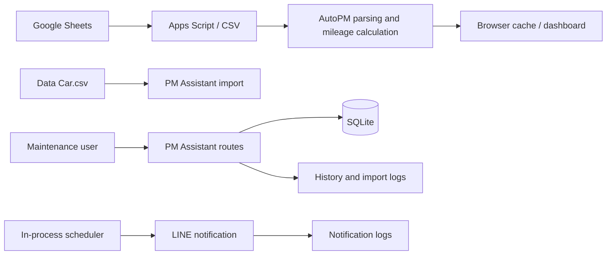
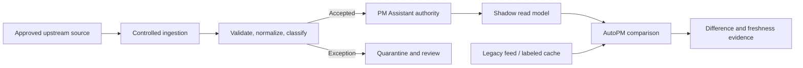
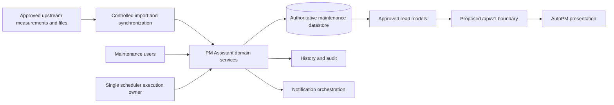
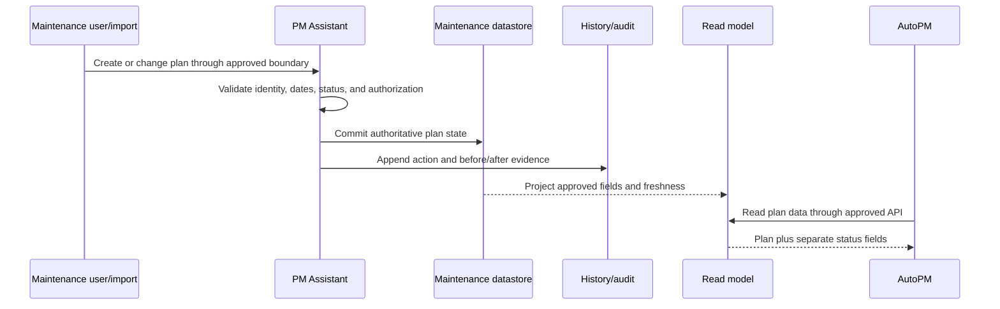
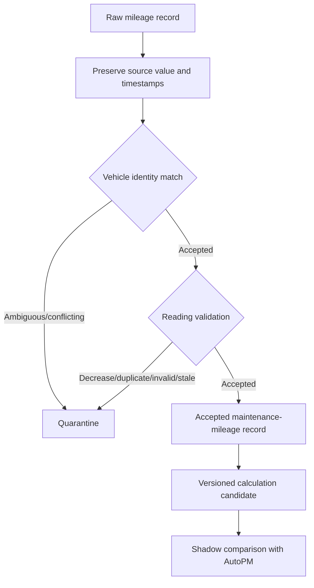
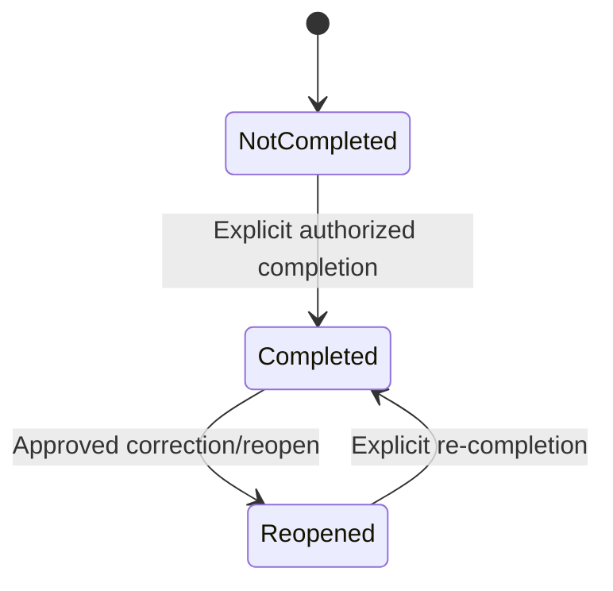
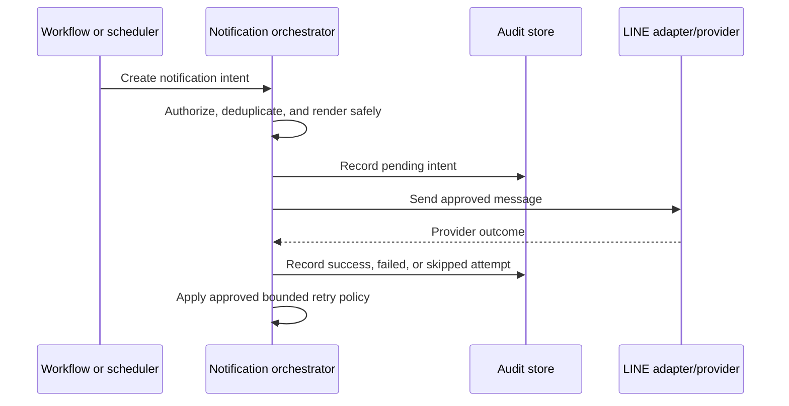
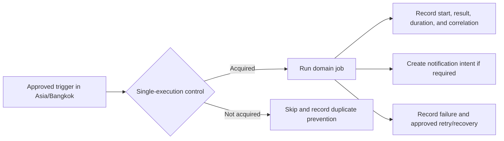
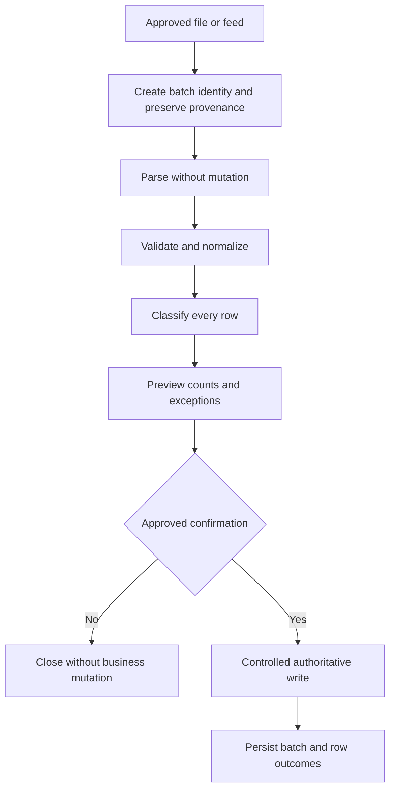
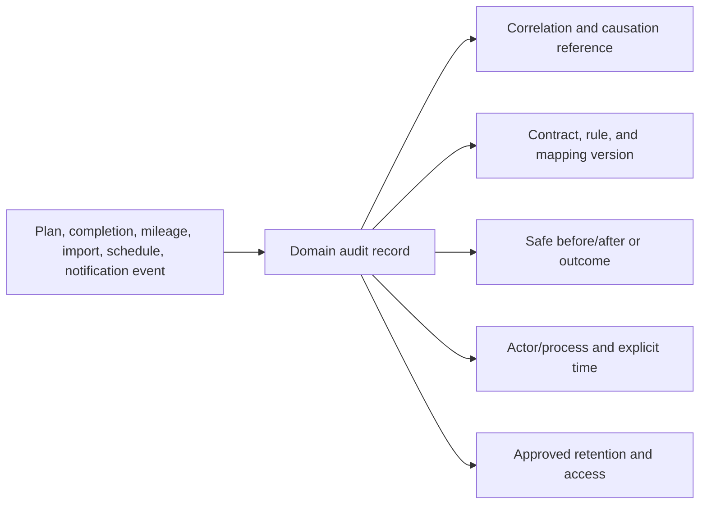

# FleetOS v1.0 Data and Integration Flow

## Purpose and status

This document defines how maintenance information is expected to move through FleetOS v1.0. It separates observed current behavior from transitional controls, target behavior, and future capabilities. It does not authorize data migration, API implementation, notification changes, or deployment.

## Cross-flow rules

Every flow must preserve these rules:

1. PM Assistant remains authoritative for maintenance workflow information.
2. AutoPM consumes maintenance information read-only and owns its presentation.
3. Direct shared-database access is prohibited.
4. Domain ownership outranks timestamps.
5. `vehicle_no` is a transitional matching key only.
6. `fleetos_vehicle_id` is proposed for the future and is not implemented.
7. `pm_mileage_status`, `pm_workflow_status`, `completion_status`, and `notification_status` remain separate.
8. Original values, provenance, rule/contract versions, and audit evidence are retained where required.
9. Ambiguous or conflicting data is quarantined, never guessed.
10. Browser cache is presentation state and is never reverse-synchronized.

## Current state

The two paths do not form an approved integration. Current AutoPM statuses and PM Assistant generic statuses may represent different concepts and must not be reconciled by name alone.

## Transitional state

Target and legacy results are compared before cutover. Differences in identity, counts, status, time, and freshness remain visible until an approved disposition is recorded.

## FleetOS v1.0 target state

The target remains proposed until the relevant contracts and implementation phases are approved and validated.

## PM plan flow

### Current state

PM Assistant supports plan create, update, delete, bulk delete, import, export, assistant actions, and weekly-control behavior through current unversioned routes. AutoPM also displays plan-related fields from its sheet/CSV feed. These current schemas are not automatically shared contracts.

### Transitional state

1. Inventory PM Assistant plans and candidate upstream plan records separately.
2. Match vehicles using the approved transitional `vehicle_no` rule and preserve source values.
3. Classify missing, ambiguous, conflicting, duplicate, and invalid records.
4. Preview controlled imports without changing authoritative records.
5. Require an approved confirmation and batch identity before mutation.
6. Preserve row-level outcomes and plan provenance.
7. Compare published read-model counts and dates with reviewed evidence.

### FleetOS v1.0 target state

PM Assistant owns the lifecycle. AutoPM cannot create, update, cancel, or complete a plan in v1. A transaction must not report success unless the authoritative change and required audit evidence have the approved consistency guarantees.

### Future state outside v1.0

Authenticated commands or domain events from other FleetOS clients may be considered under a new write contract with authorization, idempotency, concurrency, audit, and replay decisions.

## Mileage flow

### Current state

AutoPM receives last/next/remaining kilometre information from its feed and calculates dashboard status in browser code. PM Assistant has no evidenced canonical odometer entity. The upstream odometer producer and current-reading authority are unresolved.

### Transitional state

Validation must account for measured and received times, timezone, odometer reset or replacement, duplicate readings, source priority, and correction lineage. None of those policies is approved merely by documenting them.

### FleetOS v1.0 target state

After Product Owner approval of the upstream producer and calculation rule, PM Assistant owns accepted maintenance-mileage records and derives `pm_mileage_status` with:

- accepted input reference;
- rule version;
- calculated time;
- input freshness and source;
- canonical status or `unknown`;
- correction and recalculation audit.

Raw accepted readings remain intact when a calculation rule is rolled back. `pm_mileage_status` never changes `pm_workflow_status`, `completion_status`, or `notification_status`.

### Future state outside v1.0

Direct telematics or enterprise odometer ingestion is outside v1. It requires a separate source-of-truth, security, volume, ordering, correction, and availability design.

## Completion and history flow

### Current state

PM Assistant exposes completion and task actions and persists PM history. Existing generic plan status and derived overdue behavior require reconciliation with the proposed separate status model.

### Transitional state

- Map current actions and values to candidate workflow and completion concepts without rewriting source history.
- Never infer completion from a mileage reset, sheet label, elapsed deadline, notification result, or dashboard state.
- Preserve existing history and add compensating evidence for corrections where feasible.
- Define backdating, evidence, reopen, delete/tombstone, actor visibility, and retention rules before migration.

### FleetOS v1.0 target state

The diagram describes `completion_status` only. Workflow progression remains a different state machine. Every accepted transition records actor/process, old and new state, reason, effective and recorded times, correlation, and safe evidence reference. AutoPM receives only an approved projection.

### Future state outside v1.0

Enterprise maintenance-event distribution or external completion commands require separate contracts and are not included.

## Notification flow

### Current state

PM Assistant sends LINE messages through manual and scheduled behavior and stores notification outcomes. Current diagnostic behavior is implementation evidence and must be reviewed for sensitive-data exposure before production use.

### Transitional state

1. Define notification intent separately from each provider attempt.
2. Establish a business idempotency key and duplicate-suppression policy.
3. Validate approved recipients and configuration without exposing values.
4. Redact targets, credentials, payloads, and provider responses in logs/read models.
5. Classify retryable and non-retryable outcomes.
6. Shadow-test delivery without using production recipients unless separately approved.

### FleetOS v1.0 target state

`notification_status` is based on notification intent and delivery evidence. AutoPM cannot declare delivery success. Retry attempts remain linked to the original intent.

### Future state outside v1.0

Additional channels, user-configurable routing, or enterprise messaging infrastructure require separate approval.

## Scheduler flow

### Current state

APScheduler starts within the PM Assistant application process and registers daily, assistant, weekly, and report jobs. This does not prove safe execution under multiple application processes or replicas.

### Transitional state

- Inventory every job, trigger, owner, input, side effect, and failure path.
- Select an approved single-execution strategy for the chosen runtime topology.
- Introduce deterministic job identities, misfire behavior, bounded concurrency, and safe retry rules.
- Separate scheduler enablement from application readiness and record coarse health.
- Test process restart, overlapping schedules, clock/timezone behavior, dependency failure, and recovery.

### FleetOS v1.0 target state

The runtime may use one process or a separate worker, but the mechanism is unresolved and vendor-neutral. AutoPM availability is not required for PM Assistant jobs.

### Future state outside v1.0

A distributed workflow engine or event scheduler is outside v1 unless separately approved.

## Import and synchronization flow

### Current state

PM Assistant supports plan/location/vehicle and weekly-control import behavior and stores import logs. AutoPM records feed/cache metadata in browser storage. Browser metadata is not authoritative synchronization audit.

### Transitional state

Replayed input must not duplicate business records under the approved batch/idempotency design. Partial success remains visible and must not be presented as fully reconciled.

### FleetOS v1.0 target state

Every import or synchronization run records source type, safe source reference, contract and rule versions, received/accepted/rejected/ambiguous counts, start/completion times, actor/process, correlation, replay disposition, and safe error summary. Source files, checksum behavior, retention, atomicity, and resume policy remain implementation gates.

### Future state outside v1.0

Continuous enterprise synchronization or bidirectional integration is not part of v1. AutoPM cache remains prohibited as an upstream source.

## Audit flow

### Current state

PM Assistant has history, notification, import, webhook, and file-log evidence, but current records do not by themselves satisfy a unified FleetOS audit contract.

### Transitional state

- Map audit-producing actions by domain.
- Define safe correlation propagation and actor/process representation.
- Identify sensitive fields and redaction rules.
- Preserve legacy evidence while avoiding destructive rewrites.
- Define retention, access, correction, deletion/privacy, and operational review procedures.

### FleetOS v1.0 target state

Audit data excludes secrets, credentials, authorization headers, raw webhook payloads, unnecessary personal data, and unredacted notification targets. Corrections retain prior evidence.

### Future state outside v1.0

Centralized enterprise audit or security-information integration may follow a separate retention, privacy, access, and incident-response decision.

## Flow-level failure and rollback rules

- Disable the new AutoPM consumer route without changing PM Assistant authority.
- Preserve a labeled last-known-good read path until cutover acceptance.
- Never reverse-sync AutoPM cache or display state.
- Stop imports on unsafe ambiguity and retain preview/batch evidence.
- Roll back mapping and calculation versions without rewriting raw sources.
- Preserve accepted plan, completion, history, notification, and identity evidence.
- Prevent retry from duplicating imports, jobs, notifications, or future commands.
- Reconcile counts, identities, statuses, timestamps, and audit after rollback.

## Unresolved implementation gates

- Upstream odometer ownership and accepted-reading model.
- Mileage thresholds, boundaries, and stale policy.
- Workflow transition and schedule-condition vocabulary.
- Completion evidence, backdating, reopen, and deletion behavior.
- Import atomicity, checksum, idempotency, retention, and acceptance thresholds.
- Scheduler topology, locking, misfire, retry, and recovery behavior.
- Notification recipients, idempotency, retry, redaction, and retention.
- Audit access, privacy, retention, and correction policy.

## Related documents

- [FleetOS v1.0 Blueprint](FLEETOS_V1_BLUEPRINT.md)
- [System Context and Module Map](SYSTEM_CONTEXT_AND_MODULE_MAP.md)
- [Deployment and Runtime Blueprint](DEPLOYMENT_AND_RUNTIME_BLUEPRINT.md)
- [Implementation Roadmap](IMPLEMENTATION_ROADMAP.md)
