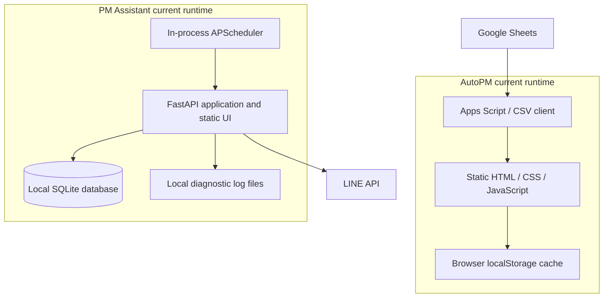
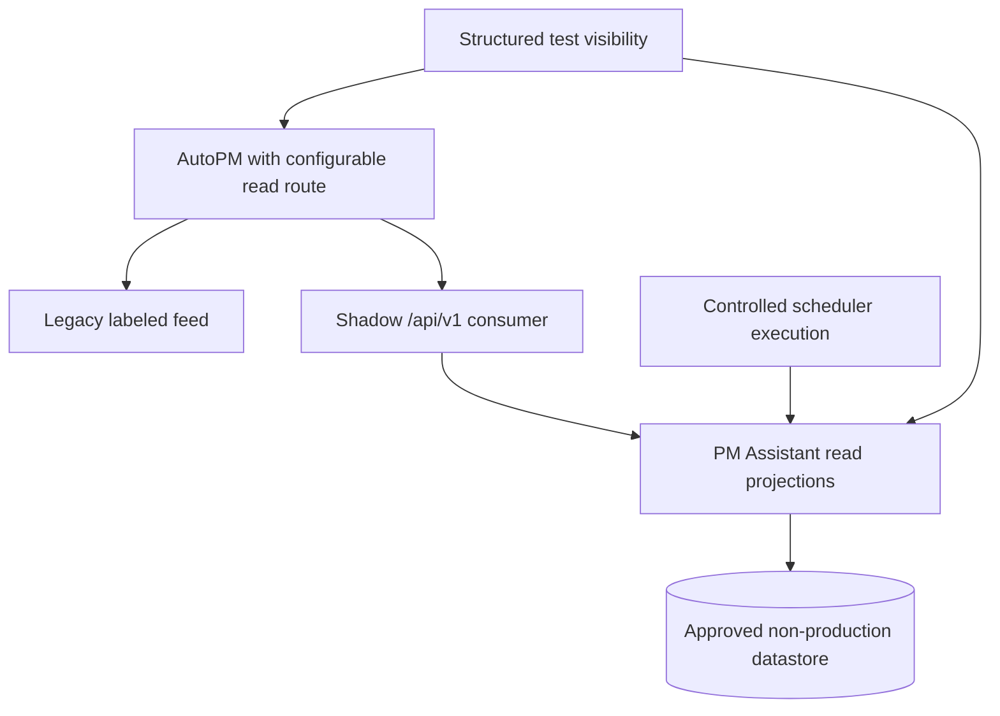
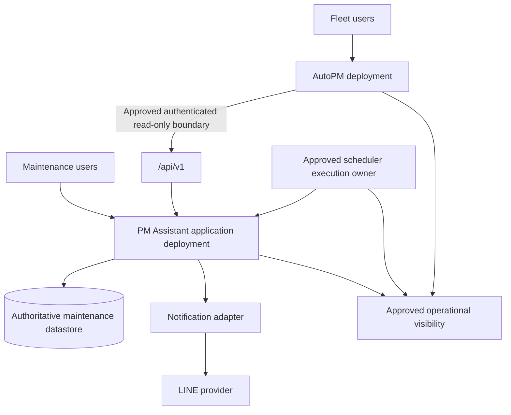

# FleetOS v1.0 Deployment and Runtime Blueprint

## Purpose and status

This document defines vendor-neutral deployment, configuration, security, observability, persistence, testing, and rollback direction for FleetOS v1.0. It does not claim that a target runtime is deployed. PostgreSQL, Railway, authentication, Docker, CI/CD, a production API, and production observability are not proven operational by current repository evidence.

## Runtime principles

1. AutoPM and PM Assistant remain separate deployment and rollback units.
2. PM Assistant remains authoritative for maintenance workflow information regardless of runtime technology.
3. AutoPM never connects directly to PM Assistant persistence.
4. Deployment topology does not change data ownership.
5. Target infrastructure is vendor-neutral until the Product Owner approves a specific design.
6. Configuration, secrets, and environment separation are explicit.
7. Schedulers and notifications require duplicate prevention and auditable failure handling.
8. Every production change has observable acceptance and credible rollback or forward recovery.

## Current state

Observed constraints include a hard-coded local SQLite URL, application-process scheduler jobs, development-oriented CORS, unversioned mixed-purpose routes, and local logs. No repository deployment manifest, container definition, CI workflow, or versioned database migration framework was found.

## Transitional state

The transitional runtime must:

- separate environment-specific values from source code;
- keep target API consumption reversible;
- preserve the legacy AutoPM read path until acceptance;
- introduce dedicated read models without exposing ORM entities;
- select and validate one scheduler execution owner;
- exercise target security and observability in an isolated environment;
- rehearse persistence migration and recovery without touching production data;
- compare target and legacy results using approved sanitized evidence.

## FleetOS v1.0 target state

The target requires independent deployability, but it does not prescribe vendors, containerization, number of processes, or database engine. Those details must satisfy the gates below and remain replaceable behind approved contracts.

## Future state outside v1.0

Future direction may include canonical identity services, dedicated event infrastructure, multiple notification providers, distributed workflow orchestration, enterprise telemetry, or automated delivery pipelines. These are outside v1 unless separately approved and evidenced.

## Deployment topology requirements

### AutoPM deployment

- Serves static presentation assets through an approved delivery boundary.
- Contains no privileged service credential in browser code or storage.
- Uses an approved browser-to-API or trusted-proxy topology.
- Restricts origins and content behavior according to the security design.
- Supports a reversible read-route configuration and clearly labeled stale fallback.
- Can be deployed or rolled back without changing PM Assistant data.

### PM Assistant deployment

- Exposes only approved public routes and projections.
- Separates application readiness from process liveness.
- Validates configuration at startup without echoing secrets.
- Uses an approved datastore connection boundary rather than a hard-coded production value.
- Supports graceful startup/shutdown and bounded dependency deadlines.
- Keeps scheduler execution safe for the selected process/replica topology.
- Keeps core maintenance workflows independent of AutoPM availability.

### Scheduler runtime

The Product Owner must approve one of the following categories or another evidenced design:

- a deliberately single application process that owns jobs;
- a dedicated scheduler/worker deployment;
- a distributed lock or job system with proven single-execution semantics.

The Blueprint does not select among them. Whichever topology is selected must test restart, overlap, misfire, retry, duplicate prevention, timezone, dependency failure, and recovery.

## Configuration direction

Configuration is grouped by responsibility and environment, using names and safe placeholders only:

| Area | Required direction |
| --- | --- |
| Application | Environment name, version, safe feature switches, public base paths. |
| API client | Approved endpoint, timeouts, retry limits, cache/staleness limits, contract version. |
| Persistence | Connection reference, pool/timeout settings if applicable, migration state; values remain secret where required. |
| Security | Allowed origins, trust/proxy behavior, credential references, authorization scopes. |
| Scheduler | Enabled jobs, timezone, triggers, concurrency, misfire and retry policy. |
| Notifications | Provider endpoint category, credential references, approved targets/routing, retry and timeout policy. |
| Observability | Service name, safe log level, correlation policy, metrics/alert destinations by approved reference. |

Rules:

- Development, test, staging, and production configuration remain distinct.
- Staging must not silently target production data or recipients.
- Missing or invalid required configuration fails safely.
- `.env.example`, if separately approved in a future task, may contain variable names and non-secret placeholders only.
- Configuration changes require review, audit, rollback, and separate external-system approval where applicable.

## Security direction

Production exposure is blocked until the Product Owner approves and evidence validates:

- caller identity and trust topology;
- least-privilege service and human authorization;
- browser/proxy boundary and credential storage;
- TLS termination and trusted-proxy behavior;
- restricted production CORS;
- resource-existence disclosure policy;
- input, query, pagination, upload, and body-size limits;
- rate limits and abuse handling;
- webhook signature verification where applicable;
- notification recipient authorization;
- secret issuance, rotation, revocation, and incident procedures;
- field, log, error, history, and audit redaction;
- data classification, retention, privacy, access, and deletion requirements.

Correlation IDs are diagnostic only. Browser UI restrictions and cached values are not security controls. Anonymous production maintenance access is not approved.

## Observability direction

### Required signals

| Signal | Minimum target evidence |
| --- | --- |
| API | Request result, latency, version, safe route template, correlation, retryable error class. |
| Read models | Source, `as_of`, generated time, freshness, stale state, unavailable state. |
| Identity | Counts of exact, normalized, ambiguous, conflicting, missing, and rejected matches. |
| Imports | Batch start/end, counts, partial outcomes, replay disposition, safe failure summary. |
| Scheduler | Registration, start, finish, duration, misfire, duplicate prevention, failure, recovery. |
| Notifications | Intent, attempt number, safe provider result, retry decision, terminal status. |
| Persistence | Readiness, migration version, safe error class, backup/restore evidence without topology leakage. |
| Security | Authentication/authorization outcomes and security-relevant events using approved redaction. |

### Health model

- Liveness answers whether the process can execute.
- Readiness answers whether essential authoritative read dependencies can serve the approved boundary.
- Probes reveal only coarse state and no engine, host, schema, path, credential, or internal topology.
- Missing authoritative data cannot be presented as a healthy zero result.

### Logging and correlation

Target logs are structured and contain explicit timestamp, timezone, severity, service/module, event, safe resource reference, result, duration, version, and validated correlation ID where relevant. Raw request/response bodies, credentials, authorization headers, connection strings, notification targets, webhook payloads, and unnecessary personal data are excluded.

No production logging or monitoring capability is claimed to exist today.

## Database migration direction

### Current state

PM Assistant uses SQLite through SQLAlchemy. Current code also contains initialization and legacy-table copying behavior. That is not a versioned production migration strategy.

### Transitional state

1. Inventory tables, constraints, indexes, nullability, text encodings, date/time semantics, relationships, and current data volumes.
2. Resolve identity and status meaning before schema mapping.
3. Select a versioned migration mechanism and target persistence engine through Product Owner approval.
4. Build migrations against isolated synthetic or approved sanitized data.
5. Establish backup, restore, forward-recovery, and migration ownership procedures.
6. Rehearse schema and data conversion, including failure injection.
7. Compare counts, constraints, identities, status distributions, timestamps, Unicode, imports, history, and notification audit.
8. Test application compatibility and deployment order.
9. Shadow-read and reconcile before cutover.

### FleetOS v1.0 target state

The authoritative datastore must provide approved durability, concurrency, backup, restore, recovery, migration, monitoring, access control, and operational support for expected use. The Blueprint does not require a named engine.

Migration does not change data ownership. A cutover requires approved recovery objectives, stop/go criteria, rollback or forward-recovery choice, and retained evidence. No production migration is authorized by this document.

### Future state outside v1.0

Sharding, multi-region persistence, analytics replicas, event stores, or enterprise data platforms are outside v1.

## Testing direction

### Static and documentation checks

- Markdown, links, diagrams, configuration schemas, code syntax, formatting, and type checks where tooling is approved.

### Domain and service tests

- Identity normalization/classification.
- Status transitions and separation.
- Mileage boundary, unknown, stale, reset, correction, and rule-version behavior.
- Import preview, validation, replay, partial failure, and audit.
- Scheduler overlap, retry, timezone, restart, duplicate prevention, and failure.
- Notification rendering, redaction, idempotency, retry, provider failure, and safe audit.

### Contract and consumer tests

- Proposed `/api/v1` paths, methods, media type, envelopes, fields, nullability, enums, pagination, filters, sorting, errors, freshness, caching, correlation, and compatibility.
- AutoPM unknown-enum, stale-cache, unavailability, retry, and source-label behavior.
- No cross-domain status inference.

### Security and operational tests

- Authentication and authorization failure cases when implemented.
- CORS, rate limits, input limits, redaction, webhook verification, secret handling, and misuse cases.
- Liveness, readiness, dependency timeouts, structured logs, correlation, alert visibility, backup, restore, and recovery.

### Migration and user acceptance

- Counts, constraints, crosswalks, Unicode/Thai text, dates/timezones, status distributions, audit, reconciliation, rollback, and forward recovery.
- Critical AutoPM and PM Assistant workflows, accessibility, responsive behavior, and failure/stale states.

The repository does not currently demonstrate an established automated test suite or CI workflow. Test direction is a production gate, not an operational claim.

## Deployment sequence direction

1. Accept the governing architecture and resolve phase-blocking decisions.
2. Prepare isolated configuration, security, datastore, scheduler, and observability foundations.
3. Build PM Assistant read models and contract tests without AutoPM cutover.
4. Reconcile identities and data; shadow-read target results.
5. Deploy compatible provider behavior before enabling the consumer.
6. Enable AutoPM target reads for a controlled audience through approved configuration.
7. Observe correctness, freshness, latency, errors, identity exceptions, jobs, and notifications.
8. Promote only after acceptance thresholds pass.
9. Retain the labeled last-known-good path for the approved stabilization window.
10. Retire transitional behavior only through separate approval and tested rollback evidence.

## Rollback strategy

### AutoPM rollback

- Disable the target read route through approved configuration.
- Restore the last-known-good read contract while displaying source and staleness.
- Do not synchronize cached or legacy presentation data into PM Assistant.

### PM Assistant/API rollback

- Keep compatible API versions overlapped during consumer rollback.
- Roll back application behavior only if schema and data remain compatible.
- Preserve authoritative workflow changes, history, audit, and identifiers already accepted.

### Scheduler and notification rollback

- Stop unsafe job execution without deleting outcome evidence.
- Prevent duplicate retry during topology changes.
- Preserve intent and attempt records; do not report undelivered messages as successful.

### Persistence rollback or recovery

- Follow the approved backup/restore or forward-recovery plan.
- Freeze unsafe writes when required and reconcile after recovery.
- Never treat engine rollback as an ownership transfer.
- Do not restore revoked credentials as part of configuration rollback.

### Rollback triggers

Triggers include data corruption, identity mismatch beyond threshold, status-semantic violation, unavailable authoritative reads, unsafe authorization, sensitive-data exposure, duplicate jobs/notifications, failed reconciliation, unacceptable latency/error rate, or inability to restore safely.

The Product Owner or approved operator owns stop/go and rollback decisions. Post-rollback validation covers data, API compatibility, jobs, notifications, security, freshness, and audit.

## Production-readiness gates

- Vendor-neutral topology selected and documented.
- Environment and configuration separation validated.
- Security architecture and tests approved.
- Persistence migration, backup, restore, and reconciliation evidence approved.
- Scheduler and notification failure/duplicate controls approved.
- Required observability and alerts demonstrated.
- Contract, integration, security, operational, migration, rollback, and user-acceptance tests pass.
- Operational runbooks, ownership, support, incident, retention, and recovery objectives approved.
- No phase-blocking Product Owner decision remains unresolved.
- Release, deployment, migration, and external-service actions receive separate approval.

## Unresolved implementation gates

- Hosting, network, proxy, and process topology.
- Persistence engine and migration tooling.
- Authentication and authorization mechanism and scopes.
- Scheduler ownership and single-execution mechanism.
- Metrics/log platform, alert thresholds, and retention.
- Backup frequency, recovery objectives, restore owner, and evidence retention.
- Production data volume, load target, availability objective, and stabilization window.
- CI/CD direction, if any; none is assumed for v1.

## Related documents

- [FleetOS v1.0 Blueprint](FLEETOS_V1_BLUEPRINT.md)
- [System Context and Module Map](SYSTEM_CONTEXT_AND_MODULE_MAP.md)
- [Data and Integration Flow](DATA_AND_INTEGRATION_FLOW.md)
- [Implementation Roadmap](IMPLEMENTATION_ROADMAP.md)
