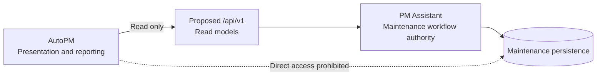

# FleetOS v1.0 Blueprint

## Document status

- Status: Implementation-oriented target for Product Owner review
- Scope: FleetOS v1.0 definition and production-readiness direction
- Decision owner: FleetOS Product Owner

This document does not authorize implementation or claim that target capabilities are operational. The referenced ADRs and `/api/v1` contract remain proposed direction while their source documents are marked `Proposed`.

## Product vision

FleetOS is the parent fleet operating platform that connects fleet visibility with controlled maintenance execution while preserving two distinct products:

- **AutoPM** turns approved fleet and maintenance information into dashboards, calendars, KPIs, filters, and executive views.
- **PM Assistant** controls maintenance planning, workflow, completion, history, notifications, scheduling, imports, and authoritative maintenance persistence.

FleetOS v1.0 is intended to replace accidental coupling and ambiguous status sharing with explicit ownership, versioned read boundaries, traceable data movement, operational controls, and reversible delivery.

## FleetOS v1.0 goals

1. Preserve AutoPM and PM Assistant as independently deployable bounded modules.
2. Establish PM Assistant as the authoritative maintenance workflow boundary.
3. Make AutoPM a read-only consumer of approved maintenance read models.
4. Introduce an approved, versioned, read-only integration boundary without exposing persistence internals.
5. Preserve separate mileage, workflow, completion, and notification meanings.
6. Reconcile transitional identities and sources without guessing or destructive merging.
7. Make imports, schedules, notifications, and important state transitions auditable.
8. Establish security, configuration, observability, testing, migration, rollback, and operational gates before production use.
9. Support staged cutover with freshness metadata and a labeled last-known-good read path.

## Non-goals

FleetOS v1.0 does not merge the two applications, create a shared database, grant AutoPM write authority, or establish unapproved enterprise identities. It does not make a hosting provider, database engine, container platform, CI/CD product, or authentication mechanism part of the product contract.

## Four-state model

### Current state

Repository evidence shows:

- AutoPM is an HTML, CSS, and JavaScript dashboard that consumes Google Sheets data through CSV or Apps Script JSON, uses browser cache, and can fall back to `data.csv`.
- AutoPM calculates current mileage-oriented dashboard status in browser code. Those thresholds and labels are observed behavior, not approved authoritative rules.
- PM Assistant is a Python application using FastAPI, SQLAlchemy, SQLite, APScheduler, CSV/XLSX import and export, and LINE integration.
- PM Assistant exposes unversioned read and write routes and keeps plans, history, notifications, imports, vehicle/location data, weekly control, task state, users, and settings in local persistence.
- APScheduler executes inside the application process using the `Asia/Bangkok` timezone.
- No approved operational FleetOS integration API exists between AutoPM and PM Assistant.
- Production authentication, authorization, PostgreSQL, Railway, Docker, CI/CD, and production observability are not proven operational.

### Transitional state

The transition preserves service while target controls are built:

- AutoPM may continue using its current feed and labeled last-known-good cache.
- Google Sheets, Apps Script, CSV, and `Data Car.csv` remain transitional upstream evidence, not authoritative workflow stores.
- `vehicle_no` is used for versioned comparison and reconciliation only; ambiguous matches are quarantined.
- PM Assistant remains authoritative for workflow, completion, history, notification, and controlled import outcomes.
- Dedicated `/api/v1` read models are built and shadow-tested behind an approved consumer configuration switch.
- Current unversioned routes remain legacy/internal until individually assessed; they are not automatically v1-compatible.
- Persistence, scheduler, security, and hosting changes proceed through separate approval and validation gates.

### FleetOS v1.0 target state

FleetOS v1.0 is ready for production consideration only when:

- AutoPM and PM Assistant remain separate deployment and rollback units.
- AutoPM consumes authoritative maintenance information through an approved versioned read interface.
- PM Assistant publishes purpose-built read models and does not expose tables or ORM objects as the cross-module contract.
- The four status domains are explicitly represented and tested.
- Transitional identity ambiguity, source freshness, unavailable data, and errors are visible rather than guessed.
- Imports and reconciliations are controlled, replay-safe under an approved scheme, and auditable.
- Scheduler execution cannot duplicate business jobs under the approved topology.
- Notification intent, attempt, result, and retry behavior is controlled and observable.
- Runtime configuration and secrets are outside source code and validated safely.
- Authentication, authorization, CORS, TLS, sensitive-field exposure, and retention have approved designs and evidence.
- The selected maintenance datastore has tested backup, restore, migration, reconciliation, and recovery procedures.
- Liveness, readiness, structured logs, correlation, freshness, job visibility, and alerting meet approved operational criteria.
- Contract, integration, security, migration, operational, rollback, and user-acceptance evidence passes the roadmap gates.

The target is vendor-neutral. A target capability is not operational until separately implemented and validated.

### Future state outside v1.0

The following direction is deferred unless later approved:

- An operational `fleetos_vehicle_id` and enterprise FleetOS vehicle registry.
- Stable FleetOS identities for locations, fleets, business units, people, and teams.
- Cross-module write commands, events, or webhooks beyond approved transitional ingestion.
- Predictive maintenance, telematics, ERP integration, mobile applications, or multi-tenant platform capabilities.
- Replacement of every transitional feed or retirement of legacy interfaces without acceptance and rollback evidence.
- Consolidation of AutoPM and PM Assistant into one application or deployment.

## In-scope capabilities

| Capability | FleetOS v1.0 responsibility |
| --- | --- |
| Dashboard and KPI presentation | AutoPM presents approved read data and freshness; it does not own maintenance truth. |
| PM plan lifecycle | PM Assistant creates, changes, cancels, and publishes authoritative plans through controlled interfaces. |
| Completion and history | PM Assistant records explicit completion and auditable history; AutoPM may display approved projections. |
| Mileage condition | PM Assistant may publish `pm_mileage_status` only after input ownership and a versioned rule are approved. |
| Notifications | PM Assistant controls intent, delivery attempts, results, retry policy, and audit. |
| Scheduling | PM Assistant owns scheduled maintenance actions with one approved execution owner. |
| Imports and synchronization | PM Assistant validates and audits controlled ingestion; transitional sources do not gain workflow authority. |
| Read-only integration | Proposed `/api/v1` purpose-built read models with common success, error, freshness, and correlation behavior. |
| Operations | Approved configuration, security, health, observability, backup, recovery, and support evidence. |

## Explicitly out of scope

- Direct AutoPM writes to PM Assistant persistence.
- Direct shared-database reads or writes.
- Treating browser cache as an authoritative source.
- Inferring completion from mileage, sheet status, notification success, or elapsed time.
- Treating `vehicle_no` as a permanent enterprise key.
- Describing `fleetos_vehicle_id` as implemented.
- Automatic identity merge based on row order, timestamp, registration, or vehicle code.
- Promoting existing unversioned routes or current source schemas into a public contract without review.
- A production write API in v1.
- Unapproved renaming of modules, folders, URLs, database tables, projects, or screens.

## Module boundary contract

### AutoPM responsibilities

AutoPM owns dashboard composition, KPI visualization, filtering, calendars, presentation labels, accessible rendering, and temporary presentation cache. It must render source and freshness, tolerate approved unknown enum values, and distinguish stale from authoritative-unavailable data.

AutoPM must not create or alter maintenance workflow records, duplicate PM Assistant workflow rules, declare completion or notification success, or access PM Assistant persistence directly.

### PM Assistant responsibilities

PM Assistant owns PM plan lifecycle, workflow status, explicit completion, PM history, notification orchestration, scheduler behavior, controlled import/synchronization audit, and authoritative maintenance persistence. It publishes dedicated read projections and remains operational for its core workflows without AutoPM.

### Shared concepts and boundaries

Shared concepts cross the boundary only through approved contracts. Vehicle and location references retain provenance and identity status. Fleet and business-unit labels remain separate namespaces until their hierarchy is approved. Timezone, source, freshness, null, ambiguity, and unavailability must be explicit.

## Status model

| Field | Meaning | Authority in v1 target |
| --- | --- | --- |
| `pm_mileage_status` | Condition derived from accepted mileage input and an approved versioned rule. | PM Assistant after mileage gates pass. |
| `pm_workflow_status` | Progress through the maintenance planning workflow. | PM Assistant. |
| `completion_status` | Explicit completion, correction, or reopen state. | PM Assistant. |
| `notification_status` | Notification intent and delivery outcome. | PM Assistant. |

No status may overwrite, infer, or stand in for another. Any schedule condition such as overdue-by-date must remain distinct from workflow progression unless the Product Owner approves a precise contract change.

## Identity direction

- `vehicle_no` is the only approved transitional cross-system matching key.
- Original source values and versioned normalized comparison values are retained.
- Registration and vehicle code remain attributes or namespaced aliases.
- Local database IDs and sheet row numbers are not shared enterprise identities.
- Ambiguous, conflicting, missing, and rejected identities are explicit outcomes.
- `fleetos_vehicle_id` is reserved as a proposed future canonical identifier; its owner, type, creation, merge, split, retirement, and storage are unresolved and outside v1 implementation unless separately approved.

## API and error direction

The proposed read-only API direction is `/api/v1` using `GET`, JSON success/error envelopes, opaque boundary identifiers, explicit freshness, cursor pagination for lists, correlation IDs, and stable machine-readable error codes. It is not operational merely because it is documented.

AutoPM retries only approved transient failures within bounded policy. A valid empty result, a missing singular resource, ambiguous identity, stale data, and unavailable authoritative input remain different states. Error responses and logs must not expose secrets, persistence details, paths, topology, raw notification targets, or sensitive payloads.

## Product Owner implementation gates

The following decisions remain unresolved and block the affected implementation phase:

1. Acceptance or revision of the proposed ADR and API direction.
2. Enterprise Vehicle Master ownership and future vehicle identity governance.
3. Location, fleet, business-unit, person, team, and responsibility identity.
4. Odometer producer, source priority, correction, reset, duplicate, timezone, and freshness policy.
5. Mileage thresholds, calculation inputs, schedule condition, workflow transitions, completion evidence, and reopen policy.
6. Authentication topology, authorization scopes, browser/proxy boundary, CORS, TLS, and resource disclosure.
7. Hosting topology, persistence engine, migration mechanism, scheduler ownership, and recovery objectives.
8. Notification idempotency, retry, recipient authorization, and retention.
9. Import atomicity, checksum, replay identity, retention, and exception acceptance thresholds.
10. KPI definitions, counted population, audit/privacy retention, and operational ownership.

## Definition of FleetOS v1.0 complete

FleetOS v1.0 is complete only when all of the following are true:

- Product Owner decisions required for v1 are recorded and accepted.
- AutoPM and PM Assistant boundaries and independent rollback are demonstrated.
- The approved read contract is implemented, secured, contract-tested, and observed in the approved environment.
- AutoPM consumes it through a reversible configuration and displays source, freshness, stale, unknown, and unavailable states correctly.
- Identity reconciliation meets approved exception thresholds without guessed matches.
- All four status domains are separately persisted or projected, serialized, rendered, and tested.
- Plan, mileage, completion, history, notification, scheduler, import, synchronization, and audit flows pass their acceptance evidence.
- The selected datastore and deployment topology pass backup, restore, recovery, compatibility, and reconciliation tests.
- Security, observability, operational support, rollback, and user acceptance gates pass.
- No unresolved decision that affects safe production operation remains open.
- Product Owner separately approves release and production deployment.

Documentation completion alone does not make FleetOS v1.0 production-ready.

## Related Blueprint documents

- [System Context and Module Map](SYSTEM_CONTEXT_AND_MODULE_MAP.md)
- [Data and Integration Flow](DATA_AND_INTEGRATION_FLOW.md)
- [Deployment and Runtime Blueprint](DEPLOYMENT_AND_RUNTIME_BLUEPRINT.md)
- [Implementation Roadmap](IMPLEMENTATION_ROADMAP.md)
