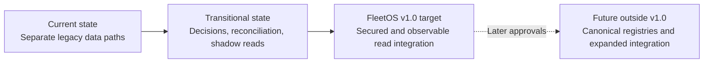
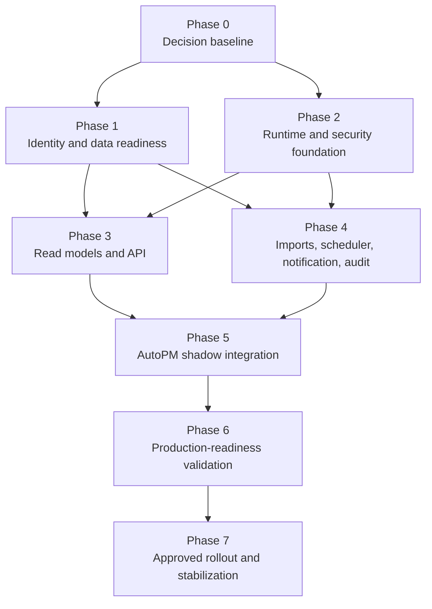

# FleetOS v1.0 Implementation Roadmap

## Purpose and status

This roadmap sequences the decisions, implementation, validation, and operational evidence required before FleetOS v1.0 can be considered production-ready. It is not implementation authorization, a release schedule, or evidence that any target phase is complete.

Each phase requires the mandatory FleetOS workflow: analyze, explain, assess architecture and risk, present exact files, obtain Product Owner approval, modify only approved scope, validate, report, and stop at Git or external-action gates.

## State progression

## Dependency overview

Phases may overlap only when their dependencies and rollback boundaries remain satisfied. No calendar estimate is established here.

## Phase 0 — Decision and contract baseline

### Objective

Convert unresolved v1 architecture questions into accepted decisions or explicitly approved deferrals before behavior is built.

### Required work

- Review and accept, revise, or supersede proposed ADR-0001, ADR-0002, and ADR-0003.
- Review and approve or revise the proposed API contract and error model.
- Confirm v1 scope, module responsibilities, read-only boundary, and four-state vocabulary.
- Approve separate meanings and candidate values for all four status domains.
- Define schedule-condition treatment separately from workflow progression.
- Assign decision owners and acceptance dates for remaining gates.

### Exit evidence

- Accepted decision records with no contradiction among architecture, ownership, identity, API, and error direction.
- Approved v1 scope and compatibility policy.
- Explicit record of unresolved items that block later phases.

### Rollback

Documentation-only decisions can be reverted or superseded through an approved isolated documentation change. No implementation proceeds under a withdrawn decision.

## Phase 1 — Identity, data ownership, and reconciliation readiness

### Dependencies

Phase 0 ownership and identity direction.

### Objective

Make shared data matchable, classifiable, and auditable without inventing canonical identity.

### Required work

- Inventory vehicle numbers, registrations, vehicle codes, locations, grouping labels, responsibilities, plans, history, imports, and mileage evidence.
- Approve normalization rules and a Thai/Unicode/date test corpus.
- Produce exact, normalized, ambiguous, conflicting, missing, and rejected classifications.
- Define reversible crosswalk and mapping-version behavior.
- Resolve enterprise Vehicle Master, location, grouping, and odometer ownership needed for v1.
- Define accepted mileage-record behavior and calculation-rule approval process.
- Establish reconciliation thresholds and exception ownership.

### Exit evidence

- No guessed or destructive identity matches.
- Reviewed exception reports and approved acceptance thresholds.
- Proven preservation of original values, provenance, and mapping versions.
- Approved status and mileage inputs needed for read-model implementation.

### Rollback

Revert to the prior mapping version while retaining raw source records and decisions. Do not renumber or reuse issued references. Do not reverse-sync AutoPM cache.

## Phase 2 — Runtime, configuration, security, and persistence foundation

### Dependencies

Phase 0 security, topology, and operational decisions. Phase 1 informs persistence design where identity changes are involved.

### Objective

Create an isolated, vendor-neutral foundation capable of safely hosting the target read boundary and authoritative workflows.

### Required work

- Select hosting/network/proxy and process topology.
- Define environment separation and safe configuration validation.
- Approve authentication, authorization scopes, CORS, TLS, rate limits, and sensitive-field policy.
- Select persistence engine and versioned migration mechanism.
- Rehearse backup, restore, migration, compatibility, and reconciliation.
- Select scheduler single-execution strategy.
- Define structured logging, correlation, metrics, probes, alerts, retention, and incident ownership.
- Establish safe test recipients and isolated external-integration behavior.

### Exit evidence

- No secrets in source, browser assets, logs, fixtures, or documentation.
- Authentication/authorization and redaction tests pass in the approved isolated environment.
- Backup restoration and migration recovery are demonstrated.
- Scheduler duplicate-prevention design passes concurrency/restart tests.
- Required health and operational signals are visible without topology leakage.

### Rollback

Return to the last-known-good isolated runtime/configuration. Preserve audit evidence and never restore revoked credentials. Database recovery follows the approved backup/restore or forward-recovery plan.

## Phase 3 — PM Assistant read models and proposed `/api/v1`

### Dependencies

Phases 0, 1, and 2.

### Objective

Implement the approved read-only boundary behind PM Assistant authority without changing AutoPM yet.

### Required work

- Build dedicated response/read models rather than exposing ORM objects.
- Implement approved liveness/readiness, vehicle, plan, history, location, summary, mileage, and synchronization reads.
- Apply common success and error envelopes, correlation, freshness, null, pagination, filtering, sorting, and caching rules.
- Preserve opaque resource IDs and transitional identity semantics.
- Serialize all four status domains separately.
- Enforce authorization, projection/redaction, timeout, retry-facing, and rate-limit behavior.
- Add provider contract, security, performance, and compatibility tests.

### Exit evidence

- Approved contract test suite passes.
- Existing unversioned routes remain outside the v1 guarantee unless separately migrated.
- Ambiguous identity, missing resource, empty list, zero summary, stale data, and unavailable authoritative input behave distinctly.
- No persistence, secret, topology, or sensitive audit detail leaks through responses or logs.

### Rollback

Keep the provider compatible with the prior application while disabling unsafe new exposure. Preserve authoritative data and issued identifiers. A provider rollback must remain schema-compatible or follow the approved recovery plan.

## Phase 4 — Controlled imports, scheduler, notifications, and audit

### Dependencies

Phases 0, 1, and 2. API-safe synchronization projections also depend on Phase 3.

### Objective

Make background and ingestion side effects deterministic, controlled, recoverable, and observable.

### Required work

- Introduce approved batch/replay identity for controlled imports.
- Validate preview, confirmation, partial failure, quarantine, correction, and audit behavior.
- Implement scheduler ownership, deterministic job identity, overlap/misfire controls, bounded retry, and recovery.
- Separate notification intent from delivery attempts.
- Implement approved notification idempotency, recipient authorization, redaction, retry, and retention.
- Correlate plan, mileage, completion, import, scheduler, and notification outcomes through safe audit records.

### Exit evidence

- Replayed imports and overlapping jobs do not duplicate business outcomes.
- Partial import outcomes and identity exceptions remain visible.
- Notification failure cannot be reported as success.
- Restart, dependency failure, provider failure, timeout, and recovery tests pass.
- Audit evidence contains required lineage and no secrets or unnecessary sensitive data.

### Rollback

Stop unsafe jobs/imports, preserve batch and attempt evidence, and revert mapping/rule versions without rewriting raw records. Prevent retries from duplicating work during rollback.

## Phase 5 — AutoPM consumer and shadow cutover

### Dependencies

Phases 1 through 4.

### Objective

Integrate AutoPM as a read-only consumer while retaining independent deployment and a tested fallback.

### Required work

- Build an approved API/proxy client with bounded timeout, retry, cache, and validation behavior.
- Safely render unknown future enum values without merging status domains.
- Display source, `as_of`, freshness, stale, fallback, ambiguity, and unavailability states.
- Run legacy and target reads in shadow mode.
- Compare vehicle identity, plan counts, dates, statuses, KPI populations, and freshness.
- Put target consumption behind approved configuration or a feature switch.
- Validate accessibility, responsive behavior, Thai text, and failure states.

### Exit evidence

- AutoPM remains unable to write maintenance workflow data.
- No privileged secret is present in browser code or storage.
- Reconciliation differences meet approved thresholds and have reviewed dispositions.
- Consumer contract, stale/failure, unknown-enum, and rollback tests pass.
- PM Assistant workflows continue when AutoPM is unavailable.

### Rollback

Disable the target consumer route and restore the labeled last-known-good read path. Do not reverse-sync cache. Keep compatible provider behavior available during consumer rollback.

## Phase 6 — Production-readiness validation

### Dependencies

Phases 0 through 5.

### Objective

Demonstrate that FleetOS v1.0 meets approved functional, data, security, operational, recovery, and support criteria.

### Required work

- Run full contract, integration, security, migration, scheduler, notification, performance, operational, and end-to-end tests.
- Rehearse backup restore, deployment rollback, consumer fallback, provider compatibility, and recovery.
- Validate monitoring, alerting, on-call/owner response, and runbooks.
- Complete data reconciliation and user acceptance.
- Conduct secret, dependency, privacy, logging, and access review.
- Record known limitations and ensure none blocks safe production operation.

### Exit evidence

- All production-readiness gates pass or have explicit Product Owner-approved exceptions.
- Recovery objectives and last-known-good versions are known.
- Operators can detect and respond to stale reads, API failures, import exceptions, duplicate-prevention events, notification failures, and security events.
- Product Owner receives complete release evidence without secrets.

### Rollback

Use the rehearsed component-specific rollback or forward-recovery plan. Preserve PM Assistant authority, source evidence, audit, and compatibility throughout.

## Phase 7 — Approved rollout and stabilization

### Dependencies

Phase 6 and separate Product Owner release, deployment, migration, credential, and external-service approvals.

### Objective

Promote FleetOS v1.0 through a controlled, observable rollout and stabilization period.

### Required work

- Deploy provider-compatible behavior before enabling AutoPM consumption.
- Apply approved migration and configuration in the authorized order.
- Enable target reads for a controlled audience or percentage where supported.
- Monitor correctness, freshness, latency, errors, identity exceptions, jobs, imports, notifications, and security signals.
- Apply stop/go criteria at each promotion point.
- Retain the labeled fallback for the approved stabilization window.

### Exit evidence

- Acceptance thresholds remain satisfied throughout stabilization.
- No unresolved production-blocking incident or reconciliation gap remains.
- Support ownership, runbooks, backup, recovery, and monitoring are active and reviewed.
- Product Owner records FleetOS v1.0 release acceptance.

### Rollback

Invoke the approved stop/go procedure and component rollback. A rollback never transfers maintenance authority to AutoPM or a legacy source.

## Production-readiness gate register

| Gate | Required decision/evidence | Blocking phases |
| --- | --- | --- |
| Architecture and contracts | Accepted ownership, identity, API, error, compatibility, and status decisions. | 1–7 |
| Identity and reconciliation | Approved rules, crosswalks, exceptions, and thresholds. | 3–7 |
| Mileage | Source owner, accepted record, reset/correction, freshness, and rule version. | Mileage API, 5–7 |
| Security | Trust topology, auth, scopes, CORS, TLS, redaction, rate limits, retention. | 3–7 |
| Persistence | Engine/tooling, backup, restore, migration, recovery, and compatibility. | 3–7 |
| Scheduler | Owner, single execution, overlap, retry, timezone, recovery. | 4–7 |
| Notification | Recipients, intent, idempotency, retry, redaction, audit, retention. | 4–7 |
| Import/sync | Atomicity, batch identity, replay, partial failure, retention. | 4–7 |
| Observability | Signals, probes, alerts, correlation, retention, owners. | 3–7 |
| Testing | Contract, integration, security, migration, operational, UAT evidence. | 5–7 |
| Rollback | Last-known-good state, triggers, owner, tested procedure. | Every rollout phase |
| Release | Product Owner approval for release and each external action. | 7 |

## Unresolved Product Owner decisions

These decisions remain explicitly unresolved and are not answered by this roadmap:

- Enterprise Vehicle Master owner and `fleetos_vehicle_id` lifecycle.
- Location, fleet, business-unit, user, person, team, and responsibility identity.
- Odometer producer, priority, reset/replacement, correction, duplicate, timezone, and freshness rules.
- Mileage thresholds and rule boundaries.
- Workflow transition vocabulary, schedule condition, completion evidence, backdating, reopen, and deletion/tombstone rules.
- External PM plan, event, notification-intent, and import identities.
- Authentication and authorization mechanism, scopes, browser/proxy topology, CORS, TLS, and disclosure rules.
- Hosting, process, datastore, migration, scheduler, and recovery topology.
- Import atomicity, checksum, replay, resume, retention, and acceptance thresholds.
- Notification recipient policy, retry, idempotency, provider diagnostics, and retention.
- KPI definitions and counted population.
- Audit, privacy, log, error, and operational-data retention.
- Availability, performance, recovery, load, and stabilization targets.
- Whether CI/CD is adopted; none is assumed operational or required by this Blueprint without approval.

## Definition of roadmap complete

The roadmap is complete when:

- every v1-blocking decision is accepted;
- all phase exit evidence is reviewed;
- the approved target is implemented without violating module or ownership boundaries;
- production-readiness and rollback evidence passes;
- no unsupported operational claim remains;
- Product Owner separately approves release and deployment;
- the stabilization exit criteria are satisfied.

Completion of Blueprint documentation is Phase 0 preparation only. It is not completion of the implementation roadmap or FleetOS v1.0.

## Related documents

- [FleetOS v1.0 Blueprint](FLEETOS_V1_BLUEPRINT.md)
- [System Context and Module Map](SYSTEM_CONTEXT_AND_MODULE_MAP.md)
- [Data and Integration Flow](DATA_AND_INTEGRATION_FLOW.md)
- [Deployment and Runtime Blueprint](DEPLOYMENT_AND_RUNTIME_BLUEPRINT.md)
