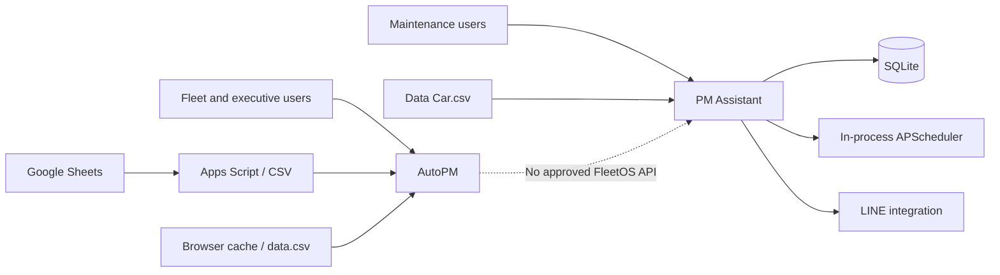
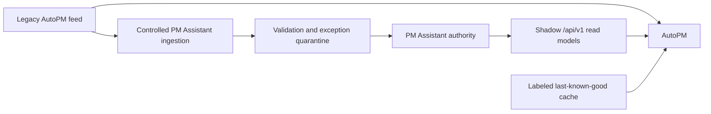
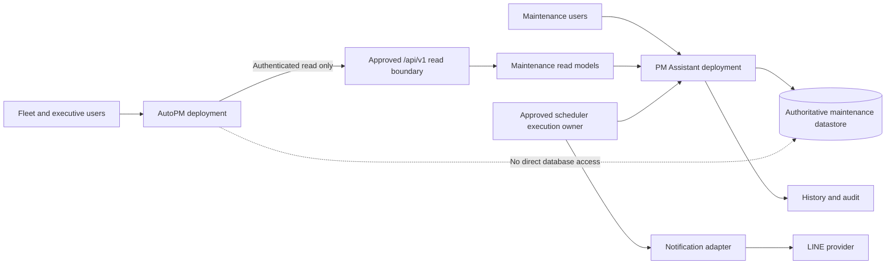
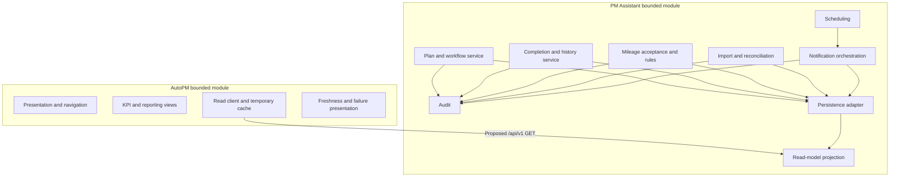
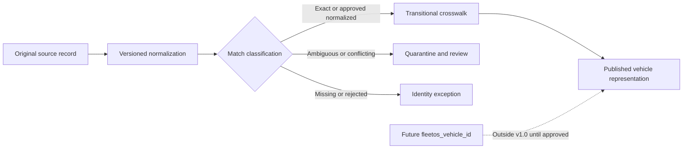
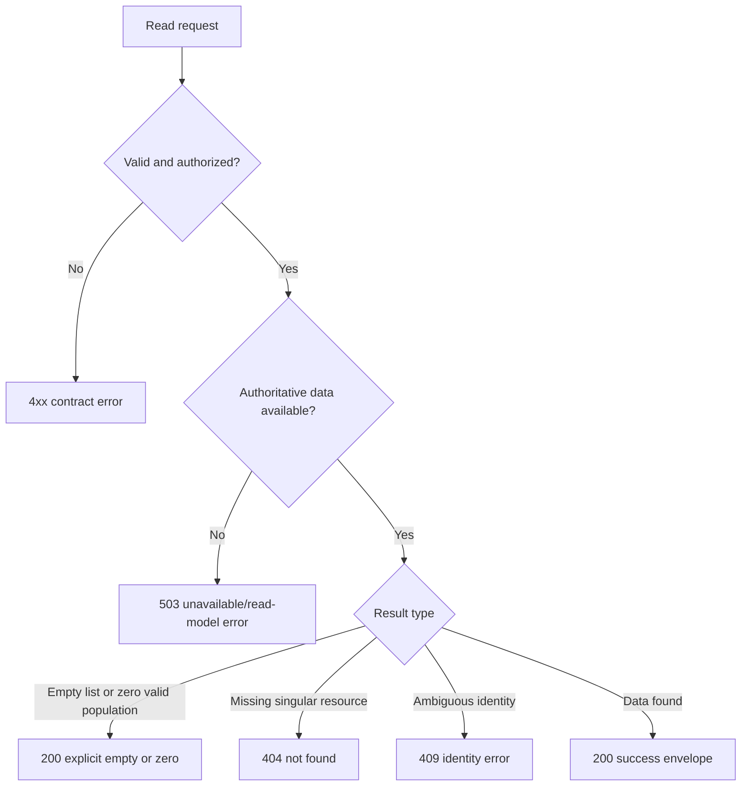

# FleetOS v1.0 System Context and Module Map

## Purpose and status

This document maps FleetOS actors, modules, responsibilities, authoritative data, identities, and the proposed read-only API boundary. It is an implementation guide, not evidence of a deployed topology or accepted API. Existing ADR and API documents marked `Proposed` remain proposed.

## Current state

### System context

AutoPM and PM Assistant currently use different information paths. AutoPM reads and interprets its feed for presentation. PM Assistant manages maintenance workflow and persistence through current unversioned routes. Source code is implementation evidence and is not an approved cross-module contract.

### Current module inventory

| Module or component | Observed responsibility | Constraint or gap |
| --- | --- | --- |
| AutoPM frontend | Dashboard, KPI, fleet views, calendar, filters, drill-down, presentation export. | Browser calculations are not authoritative PM Assistant workflow rules. |
| AutoPM data adapter | Apps Script JSON/CSV retrieval, parsing, cache, and `data.csv` fallback. | No approved versioned maintenance API; cache is presentation-only. |
| PM Assistant frontend/API | PM plans, settings, locations, vehicles, assistant actions, weekly control, reports, imports, LINE diagnostics. | Current unversioned routes mix read and write concerns and are not v1 contracts. |
| PM Assistant persistence | SQLAlchemy models and local SQLite database. | Production engine, migration framework, backup, and recovery remain unresolved. |
| Scheduler | APScheduler jobs embedded in the application process. | Multi-process and hosted duplicate-execution safety is not proven. |
| Notification integration | LINE webhook, targets, sends, diagnostics, and notification logs. | Production recipient authorization, redaction, retry, idempotency, and retention require approval. |
| Imports | CSV/XLSX and `Data Car.csv` ingestion with import records. | Canonical identity, atomicity, replay behavior, and exception thresholds remain unresolved. |

## Transitional state

### Transitional context

During transition:

- The legacy AutoPM feed remains available until reconciliation and rollback evidence passes.
- AutoPM clearly identifies source, age, stale state, and whether data came from the target or fallback path.
- PM Assistant publishes shadow read models without transferring authority to AutoPM.
- Identity and status differences are measured and reviewed, not hidden by automatic mapping.
- The AutoPM read route is controlled by an approved configuration or feature switch.

## FleetOS v1.0 target state

### Target system context

The diagram is logical and vendor-neutral. It does not claim that authentication, a production API, a production datastore, separate worker infrastructure, or observability is currently operational.

## FleetOS v1.0 module map

These are logical responsibilities. They do not require one process per box and do not authorize a source-code refactor. Implementation packaging is decided during an approved phase.

## Responsibility map

| Responsibility | AutoPM | PM Assistant | Shared contract or unresolved party |
| --- | --- | --- | --- |
| Dashboard layout and visualization | Owner | Supplies approved data | KPI meaning requires approval. |
| PM plan lifecycle | Read-only display | Authoritative owner | Proposed API projection. |
| `pm_workflow_status` | Read-only display | Authoritative owner | Vocabulary/transition gate. |
| `completion_status` | Read-only display | Authoritative owner | Evidence/reopen gate. |
| PM history | Approved read projection | Authoritative owner | Retention/privacy gate. |
| `notification_status` | Read-only display if authorized | Authoritative owner | Retry/recipient/retention gate. |
| `pm_mileage_status` | Presentation only | Proposed owner after accepted ingestion | Odometer and rule gates. |
| Temporary cache | Owner for presentation | Not dependent on it | Never an ingestion source. |
| Vehicle identity | Consumer | Consumer/publisher during transition | Enterprise owner unresolved. |
| Location identity | Consumer | Transitional local owner | Enterprise owner and stable ID unresolved. |
| Import and sync audit | Reads safe metadata | Authoritative owner | Replay/retention gates. |
| Scheduler and notification execution | None | Owner | Runtime topology unresolved. |

## Data ownership map

| Domain | Current evidence | Transitional rule | FleetOS v1.0 target | Future outside v1.0 |
| --- | --- | --- | --- | --- |
| Vehicle identity | Sheet attributes and PM Assistant local vehicle records. | Match only by approved normalized `vehicle_no`; quarantine ambiguity. | Publish a provenance-rich representation without inventing canonical identity. | `fleetos_vehicle_id` and enterprise vehicle registry. |
| Vehicle attributes | Google Sheets and `Data Car.csv` can disagree. | Preserve per-field provenance and reviewed mappings. | Publish only approved attributes and identity status. | Effective-dated enterprise master. |
| PM plan | Sheet forecasts plus PM Assistant plan records. | Sheet values may be controlled import candidates only. | PM Assistant authority. | Additional command/event channels if approved. |
| Workflow, completion, history | PM Assistant persistence and actions. | PM Assistant wins over legacy labels. | PM Assistant authority with safe read projections. | Broader enterprise event integration. |
| Mileage | AutoPM feed/current browser calculation; no observed PM Assistant odometer entity. | Validate upstream readings; keep current display path labeled. | PM Assistant may own accepted maintenance-mileage records and calculation after decisions. | Direct telematics or enterprise odometer service. |
| Notification | PM Assistant scheduler, settings, provider integration, and logs. | Audit every controlled attempt and preserve safe failure evidence. | PM Assistant authority with approved retry and retention. | Additional channels and orchestration. |
| Import/synchronization | PM Assistant import logs and AutoPM browser sync state. | Browser state stays ephemeral; PM Assistant controls auditable ingestion. | PM Assistant authority for batch outcomes. | Enterprise integration platform if approved. |

## Identity map

Identity rules:

- Preserve original Unicode and parsed/normalized values.
- Use versioned normalization for comparison only.
- Keep vehicle number, registration, and vehicle code in distinct namespaces.
- Never use sheet row index or database-local integer as shared enterprise identity.
- Ownership outranks timestamp when data conflicts.
- Do not create a canonical entity silently for a missing match.
- Keep `fleetos_vehicle_id` `null` or absent only as allowed by the proposed contract; never fabricate it.

## Read-only API map

The endpoint inventory below mirrors the proposed [API Contract](../API_CONTRACT.md). It remains proposed and non-operational until approved, implemented, secured, and validated.

| Proposed endpoint | Purpose | Authority |
| --- | --- | --- |
| `GET /api/v1/health/live` | Minimal process liveness. | PM Assistant runtime. |
| `GET /api/v1/health/ready` | Coarse readiness of essential read dependencies. | PM Assistant runtime/read boundary. |
| `GET /api/v1/vehicles/lookup` | Transitional vehicle lookup with explicit ambiguity handling. | PM Assistant-published representation; enterprise owner unresolved. |
| `GET /api/v1/vehicles` | Vehicle list for approved AutoPM views. | Same unresolved enterprise ownership. |
| `GET /api/v1/pm-plans` | Authoritative PM plan list. | PM Assistant. |
| `GET /api/v1/pm-plans/{pm_plan_id}` | Authoritative plan detail. | PM Assistant. |
| `GET /api/v1/pm-plans/{pm_plan_id}/history` | Safe auditable plan events. | PM Assistant. |
| `GET /api/v1/locations` | Approved location representations. | Transitional PM Assistant location master; enterprise owner unresolved. |
| `GET /api/v1/dashboard/summary` | Authoritative maintenance counts for AutoPM presentation. | PM Assistant for values; AutoPM for visualization. |
| `GET /api/v1/pm-mileage-status/summary` | Approved mileage-condition aggregate. | PM Assistant only after mileage gates. |
| `GET /api/v1/synchronization` | Safe import and reconciliation metadata. | PM Assistant. |

The proposed boundary uses dedicated schemas, common metadata, explicit freshness, opaque IDs, cursor pagination for lists, and `ETag` direction. Existing unversioned routes remain outside the v1 guarantee.

## API error and availability model

Error rules:

- Stable `UPPER_SNAKE_CASE` codes and safe messages use the common proposed envelope.
- Clients branch on HTTP status and code, never message text.
- Correlation IDs are diagnostic, not authentication or idempotency.
- Unsupported filters and sorts fail explicitly.
- Missing authoritative input is not represented as a zero result.
- Retry is limited to approved transient classes and bounded attempts.
- Responses and logs exclude stack traces, SQL, credentials, paths, topology, raw targets, and sensitive payloads.

## Future state outside v1.0

Future module direction may include canonical registries, additional notification channels, write commands, domain events, telematics ingestion, or enterprise identity integration. Each requires a new ownership, security, compatibility, audit, and rollback decision. None is implied by the v1 read boundary.

## Unresolved implementation gates

- ADR and API acceptance status.
- Vehicle, location, fleet, business-unit, person, and team ownership.
- External resource identifiers and idempotency formats.
- Exact status vocabularies and schedule-condition representation.
- Authentication/proxy topology and field-level exposure.
- KPI definitions and summary population.
- Deletion/tombstone, cursor, caching, and retention rules.
- Packaging of logical PM Assistant responsibilities into runtime components.

## Related documents

- [FleetOS v1.0 Blueprint](FLEETOS_V1_BLUEPRINT.md)
- [Data and Integration Flow](DATA_AND_INTEGRATION_FLOW.md)
- [Deployment and Runtime Blueprint](DEPLOYMENT_AND_RUNTIME_BLUEPRINT.md)
- [Implementation Roadmap](IMPLEMENTATION_ROADMAP.md)
