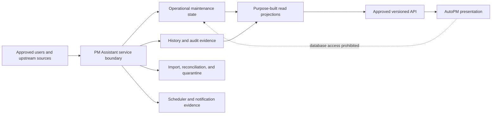

# FleetOS Database Blueprint

## Purpose and decision status

This document defines the logical FleetOS v1.0 database architecture. It separates current SQLite evidence, transitional direction, the target logical design, and future decisions. It is not executable design authority and does not claim that a target database, migration mechanism, hosted environment, or production topology exists.

PM Assistant remains the only authoritative maintenance persistence boundary. AutoPM is a presentation and reporting consumer. AutoPM receives approved API/read-model representations, never database credentials or persistence access.

## Non-negotiable boundaries

1. AutoPM and PM Assistant remain separate modules and deployment boundaries.
2. PM Assistant owns authoritative maintenance workflow persistence.
3. AutoPM has no direct table, schema, credential, connection, or write access.
4. Direct shared-database coupling is prohibited.
5. Public API models must not expose ORM entities or persistence structure.
6. `vehicle_no` is a transitional matching key only.
7. `fleetos_vehicle_id` is a proposed future canonical identifier and is not implemented.
8. `pm_mileage_status`, `pm_workflow_status`, `completion_status`, and `notification_status` remain separate concepts.
9. Historical snapshots, original source values, provenance, and correction evidence are preserved.
10. Proposed infrastructure is not operational until separately approved, implemented, and validated.

## Current SQLite implementation evidence

Repository evidence shows PM Assistant using SQLAlchemy with a local SQLite file and startup-time table creation. The implementation currently defines tables for:

- vehicle and location masters;
- PM plans, plan history, and task state;
- weekly campaigns and campaign items;
- users and settings;
- LINE targets and webhook events;
- notification and import logs.

Some records use text or local integer references without demonstrated database foreign-key enforcement. PM plans carry vehicle and location snapshot fields. Startup logic includes limited legacy-table copying rather than a general versioned migration mechanism.

This is evidence of current behavior only. Existing table names, columns, local identifiers, SQLAlchemy models, and startup behavior are not automatically approved as the FleetOS v1.0 target schema.

## Transitional database direction

The transition must establish evidence before target implementation:

1. Inventory every approved source, current table, column, constraint, relationship, query, and writer.
2. Preserve original records and decoded Unicode values before normalization.
3. Profile identity, status, date, mileage, null, duplicate, orphan, stale, and conflicting data.
4. Build controlled source-to-target crosswalks without guessing ambiguous identity.
5. Separate operational state from append-only history, audit, import outcomes, and notification attempts.
6. Introduce candidate relationships only after orphan and compatibility analysis.
7. Publish target-shaped read models in shadow mode before any AutoPM cutover.
8. Keep the legacy path labeled and reversible until Product Owner acceptance.

Transitional reconciliation does not transfer authority to an upstream file, AutoPM cache, or the latest timestamp.

## FleetOS v1.0 target database design

### Logical architecture

The diagram represents logical responsibilities, not selected schemas, servers, products, processes, or deployment topology.

### Logical data areas

| Area | Responsibility | Write authority | Candidate consumers |
| --- | --- | --- | --- |
| Operational maintenance | Current plan, workflow, completion, task, and accepted maintenance state | PM Assistant only | PM Assistant; approved read projections |
| Reference and identity | Local references, aliases, reviewed mappings, and provenance | Approved PM Assistant process; enterprise ownership remains unresolved | PM Assistant; approved projections |
| History and audit | Append-oriented domain events, state transitions, corrections, and access-safe evidence | PM Assistant processes only | Authorized operations and approved projections |
| Import and reconciliation | Batches, rows, classifications, replay disposition, quarantine, and review decisions | Controlled PM Assistant ingestion | Authorized operators; safe synchronization metadata |
| Scheduler and notification | Job execution, notification intent, attempts, outcomes, and duplicate prevention | PM Assistant scheduler/orchestrator | Authorized operators; approved status projections |
| Read projection | Purpose-built query shapes with source and freshness metadata | PM Assistant projection process | AutoPM through an approved API only |

### Write and read paths

- All authoritative mutations pass through an approved PM Assistant application boundary with validation, authorization, transaction, and audit behavior.
- Imports parse and classify before authoritative mutation. Ambiguous, conflicting, orphaned, duplicate, rejected, or stale records remain explicit.
- Scheduler and notification activity records intent separately from execution attempts.
- AutoPM reads dedicated projections through the approved versioned API contract. It cannot query operational tables or use a database replica as an integration contract.
- Read-model unavailability, valid empty results, stale results, and missing authoritative input remain distinguishable.

### Transaction and consistency direction

- A business operation must define which authoritative state and audit evidence succeed together.
- Plan, workflow, and completion changes must not report success when required evidence failed to persist.
- Import batches retain batch-level and row-level outcomes even when partial success is allowed.
- Notification business intent is distinct from provider attempts so retry cannot duplicate the intent.
- Scheduler executions require deterministic identity and an approved single-execution strategy; the mechanism is unresolved.
- Concurrent authoritative updates require an approved optimistic version or equivalent concurrency rule. Clock time alone cannot resolve conflicts.

### Identity direction

- Database-local primary keys are internal implementation details and are not shared identities by default.
- Public resource identifiers remain opaque strings under the API contract.
- `vehicle_no` may be used only for transitional matching with original value, normalized value, normalization version, classification, and provenance.
- `fleetos_vehicle_id` remains reserved and proposed. Its type, generator, owner, storage, merge/split behavior, and retirement policy are unresolved.
- Registration, vehicle code, location name, fleet label, business-unit label, and display name cannot be promoted to canonical identities by convenience.

### Status direction

| Status | Meaning | Authority and rule |
| --- | --- | --- |
| `pm_mileage_status` | Condition derived from an accepted mileage record and approved versioned calculation rule | PM Assistant after source and rule approval; it does not imply workflow or completion. |
| `pm_workflow_status` | Progress through the maintenance workflow | PM Assistant; transitions require an approved state model. |
| `completion_status` | Explicit completion, correction, or reopen state | PM Assistant; never inferred from mileage, date, notification, or dashboard state. |
| `notification_status` | Notification intent and delivery outcome | PM Assistant; based on recorded intent and provider attempts. |

Each status retains its own source/evidence and history. No database trigger, import, timestamp, or projection may silently copy one status into another.

### Historical and source preservation

- Historical plan records retain the vehicle, registration, location, grouping, and other labels known at the relevant time even if a master later changes.
- Raw decoded source values remain available as controlled evidence; normalized comparison values never overwrite them.
- Corrections append or reference compensating evidence rather than concealing the prior state.
- Mapping and calculation versions are recorded so derived results can be reproduced or rolled back without rewriting accepted raw evidence.
- Sensitive payloads are minimized or referenced safely rather than copied indiscriminately into history or audit.

### Security and access direction

- Database access follows least privilege and deny-by-default rules after an authentication and authorization design is approved.
- AutoPM receives no database user, credential, connection string, network route, schema grant, or write capability.
- Application, migration, backup, read-projection, and operational roles should be separated if the selected technology supports it; exact roles remain future design.
- Secrets, authorization material, raw webhook payloads, notification targets, and unnecessary personal data are excluded or redacted from logs and general audit views.
- Encryption, key management, database roles, row/field policies, and network controls remain unresolved implementation decisions.

### Observability direction

Future implementation evidence should make the following visible without leaking topology or sensitive content:

- persistence readiness and transaction failures;
- slow or failed approved query patterns;
- schema-version and migration outcomes;
- import classifications and reconciliation totals;
- identity exceptions and unresolved quarantine counts;
- scheduler execution and duplicate prevention;
- notification intent, attempt, retry, and final outcome;
- read-projection freshness and lag;
- backup, restore, and recovery rehearsal results.

Operational logs and durable domain audit remain separate when purpose, access, immutability, or retention differs.

## Future decisions outside Phase 4.1

Phase 4.1 does not decide:

- database engine, hosted service, server layout, replication, or production topology;
- PostgreSQL, Railway, Docker, or any other named infrastructure;
- migration framework, ORM architecture, or deployment sequencing mechanism;
- UUID or other identifier type/generation strategy;
- enterprise identity ownership and canonical identifier lifecycle;
- physical schemas, partitions, materialized views, triggers, stored procedures, or vendor-specific index types;
- backup technology, recovery objectives, retention periods, archival, deletion, privacy, and legal hold;
- authentication, authorization, encryption, key management, operational ownership, or service levels.

Significant approved decisions require the FleetOS ADR process before implementation.

## Acceptance gates for later implementation

1. Required ownership, identity, status, retention, and security decisions are approved.
2. Database engine and migration mechanism have separate approval and ADR coverage where required.
3. Current queries, writers, constraints, and data quality are inventoried.
4. Backup restoration and recovery are rehearsed using isolated approved data.
5. Migration, reconciliation, compatibility, failure, and rollback evidence passes approved thresholds.
6. AutoPM contract tests prove there is no persistence coupling.
7. Product Owner approves implementation, migration, cutover, and deployment separately.

## Related documents

- [Database Documentation](README.md)
- [Schema Design](SCHEMA_DESIGN.md)
- [Table Specification](TABLE_SPECIFICATION.md)
- [Index Strategy](INDEX_STRATEGY.md)
- [Migration Strategy](MIGRATION_STRATEGY.md)
- [FleetOS Architecture](../FLEETOS_ARCHITECTURE.md)
- [FleetOS Data Ownership](../DATA_OWNERSHIP.md)
- [FleetOS Identity Contract](../IDENTITY_CONTRACT.md)
