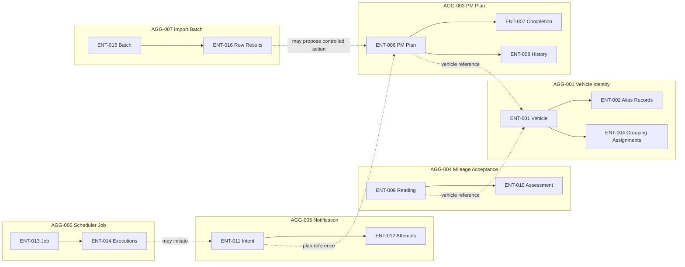

# FleetOS Aggregates and Boundaries

## Purpose

This document defines conceptual aggregate roots and consistency direction. An aggregate identifies a business consistency boundary for future design discussion; it is not a table group, ORM graph, transaction prescription, service, or deployment unit.

Cross-aggregate references use stable domain references only after their identity decisions are approved. During transition, references include provenance and explicit exception state.

## Aggregate catalog

### `AGG-001` — Vehicle Identity

- Root: `ENT-001` Vehicle.
- Contains conceptually: `ENT-002` alias records and `ENT-004` grouping assignments.
- References: `ENT-003` grouping and `ENT-019` reconciliation decisions.
- Consistency direction: do not add, merge, split, supersede, or retire identity evidence without preserved provenance and a reviewed decision when ambiguity exists.
- Transitional rule: `VO-001` is the only cross-system matching mechanism; it is not root identity.
- Blocking decisions: `DEC-001`, `DEC-002`, `DEC-004`.

The aggregate does not imply that FleetOS v1.0 implements an enterprise Vehicle Master. `fleetos_vehicle_id` remains future and unimplemented.

#### Phase 5.3 implemented subset

The first approved implementation is intentionally narrower than complete `AGG-001`. Its root is `ENT-001` Vehicle with only:

- immutable PM Assistant-local `local_vehicle_id` identity;
- one immutable `VO-020` Original Vehicle Number.

It may represent an existing PM Assistant-local Vehicle, expose those two values, and compare Vehicle entity identity using only `local_vehicle_id`. It has no mutation behavior. Equal Original Vehicle Number values never establish Vehicle identity.

This subset excludes `VO-001`, `ENT-002`, `ENT-004`, `ENT-019`, normalization, matching, aliases, grouping, reconciliation, lifecycle operations, events, repositories, persistence, APIs, and application services. The full `AGG-001` blocking decisions remain unresolved. The current implementation may obtain `local_vehicle_id` from the existing local Vehicle record identifier, but the aggregate contract is storage-agnostic.

#### Phase 6.3 local creation authority

ADR-0004 authorizes PM Assistant to create a local Vehicle reference in a later,
separately approved implementation phase. Persistence allocates the positive
`local_vehicle_id` inside the application-owned transaction; neither the caller
nor the aggregate supplies or generates it. An allocated identifier is not a
successful result until commit is confirmed and has no sequence, public, or
cross-system meaning.

The created aggregate has the same immutable two-field state and equality rules
as the Phase 5.3 subset. Successful creation must be auditable, while audit
content and implementation remain deferred. Exact Original Vehicle Number
duplicate and uniqueness behavior remains pending and is not an aggregate
invariant.

This authority does not add mutation of an existing Vehicle, deletion,
retirement, merge, split, normalization, matching, aliases, grouping,
reconciliation, events, APIs, or AutoPM behavior.

### `AGG-002` — Location Directory

- Root: `ENT-005` Location.
- Contains conceptually: approved alias/name history and attributes required for transitional plan selection.
- Referenced by: `AGG-003` through an approved reference and `VO-006` plan-time snapshot.
- Consistency direction: rename, merge, correction, and retirement preserve historical names and affected references.
- Transitional rule: use an exact canonical name or explicitly approved alias; similar names are not merged automatically.
- Blocking decision: `DEC-003`.

### `AGG-003` — PM Plan

- Root: `ENT-006` PM Plan.
- Contains conceptually: `VO-007` schedule, `VO-008` workflow status, `VO-009` completion status, `ENT-007` completion evidence, and plan-associated `ENT-008` history entries.
- References: `ENT-001` Vehicle and `ENT-005` Location using preserved plan-time evidence.
- Consistency direction: an accepted mutation must leave authoritative plan state and required history/audit evidence consistent under a later approved implementation guarantee.
- Authority: PM Assistant.
- Blocking decisions: `DEC-006`, `DEC-007`, `DEC-008`, `DEC-015`.

Completion evidence and history remain preserved even if the plan is cancelled, corrected, reopened, or later points to a reconciled vehicle/location reference. Physical append-only enforcement is an implementation decision, but concealed destructive rewrite is prohibited by `INV-013`.

### `AGG-004` — Mileage Acceptance

- Root: `ENT-009` Mileage Reading.
- Contains conceptually: validation/classification evidence and one or more `ENT-010` assessments created under distinct rule versions.
- References: `ENT-001` Vehicle.
- Consistency direction: raw and parsed input, provenance, times, and validation disposition remain preserved; assessment recalculation never rewrites accepted input.
- Authority: conditional PM Assistant ownership of accepted maintenance-mileage records.
- Blocking decisions: `DEC-009`, `DEC-010`.

No reading becomes accepted merely because AutoPM currently displays it or calculates a browser status.

### `AGG-005` — Notification

- Root: `ENT-011` Notification Intent.
- Contains: ordered `ENT-012` Notification Attempts.
- References: initiating PM plan, scheduler execution, safe recipient reference, `VO-014` configuration reference, and `VO-016` idempotency reference where approved.
- Consistency direction: every controlled attempt belongs to one intent; retries cannot conceal earlier attempts or create an untracked business delivery.
- Authority: PM Assistant.
- Blocking decision: `DEC-011`.

Provider delivery outcome is evidence about an attempt. It does not complete maintenance, change workflow, or authorize AutoPM to declare delivery success.

### `AGG-006` — Scheduler Job

- Root: `ENT-013` Scheduler Job.
- Contains: `ENT-014` Scheduler Executions.
- References: safe configuration and resulting domain action/intent references.
- Consistency direction: one approved execution owner produces at most one accepted business outcome per approved job identity; a duplicate acquisition is recorded as skipped.
- Authority: PM Assistant for scheduled maintenance actions.
- Blocking decision: `DEC-012`.

The aggregate does not select an in-process scheduler, worker, distributed lock, database lock, queue, or hosting topology.

### `AGG-007` — Import Batch

- Root: `ENT-015` Import Batch.
- Contains: all `ENT-016` Import Row Results received for the batch.
- References: `ENT-019` reconciliation decisions and any accepted domain action references.
- Consistency direction: parsing, validation, normalization, and classification precede authoritative mutation; preview has no business mutation; confirmation/cancellation and partial results remain explicit.
- Authority: PM Assistant.
- Blocking decision: `DEC-013`.

Replay detection prevents duplicate business outcomes under an approved identity, but neither checksum nor identity format is chosen here.

### `AGG-008` — Synchronization and Reconciliation

- Root: `ENT-017` Synchronization Record.
- Contains conceptually: references to mapping/rule/contract versions and `ENT-019` reconciliation decisions relevant to the run.
- References: imported or published domain representations.
- Consistency direction: source evidence, classifications, counts, mapping versions, and superseded decisions remain traceable.
- Authority: PM Assistant for maintenance synchronization audit; enterprise master decisions remain with their approved owner.
- Blocking decisions: `DEC-001`–`DEC-004`, `DEC-013` as applicable.

AutoPM browser cache is never a synchronization input.

### `AGG-009` — Audit

- Root: `ENT-018` Audit Record.
- References: safe domain resource, actor/process, correlation, configuration/rule/contract/mapping versions, and result.
- Consistency direction: audit evidence is created for required actions, excludes prohibited sensitive content, and preserves correction lineage.
- Ownership: the authoritative domain creates its audit evidence; audit access and retention do not transfer domain ownership.
- Blocking decision: `DEC-014`.

The Audit aggregate does not replace PM history, completion evidence, notification attempts, scheduler executions, or import row results. Those records retain their domain-specific meaning.

## Aggregate boundary map

Dashed arrows cross aggregate boundaries through conceptual references. They are not foreign keys, synchronous-call requirements, or transaction boundaries.

## Boundary rules

1. Only the aggregate's authoritative module accepts mutations to its business state.
2. AutoPM receives approved read projections and never loads or mutates aggregates directly.
3. A cross-aggregate reference does not copy the target aggregate's business rules into the source aggregate.
4. Historical snapshots preserve context but do not become new authoritative masters.
5. Domain ownership outranks timestamps during conflict resolution.
6. A failure to resolve vehicle or location identity creates an explicit exception; no aggregate may invent the missing canonical entity.
7. Audit evidence required for an accepted action must not be silently omitted after the action is reported successful.
8. Aggregate design must preserve independent AutoPM and PM Assistant operation and rollback.

## Read-model boundary

Approved read models may combine projections from several aggregates for AutoPM presentation. A combined projection:

- does not become an aggregate;
- does not transfer write authority to AutoPM;
- includes source and `VO-018` freshness;
- preserves the four status domains under their exact names;
- distinguishes valid empty/zero, missing, stale, ambiguous, conflicting, unauthorized, and unavailable results;
- does not expose ORM objects, table structures, secrets, raw targets, or unsafe audit content.

## Implementation decisions intentionally deferred

- Aggregate persistence shape and identifier type.
- Transaction and concurrency mechanisms.
- Repository/service/package structure.
- Whether history and audit use the same or separate stores.
- Runtime packaging of scheduler, notification, and import responsibilities.
- Database, migration, queue, lock, hosting, and recovery technology.
- Exact Original Vehicle Number duplicate and uniqueness policy for local
  creation.
- Local Vehicle-creation audit content, persistence shape, access, and retention.
- Update, correction, deletion, retirement, merge, and split behavior.

