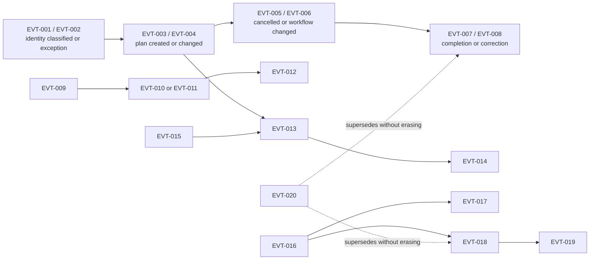

# FleetOS Domain Events and Audit

## Purpose

This document defines business-significant facts and their audit direction. A FleetOS domain event records that something meaningful occurred in an authoritative domain.

A domain event in this model is **not** an instruction to implement event sourcing, a message broker, queue, webhook, public integration event, or cross-module write API. Those mechanisms are future decisions outside v1.0 unless separately approved.

## Domain-event principles

1. The authoritative domain emits or records the fact.
2. Event names use past-tense business meaning.
3. Events do not transfer ownership or allow AutoPM to mutate maintenance state.
4. Events reference safe identifiers and versions, not physical rows or ORM objects.
5. Correlation supports diagnostics but does not prove authentication, authorization, ordering, causation, or idempotency.
6. Corrections preserve the original event and add superseding or compensating evidence.
7. Event/audit content excludes secrets, raw credentials, unsafe targets, raw webhook payloads, and unnecessary personal data.

## Event catalog

| ID | Event | Trigger and minimum conceptual evidence | Owning context |
| --- | --- | --- | --- |
| `EVT-001` | Vehicle Match Classified | Original/normalized value, rule version, source, classification, candidate/canonical reference if any, time. | Fleet Identity and Organization |
| `EVT-002` | Vehicle Identity Exception Raised | Ambiguous/conflicting/missing/rejected classification, safe reason, source, review requirement. | Fleet Identity and Organization |
| `EVT-003` | PM Plan Created | Plan reference, vehicle/location evidence, schedule, initial state, actor/process, effective/recorded time, correlation. | PM Planning and Workflow |
| `EVT-004` | PM Plan Changed | Plan reference, safe before/after summary, reason, actor/process, times, correlation. | PM Planning and Workflow |
| `EVT-005` | PM Plan Cancelled | Plan reference, previous state, cancellation reason, actor/process, times, correlation. | PM Planning and Workflow |
| `EVT-006` | PM Workflow Status Changed | Plan reference, old/new `pm_workflow_status`, reason, actor/process, times, correlation. | PM Planning and Workflow |
| `EVT-007` | PM Completion Recorded | Plan/completion reference, prior/new `completion_status`, effective and recorded time, reason, evidence reference, actor/process, correlation. | Completion and Maintenance History |
| `EVT-008` | PM Completion Reopened or Corrected | Plan/completion reference, superseded evidence reference, reason, actor/process, effective/recorded time, correlation. | Completion and Maintenance History |
| `EVT-009` | Mileage Reading Received | Reading reference, safe source, raw/parsed measurement reference, measured/received time, timezone, vehicle-match state. | Mileage Acceptance and PM Condition |
| `EVT-010` | Mileage Reading Accepted | Reading reference, validation/rule version, vehicle reference, acceptance time, actor/process. | Mileage Acceptance and PM Condition |
| `EVT-011` | Mileage Reading Quarantined | Reading reference, classification/reason, source, review requirement, time. | Mileage Acceptance and PM Condition |
| `EVT-012` | PM Mileage Status Calculated | Assessment/reading reference, old/new assessment if applicable, `pm_mileage_status`, rule version, calculated time, freshness. | Mileage Acceptance and PM Condition |
| `EVT-013` | Notification Intent Created | Intent reference, safe subject/reason/recipient reference, requested time, actor/process, correlation, idempotency reference if approved. | Notification Orchestration |
| `EVT-014` | Notification Attempt Recorded | Intent/attempt reference, attempt number, safe provider classification, `notification_status`, time/duration, retry/terminal direction, correlation. | Notification Orchestration |
| `EVT-015` | Scheduler Execution Recorded | Job/execution reference, trigger/acquisition/result, start/end/duration, safe error classification, correlation, resulting action reference. | Scheduling |
| `EVT-016` | Import Batch Previewed | Batch reference, source/contract/rule versions, outcome counts, actor/process, times, correlation; no mutation. | Import and Reconciliation |
| `EVT-017` | Import Batch Confirmed or Cancelled | Batch reference, disposition, actor/process, time, correlation, replay disposition. | Import and Reconciliation |
| `EVT-018` | Import Row Classified | Batch/row reference, source reference, validation/match classification, proposed/final disposition, safe errors. | Import and Reconciliation |
| `EVT-019` | Synchronization Completed | Sync reference, domain/source, status, counts, versions, start/end, freshness/last success, correlation. | Import and Reconciliation |
| `EVT-020` | Audit Correction Recorded | Corrected audit/domain reference, original and superseding evidence references, reason, actor/process, effective/recorded time. | Audit and Governance |

## Event relationship flow

The arrows show possible conceptual causation/correlation. An event's mere temporal order does not prove causation.

## Current, transitional, target, and future event interpretation

| State | Interpretation |
| --- | --- |
| Current evidence | PM history, notification logs, import logs, scheduler behavior, and source/cache timestamps contain partial event evidence with differing shapes. |
| Transitional | Preserve current evidence; attach safe correlation and provenance where approved; do not rewrite legacy history to simulate events. |
| FleetOS v1.0 target | Required business actions produce domain-appropriate facts and safe audit evidence with stable event identifiers from this catalog. |
| Future outside v1.0 | Publishing integration events, webhooks, streams, event stores, replayable event sourcing, or an enterprise event platform. |

## Audit record requirements

`ENT-018` records the minimum safe evidence appropriate to an action:

- domain and event identifier;
- safe resource/operation reference;
- safe `VO-013` actor or process reference;
- effective/event time and recorded time with explicit timezone interpretation;
- result and safe reason or error classification;
- `VO-015` correlation reference where available;
- relevant `VO-017` rule, contract, normalization, or mapping versions;
- safe before/after summary when a state or mapping changed;
- original/superseding evidence references for corrections;
- import, synchronization, scheduler, notification, or completion reference where applicable.

Audit must not contain:

- tokens, passwords, keys, secrets, authorization headers, cookies, or connection strings;
- raw LINE or other provider target identifiers in broadly readable projections;
- raw webhook payloads or unsafe provider responses;
- SQL, stack traces, database engine details, filesystem paths, or internal topology;
- unnecessary personal data or unredacted legacy snapshots;
- `.env` values or configuration secret values.

## Specialized history and audit

| Evidence | Primary purpose | Relationship to `ENT-018` |
| --- | --- | --- |
| `ENT-008` PM History Entry | User/domain-readable ordered maintenance history. | May be supported by audit but remains the authoritative maintenance-history concept. |
| `ENT-007` PM Completion | Evidence of explicit completion/correction. | Audit references the completion; it does not replace it. |
| `ENT-012` Notification Attempt | Provider delivery outcome and retry chain. | Audit may summarize safely; detailed attempt remains owned by notification domain. |
| `ENT-014` Scheduler Execution | Trigger, acquisition, result, duration, and duplicate protection. | Audit may reference execution. |
| `ENT-016` Import Row Result | Per-row validation and mutation disposition. | Audit may summarize batch actions without hiding row outcomes. |
| `ENT-019` Reconciliation Decision | Reviewed identity/mapping disposition and supersession. | Audit records who/when/why without losing the decision's domain meaning. |

Audit and operational logs remain separate when their purpose, access, immutability, or retention differs.

## Actor and configuration references

### Actor reference

`VO-013` may identify a human actor, service, scheduler process, import process, or controlled system action using a safe reference. It must not:

- equate a display name or free-text responsibility label with a user identity;
- claim authentication or authorization is operational;
- expose credentials or unnecessary personal data;
- imply that the Product Owner governance role is an application identity.

Identity provider, roles, permission matrix, actor visibility, provisioning, and revocation remain `DEC-005` and `DEC-014`.

### Configuration reference

`VO-014` identifies the safe configuration version/name that influenced a rule, scheduler job, import, or notification. It records no secret value. Configuration ownership, approval, and environment behavior must be resolved before implementation; database or environment-variable structure is not defined here.

## Correlation and idempotency

- `VO-015` correlation helps trace related work and must be validated and sanitized.
- Correlation alone cannot prevent duplicate business outcomes.
- `VO-016` idempotency is a separate business reference governed by `DEC-011`, `DEC-013`, and `DEC-015`.
- Retries link to the original intent/command/batch identity under an approved policy.
- An event ID, correlation ID, timestamp, filename, or provider response must not be used as idempotency evidence merely because it is available.

## Correction and retention direction

- A correction creates `EVT-020` or equivalent domain-specific superseding evidence.
- Original events, source values, accepted readings, plan history, and prior completion evidence remain traceable.
- Mapping and calculation-rule rollback changes the active version; it does not rewrite the facts produced under the prior version.
- Access, retention, privacy, deletion, legal hold, actor visibility, and correction policy remain unresolved in `DEC-014`.
- No retention duration is invented by this model.

## Audit acceptance direction

Before implementation, audit design must prove:

1. Required actions create traceable evidence under failure and success paths.
2. Persistence and audit consistency behavior is approved.
3. Corrections preserve superseded evidence.
4. Secrets and prohibited sensitive fields are absent from audit, logs, errors, and read projections.
5. Actor/process, times, result, correlation, and applicable versions are represented safely.
6. Access, disclosure, retention, privacy, and deletion policies are approved.
7. AutoPM receives only authorized, presentation-safe projections.

