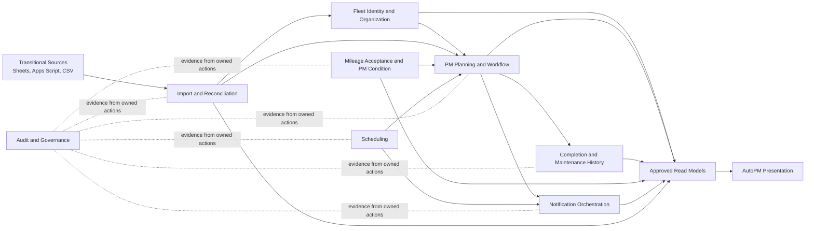
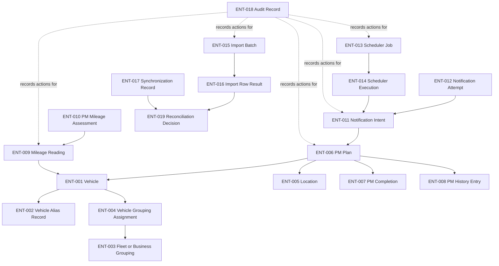

# FleetOS Canonical Domain Model v1.0

## Purpose

This document is the canonical conceptual map of FleetOS business domains for Phase 3.6. It defines the language and boundaries needed before database and application design while preserving unresolved Product Owner decisions.

The model describes business meaning, not physical storage. Mermaid diagrams in this directory are conceptual and must not be interpreted as entity-relationship database schemas or deployed component diagrams.

## Domain vocabulary

| Term | Canonical meaning |
| --- | --- |
| FleetOS | Parent Fleet Operating System containing the AutoPM and PM Assistant bounded modules. |
| AutoPM | Read-only fleet presentation module for dashboards, KPIs, calendars, filtering, exports, and freshness/fallback presentation. |
| PM Assistant | Authoritative maintenance module for PM planning, workflow, completion, history, notification orchestration, scheduling, controlled import, synchronization audit, and maintenance persistence. |
| Vehicle | The business subject receiving maintenance. Enterprise master ownership and canonical identity remain unresolved (`DEC-001`). |
| Vehicle identity | Evidence and references used to distinguish a vehicle across sources without guessing or merging ambiguous candidates. |
| Vehicle number | `vehicle_no`; the only approved transitional cross-system matching key, not a permanent enterprise identity. |
| Vehicle alias | A namespaced registration, vehicle code, or historical vehicle reference retained with provenance and, where approved, an effective period. |
| Fleet/business grouping | Organizational labels or assignments used to group vehicles. Stable identity, hierarchy, and ownership remain unresolved (`DEC-004`). |
| Location | A maintenance place or service location. PM Assistant provides transitional representations; stable FleetOS identity remains unresolved (`DEC-003`). |
| PM plan | The authoritative intention and schedule for preventive-maintenance work on a vehicle. |
| PM workflow | Progression of a plan through approved maintenance work states. Exact vocabulary and graph remain unresolved (`DEC-006`). |
| PM completion | An explicit authorized record that maintenance was completed; it is not inferred from another status or signal. |
| PM history | Ordered, preserved evidence of plan-related actions and corrections. |
| Mileage reading | A source reading received for a vehicle with measurement, time, provenance, and validation disposition. |
| PM mileage assessment | A versioned calculation of `pm_mileage_status` from an accepted reading and approved rule. |
| Schedule condition | A date-derived condition such as overdue-by-date; separate from workflow progression. |
| Notification intent | The business decision to notify an approved recipient for an approved reason. |
| Notification attempt | One provider-delivery attempt linked to an intent. |
| Scheduler job | A deterministic business job definition under one approved execution owner. |
| Scheduler execution | One observed trigger/acquisition/run outcome for a scheduler job. |
| Import batch | One controlled ingestion request with source provenance, preview, confirmation, and aggregate outcomes. |
| Import row result | The traceable classification and mutation disposition of one received row. |
| Synchronization record | Evidence of a controlled cross-source reconciliation or publication run. |
| Audit record | Safe evidence of a domain action, outcome, actor/process, time, correlation, and relevant versions. |
| Actor reference | A safe reference to the user or process responsible for an action; not proof of an enterprise identity or authorization model. |
| Configuration reference | A safe name/version reference to approved configuration used by a rule or process; never a secret value. |
| Domain event | A conceptual fact that something business-significant occurred. It does not imply an event bus or integration message. |

## Approved foundational value objects

| ID | Value object | Canonical meaning and approved boundary |
| --- | --- | --- |
| `VO-020` | Original Vehicle Number | An immutable, raw source-preserved `vehicle_no` value. It contains non-empty text with at least one non-whitespace character and preserves leading/trailing whitespace, Unicode text and digits, punctuation, and separators exactly. Equality is exact value equality. It is not FleetOS Vehicle Identity, a normalization object, a match result, or proof that two records concern the same Vehicle. |

`VO-020` was approved by the Product Owner for the Phase 5.2 domain foundation. It performs no normalization, matching, alias handling, reconciliation, or canonical-identity behavior. It may later supply only the original-value component of `VO-001`; `VO-001` itself remains unimplemented.

## Approved minimal Vehicle Aggregate

Phase 5.3 approves a deliberately narrow first implementation of `ENT-001` Vehicle within PM Assistant. Its complete state is:

- `local_vehicle_id`: an immutable positive integer identifying the aggregate only within PM Assistant;
- `original_vehicle_number`: one approved `VO-020` Original Vehicle Number.

`local_vehicle_id` is storage-agnostic domain terminology. It is not `vehicle_no`, `VO-001`, `fleetos_vehicle_id`, a cross-system reference, or an approved public API identifier. It is supplied when representing an existing PM Assistant-local Vehicle and is not generated by the aggregate. Entity equality uses only `local_vehicle_id`; equal Original Vehicle Number values never prove that two Vehicle aggregates are the same.

The current implementation is backed by the existing local identifier recorded as `vehicle_master.id`. That backing is current implementation evidence only and does not place database or ORM terminology in the domain contract.

This limited aggregate has no mutation, matching, normalization, alias, grouping, reconciliation, lifecycle, event, repository, or persistence behavior. It is an intentionally implemented subset of conceptual `AGG-001`, not the complete Vehicle Identity aggregate.

## Status vocabulary

The following domains are independent:

| Value object | Field | Meaning | Authority direction |
| --- | --- | --- | --- |
| `VO-010` | `pm_mileage_status` | Condition calculated from an accepted mileage input and approved versioned rule. | PM Assistant only after `DEC-009` and `DEC-010` are approved and implemented. |
| `VO-008` | `pm_workflow_status` | Progress through the PM planning/work process. | PM Assistant; exact vocabulary and transitions require `DEC-006`. |
| `VO-009` | `completion_status` | Explicit completion, reopen, or correction state. | PM Assistant; policy details require `DEC-007`. |
| `VO-011` | `notification_status` | Intent and delivery outcome state. | PM Assistant; retry/idempotency details require `DEC-011`. |

No value in one domain may overwrite, infer, or stand in for a value in another. A schedule condition such as overdue-by-date is also separate from all four.

## Bounded contexts

| Context | Primary concepts | Authority or responsibility |
| --- | --- | --- |
| Fleet Identity and Organization | `ENT-001`–`ENT-005`, aliases, grouping, reconciliation | Enterprise ownership unresolved. PM Assistant publishes transitional representations; both modules consume approved references. |
| PM Planning and Workflow | `ENT-006`, `VO-007`, `VO-008` | PM Assistant authoritative. AutoPM read-only. |
| Completion and Maintenance History | `ENT-007`, `ENT-008`, `VO-009` | PM Assistant authoritative. |
| Mileage Acceptance and PM Condition | `ENT-009`, `ENT-010`, `VO-010`, `VO-012` | Conditional PM Assistant authority after mileage decisions. |
| Notification Orchestration | `ENT-011`, `ENT-012`, `VO-011` | PM Assistant authoritative. |
| Scheduling | `ENT-013`, `ENT-014` | PM Assistant owns business jobs; runtime execution policy unresolved. |
| Import and Reconciliation | `ENT-015`–`ENT-017`, `ENT-019` | PM Assistant controls mutation and batch outcomes. |
| Audit and Governance | `ENT-018`, actor/configuration/correlation references | Domain owner creates safe evidence; access and retention unresolved. |
| Reporting and Read Models | Approved projections, freshness, source, fallback | AutoPM owns presentation only; authoritative values remain with their domain owner. |

These contexts are logical language and ownership boundaries. They do not require separate processes, packages, services, databases, or deployment units.

## Domain context map

## Module responsibilities

### AutoPM

AutoPM owns:

- dashboard, KPI, calendar, filter, drill-down, export, and copy presentation;
- source, freshness, stale, fallback, unknown, empty, and unavailable presentation;
- temporary read cache and last-known-good presentation behavior.

AutoPM must not:

- create, update, cancel, complete, correct, or reopen authoritative maintenance work;
- read or write PM Assistant persistence directly;
- reverse-synchronize browser cache or legacy presentation data;
- duplicate authoritative PM Assistant workflow, completion, notification, or approved mileage rules;
- declare notification success.

### PM Assistant

PM Assistant owns:

- PM plan lifecycle and authoritative publication;
- `pm_workflow_status`, `completion_status`, PM history, and `notification_status`;
- notification orchestration and scheduled maintenance actions;
- controlled import, row outcomes, synchronization, and associated audit;
- accepted maintenance-mileage records and `pm_mileage_status` only after their blocking decisions are approved.

PM Assistant must remain usable for core workflows when AutoPM is unavailable and must expose approved read models rather than persistence structures.

## Four-state domain separation

| Area | Current implementation evidence | Transitional domain model | FleetOS v1.0 target | Future outside v1.0 |
| --- | --- | --- | --- | --- |
| Vehicle | AutoPM sheet rows and PM Assistant local vehicle records use `vehicle_no` and local identifiers. | Match by approved normalized `vehicle_no`; preserve aliases/provenance; quarantine exceptions. | Publish a provenance-rich vehicle representation without fabricating canonical identity. | Operational enterprise registry and `fleetos_vehicle_id`. |
| Location | PM Assistant has a local integer ID/name; plans retain location text. | Exact canonical name or approved alias; preserve plan-time label. | Transitional PM Assistant representation with audited lifecycle direction. | Stable enterprise FleetOS location identity. |
| Fleet/business grouping | Sheet and PM Assistant labels can differ; no stable shared master is proven. | Preserve original labels and reviewed versioned mappings. | Explicit grouping references and assignment history as approved. | Stable enterprise organizational registries. |
| PM plan/workflow | PM Assistant uses generic status including derived `Overdue`; AutoPM has legacy plan fields. | PM Assistant remains authoritative; legacy candidates enter only through controlled import. | Separate plan workflow, completion, schedule condition, and read projection. | General cross-module write commands or distributed orchestration. |
| Completion/history | PM Assistant records actual date and history; correction/reopen policy is incomplete. | Preserve existing history and append correction evidence. | Explicit completion with separate status and safe ordered history. | Broader enterprise maintenance event distribution. |
| Mileage | AutoPM calculates status in browser; PM Assistant has no observed odometer entity. | Preserve raw upstream evidence and quarantine invalid/ambiguous input. | Accepted reading and versioned assessment after decisions. | Telematics or enterprise odometer integration. |
| Notification | PM Assistant logs LINE outcomes; intent and attempt are not canonically separated. | Preserve safe attempt evidence; no AutoPM delivery authority. | Separate intent and attempts with approved duplicate/retry policy. | Additional channels or enterprise notification orchestration. |
| Scheduler | APScheduler jobs execute inside the PM Assistant process. | Treat current jobs as evidence; observe duplicates and failures. | Deterministic job and execution model with one approved owner. | Distributed orchestration. |
| Import/sync | PM Assistant stores batch summaries; AutoPM stores ephemeral sync metadata. | Preview/classify before mutation; preserve batch and row outcomes. | Auditable, replay-safe controlled ingestion under approved rules. | Enterprise integration platform. |
| Audit | History/import/notification records have differing shapes. | Preserve current evidence and redact unsafe content. | Domain-appropriate audit with common safe references and versions. | Enterprise-wide audit platform. |

## Entity relationship concept map

Arrows indicate conceptual reference or ownership direction, not foreign keys.

## Relationship rules

1. A PM plan refers to one resolved or exception-tracked vehicle reference and preserves its plan-time vehicle evidence.
2. A PM plan refers to a transitional location representation and preserves its plan-time label.
3. Completion and history remain associated with the plan that caused them, including after correction, cancellation, or identity reconciliation.
4. A mileage assessment refers to one accepted mileage reading and one approved rule version; recalculation creates new assessment evidence rather than rewriting the reading.
5. Every notification attempt refers to exactly one notification intent.
6. Every scheduler execution refers to one scheduler job; any resulting notification intent remains independently auditable.
7. Every import row result belongs to one import batch, including rejected, ambiguous, conflicting, skipped, or cancelled outcomes.
8. Synchronization and reconciliation preserve mapping/rule versions and do not convert AutoPM cache into an upstream source.
9. Audit references are safe domain references, not permission grants or physical database relationships.

## Physical design exclusions

This model does not select or define:

- PostgreSQL, SQLite, or another database engine;
- table, column, schema, index, constraint, or foreign-key design;
- UUID, integer, ULID, sequence, or other identifier generation;
- ORM classes, repositories, service layout, or migration framework;
- transaction boundaries or isolation levels beyond conceptual consistency direction;
- hosting, Railway, Netlify, worker, queue, lock, or process topology;
- authentication, authorization, CORS, TLS, or credential implementation.

## Definition of Domain Model complete

The FleetOS Domain Model v1.0 documentation is complete when:

1. All required business concepts have a canonical definition and state classification.
2. Every entity, aggregate, value object, rule, invariant, transition, event, and unresolved decision has a unique identifier.
3. AutoPM and PM Assistant responsibilities and ownership boundaries are explicit.
4. Current implementation evidence is not presented as automatic domain approval.
5. Transitional identity and source behavior is distinguished from v1 target behavior.
6. Future concepts outside v1.0 are explicitly excluded.
7. Entity relationships and aggregate boundaries are conceptual and contain no physical schema commitment.
8. All four status domains and schedule condition remain separate.
9. Lifecycle diagrams distinguish fixed requirements from decision-dependent transitions.
10. Conflict, reconciliation, idempotency, historical preservation, cancellation, correction, reopen, and deletion direction is documented without inventing unresolved policy.
11. Domain events are defined as business facts and do not imply event infrastructure.
12. Audit and secret-safety requirements are explicit.
13. Every blocking question appears in the `DEC` register and is cross-referenced where relevant.
14. Markdown structure, Mermaid syntax, links, identifiers, terminology, and secret safety are validated.
15. The Product Owner accepts the documentation baseline before database or implementation design begins.

