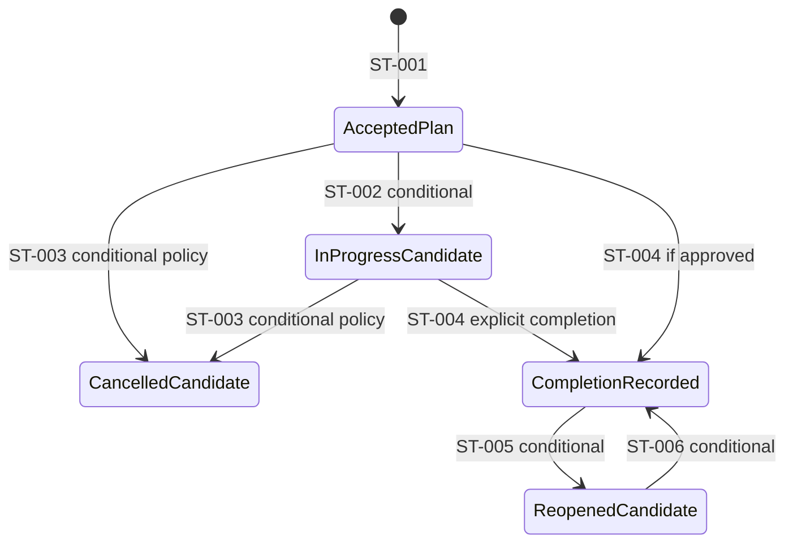
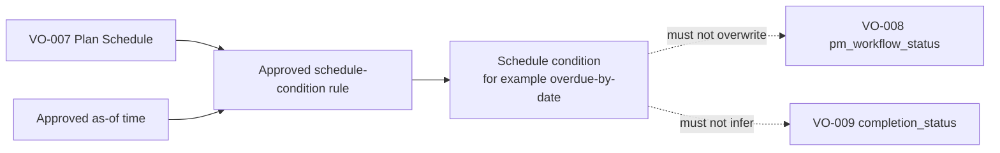
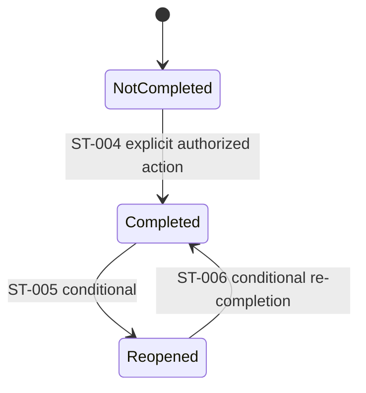
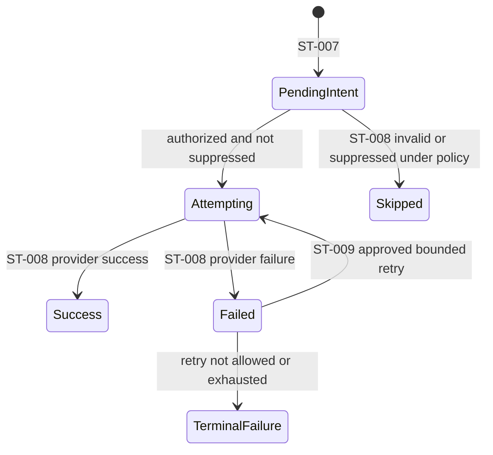
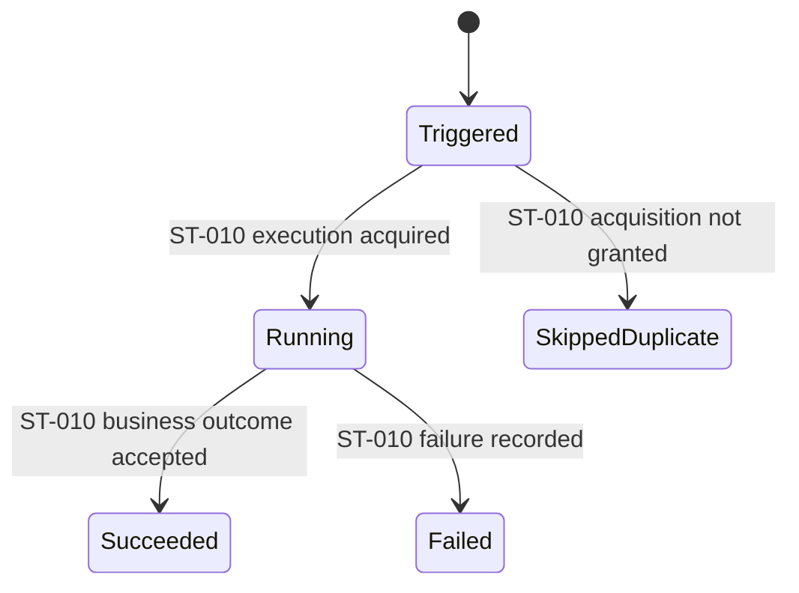
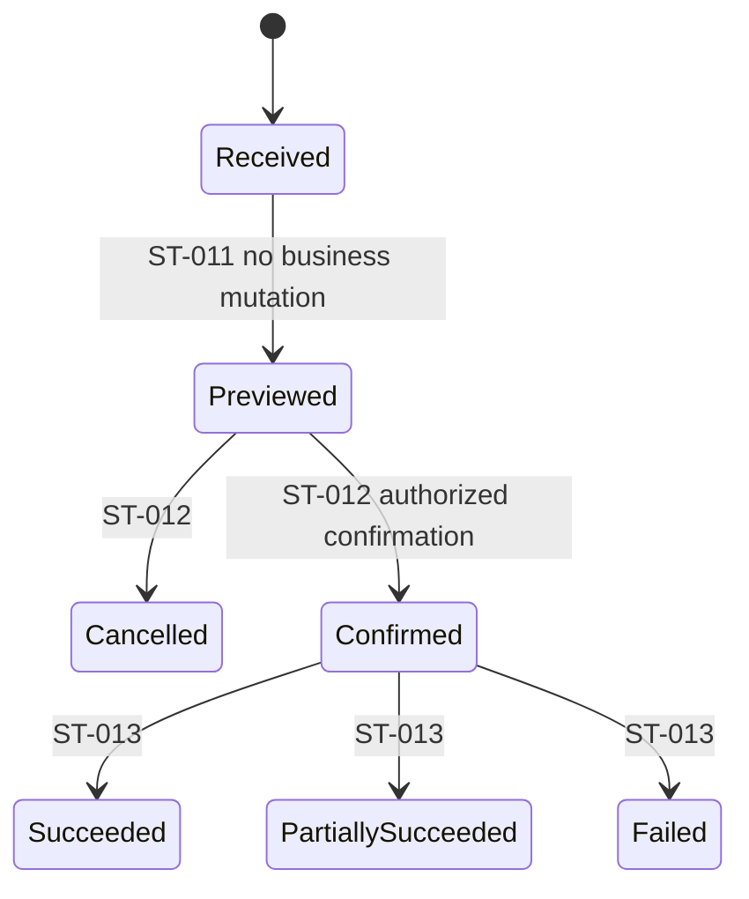
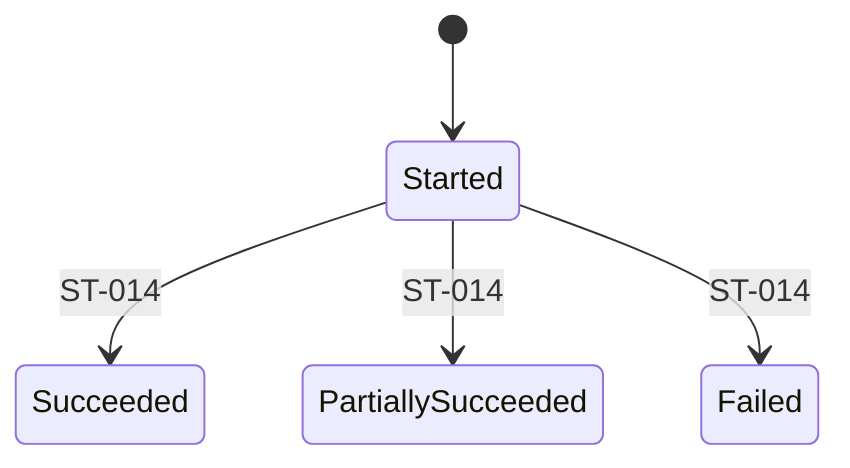
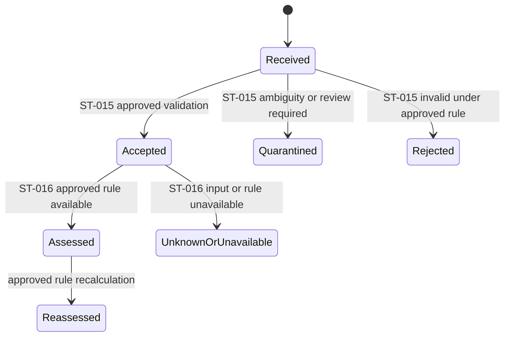

# FleetOS State and Lifecycle Model

## Purpose

This document defines conceptual state transitions and lifecycle direction. It separates repository evidence, fixed domain constraints, and decision-dependent target transitions.

An identifier in this catalog makes a transition traceable; it does not make an unresolved edge approved. Rows marked **Conditional** must not be implemented as settled policy until the cited `DEC` decision is approved.

## Cross-lifecycle rules

- `pm_mileage_status`, `pm_workflow_status`, `completion_status`, and `notification_status` are independent.
- A schedule condition such as overdue-by-date is separate from workflow state.
- Completion is explicit and cannot be inferred from date, mileage, sheet label, workflow, dashboard, or notification outcome.
- Accepted transitions preserve old/new values, reason, actor/process, event/effective time, recorded time, correlation, and applicable versions.
- Invalid, ambiguous, conflicting, duplicate, stale, unauthorized, and unavailable inputs remain explicit outcomes.
- Corrections and reopen actions preserve prior evidence.

## Transition catalog

| ID | Lifecycle | Conceptual transition | State | Decision or rule |
| --- | --- | --- | --- | --- |
| `ST-001` | PM plan | No authoritative plan → accepted initial plan | Required direction | Valid identity/reference handling, dates, location, authorization, state, and audit are required. Initial vocabulary depends on `DEC-006`. |
| `ST-002` | PM workflow | Planned candidate → in-progress candidate | Conditional | Exact names, entry conditions, and authorization require `DEC-006`. |
| `ST-003` | PM plan | Active candidate → cancelled candidate | Required capability, conditional policy | PM Assistant owns cancellation; source states, reason, reversibility, and downstream effect require `DEC-006` and `DEC-007`. |
| `ST-004` | Completion | Not completed → completed | Required direction | Explicit authorized PM Assistant action and required evidence; vocabulary details require `DEC-007`. |
| `ST-005` | Completion | Completed → reopened | Conditional | Reason, authorization, downstream effect, and time policy require `DEC-007`. |
| `ST-006` | Completion | Reopened → completed again | Conditional | Re-completion appends evidence and preserves previous completion; policy requires `DEC-007`. |
| `ST-007` | Notification | No intent → pending intent | Required direction | Separate `ENT-011` intent; idempotency and recipient rules require `DEC-011`. |
| `ST-008` | Notification attempt | Attempt started → success, failed, or skipped | Required direction | Provider result is safely classified; exact terminal/retry classes require `DEC-011`. |
| `ST-009` | Notification retry | Retryable failed attempt → next bounded attempt | Conditional | Retry count, delay, expiry, suppression, and provider classification require `DEC-011`. |
| `ST-010` | Scheduler execution | Triggered → running, safely skipped, succeeded, or failed | Required direction | Single-execution, misfire, overlap, and recovery details require `DEC-012`. |
| `ST-011` | Import batch | Received → previewed | Required | Parsing, validation, normalization, classification, and counts occur without business mutation. |
| `ST-012` | Import batch | Previewed → confirmed or cancelled | Required | Confirmation requires approved authorization; cancellation preserves batch/row evidence. |
| `ST-013` | Import batch | Confirmed → succeeded, partially succeeded, or failed | Required direction | Atomicity, resume, and replay behavior require `DEC-013`; partial success cannot be labeled full success. |
| `ST-014` | Synchronization | Started → succeeded, partially succeeded, or failed | Required direction | Outcome includes safe counts, versions, freshness, and correlation; thresholds require `DEC-013`. |
| `ST-015` | Mileage reading | Received → accepted, quarantined, or rejected | Conditional | Producer, identity, time, duplicate, reset, sequence, and freshness rules require `DEC-009`. |
| `ST-016` | Mileage assessment | Accepted reading → calculated status or unknown/unavailable | Conditional | Calculation and thresholds require `DEC-010`; reading remains intact. |

## PM plan and workflow lifecycle

### Current implementation evidence

- PM Assistant stores `Planned`, `In Progress`, `Completed`, `Cancelled`, and `Overdue` in one generic plan status field.
- Some routes derive `Overdue` from deadline date.
- Completion sets plan status and actual date and can update related task/weekly-control state.
- Pause, resume, follow-up, snooze, and weekly-control statuses exist separately in current models/routes.

These behaviors do not establish the target transition graph or prove that pause/follow-up/weekly-control states belong in `pm_workflow_status`.

### Transitional model

- PM Assistant remains authoritative for plan state.
- Legacy `Overdue` is treated as evidence requiring mapping review, not automatically as workflow progression.
- Candidate upstream plans enter through `AGG-007`, not direct overwrite.
- Existing state values are preserved with provenance during reconciliation.

### FleetOS v1.0 target direction

The labels `AcceptedPlan`, `InProgressCandidate`, `CancelledCandidate`, and `ReopenedCandidate` are diagram concepts, not approved serialized enum values. `DEC-006` and `DEC-007` must approve the exact vocabulary and edges.

Schedule condition is derived independently:

### Future outside v1.0

- General AutoPM write commands.
- Distributed workflow orchestration.
- Cross-module event-driven command processing.

## Completion lifecycle

Rules:

- `ST-004` creates `ENT-007` evidence and related history/audit.
- A duplicate or concurrent completion request must produce one consistent business outcome under `DEC-015`.
- Backdating, required evidence, linked task/weekly effects, correction, reopen, and deletion require `DEC-007`.
- Correction must append or compensate; it must not conceal the original completion.

## Notification lifecycle

### Current implementation evidence

PM Assistant creates LINE sends and `NotificationLog` records with success, failed, or skipped results. A distinct persistent intent, attempt number, approved duplicate key, and bounded retry policy are not established.

### Target direction

`Skipped`, `Success`, and `Failed` are attempt outcomes. Intent-level terminal vocabulary, retry eligibility, recipient authorization, expiry, and duplicate suppression require `DEC-011`.

Every attempt remains linked to its original intent. A notification outcome changes neither completion nor PM workflow.

## Scheduler lifecycle

The lifecycle requires visible start, result, duration, correlation, and duplicate-prevention outcome. Exact job identity, execution owner, timezone, locking, overlap, misfire, retry, concurrency, and restart recovery require `DEC-012`.

## Import and synchronization lifecycle

### Import batch

Every received row receives an `ENT-016` outcome even when the batch is cancelled, interrupted, or rejected before mutation. `DEC-013` determines atomicity, checksum, replay identity, resume, retention, and acceptance thresholds.

### Synchronization

Synchronization preserves source, counts, mapping/rule/contract versions, correlation, start/end time, last-success/freshness direction, and reconciliation exceptions. AutoPM cache is excluded as a source.

## Mileage lifecycle

`Reassessed` creates new calculation evidence; it does not alter `ENT-009`. Thresholds currently found in AutoPM are implementation evidence only.

## Cancellation, deletion, correction, and reopening direction

| Action | Direction fixed by current contracts | Unresolved policy |
| --- | --- | --- |
| Cancel plan/import | Preserve the record, reason, actor/process, time, and downstream evidence; do not represent cancelled work as completed. | Allowed source states, reversal, authorization, and downstream effects (`DEC-006`, `DEC-007`, `DEC-013`). |
| Delete plan/location/history/audit | Historical and referential evidence must not be silently detached or concealed. | Soft-delete/tombstone/retention/privacy behavior and authority (`DEC-003`, `DEC-007`, `DEC-014`). |
| Correct data or mapping | Preserve original and superseded evidence, reason, reviewer/actor, and version. | Approval levels, effective-time behavior, and consumer projection (`DEC-001`–`DEC-004`, `DEC-014`). |
| Reopen completion | Preserve the original completion and append reopen evidence. | Eligibility, evidence, authorization, linked state, and subsequent completion (`DEC-007`). |

## Lifecycle acceptance direction

Before implementation, each lifecycle must have:

1. Approved state vocabulary and terminal states.
2. Approved transition graph and authorization per edge.
3. Explicit invalid, duplicate, concurrent, and dependency-failure behavior.
4. Effective/event/recorded time and timezone rules.
5. Audit and history requirements.
6. Idempotency and concurrency behavior where commands exist.
7. Retention, correction, deletion, and rollback behavior.
8. Unit, service, contract, failure, and user-acceptance tests appropriate to the lifecycle.

