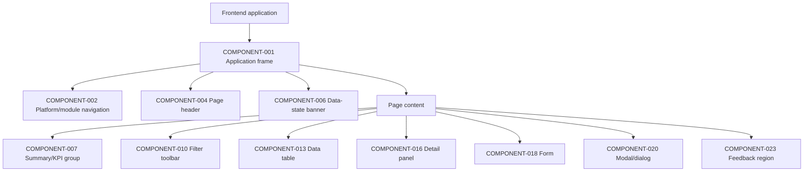

# FleetOS Component and Design-System Direction

## Purpose and status

This document defines framework-neutral frontend component responsibilities and semantic design-token direction for FleetOS, AutoPM, and PM Assistant.

It does not select a component framework, CSS methodology, package, icon library, font provider, final brand palette, or migration strategy.

## Component principles

1. Components express presentation and interaction, not authoritative maintenance rules.
2. Shared visual patterns do not merge application modules or domain ownership.
3. Components receive explicit status-domain fields rather than a generic overloaded `status`.
4. Data-bearing components surface source, freshness, unknown, stale, and unavailable state.
5. Interactive components are operable by keyboard, touch, and assistive technology.
6. Thai and mixed Thai/English text must reflow without clipping.
7. Components expose safe extension points for unknown fields and future enum values.
8. Commands and navigation remain semantically and visually distinct.
9. Component composition remains compatible with the current frontend technologies unless a later migration is approved.

## Component hierarchy

The hierarchy is conceptual. It does not require a single shared component package or runtime.

## Component catalog

| ID | Component | Responsibility |
|---|---|---|
| `COMPONENT-001` | Application frame | Module identity, navigation regions, main landmark, global state, and responsive structure. |
| `COMPONENT-002` | Platform/module navigation | Proposed FleetOS module selection and handoff; remains usable independently of page data. |
| `COMPONENT-003` | Module navigation | Primary and secondary navigation inside AutoPM or PM Assistant. |
| `COMPONENT-004` | Page header | Heading, concise purpose, module context, source/freshness summary, and owned actions. |
| `COMPONENT-005` | Breadcrumbs | Hierarchical context with safe resource labels and responsive collapse. |
| `COMPONENT-006` | Data-state banner | Current, stale, fallback, offline, unavailable, or recovery state with source and time context. |
| `COMPONENT-007` | Summary/KPI group | Approved aggregate presentation with population, filters, calculation version, and freshness where supplied. |
| `COMPONENT-008` | Metric card | One metric, label, value, unit/context, trend only if approved, and non-color status cue. |
| `COMPONENT-009` | Status presentation | Explicit status-domain label, value, icon/text cue, unknown handling, and optional explanation. |
| `COMPONENT-010` | Filter toolbar | Search, allowlisted filters, sort, applied-state summary, apply/reset, and responsive arrangement. |
| `COMPONENT-011` | Search field | Labeled search input with submit/clear behavior and query ownership. |
| `COMPONENT-012` | Filter control | Select, date, toggle, or other approved filter with label, current value, and validation. |
| `COMPONENT-013` | Data table | Accessible headers, rows, sorting direction, loading/empty/error state, and responsive overflow/alternative. |
| `COMPONENT-014` | Pagination control | Cursor/page navigation, position context, disabled state, and focus retention. |
| `COMPONENT-015` | Calendar/schedule view | Date-based visualization with accessible list/table alternative and timezone context. |
| `COMPONENT-016` | Detail panel | Vehicle, plan, location, batch, or event details without hiding identity/source state. |
| `COMPONENT-017` | History timeline | Ordered safe events with event time, recorded time where relevant, actor/process reference, and correction context. |
| `COMPONENT-018` | Form | Labeled fields, instructions, validation, dirty/submitting/result states, and safe input preservation. |
| `COMPONENT-019` | File import workflow | File selection, preview, classification counts, confirmation, progress, and batch/row outcomes. |
| `COMPONENT-020` | Modal/dialog | Focus-contained short task, confirmation, or detail view with explicit title and close behavior. |
| `COMPONENT-021` | Confirmation dialog | Consequence, affected resource, irreversible/retention direction, confirm/cancel, and pending state. |
| `COMPONENT-022` | Command action group | PM Assistant-owned mutation actions with clear hierarchy and authorization/result state. |
| `COMPONENT-023` | Feedback region | Persistent inline result/error plus optional supplemental toast or live announcement. |
| `COMPONENT-024` | Empty/error/recovery panel | Condition-specific explanation and safe next action without conflating empty and failure. |
| `COMPONENT-025` | Help and disclosure | Contextual guidance, definitions, source/freshness explanation, and accessible expand/collapse. |

## Design-token direction

Tokens describe semantic roles rather than final visual values.

### Color tokens

- surface: application, navigation, card, elevated, overlay;
- text: primary, secondary, muted, inverse, link;
- border: default, strong, focus, selected;
- action: primary, secondary, destructive, disabled;
- state: informational, positive, caution, critical, neutral, unknown;
- data: current, stale, fallback, offline, unavailable;
- chart series: approved distinguishable set with non-color labels/patterns.

No token value or current application color is approved as FleetOS branding by this document.

### Typography tokens

- family roles for Thai/Latin body, headings, and code/identifier display;
- body, label, caption, heading, metric, and dense-table sizes;
- readable line height suitable for Thai combining marks;
- weights that remain legible at normal and high zoom;
- letter spacing that does not harm Thai readability.

Remote font loading, licensed fonts, and final brand typography remain `DEC-011`.

### Spacing and sizing tokens

- spacing scale;
- page and content gutters;
- component padding;
- control height;
- touch target minimum direction;
- table density modes only when accessibility remains acceptable;
- sidebar/header width direction;
- modal and panel maximum sizes.

### Shape, elevation, and motion tokens

- border radius;
- border strength;
- elevation levels;
- overlay backdrop;
- duration and easing roles;
- reduced-motion alternatives;
- focus-ring thickness and offset.

## Status pattern

`COMPONENT-009` must:

- show the exact domain name in labels, headings, help text, or adjacent context when ambiguity is possible;
- use text plus icon/shape, not color alone;
- tolerate unknown values with a neutral “Unknown” presentation;
- retain the raw safe value for diagnostics only where approved;
- never map one status domain onto another;
- keep schedule condition separate;
- expose a definition through `COMPONENT-025` where users may confuse meanings.

## Table patterns

`COMPONENT-013` supports:

- a caption or accessible name;
- semantic column headers;
- row headers where useful;
- keyboard-operable sorting controls;
- visible sort direction;
- explicit selected rows and bulk-action scope;
- bounded pagination;
- loading rows or region state without replacing existing content during refresh;
- valid empty state;
- horizontal overflow only when necessary;
- sticky headers only when they remain accessible and do not obscure focused content;
- a stacked record/card or priority-column alternative on narrow screens when a wide table is unusable.

Tables must not:

- render unavailable data as an empty body;
- rely on title/hover for essential content;
- place several unlabeled icon buttons in one action cell;
- silently hide critical columns at smaller widths;
- load unbounded authoritative collections into the browser.

## Filter patterns

`COMPONENT-010`:

- distinguishes draft controls from applied filters;
- exposes applied count and values;
- provides reset behavior;
- preserves URL-owned state according to `DEC-005`;
- validates unsupported or invalid combinations;
- retains source/freshness context after filtering;
- does not recalculate authoritative metrics from partial client data unless the API contract defines that population;
- supports keyboard traversal in visual order.

Auto-apply versus explicit Apply remains a page-specific decision. Expensive or server-owned filters should normally use explicit submission.

## Form patterns

`COMPONENT-018` is primarily a PM Assistant pattern in v1.

Forms:

- use persistent labels;
- identify required fields without color alone;
- provide instructions before errors where possible;
- validate on the client for usability and again at the authoritative boundary;
- show a validation summary and field associations;
- preserve safe user input after recoverable errors;
- prevent blind duplicate submission;
- show submitting, succeeded, failed, conflict, and stale-edit state;
- distinguish save, cancel, reset, and destructive actions;
- warn about unsaved changes under an approved rule;
- never echo secrets into errors or store privileged values in browser persistence.

Client validation is not authorization and does not replace domain validation.

## Modal and confirmation patterns

`COMPONENT-020` and `COMPONENT-021`:

- have a programmatic name and description;
- move focus to an appropriate element when opened;
- contain keyboard focus while modal;
- close through an explicit control;
- support Escape unless the operation cannot safely be dismissed;
- restore focus to the invoking control;
- prevent background interaction;
- keep primary and destructive actions clearly labeled;
- avoid using a modal for long, multi-section work when a page is more appropriate.

Browser-native `prompt` and `confirm` are current evidence only, not the target design requirement.

## Notification and feedback patterns

`COMPONENT-023` distinguishes:

- field validation;
- page/region error;
- command result;
- background refresh result;
- stale/fallback warning;
- informational toast;
- notification-domain delivery status.

A toast:

- is supplemental;
- is not the only place for critical error or command outcome;
- remains visible long enough under an approved timing rule;
- can be announced without repeatedly interrupting assistive-technology users;
- contains no secret or unrestricted sensitive content.

Frontend feedback must not claim that a LINE or other provider delivery succeeded unless PM Assistant publishes an authoritative `notification_status`.

## Loading, empty, and error component patterns

`COMPONENT-024` renders condition-specific content:

- loading: what region is loading and whether prior data remains;
- empty: valid query/population with no results;
- not found: missing singular resource;
- ambiguous/conflicting identity: review required;
- stale: data available with age/reason;
- offline: connection state and whether cached data is shown;
- unavailable: authoritative data cannot be supplied;
- unauthorized: access is not permitted;
- error: unexpected safe failure and recovery action.

Skeletons must not resemble real values so closely that users mistake them for data.

## Calendar patterns

`COMPONENT-015`:

- identifies month/week/range and timezone;
- supplies previous, next, and today/range controls;
- supports keyboard operation;
- provides a list/table alternative;
- does not use color alone for event type or status;
- handles multiple events per day without inaccessible hover overflow;
- distinguishes planned dates, deadlines, actual dates, and schedule conditions;
- shows stale/unavailable state for the calendar population.

## Component ownership and sharing

Visual specifications may be shared conceptually, but physical sharing is optional.

- AutoPM may implement compatible patterns in its existing static frontend.
- PM Assistant may implement compatible patterns in its existing served frontend.
- A future shared package requires separate dependency, versioning, security, deployment, and rollback approval.
- One module must not be blocked from rollback because a shared visual package forces incompatible behavior.

## Component acceptance direction

Before a component is production-ready:

1. its application and page ownership are known;
2. its data and command boundary is explicit;
3. applicable `UISTATE-*`, `UX-*`, and `A11Y-*` requirements pass;
4. unknown, empty, stale, offline, unavailable, and error cases are tested;
5. Thai and mixed-language layout is reviewed;
6. responsive behavior is reviewed at approved viewports;
7. no authoritative rule is duplicated;
8. no secret or sensitive payload is exposed;
9. feature-switch and rollback behavior is understood;
10. any shared-package decision receives separate approval.
