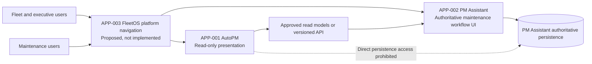

# FleetOS Frontend Blueprint v1.0

## 1. Purpose

This document defines how FleetOS frontend experiences should be structured for AutoPM, PM Assistant, and proposed FleetOS platform navigation.

It translates the existing architecture, product, domain, database, API, and application contracts into a frontend design that is implementation-oriented but framework-neutral. It does not authorize frontend source changes.

## 2. Scope

### In scope

- Current AutoPM and PM Assistant frontend implementation evidence.
- Transitional frontend direction.
- FleetOS v1.0 target frontend responsibilities.
- Proposed platform navigation and module handoff.
- Page, feature, component, state, responsive, accessibility, performance, observability, testing, rollout, and rollback direction.
- Read-only integration from AutoPM through approved read models or a versioned API.
- PM Assistant operational UI direction for authoritative maintenance workflows.

### Out of scope

- Implementing or restructuring HTML, CSS, JavaScript, Python, API, or database code.
- Selecting React, Vue, Angular, Svelte, another framework, a state library, or a design-system product.
- Merging AutoPM and PM Assistant into one application or deployment.
- Claiming that a FleetOS platform shell or `/api/v1` is implemented.
- AutoPM maintenance write commands.
- Approving permissions, authentication, KPI definitions, mileage thresholds, notification recipients, branding, production performance targets, or infrastructure.

## 3. Frontend application catalog

| ID | Frontend application | State | Responsibility |
|---|---|---|---|
| `APP-001` | AutoPM | Current application with transitional and v1 target direction | Read-only fleet dashboard, reporting, calendar, vehicle drill-down, filtering, source/freshness, and bounded fallback presentation. |
| `APP-002` | PM Assistant | Current application with transitional and v1 target direction | Authoritative maintenance planning, operational workflow, completion, history, imports, scheduling, notifications, location management, settings, and safe operational visibility. |
| `APP-003` | FleetOS platform navigation surface | Proposed; not implemented | Conceptual platform/module entry, common navigation conventions, context, breadcrumbs, and cross-module handoff without merging bounded modules. |

`APP-003` is a logical frontend responsibility. It does not require a new codebase, a shared runtime, or a particular hosting topology. Its final name, landing behavior, and physical implementation are unresolved by `DEC-001`, `DEC-002`, and `DEC-003`.

## 4. Frontend application context

The diagram is conceptual. Current users may continue to open AutoPM and PM Assistant directly during transition.

## 5. Current AutoPM frontend evidence

Repository evidence shows:

- a static HTML/CSS/JavaScript application;
- dashboard, group summary, vehicle tracking, PM calendar, and synchronization views;
- fleet-health, mileage-oriented KPI, urgent/critical lists, detail modal, filters, pagination, sorting, copy, and export;
- Google Sheets CSV and Apps Script JSON reads;
- browser `localStorage` cache and local `data.csv` fallback;
- browser-side parsing, mapping, filtering, summaries, and mileage-oriented status calculation;
- source, timestamps, record counts, API/feed version, and cache-state presentation;
- desktop and responsive CSS breakpoints.

These screens and calculations are current evidence only. Browser-derived mileage thresholds, labels, fleet-health formulas, and KPI populations are not approved authoritative rules.

## 6. Current PM Assistant frontend evidence

Repository evidence shows:

- a FastAPI-served HTML/CSS/JavaScript application;
- My Today, dashboard, PM manager, weekly control, calendar, next-day follow-up, location management, assistant/help, settings, and diagnostics pages;
- plan create, update, delete, bulk delete, import, export, completion, pause, resume, and follow-up;
- location create, update, delete, import, and export;
- vehicle lookup, reports, scheduler settings, LINE integration, notification/import logs, system health, logs, and diagnostics;
- direct calls to current unversioned `/api/...` routes;
- responsive tables, grids, forms, modals, confirmation prompts, and toast feedback.

These screens prove current implementation behavior only. Current generic statuses, local IDs, visible administrator labels, settings fields, diagnostic endpoints, and notification details are not automatically approved target contracts or permissions.

## 7. Transitional frontend direction

The transition preserves application availability while introducing explicit seams:

1. Keep AutoPM legacy feeds and last-known-good cache labeled and reversible.
2. Introduce a transport client and frontend data adapter without changing authoritative ownership.
3. Consume shadow PM Assistant read projections when their contracts and security decisions are approved.
4. Compare legacy and target results without using shadow results to mutate maintenance state.
5. Keep PM Assistant current workflows operational while purpose-built read models are added.
6. Preserve current routes as legacy/internal evidence; do not treat path prefixing as a v1 contract.
7. Add source, freshness, stale, fallback, unknown, ambiguity, and unavailable presentation consistently.
8. Place target consumption behind an approved feature switch.
9. Retain independent AutoPM and PM Assistant rollback.

## 8. FleetOS v1.0 target frontend architecture

### AutoPM target responsibilities

AutoPM:

- renders approved authoritative maintenance projections read-only;
- owns layout, visualization, presentation labels, local filtering, navigation, and interaction state;
- displays source, `as_of`, generated time, freshness, stale reason, and fallback state;
- tolerates approved nullable fields and unknown future enum values;
- provides read-only vehicle, plan, calendar, history, notification-summary, import-summary, synchronization, and audit visibility only where approved;
- keeps a bounded last-known-good cache under an approved policy;
- never writes cache, fallback, or display state back to PM Assistant.

AutoPM does not:

- create, update, cancel, complete, import, schedule, retry, or notify;
- infer completion or notification success;
- duplicate authoritative workflow or approved mileage rules;
- resolve ambiguous identities automatically;
- gain database access or privileged service credentials.

### PM Assistant target responsibilities

PM Assistant:

- remains the authoritative workflow user experience;
- accepts approved maintenance commands through owned application boundaries;
- validates identity, state, dates, location, authorization, and concurrency before mutation;
- records required history and audit evidence;
- owns controlled import preview, confirmation, outcome, and exception presentation;
- owns scheduler, notification, operational settings, and safe diagnostic presentation;
- publishes purpose-built read projections with freshness and safe errors;
- remains operational for core workflows when AutoPM is unavailable.

### FleetOS platform navigation target responsibilities

The proposed platform navigation surface:

- identifies FleetOS as the parent platform;
- exposes AutoPM and PM Assistant as distinct modules;
- preserves module-specific navigation and authority;
- provides a consistent method for module switching, context, breadcrumbs, and help;
- does not hide authorization requirements behind client-only navigation;
- remains optional to module runtime availability and rollback.

## 9. Status presentation contract

Frontend components must use the exact domain name when status meaning matters:

| Status | Frontend meaning | Owner |
|---|---|---|
| `pm_mileage_status` | Condition derived from accepted mileage input and an approved versioned rule. | PM Assistant after mileage decisions pass. |
| `pm_workflow_status` | Progress through the maintenance planning workflow. | PM Assistant. |
| `completion_status` | Explicit completion, correction, or reopen state. | PM Assistant. |
| `notification_status` | Notification intent and delivery outcome. | PM Assistant. |

A generic badge labeled only “Status” is insufficient where more than one domain may appear. Schedule conditions such as overdue-by-date remain separate from workflow status.

## 10. Identity presentation contract

- Display the original approved `vehicle_no` value and identify it as transitional where cross-system matching is relevant.
- Never present `vehicle_no` as a permanent enterprise identity.
- Never fabricate `fleetos_vehicle_id`; it remains null, omitted, or explicitly unavailable according to the approved API contract.
- Keep registration and vehicle code in distinct labeled namespaces.
- Show ambiguous, conflicting, missing, and rejected identity outcomes explicitly.
- Preserve Thai and Unicode source values.
- Do not use row order, latest timestamp, registration, or vehicle code as an implicit replacement identity.

## 11. Read-only API integration

The target AutoPM client follows the proposed `/api/v1` read-only boundary described by the API Blueprint. Core frontend candidates include vehicle lookup/list, PM plan list/detail, PM history, locations, dashboard summary, and synchronization visibility. Mileage, notification, import, and audit visibility retain their API decision gates.

Transport success alone is not application success. The client distinguishes:

- valid zero summary;
- valid empty collection;
- missing singular resource;
- ambiguous or conflicting identity;
- stale result;
- unavailable authoritative input;
- authentication or authorization failure;
- transient service failure;
- unexpected internal failure.

Current unversioned PM Assistant routes remain current implementation evidence and are not aliases of the proposed v1 contract.

## 12. Performance direction

Frontend performance must be measurable and budgeted after `DEC-016` is approved. Direction includes:

- prioritize shell, navigation, page heading, state/freshness, and primary task content;
- avoid loading all page modules, history, diagnostics, or large lists at startup;
- use bounded server pagination for target lists;
- virtualize or progressively render only when data size and accessibility behavior justify it;
- debounce search only under an approved interaction rule and never hide submitted query state;
- minimize duplicate requests through explicit server-state caching and request deduplication;
- preserve responsive images and icons without introducing unreviewed external dependencies;
- measure route/page load, data latency, render cost, long tasks, and user-visible errors without collecting prohibited content.

No numerical performance target is approved here.

## 13. Lazy-loading direction

Potential lazy-loaded boundaries include:

- non-default module pages;
- vehicle or plan detail panels;
- history and audit timelines;
- calendars outside the initial visible period;
- large import outcome details;
- notification and operational diagnostics;
- help and training content.

Lazy loading must provide an accessible loading state, deterministic error recovery, and a non-hover activation path. It must not delay critical error, stale, or authorization information.

## 14. Error-boundary direction

Each application requires failure isolation at:

- application frame;
- route/page;
- major data region;
- detail panel or modal;
- deferred/lazy-loaded feature.

An error boundary:

- shows a safe user-oriented message and recovery action;
- preserves unaffected navigation and context where safe;
- includes a correlation reference only when supplied by the approved boundary;
- does not display stack traces, raw payloads, SQL, paths, hosts, tokens, notification targets, or provider responses;
- never converts an exception into an empty table or successful zero.

The exact implementation depends on the approved framework or current technology and is not selected here.

## 15. Observability direction

Frontend operational evidence should cover:

- application/module version;
- selected data mode without secret configuration;
- request result class and duration;
- approved endpoint/resource identifier;
- cache hit, stale use, fallback use, and cache age;
- unknown enum and contract-validation failures;
- identity ambiguity/conflict presentation;
- page-level errors and recovery outcomes;
- feature-switch state;
- shadow comparison disposition.

Observability must avoid query text, free-form notes, raw identifiers where unnecessary, credentials, tokens, notification recipients, raw imported rows, and unrestricted audit content. Product analytics, session replay, and external telemetry providers require separate approval.

## 16. Testing direction

Later implementation testing should include:

- component rendering and keyboard behavior;
- adapter contract and unknown-value handling;
- route, URL, filter, pagination, and deep-link behavior;
- form validation and safe error association in PM Assistant;
- loading, empty, error, stale, offline, ambiguity, unauthorized, and unavailable cases;
- responsive layout and zoom/reflow;
- Thai/Unicode/date/time/number cases;
- AutoPM read-only enforcement;
- prevention of authoritative rule duplication;
- accessibility checks plus human assistive-technology review;
- feature-switch, shadow, fallback, and rollback rehearsal.

Repository evidence does not currently demonstrate an established frontend automated test suite or CI workflow.

## 17. Future capabilities outside v1.0

- General maintenance commands from AutoPM.
- A merged AutoPM and PM Assistant application.
- An operational enterprise `fleetos_vehicle_id` registry.
- Stable FleetOS identities for locations, organizations, people, teams, or responsibilities.
- Native mobile applications.
- Offline maintenance mutation and later synchronization.
- Multi-tenant platform navigation.
- User-customizable dashboards or cross-module page composition.
- New notification providers or user-defined routing.
- Event-driven or real-time frontend updates beyond an approved read contract.
- Full enterprise analytics beyond approved v1 read models.

## 18. Architecture and implementation impact

This Blueprint changes documentation only.

A later approved implementation may add clearer transport, adapter, cache, route, component, and error seams inside the existing frontend technologies. It does not require a framework migration or repository restructure. A material change to module ownership, cross-module writes, authentication topology, or deployment boundaries requires architecture and possibly ADR review.

## 19. Risks and rollback

Primary risks are:

- proposed architecture being described as implemented;
- current visual or business behavior becoming an accidental v1 contract;
- status conflation;
- identity fabrication;
- duplicated business rules;
- stale data presented as current;
- settings or diagnostics exposing sensitive content;
- platform navigation coupling module availability;
- inaccessible component patterns;
- premature framework or design-tool selection.

Mitigations are the fixed guardrails, identifier catalogs, explicit state model, decision register, and validation gates.

Documentation rollback is an isolated Product Owner revert of the eight files in `docs/frontend/`. A later implementation rollback must disable the affected frontend path, retain PM Assistant authority, keep compatible provider behavior where safe, preserve audit and shadow evidence, label fallback staleness, and never reverse-synchronize AutoPM cache.

## 20. Definition of Frontend Blueprint complete

The Frontend Blueprint is complete when:

1. all eight documents exist and link correctly;
2. current, transitional, v1 target, and future states remain distinct;
3. `APP-*`, `PAGE-*`, `FEAT-*`, `COMPONENT-*`, `UISTATE-*`, `UX-*`, `A11Y-*`, `VAL-*`, and `DEC-*` registries are unique and cross-referenced;
4. AutoPM read-only behavior and PM Assistant authority are preserved;
5. page, navigation, component, state, responsive, accessibility, performance, observability, testing, rollout, and rollback direction are covered;
6. diagrams remain conceptual and do not claim implementation;
7. unresolved Product Owner decisions remain explicit;
8. Markdown, links, Mermaid, terminology, Thai/Unicode, and secret-safety validation passes;
9. exact changed files and validation limitations are reported;
10. no source, database, environment, deployment, Git, or external-service change occurs.

Blueprint completion is documentation completion only. It is not implementation, acceptance, production readiness, deployment, or release.
