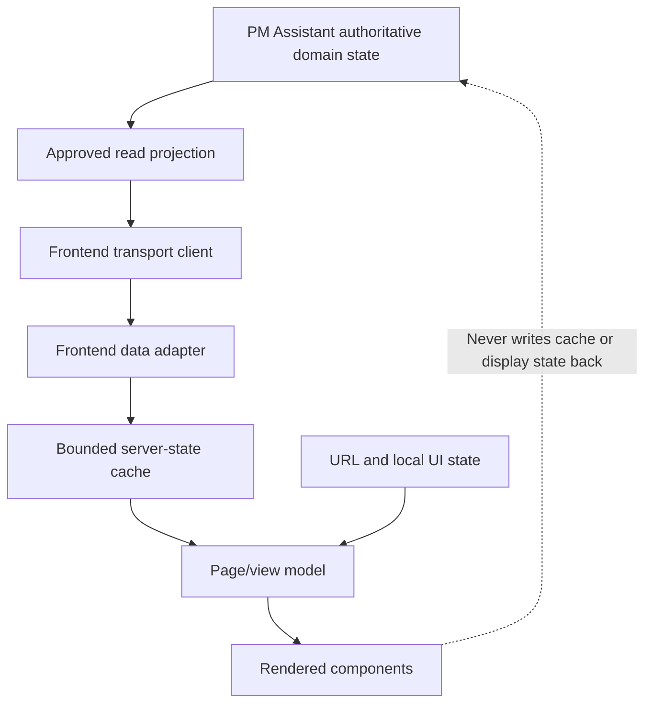
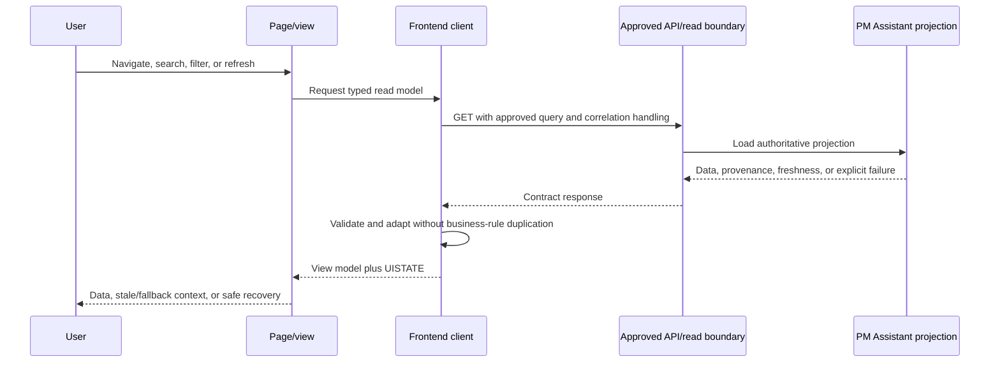
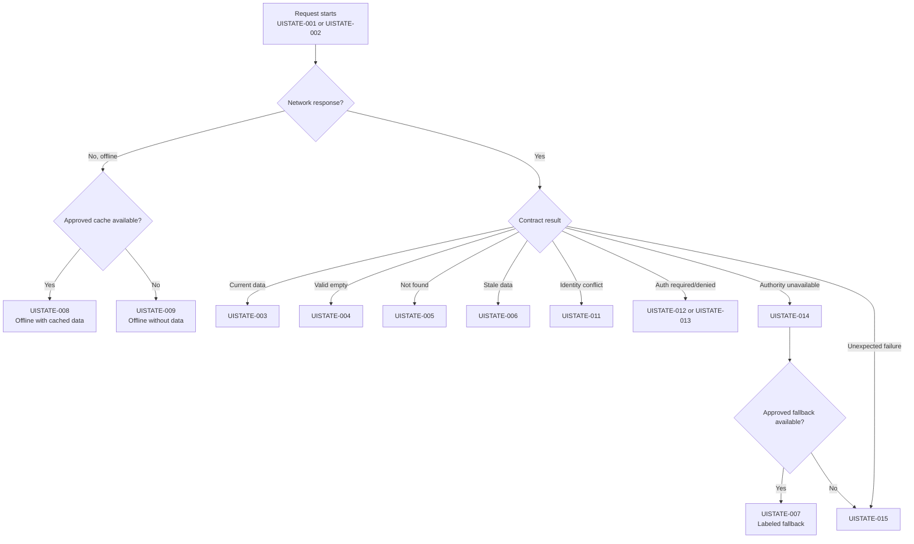

# FleetOS Frontend State and Data Flow

## Purpose

This document defines frontend state ownership, read-only API integration, adapter responsibilities, cache and freshness, form state, URL state, and recovery behavior.

It prevents browser presentation state from being confused with PM Assistant authoritative state.

## State ownership model

PM Assistant command flows originate only from approved PM Assistant forms/actions. AutoPM has no maintenance command path in v1.

## Frontend state catalog

| ID | State | Owner | Required presentation/behavior |
|---|---|---|---|
| `UISTATE-001` | Initial loading | Requesting page/region | Identify the loading region; do not display fabricated zeroes. |
| `UISTATE-002` | Refreshing with existing data | Server-state controller | Retain usable prior data, indicate refresh, and avoid disruptive full-page replacement. |
| `UISTATE-003` | Current success | Server-state controller | Display approved data with source and freshness metadata. |
| `UISTATE-004` | Valid empty | Page/view model | Explain that the valid authoritative query returned no items; offer relevant next action. |
| `UISTATE-005` | Singular not found | Page/view model | State that the requested resource is absent or not visible; do not substitute another match. |
| `UISTATE-006` | Stale authoritative result | Freshness controller | Display data with age, stale reason, source, and recovery/refresh direction. |
| `UISTATE-007` | Labeled fallback | AutoPM fallback controller | Display last-known-good or transitional source explicitly; never reverse-synchronize it. |
| `UISTATE-008` | Offline with cached data | Browser/server-state controller | Show connection state, cache age, and read-only limitations. |
| `UISTATE-009` | Offline without data | Browser/server-state controller | Show unavailable content and safe retry direction; not an empty result. |
| `UISTATE-010` | Validation error | Form/filter owner | Show summary and field/query-specific errors while preserving safe input. |
| `UISTATE-011` | Ambiguous or conflicting identity | Identity-aware page | Show candidates/classification only as authorized and require reviewed resolution. |
| `UISTATE-012` | Authentication required | Approved security boundary | Proposed until implemented; distinguish from authorization failure. |
| `UISTATE-013` | Authorization denied | Approved security boundary | State insufficient access safely; hiding navigation is not enforcement. |
| `UISTATE-014` | Authoritative data unavailable | Read boundary/page | Explain that required authority cannot supply data; never show successful zero/empty. |
| `UISTATE-015` | Unexpected safe error | Error boundary | Show safe message, recovery action, and approved correlation reference. |
| `UISTATE-016` | Submitting or mutating | PM Assistant form/action | Prevent accidental duplicate submission and reconcile with authoritative result. |

## State classes

### Authoritative server state

Owned by PM Assistant:

- PM plans;
- `pm_workflow_status`;
- `completion_status`;
- approved `pm_mileage_status`;
- PM history;
- `notification_status`;
- controlled import and synchronization outcomes;
- location maintenance data during the approved transition;
- scheduler and notification operational state.

Frontend display, cache, elapsed time, or provider result cannot overwrite this state.

### Read-projection state

Owned and published by PM Assistant through purpose-built models:

- approved resource fields;
- source/provenance;
- `as_of`;
- generated time;
- freshness and stale reason;
- calculation/contract/rule version where applicable;
- pagination;
- safe error semantics.

Read projections are not persistence models.

### Server state in the frontend

The frontend owns only the lifecycle of a received representation:

- request key;
- loading/refreshing/result/error;
- received response;
- validator such as `ETag` when approved;
- cache storage time;
- expiration/stale evaluation;
- retry count and next allowed action;
- last-known-good selection.

### UI state

Local UI state includes:

- open navigation drawer;
- active disclosure;
- selected row or detail panel;
- modal/dialog state;
- local density or layout choice if approved;
- hover and focus state;
- temporary toast visibility.

UI state must not be logged as domain audit or treated as saved maintenance state.

### Filter and search state

Filter state includes:

- draft values;
- applied values;
- validated query representation;
- sort;
- pagination relationship;
- applied-filter summary.

Applying a filter resets or preserves pagination according to the endpoint contract. Client filtering of a partial server page must not be presented as a complete authoritative population.

### Form state

PM Assistant form state includes:

- initial authoritative values/version;
- draft values;
- dirty fields;
- client validation;
- submitting;
- server validation errors;
- conflict/stale-edit result;
- success and returned authoritative resource.

Unsaved form state is not audit evidence. AutoPM has no maintenance mutation form state in v1.

### URL and navigation state

URL-owned state is defined in the navigation document. It should be serializable, shareable where authorized, and free of secret or unrestricted sensitive content.

## API-to-adapter-to-view flow

The flow is conceptual and does not claim that `/api/v1` is operational.

## Frontend transport client

The transport client:

- uses only approved base references and versioned paths;
- issues safe read methods for AutoPM;
- applies bounded deadlines and approved transient retry;
- sends/receives correlation metadata according to the API contract;
- classifies HTTP and network results;
- does not parse human-readable error messages for program logic;
- does not store privileged service credentials in frontend code or browser storage;
- does not silently retry PM Assistant mutation requests.

Browser-to-API versus trusted-proxy topology remains `DEC-014`.

## Frontend data adapter

The adapter:

- validates required envelope and field types;
- preserves original approved Unicode display values;
- maps nullable and optional fields;
- carries source, freshness, versions, and pagination into the view model;
- maps known error codes to `UISTATE-*`;
- presents unknown enum values neutrally;
- formats display values only after preserving contract meaning;
- can produce component-ready records without exposing raw API/persistence shapes throughout the UI.

The adapter must not:

- compute authoritative workflow, completion, notification, or approved mileage state;
- infer completion from date, mileage, current status, or notification;
- merge identities;
- substitute registration or vehicle code for `vehicle_no`;
- invent `fleetos_vehicle_id`;
- convert unavailable input into zero;
- expose raw history JSON, notification targets, imported rows, provider responses, or internal topology.

## Cache and freshness state

Every cached read considered for display carries enough information to evaluate:

- resource/query identity;
- API/contract version;
- authorization context where applicable;
- source;
- authoritative `as_of`;
- generated time;
- browser storage time;
- stale decision and reason;
- validator;
- fallback mode.

Cache lifetime, size, storage mechanism, privacy, encryption, invalidation, and stale-if-error rules remain `DEC-009` and `DEC-010`.

Rules:

- Cache is presentation-only.
- A cache hit does not mean current data.
- Newer browser storage time does not outrank older authoritative `as_of`.
- Authorization-sensitive responses must not enter shared caches.
- Logout/revocation must clear or isolate protected cached data under the approved security design.
- Cache is never an import, reconciliation, or reverse-synchronization source.

## Loading, error, stale, and recovery flow

Retry is bounded and condition-specific. Validation, authentication, authorization, not-found, and identity-conflict failures are not automatically retried.

## Mutation flow in PM Assistant

For an approved PM Assistant command:

1. Load the authoritative resource and concurrency reference.
2. Initialize `COMPONENT-018`.
3. Validate draft input for usability.
4. Submit once through the authoritative boundary.
5. Keep `UISTATE-016` visible.
6. Reconcile the response:
   - success: replace draft/server state with the returned authoritative result;
   - validation: use `UISTATE-010`;
   - conflict/stale edit: reload and require reviewed reconciliation;
   - unauthorized: use `UISTATE-013`;
   - safe failure: use `UISTATE-015`.
7. Refresh affected read projections according to approved invalidation behavior.

Optimistic authoritative mutation is not approved by this Blueprint.

## Search, filter, pagination, and URL interaction

- Query changes use allowlisted public field names.
- Invalid combinations fail explicitly.
- Cursor state is bound to the relevant endpoint, filters, sort, and snapshot semantics.
- Changing filters invalidates an incompatible cursor.
- Local presentation sorting is allowed only when it does not misrepresent server pagination or KPI population.
- Back/forward navigation restores applied state.
- Copy/export uses the currently authorized displayed projection and identifies source/freshness where required.

## Date, time, and number state

- API values remain unambiguous ISO/RFC representations according to the API contract.
- Display formatting is a view responsibility controlled by `DEC-013`.
- The adapter retains original value/timezone context needed for audit or troubleshooting.
- Browser locale defaults must not silently change domain meaning.
- Gregorian and Buddhist Era labels must not be mixed without explicit indication.
- Numeric placeholders are not identities or zero values.

## Unknown and forward-compatible state

When an approved API adds an unknown optional field or enum:

- do not fail the whole page unless the unknown value prevents safe interpretation;
- preserve a neutral “Unknown” display;
- avoid mapping it to the closest known status;
- record safe contract telemetry where approved;
- keep raw values out of unrestricted user-facing errors;
- follow compatibility and rollout policy before implementation changes.

## State observability

Safe frontend evidence may include:

- page/resource design ID;
- request result class;
- `UISTATE-*`;
- duration bucket or value under approved telemetry;
- cache/fallback/stale classification;
- contract/API version;
- unknown enum classification;
- feature-switch mode;
- safe correlation ID.

It excludes credentials, raw authorization material, free-form notes, notification targets, imported rows, unrestricted actor data, and raw payloads.

## State acceptance direction

Later implementation must prove:

1. authoritative and presentation state are separate;
2. AutoPM cannot mutate PM Assistant state;
3. all `UISTATE-*` conditions render distinctly;
4. empty is not used for unavailable;
5. stale/fallback carries source and age;
6. adapter behavior is contract-tested;
7. cache is bounded and never reverse-synchronized;
8. forms reconcile with authoritative results;
9. URL state is safe and restorable;
10. rollback can disable target consumption without changing accepted PM Assistant data.
