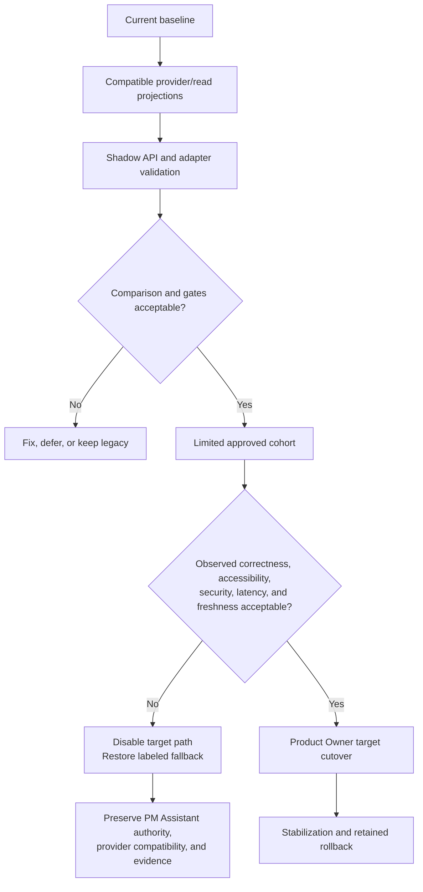

# FleetOS Frontend Validation and Rollout

## Purpose and status

This document defines validation gates, implementation testing direction, feature-switch rollout, shadow comparison, rollback, unresolved Product Owner decisions, and the definition of Frontend Blueprint complete.

For Phase 4.4, only documentation gates can pass. Runtime, accessibility-conformance, performance, security-control, and rollout gates remain future requirements and must not be reported as passed without implementation evidence.

## Validation principles

1. Documentation does not prove runtime behavior.
2. Current screenshots or screens do not prove target accessibility, permissions, security, or performance.
3. A missing authoritative dataset is not a valid empty result.
4. A successful UI toast is not an authoritative notification outcome.
5. AutoPM cache and legacy sources are never rollback write sources.
6. Validation records checks not run, limitations, warnings, and residual risks.
7. Rollout remains reversible and preserves PM Assistant authority.

## Validation gate registry

| ID | Gate | Acceptance direction |
|---|---|---|
| `VAL-001` | Governance and scope | Correct branch; only eight approved files; no source, existing document, database, environment, deployment, Git write, or external-service change. |
| `VAL-002` | Markdown structure | Headings, lists, tables, code fences, and document hierarchy are structurally consistent. |
| `VAL-003` | Link integrity | Every local relative link resolves with correct case. |
| `VAL-004` | Mermaid integrity | Fences are balanced; syntax is conceptually valid; diagrams do not claim implementation. |
| `VAL-005` | Identifier integrity | Every frontend `APP-*`, `PAGE-*`, `FEAT-*`, `COMPONENT-*`, `UISTATE-*`, `UX-*`, `A11Y-*`, `VAL-*`, and `DEC-*` is defined once in its registry and cross-referenced consistently. |
| `VAL-006` | Four-state terminology | Current evidence, transitional direction, v1 target, and future capability remain distinct. |
| `VAL-007` | Architecture and ownership | FleetOS parent identity, module separation, PM Assistant authority, AutoPM read-only behavior, and no shared database are preserved. |
| `VAL-008` | Identity and status | `vehicle_no`, `fleetos_vehicle_id`, and the four status domains follow governing contracts. |
| `VAL-009` | Page and feature coverage | Required dashboard, vehicle, planning, calendar, location, history, notification, import/sync, audit, settings, and common-state content is mapped. |
| `VAL-010` | Component and state coverage | Component hierarchy, design tokens, tables, filters, forms, dialogs, feedback, adapter, server/UI/filter/cache/form/URL state, and recovery are coherent. |
| `VAL-011` | Responsive and UX coverage | Desktop, tablet, mobile, loading, empty, error, stale, offline, and recovery direction is complete. |
| `VAL-012` | Accessibility direction | Keyboard, focus, semantics, labels, contrast, sizing, reflow, non-color cues, motion, calendar alternative, and human validation direction are explicit. |
| `VAL-013` | Thai, Unicode, and formatting | UTF-8, Thai preservation, normalization boundaries, dates, times, timezones, numbers, units, and era ambiguity are covered. |
| `VAL-014` | Security and secret safety | No secret values or unsafe examples; settings, cache, URLs, diagnostics, audit, notifications, and imports follow redaction direction. |
| `VAL-015` | Performance and observability | Performance, lazy loading, error boundaries, safe telemetry, and unresolved budgets/providers are explicit. |
| `VAL-016` | Future implementation testing | Component, adapter, contract, integration, end-to-end, accessibility, responsive, security, performance, shadow, and rollback tests are defined. |
| `VAL-017` | Rollout and rollback | Feature switch, shadow comparison, cohort direction, stop triggers, fallback, evidence retention, and no reverse synchronization are defined. |
| `VAL-018` | Product Owner acceptance | Required decisions are resolved or explicitly deferred, residual risk is accepted, and any implementation scope receives separate approval. |

## Phase 4.4 documentation validation procedure

1. Reconfirm `phase-4-4-frontend-blueprint`.
2. Confirm the baseline and exact changed-file set.
3. Inspect Markdown structure and fence balance.
4. Resolve every local relative link.
5. Review Mermaid labels and syntax.
6. Extract frontend identifiers, check registry definitions, duplicates, and references.
7. Search for unsupported claims such as “implemented,” “deployed,” “production-ready,” or operational authentication where the context is proposed.
8. Search for generic status conflation, direct database access, AutoPM writes, fabricated identity, or duplicated business rules.
9. Review all 60 requested frontend content areas against the document map.
10. Review Thai/Unicode and date/time/number language.
11. Scan for credential/token/private-key/secret-like content and unsafe local/environment examples.
12. Run `git diff --check`, inspect `git diff --stat`, and list exact changed files.

No new validator dependency should be installed for this documentation phase without separate approval.

## Future implementation test strategy

### Static and component tests

- valid HTML/DOM semantics under the selected implementation;
- CSS/layout checks where supported;
- component states for every applicable `UISTATE-*`;
- keyboard and focus behavior;
- status-domain and source/freshness rendering;
- Thai strings and mixed-language layout;
- unknown enum and null handling.

### Adapter and contract tests

- approved envelope and error parsing;
- required/optional/nullable fields;
- source, freshness, pagination, correlation, and versions;
- four independent statuses;
- ambiguous/missing/conflicting identity;
- empty versus unavailable;
- safe unknown-field compatibility;
- bounded retry;
- no authoritative calculation duplication.

### Integration tests

- AutoPM read client to approved provider boundary;
- PM Assistant forms/actions to owned application services;
- cache and invalidation behavior;
- URL/filter/pagination interaction;
- import preview/confirm/outcome;
- notification, scheduler, history, and audit safe projections;
- feature-switch state and fallback.

### End-to-end and user validation

- FleetOS/module navigation where implemented;
- fleet dashboard to vehicle detail;
- PM planning and history;
- My Today completion/pause/follow-up;
- calendar and weekly control;
- location management;
- import preview and partial result;
- stale/offline/unavailable recovery;
- keyboard-only critical tasks;
- responsive and Thai-language review.

### Security tests

- no privileged credentials in static assets or browser storage;
- authentication/authorization failures once implemented;
- URL/query/cache disclosure;
- error and diagnostic redaction;
- restricted audit/notification/import visibility;
- cross-user cache isolation;
- feature-switch authorization;
- safe logout/revocation behavior.

### Performance and operational tests

- approved page/render/request budgets;
- large lists and pagination;
- calendar range loading;
- lazy-loaded region failure;
- long task and memory behavior;
- telemetry redaction;
- error-boundary recovery;
- provider slowdown and timeout;
- cache/fallback age and stabilization observation.

## Shadow comparison direction

Shadow comparison evaluates legacy AutoPM presentation inputs against approved target read models without granting the shadow path authority.

Compare:

| Area | Comparison direction |
|---|---|
| Identity | Exact, normalized, missing, ambiguous, conflicting, duplicate, and changed `vehicle_no`; aliases remain namespaced. |
| Vehicles | Counts, approved attributes, missing references, and provenance. |
| Plans | Counts, dates, location snapshots, workflow, completion, and update times. |
| Mileage | Inputs, source freshness, rule version, status counts, and unknown/unavailable cases only after mileage approval. |
| Dashboard | Population, exclusions, filters, calculation versions, totals, and zero/unavailable distinction. |
| Calendar | Date field meaning, timezone, range, item counts, and missing data. |
| History | Ordering, corrections, safe actor/process representation, and redaction. |
| Notifications | Aggregate intent/attempt/status counts without recipient or content exposure. |
| Import/sync | Batch/run counts, accepted/rejected/ambiguous outcomes, replay disposition, last success, and stale state. |
| Operations | Latency, timeout, error class, cache/fallback use, unknown values, and page recovery. |

Differences require disposition: expected legacy difference, data-quality exception, contract defect, adapter defect, rule-definition gap, or unresolved decision. A visual match alone is insufficient.

## Feature-switch model

The target frontend read path should be selected through an approved configuration mechanism with modes conceptually equivalent to:

- legacy only;
- shadow compare;
- target for approved cohort;
- target primary with labeled fallback;
- target disabled during rollback.

Rules:

- feature state is environment-specific and auditable where required;
- browser users cannot elevate themselves into a cohort or privileged feature;
- secrets are not feature-switch values;
- AutoPM read-path switching does not change PM Assistant authority;
- PM Assistant command features require separate authorization and cannot be enabled merely by exposing navigation;
- provider-compatible behavior exists before target consumption;
- UI identifies fallback or degraded mode safely.

The exact switch mechanism and owner remain `DEC-018`.

## Rollout and rollback flow

The flow is future direction, not evidence of an existing feature switch or cohort.

## Rollout stages

### Stage 0 — Decision and design baseline

- Resolve or explicitly defer blocking `DEC-*` entries.
- Approve pages, contracts, security topology, accessibility target, and rollback owner.
- Establish safe test data and environments.

### Stage 1 — Provider-compatible read models

- Implement approved PM Assistant projections without changing AutoPM.
- Validate contract, security, freshness, errors, observability, and performance.
- Keep existing PM Assistant workflows operational.

### Stage 2 — Frontend adapter seam

- Implement transport and adapter behind an inactive switch.
- Add `UISTATE-*` rendering and safe unknown handling.
- Confirm no authoritative rule duplication.

### Stage 3 — Shadow comparison

- Request legacy and target inputs under approved controls.
- Do not show shadow values as authoritative.
- Record safe differences and dispositions.

### Stage 4 — Limited cohort

- Enable approved users/environment only.
- Observe correctness, usability, accessibility, latency, errors, cache age, and support burden.
- Maintain labeled fallback.

### Stage 5 — Product Owner cutover

- Confirm acceptance thresholds and support readiness.
- Enable target primary behavior.
- Retain rollback during the approved stabilization window.

### Stage 6 — Stabilization and transitional retirement

- Continue monitoring and reconciliation.
- Retire a legacy path only after explicit Product Owner approval.
- Preserve evidence and do not erase historical identity/source context.

## Stop and rollback triggers

Rollback or stop/go review is required when:

- AutoPM can issue or appears to issue an unauthorized maintenance command;
- status domains are conflated or completion/notification success is inaccurate;
- identity ambiguity is silently resolved;
- unavailable authority is shown as zero/empty/current;
- stale or fallback data lacks clear labeling;
- secrets, targets, raw payloads, sensitive notes, paths, or topology appear in UI, URL, cache, logs, or telemetry;
- authentication, authorization, CORS, proxy, or cache isolation violates the approved design;
- Thai text, dates, or numbers change meaning;
- keyboard, focus, reflow, contrast, or mobile behavior blocks a critical task;
- pagination/filtering omits or duplicates material records;
- error, latency, or support burden exceeds approved thresholds;
- PM Assistant core workflows depend on AutoPM availability;
- rollback cannot preserve PM Assistant authority, accepted state, history, audit, or provider compatibility.

## Rollback direction

### AutoPM consumer rollback

1. Disable target consumption through the approved switch.
2. Restore the labeled last-known-good legacy/read path where safe.
3. Keep source, cache age, and stale/fallback state visible.
4. Preserve comparison evidence and error classifications.
5. Never write fallback or browser cache into PM Assistant.

### PM Assistant frontend rollback

- Roll back only the affected UI/application version under compatible provider and data rules.
- Preserve accepted workflow changes, history, audit, imports, scheduler evidence, and notification attempts.
- Do not conceal a completed command by reverting only its UI.
- Stop unsafe command exposure while maintaining safe read/provider compatibility where possible.

### Platform navigation rollback

- Disable or revert `APP-003` independently.
- Keep direct AutoPM and PM Assistant entry available according to the approved operating model.
- Do not make platform navigation a single point of failure for PM Assistant core work.

### Security rollback

- Do not restore revoked credentials.
- Prefer a fixed forward version when reverting would reopen a vulnerability.
- Clear or isolate protected browser cache as required.

### Documentation rollback

The Product Owner may revert only the eight files under `docs/frontend/`. No source code, data, environment, deployment, or external service is affected by Phase 4.4.

## Unresolved Product Owner decision register

| ID | Decision | Impact |
|---|---|---|
| `DEC-001` | Final name and product scope of `APP-003`: platform navigation surface, platform shell direction, or another approved term. | Platform communication and implementation scope. |
| `DEC-002` | Physical cross-module handoff: direct URLs, same-window navigation, new window, proxy/router, or another mechanism. | Navigation, security, deployment, and rollback. |
| `DEC-003` | FleetOS default landing page, module availability behavior, and direct-entry support. | `PAGE-001`, breadcrumbs, failure isolation. |
| `DEC-004` | Canonical route, breadcrumb depth, page titles, and opaque resource URL conventions. | Deep links and navigation compatibility. |
| `DEC-005` | Which filters, sorts, pagination, date ranges, and tabs belong in URL state versus local state. | Shareability, privacy, back/forward behavior. |
| `DEC-006` | Final page grouping, labels, default module pages, and current-screen retention/rename policy. | Information architecture and user migration. |
| `DEC-007` | Approved frontend fields and expansion behavior for vehicles, plans, locations, history, notifications, imports, synchronization, and audit. | Page/component safety and API consumption. |
| `DEC-008` | KPI definitions, populations, exclusions, grouping semantics, historical behavior, and calculation versions. | Dashboards and shadow comparison. |
| `DEC-009` | Cache storage mechanism, size, privacy, authorization isolation, invalidation, and retention. | Security, offline behavior, rollback. |
| `DEC-010` | Freshness thresholds, stale reasons, maximum fallback age, retry bounds, timeouts, and stale-if-error behavior. | `UISTATE-006` through `UISTATE-009`. |
| `DEC-011` | FleetOS branding, semantic token values, typography, fonts, iconography, density, and motion language. | Design-system implementation. |
| `DEC-012` | Accessibility standard/level, browser matrix, assistive technologies, viewport matrix, touch target, contrast, and exception policy. | `A11Y-*` acceptance and release. |
| `DEC-013` | Thai locale, Gregorian/Buddhist Era presentation, timezone labels, relative time, number grouping, precision, and units. | Formatting and identity-safe display. |
| `DEC-014` | Authentication/proxy topology, human/service identities, session behavior, CORS, scopes, and browser credential handling. | Protected navigation and API access. |
| `DEC-015` | Mobile scope and priority for dashboards, planning, import, settings, audit, notifications, and restricted diagnostics. | Responsive implementation and release scope. |
| `DEC-016` | Page-load, interaction, API latency, render, bundle/asset, memory, and large-data performance budgets. | Performance testing and lazy loading. |
| `DEC-017` | Frontend telemetry/analytics provider, data classification, sampling, retention, user notice, and support ownership. | Observability and privacy. |
| `DEC-018` | Feature-switch mechanism, owner, cohort selection, audit, and emergency disable behavior. | Rollout and rollback. |
| `DEC-019` | Shadow comparison thresholds, review owner, accepted difference classes, and stabilization period. | Target cutover evidence. |
| `DEC-020` | Access, redaction, retention, and correction rules for settings, diagnostics, notification, import, history, and audit views. | Security-gated pages and release. |

## Definition of Frontend Blueprint complete

The Phase 4.4 Frontend Blueprint is complete when:

1. the eight approved documents exist and no existing file is modified;
2. all requested frontend content areas are covered;
3. frontend identifiers are unique, defined, and cross-referenced;
4. Markdown, links, Mermaid, terminology, Thai/Unicode, and secret-safety checks pass;
5. FleetOS, AutoPM, PM Assistant, authority, identity, and status terminology matches governing documents;
6. accessibility, responsive, performance, observability, testing, feature-switch, shadow, and rollback direction is explicit;
7. unresolved decisions remain unresolved rather than being invented;
8. exact changed files, validation results, limitations, risks, and remaining work are reported;
9. no commit, push, deployment, migration, or external action occurs.

Completion does not mean the frontend is implemented, accessible-conformant, production-ready, deployed, or released.
