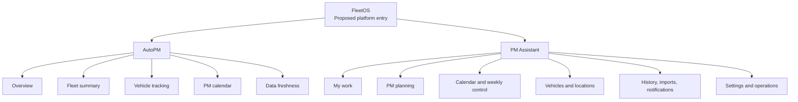

# FleetOS Information Architecture and Navigation

## Purpose and status

This document defines conceptual information architecture, module navigation, primary and secondary navigation, breadcrumbs, URLs, and responsive navigation for `APP-001`, `APP-002`, and proposed `APP-003`.

It does not claim that a FleetOS shared shell, authentication system, or cross-module router exists.

## Navigation principles

1. FleetOS is the parent platform; AutoPM and PM Assistant remain visibly distinct modules.
2. Navigation reflects user tasks and ownership boundaries, not current source folders or API routes.
3. Primary navigation identifies module or top-level module area.
4. Secondary navigation identifies capabilities within the selected module.
5. Breadcrumbs communicate hierarchy and resource context; they do not act as the only navigation.
6. URLs own shareable navigation and filter state where approved.
7. Hiding a link is not authorization.
8. Current page names may remain during transition; target labels require Product Owner and user review.
9. Desktop density must not be reproduced unchanged on narrow screens.
10. Navigation remains usable by keyboard, touch, zoom, and assistive technology.

## Conceptual navigation hierarchy



The hierarchy is a target information model. It does not require all nodes to be separate routes or pages.

## FleetOS platform navigation direction

Proposed `APP-003` provides:

- FleetOS identity and current module context;
- module switcher entries for AutoPM and PM Assistant;
- optional platform landing/module selection;
- common help, data-state, and account/session locations only after their contracts are approved;
- consistent breadcrumb placement and cross-module handoff;
- explicit “opens AutoPM” or “opens PM Assistant” labels when a task crosses a boundary.

It must not:

- make module availability mutually dependent;
- imply one database or one deployment;
- convert AutoPM navigation into PM Assistant commands;
- display invented permissions;
- store privileged credentials in browser state;
- hide source or freshness when moving from AutoPM presentation to PM Assistant authority.

## AutoPM information architecture

### Primary navigation

- Overview
- Fleet analysis
- Vehicle tracking
- PM calendar
- Data status

### Secondary navigation

- Overview: fleet health, approved KPI summaries, urgent/critical attention, freshness.
- Fleet analysis: business/fleet grouping, vehicle type, model, responsibility, approved summary drill-down.
- Vehicle tracking: search, filters, sorting, pagination, vehicle detail.
- PM calendar: date period, grouping, calendar/list presentation, vehicle detail.
- Data status: source, `as_of`, generated time, stale/fallback state, synchronization visibility.

Current AutoPM dashboard, summary, fleet, calendar, and sync views map into this direction without becoming mandatory route names.

## PM Assistant information architecture

### Primary navigation

- My work
- Planning
- Schedule
- Reference data
- Operational visibility
- Settings and help

### Secondary navigation

- My work: My Today, follow-up, priority queue, completion/pause/resume actions.
- Planning: PM-plan list, create/edit, plan detail, history.
- Schedule: calendar, weekly control, next-day view, scheduled report visibility.
- Reference data: vehicle lookup/reference, locations.
- Operational visibility: imports, synchronization, notification status, audit/history, restricted diagnostics.
- Settings and help: approved scheduler/report settings, notification integration configuration, help/training.

Current PM Assistant page names may remain during transition. Target grouping does not authorize route renaming.

## Primary and secondary navigation behavior

### Primary navigation

- Shows one selected item.
- Uses semantic links or buttons according to whether navigation changes URL or opens a control.
- Includes a visible text label; icons are supplemental.
- Indicates module boundary when switching between applications.
- Remains available when a page data region fails.
- Collapses into a modal or drawer pattern at approved narrow widths.

### Secondary navigation

- Appears only within the owning module.
- May be a sidebar subgroup, tab list, local index, or page-level link group.
- Does not mix commands with navigation without clear visual and semantic distinction.
- Maintains a predictable order across pages.
- Supports direct URL entry when the page is routable.

## Breadcrumb direction

Recommended hierarchy:

```text
FleetOS / Module / Section / Resource
```

Examples are conceptual:

```text
FleetOS / AutoPM / Vehicle tracking / vehicle_no display value
FleetOS / PM Assistant / Planning / PM plan reference
```

Rules:

- FleetOS and module ancestors are links only when their destinations exist.
- The current page/resource is text, not a redundant link.
- Resource labels use safe display values, not fabricated canonical identity.
- Long Thai or mixed-language labels wrap or truncate with an accessible full name.
- Breadcrumbs remain supplemental to the page heading.
- On mobile, ancestors may collapse while the module and current page remain perceivable.

Final breadcrumb depth and platform landing behavior are governed by `DEC-003` and `DEC-004`.

## URL and navigation state direction

The target URL may own:

- module and page;
- opaque resource reference;
- pagination cursor or page representation where compatible;
- sort field and direction;
- applied filters;
- calendar period or date range;
- selected safe tab when it represents meaningful content.

The URL must not contain:

- credentials, tokens, secrets, raw notification targets, personal data, or unrestricted notes;
- raw imported row content;
- internal database paths or topology;
- privileged feature configuration;
- fabricated `fleetos_vehicle_id`.

Temporary drawer state, hover state, modal animation, unsaved form values, and toast state remain local UI state.

## Deep links and cross-module handoff

A deep link should:

- restore the intended module and page;
- validate the resource and authorization at the owning boundary;
- show explicit not-found, ambiguity, unauthorized, or unavailable states;
- avoid silently redirecting an ambiguous resource to the first match;
- preserve a safe return context when moving between modules;
- indicate that a read-only AutoPM user is entering the authoritative PM Assistant workflow.

Cross-module handoff may use a normal URL, a platform navigation service, or another approved mechanism. The mechanism is unresolved by `DEC-002`.

## Page headers and local navigation

Every target page should provide:

- one primary heading;
- a concise purpose or current scope;
- source/freshness context where maintenance read data is present;
- primary actions owned by that module;
- local navigation or tabs where the page contains distinct subviews;
- applied-filter summary and reset behavior where filtering is material.

PM Assistant mutation actions must be visually distinct from navigation and read-only export/copy actions.

## Navigation states

Navigation must account for:

- initializing module context;
- loading page data without disabling unrelated navigation;
- unavailable target module;
- unauthorized page or command;
- unknown/deprecated deep link;
- unsaved form changes;
- feature disabled by approved configuration;
- target read route disabled during rollback;
- current module using labeled fallback data.

Feature-disabled and unauthorized are different states. A hidden navigation item must not be the only enforcement.

## Responsive navigation

### Desktop

- Persistent sidebar or header navigation may be used.
- Primary and secondary navigation can coexist when content width remains usable.
- Current module and data-state context remain visible.

### Tablet

- Primary navigation may collapse.
- Secondary groups may become a local menu or horizontally scrollable tab list with keyboard support.
- Page actions wrap without changing action order or meaning.

### Mobile

- Use a dismissible navigation drawer or equivalent.
- Opening moves focus into the drawer; closing restores focus to the trigger.
- Escape closes the drawer when appropriate.
- Background content is not keyboard-accessible while a modal drawer is open.
- Page title, module identity, and critical stale/error state remain visible outside the drawer.
- No navigation depends on hover.

## Current-to-target mapping

| Current evidence | Target IA interpretation |
|---|---|
| AutoPM dashboard navigation group | AutoPM overview and analysis areas. |
| AutoPM sync page | Data status and freshness, not authoritative synchronization ownership. |
| PM Assistant My Today | My work landing candidate. |
| PM Manager | Planning workspace. |
| Weekly Control, Calendar, Next Day | Schedule area with separate task meanings. |
| Locations | Reference-data area owned by PM Assistant during transition. |
| Settings and LINE Debug | Settings and restricted operational visibility, subject to security decisions. |
| Assistant Center | Help, workflow guidance, and training direction. |

## Navigation acceptance direction

Later implementation is acceptable only when:

1. module boundaries remain visible;
2. direct links restore safe context;
3. keyboard and focus behavior pass applicable `A11Y-*` requirements;
4. narrow-screen navigation preserves access to primary tasks;
5. feature switches and rollback do not produce broken or misleading links;
6. unauthorized and unavailable states remain distinct;
7. no URL exposes prohibited sensitive content;
8. AutoPM remains read-only;
9. PM Assistant remains usable without AutoPM;
10. Product Owner decisions affecting landing, routing, labels, and handoff are resolved or explicitly deferred.
