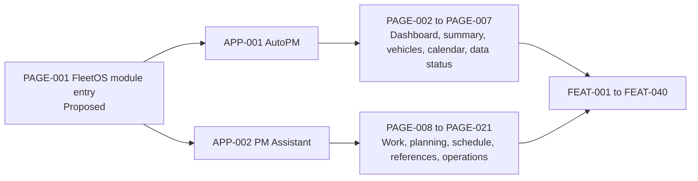

# FleetOS Page and Feature Catalog

## Purpose and interpretation

This catalog assigns stable frontend design identifiers to pages and features. It maps current implementation evidence to transitional and FleetOS v1.0 target direction without authorizing routes, source changes, permissions, or framework structure.

A page is a user-recognizable navigation destination or resource workspace. A feature is a coherent user capability that may appear on more than one page.

## Page and feature map

The ranges summarize catalog relationships and do not imply one implementation bundle.

## Page catalog

| ID | Page | Application | State | Primary responsibility |
|---|---|---|---|---|
| `PAGE-001` | FleetOS module entry | `APP-003` | Proposed, not implemented | Identify FleetOS and open AutoPM or PM Assistant without merging them. |
| `PAGE-002` | Fleet overview dashboard | `APP-001` | Current evidence; target refinement | Read-only approved fleet summaries, attention areas, and freshness. |
| `PAGE-003` | Fleet group summary | `APP-001` | Current evidence; target refinement | Grouped read-only analysis by approved dimensions and KPI definitions. |
| `PAGE-004` | Vehicle tracking and lookup | `APP-001` | Current evidence; target refinement | Search, filter, sort, paginate, and inspect read-only vehicle maintenance projections. |
| `PAGE-005` | Vehicle detail | `APP-001` | Current modal evidence; target page/panel direction | Read-only vehicle reference, plan, status, schedule, and approved history context. |
| `PAGE-006` | AutoPM PM calendar | `APP-001` | Current evidence; target refinement | Read-only date-based maintenance presentation with approved filters and freshness. |
| `PAGE-007` | AutoPM data status | `APP-001` | Current evidence; transitional/v1 direction | Source, `as_of`, generated time, stale/fallback, cache, and safe synchronization visibility. |
| `PAGE-008` | My Today | `APP-002` | Current evidence; target refinement | Prioritized authoritative maintenance task workspace. |
| `PAGE-009` | PM Assistant dashboard | `APP-002` | Current evidence; target refinement | Operational maintenance summaries and navigation to owned work. |
| `PAGE-010` | PM plan management | `APP-002` | Current evidence; target refinement | Search, filter, create, update, cancel/delete direction, import, and export plans. |
| `PAGE-011` | PM plan detail and history | `APP-002` | Partially evidenced; target direction | Authoritative plan fields, distinct statuses, actions, and ordered safe history. |
| `PAGE-012` | Weekly PM Control | `APP-002` | Current evidence; target refinement | Weekly campaign/lot tracking, import, follow-up state, and approved notification action. |
| `PAGE-013` | PM Assistant calendar | `APP-002` | Current evidence; target refinement | Operational calendar and schedule review. |
| `PAGE-014` | Next-day and follow-up | `APP-002` | Current evidence; target refinement | Near-term work, contact/follow-up, and owned task actions. |
| `PAGE-015` | Vehicle reference lookup | `APP-002` | Current data evidence; target direction | Resolve or classify transitional vehicle references without silent merging. |
| `PAGE-016` | Location management | `APP-002` | Current evidence; target refinement | Controlled location create/update/import/export and historical-label-safe management. |
| `PAGE-017` | Import and synchronization | `APP-002` | Current partial evidence; target direction | Preview, confirmation, batch/row outcomes, replay disposition, and sync visibility. |
| `PAGE-018` | Notification and report visibility | `APP-002` | Current evidence; security-gated target | Safe notification status, scheduled report preview/send direction, and failure visibility. |
| `PAGE-019` | Audit and maintenance history visibility | `APP-002` | Current partial evidence; decision-gated target | Restricted, redacted domain history and audit review. |
| `PAGE-020` | Settings and operations | `APP-002` | Current evidence; security-gated target | Approved non-secret configuration, schedules, feature state, and operational controls. |
| `PAGE-021` | Help and workflow guidance | `APP-002` | Current evidence; target refinement | Task guidance, workflow explanation, training, and accessible help. |

Restricted diagnostics remain a sub-capability of `PAGE-020` or a future separately approved page. This catalog does not approve public exposure of current debug endpoints, logs, payload inspectors, or provider details.

## Feature catalog

| ID | Feature | Owning application/page direction |
|---|---|---|
| `FEAT-001` | FleetOS module selection | `APP-003`, `PAGE-001`; proposed. |
| `FEAT-002` | Module switching and safe handoff | `APP-003`; AutoPM/PM Assistant boundary remains explicit. |
| `FEAT-003` | Breadcrumb and page context | All routable pages. |
| `FEAT-004` | Fleet summary KPIs | `PAGE-002`, `PAGE-003`; definitions remain Product Owner-gated. |
| `FEAT-005` | Critical and attention presentation | `PAGE-002`, `PAGE-004`; read-only and non-authoritative in AutoPM. |
| `FEAT-006` | Grouped fleet analysis | `PAGE-003`. |
| `FEAT-007` | Vehicle search | `PAGE-004`, `PAGE-015`. |
| `FEAT-008` | Vehicle filters and sorting | `PAGE-003`, `PAGE-004`, `PAGE-006`. |
| `FEAT-009` | Vehicle read-only detail | `PAGE-005`. |
| `FEAT-010` | PM calendar presentation | `PAGE-006`, `PAGE-013`. |
| `FEAT-011` | Source and freshness display | All pages consuming maintenance reads; emphasized on `PAGE-007`. |
| `FEAT-012` | Bounded last-known-good fallback | `APP-001`, primarily `PAGE-002` through `PAGE-007`. |
| `FEAT-013` | Copy and export current projection | AutoPM analysis pages; source/freshness context retained where required. |
| `FEAT-014` | My Today priority queue | `PAGE-008`. |
| `FEAT-015` | Complete maintenance work | `PAGE-008`, `PAGE-011`; PM Assistant only. |
| `FEAT-016` | Pause, resume, and follow-up | `PAGE-008`, `PAGE-014`; PM Assistant only. |
| `FEAT-017` | PM-plan search and filtering | `PAGE-010`. |
| `FEAT-018` | PM-plan create and edit form | `PAGE-010`, `PAGE-011`; authorization and vocabulary gated. |
| `FEAT-019` | PM-plan cancellation/deletion direction | `PAGE-010`, `PAGE-011`; retention and history behavior unresolved. |
| `FEAT-020` | PM-plan detail | `PAGE-011`. |
| `FEAT-021` | PM history timeline | `PAGE-011`, `PAGE-019`; safe projection only. |
| `FEAT-022` | Weekly campaign/lot control | `PAGE-012`. |
| `FEAT-023` | Weekly-control import | `PAGE-012`, with import rules from `PAGE-017`. |
| `FEAT-024` | Next-day work list | `PAGE-014`. |
| `FEAT-025` | Transitional vehicle matching | `PAGE-015`; `vehicle_no` only under approved normalization. |
| `FEAT-026` | Identity exception presentation | `PAGE-004`, `PAGE-005`, `PAGE-015`, `PAGE-017`. |
| `FEAT-027` | Location list and selection | `PAGE-010`, `PAGE-011`, `PAGE-016`. |
| `FEAT-028` | Location maintenance | `PAGE-016`; PM Assistant only. |
| `FEAT-029` | Import preview and confirmation | `PAGE-017`; parsing precedes authoritative mutation. |
| `FEAT-030` | Import batch and row outcomes | `PAGE-017`; partial, rejected, ambiguous, and replay states explicit. |
| `FEAT-031` | Synchronization-run visibility | `PAGE-007`, `PAGE-017`; safe metadata only. |
| `FEAT-032` | Notification-status summary | `PAGE-018`; recipients and content excluded from general views. |
| `FEAT-033` | Report preview and send direction | `PAGE-018`; PM Assistant only and authorization-gated. |
| `FEAT-034` | Scheduler visibility and control | `PAGE-020`; execution ownership and permissions gated. |
| `FEAT-035` | Audit-event review | `PAGE-019`; restricted, redacted, retention-gated. |
| `FEAT-036` | Non-secret settings management | `PAGE-020`; secret storage remains outside browser assets. |
| `FEAT-037` | Safe health and readiness visibility | `PAGE-020`; coarse state without topology disclosure. |
| `FEAT-038` | Restricted diagnostic direction | `PAGE-020`; access, redaction, retention, and environment gated. |
| `FEAT-039` | Help, handbook, and guided workflow | `PAGE-021`. |
| `FEAT-040` | Feature-switch and rollout state display | Operationally authorized visibility only; defined further in rollout documentation. |

## Common page contract

Every target page defines:

- module/application owner;
- user goal;
- current, transitional, v1 target, or future status;
- read or command boundary;
- API/read-model dependency;
- identity and four-status relevance;
- source and freshness behavior;
- loading, empty, error, stale, offline, ambiguity, unauthorized, and unavailable behavior;
- responsive priority;
- accessibility requirements;
- observability and rollback considerations.

## Dashboard pages

### AutoPM fleet overview

`PAGE-002` presents approved summaries and attention items. It must:

- identify metric population, filters, calculation version, source, and freshness when supplied;
- distinguish zero from unavailable;
- allow drill-down without changing authoritative state;
- avoid treating current browser formulas as approved rules;
- retain non-color status cues.

### PM Assistant dashboard

`PAGE-009` supports operational orientation. It may summarize owned workflow information and link to authoritative workspaces. It must not create a second source of truth separate from PM Assistant application services.

## Vehicle lookup and detail

`PAGE-004`, `PAGE-005`, and `PAGE-015` keep presentation lookup separate from identity reconciliation.

- AutoPM lookup is read-only.
- PM Assistant may expose controlled identity classification and exception workflow when approved.
- Multiple matches are not auto-selected.
- Registration and vehicle code stay separately labeled.
- `fleetos_vehicle_id` is not displayed as implemented.
- Missing master data does not erase an existing authoritative plan.

## PM planning pages

`PAGE-010` and `PAGE-011`:

- keep create/edit/complete/cancel commands in PM Assistant;
- distinguish form state from saved domain state;
- validate date, location, identity, status, authorization, and concurrency at the owning boundary;
- show explicit result and safe errors;
- preserve history and correction evidence;
- keep `pm_workflow_status` and `completion_status` separate.

## Calendar and scheduling views

`PAGE-006`, `PAGE-012`, `PAGE-013`, and `PAGE-014`:

- label whether they are read-only presentation or authoritative workspaces;
- keep scheduled-date conditions separate from workflow status;
- provide calendar and accessible list/table alternatives;
- preserve applied date range and timezone context;
- show stale or unavailable data rather than an empty calendar;
- do not assume scheduler execution from a displayed calendar item.

## Location management views

`PAGE-016`:

- uses PM Assistant as the transitional owning maintenance boundary;
- does not claim the local integer ID or name is a stable FleetOS identity;
- preserves historical plan labels across rename direction;
- shows ambiguous aliases or unresolved mappings;
- protects address, note, and contact fields under approved exposure rules.

## PM history and audit visibility

`PAGE-011` provides user-readable PM history. `PAGE-019` provides restricted audit direction.

They remain separate because audit does not replace plan history, completion evidence, notification attempts, import outcomes, or scheduler execution records. Both exclude secrets and unsafe raw payloads.

## Notification views

`PAGE-018` distinguishes:

- notification intent;
- provider attempt;
- retry or skipped duplicate;
- final `notification_status`;
- scheduled report preview/send behavior.

AutoPM may receive only an approved read-only aggregate. It cannot declare delivery success. General views exclude recipient identifiers, message bodies, tokens, raw webhooks, and provider responses.

## Import and synchronization views

`PAGE-017` covers:

1. select approved source;
2. parse without mutation;
3. validate and normalize;
4. classify accepted, rejected, ambiguous, conflicting, duplicate, and other outcomes;
5. show preview;
6. request authorized confirmation;
7. execute under the approved atomic/partial policy;
8. show batch and row outcomes;
9. retain replay and audit evidence.

AutoPM `PAGE-007` may display safe synchronization metadata but cannot initiate authoritative import unless a later contract explicitly approves it.

## Settings direction

`PAGE-020` may present:

- safe feature state;
- approved schedules and non-secret policy values;
- coarse health/readiness;
- operational stop/go controls where authorized;
- secret presence/validity state without secret value;
- restricted diagnostic links.

It must never render stored credentials back into general page source, logs, URLs, browser storage, or documentation examples. Current implementation fields are evidence only.

## Common page states

Pages reference the `UISTATE-*` registry rather than inventing page-specific generic states. At minimum:

- initial loading;
- refreshing with existing content;
- valid empty;
- success/current;
- stale/fallback;
- offline;
- validation error;
- unavailable authority;
- unauthorized;
- ambiguous identity;
- unexpected error.

## Catalog acceptance direction

The page and feature catalog is implementation-ready only when:

1. every implemented page maps to one `PAGE-*`;
2. every material capability maps to one `FEAT-*`;
3. command features remain in PM Assistant;
4. read-only features retain source and freshness;
5. sensitive pages have approved access and redaction;
6. mobile and accessibility priority is specified;
7. no page relies on a fabricated identity or generic status;
8. feature-switch and rollback behavior is known;
9. unresolved decisions are recorded rather than guessed.
