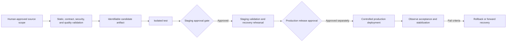

# FleetOS CI/CD and Deployment

## Purpose and status

This document defines proposed delivery, artifact, promotion, deployment, approval, and rollback controls for FleetOS v1.0. It does not create or modify a CI workflow, branch, build, artifact, deployment, hosting service, environment, or release.

Repository evidence does not prove an established FleetOS CI/CD pipeline. Git operations remain human-controlled under the FleetOS Development Guide and Engineering Standard.

## CI/CD and deployment requirement registry

| ID | Requirement |
| --- | --- |
| `ICD-001` | Delivery automation, if approved, enforces rather than bypasses Product Owner scope, review, Git, deployment, migration, credential, and external-service gates. |
| `ICD-002` | AutoPM and PM Assistant build, deployment, promotion, and rollback scopes remain independently identifiable. |
| `ICD-003` | A promoted artifact is immutable or otherwise uniquely identifiable and traceable to reviewed source and validation evidence. |
| `ICD-004` | Environment-specific configuration and secrets are supplied at the approved boundary and are not baked into public artifacts. |
| `ICD-005` | Provider-compatible PM Assistant behavior is available before AutoPM target consumption is enabled. |
| `ICD-006` | Database migrations, if any, have separate approval, compatibility analysis, backup/restore evidence, ownership, and stop/go criteria. |
| `ICD-007` | Deployment reports liveness and readiness separately and supports graceful withdrawal, draining, shutdown, and uncertain-work reconciliation. |
| `ICD-008` | Job deployment prevents simultaneous unsafe old and new execution owners and proves duplicate prevention. |
| `ICD-009` | Release promotion requires applicable contract, security, quality, operational, migration, recovery, rollback, and user-acceptance evidence. |
| `ICD-010` | Rollback selects a known compatible artifact and configuration while preserving accepted authoritative data, identifiers, history, and audit. |
| `ICD-011` | Deployment evidence records safe version, environment, result, duration, approvals, and rollback disposition without secret values. |
| `ICD-012` | No pipeline or deployment capability is described as operational until the approved tooling is implemented and validated. |

## Proposed delivery flow

This flow is target direction and does not imply an automated pipeline.

## Validation stages

| Stage | Evidence direction |
| --- | --- |
| Documentation/static | Markdown, links, diagrams, identifiers, schemas, formatting, syntax, types, and dependency review where applicable |
| Component | Domain, service, API, persistence, import, scheduler, notification, and frontend behavior |
| Contract | Provider and AutoPM consumer compatibility, errors, freshness, unknown values, and version behavior |
| Security | Authentication, authorization, input limits, CORS, redaction, secret handling, misuse, and dependency risk |
| Operational | Startup, readiness, degradation, shutdown, logs, alerts, job safety, backup, restore, recovery, and rollback |
| Acceptance | Critical user workflows, Thai text, accessibility, responsive behavior, stale/unavailable states, and Product Owner criteria |

Checks not run and tooling limitations are reported as limitations, not passes.

## Deployment order

1. Approve infrastructure, security, persistence, job, observability, and recovery decisions.
2. Validate isolated configuration and dependencies.
3. Deploy compatible PM Assistant provider behavior without AutoPM cutover.
4. Validate persistence compatibility and job ownership.
5. Shadow or otherwise compare the AutoPM target consumer.
6. Enable the target path for an approved controlled audience.
7. Observe correctness, freshness, latency, errors, jobs, notifications, and security evidence.
8. Promote only after thresholds pass.
9. Retain the approved fallback through the stabilization window.
10. Retire transitional behavior only through separate approval.

## Rollback integration

- AutoPM can return to a last-known-good compatible read route while displaying source and staleness.
- PM Assistant provider compatibility overlaps consumer rollback.
- Unsafe job acquisition stops before changing execution owners.
- Application rollback does not automatically imply storage rollback.
- Revoked or compromised credentials are never restored.
- Uncertain writes, jobs, imports, or notifications are reconciled before replay.

## Human and automation boundaries

Any future automation must retain explicit human ownership for architecture acceptance, scope approval, protected-environment promotion, production deployment, migration, credential operations, rollback decisions, and incident escalation. This document does not alter the repository rule that Codex must not create branches, commit, push, merge, or deploy.

## Related documents

- [Environment Architecture](ENVIRONMENT_ARCHITECTURE.md)
- [Monitoring and Logging](MONITORING_AND_LOGGING.md)
- [Application Deployment](../application/APPLICATION_DEPLOYMENT.md)
- [Review and Release Checklists](../engineering/REVIEW_RELEASE_CHECKLISTS.md)
- [Disaster Recovery and Rollback](DISASTER_RECOVERY_AND_ROLLBACK.md)

