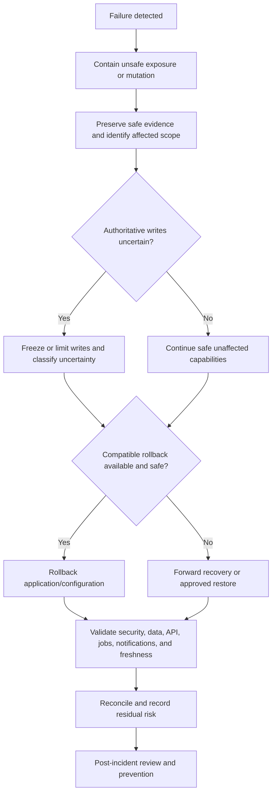

# FleetOS Disaster Recovery and Rollback

## Purpose

This document defines recovery, rollback, forward-recovery, reconciliation, rehearsal, and decision-ownership requirements for FleetOS v1.0. It does not establish numerical recovery objectives, declare an operational disaster-recovery capability, or authorize a restore, deployment, migration, credential action, or production change.

## Disaster recovery and rollback requirement registry

| ID | Requirement |
| --- | --- |
| `IDR-001` | Every production component has an approved owner, failure classification, detection path, stop/go authority, recovery path, and communication route. |
| `IDR-002` | Recovery objectives, including RPO and RTO where applicable, are approved from business impact and validated by rehearsal rather than assumed from provider claims. |
| `IDR-003` | Rollback and forward recovery are selected using data compatibility, security, job, notification, user-impact, and restoration evidence. |
| `IDR-004` | Recovery preserves PM Assistant authority and never promotes AutoPM cache, Google Sheets, CSV, or a presentation source into authoritative workflow storage. |
| `IDR-005` | Accepted identifiers, maintenance outcomes, history, audit, import evidence, job evidence, and notification evidence are preserved or reconciled explicitly. |
| `IDR-006` | Backups are trusted only after isolated restore and application-level validation. |
| `IDR-007` | Uncertain requests, imports, jobs, notifications, and migrations are classified and reconciled before replay. |
| `IDR-008` | Security recovery revokes or rotates affected credentials and never restores compromised or revoked material through rollback. |
| `IDR-009` | Recovery procedures distinguish application, configuration, storage, network, provider, security, data-quality, and regional or platform failure. |
| `IDR-010` | Recovery evidence includes timeline, decisions, versions, safe correlations, data reconciliation, residual risk, and post-recovery validation. |
| `IDR-011` | Recovery and rollback are rehearsed in an isolated approved environment at an approved frequency and after material architecture changes. |
| `IDR-012` | Disaster recovery is not described as operational until owners, runbooks, access, backups, restores, monitoring, communications, and rehearsals are validated. |

## Failure classification

| Failure class | Example impact | Primary recovery direction |
| --- | --- | --- |
| Application | Unsafe release, crash, incompatible behavior | Compatible rollback or corrected release |
| Configuration | Invalid endpoint, origin, feature, schedule, or routing | Restore approved configuration without restoring revoked secrets |
| Persistence | Corruption, unavailable storage, failed migration | Stop unsafe writes; restore or forward recover; reconcile |
| Job execution | Duplicate owner, missed or uncertain occurrence | Stop acquisition; classify occurrences; reconcile before replay |
| Notification provider | Timeout, outage, ambiguous result | Preserve intent and attempts; retry only under approved policy |
| Network/security | Exposure, unauthorized access, certificate or trust failure | Contain, restrict, revoke, investigate, recover forward safely |
| Data quality | Identity, status, import, freshness, or mapping corruption | Quarantine, restore mapping/rule version, compensate, reconcile |
| Platform/location | Environment-wide or provider-wide outage | Use approved alternate path only after consistency and access checks |

## Recovery decision flow

## Component rollback direction

### AutoPM

- Select the last-known-good compatible read route or artifact.
- Display source and staleness when using an approved fallback.
- Never write presentation cache or legacy feed data into PM Assistant.

### PM Assistant application and API

- Maintain compatible provider behavior during consumer rollback.
- Roll back only when persistence and accepted data remain compatible.
- Preserve accepted workflow changes, identifiers, history, and audit.

### Jobs and notifications

- Stop unsafe acquisition before changing execution ownership.
- Preserve occurrence, intent, attempt, and provider-result evidence.
- Reconcile uncertain outcomes before retry to avoid duplicate business effects.

### Persistence and migration

- Stop unsafe writes when required.
- Choose restore, forward migration, compensating correction, or controlled replay through the approved owner.
- Validate schema, counts, relationships, identities, status domains, Unicode, dates, history, and audit.
- Do not assume destructive down-migration is safer than forward recovery.

### Security and credentials

- Contain exposure and revoke or rotate affected material.
- Use a known safe application/configuration state only if it does not reopen the weakness.
- Preserve safe forensic evidence without copying secret values into reports.

## Recovery rehearsal

A rehearsal should validate:

1. detection and escalation;
2. access to approved runbooks and recovery tooling;
3. owner and decision availability;
4. backup selection and integrity;
5. isolated restoration;
6. application and contract compatibility;
7. job and notification uncertainty handling;
8. data and audit reconciliation;
9. user and operator communication;
10. measured recovery point and duration against approved objectives;
11. return to normal monitoring and access;
12. lessons, actions, and runbook updates.

## Stop/go and completion criteria

Recovery is complete only when:

- unsafe exposure or mutation is contained;
- essential service state is verified;
- authoritative data and audit reconcile within approved thresholds;
- jobs, imports, and notifications have explicit dispositions;
- security controls and credentials are safe;
- AutoPM displays correct source and freshness;
- monitoring confirms stable operation through the approved observation window;
- residual risk and remaining work are accepted by the authorized owner.

## Related documents

- [Infrastructure Blueprint](INFRASTRUCTURE_BLUEPRINT.md)
- [Storage and Backup](STORAGE_AND_BACKUP.md)
- [CI/CD and Deployment](CI_CD_AND_DEPLOYMENT.md)
- [Monitoring and Logging](MONITORING_AND_LOGGING.md)
- [Scaling and High Availability](SCALING_AND_HIGH_AVAILABILITY.md)

