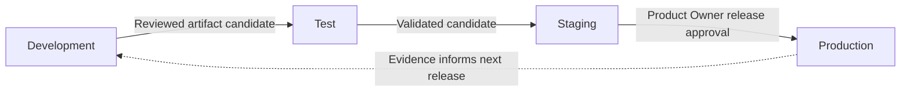

# FleetOS Environment Architecture

## Purpose

This document defines proposed environment separation, configuration boundaries, promotion rules, and environment lifecycle requirements for FleetOS v1.0. It does not create an environment or select a hosting provider.

## Environment requirement registry

| ID | Requirement |
| --- | --- |
| `IENV-001` | Development, test, staging, and production have explicit identities and do not silently share data, credentials, recipients, callbacks, or operational destinations. |
| `IENV-002` | Environment-specific configuration is supplied through an approved boundary and is not embedded in browser assets or authoritative business rules. |
| `IENV-003` | Secret values are stored outside source and documentation, referenced safely, and validated without being echoed. |
| `IENV-004` | Production-like validation uses synthetic or explicitly approved sanitized data unless separate access approval exists. |
| `IENV-005` | Staging cannot send to production notification recipients or mutate production data. |
| `IENV-006` | Each environment has identifiable application, configuration, contract, schema, and artifact versions where applicable. |
| `IENV-007` | Promotion moves reviewed artifacts and configuration intent; it does not copy uncontrolled runtime state between environments. |
| `IENV-008` | Missing essential configuration prevents readiness and unsafe background work rather than activating an embedded default. |
| `IENV-009` | Environment creation, refresh, access, expiration, and destruction follow approved ownership and evidence-retention rules. |
| `IENV-010` | AutoPM and PM Assistant preserve separate deployment and rollback controls within every shared environment. |
| `IENV-011` | Feature or route selection supports controlled rollout without changing domain ownership, identity meaning, or status semantics. |
| `IENV-012` | Environment drift is detectable before promotion; unresolved drift blocks release approval. |

## Logical environment model

| Environment | Intended purpose | Data and integration direction |
| --- | --- | --- |
| Development | Local or isolated engineering feedback | Synthetic/local data; provider calls disabled or safely redirected |
| Test | Repeatable automated or controlled validation | Disposable synthetic fixtures and deterministic provider substitutes |
| Staging | Production-like acceptance and recovery rehearsal | Isolated approved data; no silent production recipients or credentials |
| Production | Approved user operation | Authoritative data and approved external integrations only after production gates pass |

The exact number of environments and hosting layout remain `IDEC-001`.

Promotion arrows represent controlled decisions, not an operational pipeline.

## Configuration categories

| Category | Environment-specific direction |
| --- | --- |
| Application identity | Environment, module, version, safe public path, and approved feature selection |
| API/read boundary | Endpoint reference, contract version, timeout, retry, cache, and freshness policy |
| Persistence | Secret connection reference, schema compatibility, deadlines, and pool direction if applicable |
| Security | Origins, trust/proxy behavior, credential references, authorization policy references |
| Jobs | Enablement, timezone, execution owner, schedules, overlap, misfire, retry, and safe test mode |
| Notifications | Provider reference, credential reference, recipient routing, templates, timeout, and retry |
| Observability | Service identity, safe log level, telemetry destination reference, alert routing, retention reference |

Configuration values that establish business meaning, ownership, identity, or status rules require the applicable approved contract; they are not ordinary infrastructure toggles.

## Isolation and access

- Access follows least privilege and separates human, application, delivery, migration, backup, and operational responsibilities where the selected platform supports it.
- Production access is not inherited automatically from non-production access.
- Emergency access requires an approved trigger, time-bound authorization, safe audit evidence, and review.
- Environment exports, snapshots, logs, and backups retain the classification and access restrictions of their source data.
- A production copy must not be placed in a lower environment merely for convenience.

## Environment validation

Before promotion, validate:

- environment identity and application version;
- configuration completeness without exposing values;
- approved contract and schema compatibility;
- external target isolation;
- security boundary and access;
- liveness, readiness, logging, and alert routing;
- backup and recovery prerequisites where applicable;
- AutoPM and PM Assistant independent rollback;
- absence of unresolved drift.

## Rollback and environment failure

Rollback selects a known compatible application and configuration state. It must not restore revoked credentials, reverse authoritative ownership, copy AutoPM cache into PM Assistant, or overwrite accepted data without the approved recovery procedure.

## Related documents

- [Infrastructure Blueprint](INFRASTRUCTURE_BLUEPRINT.md)
- [Network and Security](NETWORK_AND_SECURITY.md)
- [CI/CD and Deployment](CI_CD_AND_DEPLOYMENT.md)
- [Monitoring and Logging](MONITORING_AND_LOGGING.md)
- [Disaster Recovery and Rollback](DISASTER_RECOVERY_AND_ROLLBACK.md)

