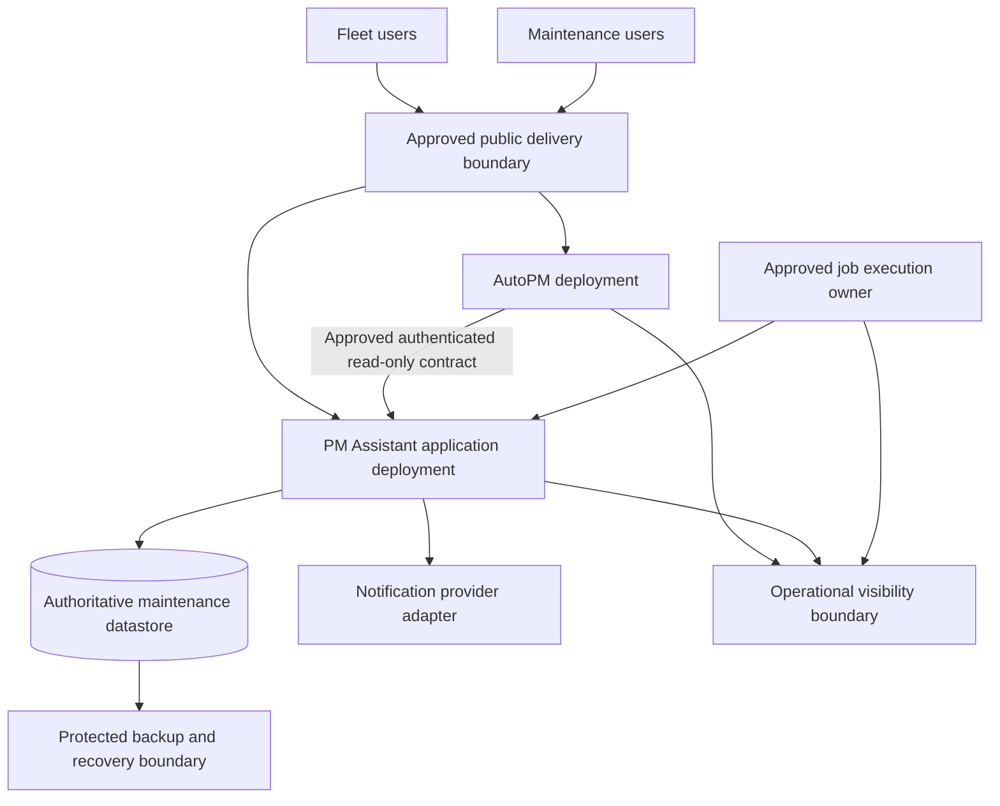
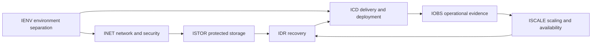

# FleetOS Infrastructure Blueprint v1.0

## Purpose

This document defines the logical infrastructure architecture for FleetOS v1.0. It connects environment, network, security, storage, delivery, observability, scaling, availability, disaster recovery, and rollback requirements without selecting a vendor or claiming that target capabilities are operational.

## Scope and exclusions

The Blueprint covers:

- logical deployment boundaries for AutoPM and PM Assistant;
- environment and configuration separation;
- network trust boundaries and security controls;
- authoritative storage, backup, and restore direction;
- proposed delivery and deployment controls;
- operational visibility and incident evidence;
- scaling, availability, recovery, and rollback gates.

It does not authorize source changes, infrastructure provisioning, containerization, CI workflow creation, database migration, secret changes, deployment, external-service changes, or production operation.

## Infrastructure requirement registry

| ID | Requirement |
| --- | --- |
| `IBP-001` | AutoPM and PM Assistant remain independently deployable and reversible infrastructure units. |
| `IBP-002` | PM Assistant remains the only authoritative maintenance persistence boundary; AutoPM receives approved read models or versioned APIs only. |
| `IBP-003` | Infrastructure configuration, secrets, data, logs, backups, and operational access are separated by approved environment. |
| `IBP-004` | Target infrastructure remains vendor-neutral until a separately approved decision selects a technology or provider. |
| `IBP-005` | Every production change has an identified owner, observable acceptance evidence, stop/go criteria, and credible rollback or forward-recovery path. |
| `IBP-006` | Infrastructure exposes only approved public boundaries and applies least privilege to users, services, networks, data, and operational tooling. |
| `IBP-007` | Background-job topology proves one approved execution owner or an equivalent single-execution mechanism before scaling. |
| `IBP-008` | Authoritative data, history, audit, identifiers, and accepted business outcomes survive compatible application rollback. |
| `IBP-009` | Proposed service levels, recovery objectives, retention, alert thresholds, and capacity targets remain unresolved until evidence and Product Owner approval exist. |
| `IBP-010` | No infrastructure capability is described as operational without implementation and validation evidence from the approved environment. |

## Four-state architecture

### Current implementation evidence

Repository documentation identifies:

- AutoPM as static HTML, CSS, and JavaScript with Google Sheets, Apps Script, CSV, and browser-cache-oriented data consumption;
- PM Assistant as FastAPI, SQLAlchemy, SQLite, APScheduler, local logging, imports, and notification integration;
- separate application concepts but no proven production FleetOS integration boundary;
- no repository evidence proving an approved production container definition, CI/CD workflow, hosted authoritative datastore, centralized observability platform, production authentication, or safe multi-replica scheduler topology.

This is implementation evidence, not approval of the current arrangement as production infrastructure.

### Transitional direction

The transition should:

- establish isolated non-production validation;
- externalize environment-specific configuration through approved boundaries;
- introduce safe health, readiness, logging, and deployment evidence;
- rehearse backup, restore, migration, and recovery without production mutation;
- keep AutoPM target reads reversible and labeled;
- prove scheduler and notification safety before replica or process changes;
- retain current compatible paths until acceptance and rollback evidence pass.

### FleetOS v1.0 target infrastructure

The diagram is logical. It does not prescribe a cloud, region, network product, container runtime, database engine, pipeline product, telemetry product, number of replicas, or provider.

### Future outside v1.0

Potential future capabilities include multi-region operation, active-active data services, enterprise identity infrastructure, distributed workflow orchestration, event streaming, dedicated analytics infrastructure, and automated cross-region failover. These require separate business need, architecture decisions, cost analysis, implementation scope, and recovery evidence.

## Logical infrastructure boundaries

| Boundary | Responsibility | Prohibited coupling |
| --- | --- | --- |
| AutoPM delivery | Static presentation, approved read configuration, freshness and failure display | Privileged secrets, direct database connectivity, authoritative writes |
| PM Assistant runtime | Maintenance workflows, approved APIs, persistence coordination, job and notification integration | Dependency on AutoPM availability for core work |
| Authoritative storage | Maintenance state, history, audit, controlled import and operational evidence | AutoPM credentials or shared-table integration |
| Job execution | Scheduled work with observable single-execution behavior | Uncontrolled activation in every application replica |
| Operational visibility | Safe logs, metrics, traces, probes, alerts, and incident evidence | Business authority or storage of exposed secret values |
| Recovery boundary | Backups, restore procedures, reconciliation evidence, and decision records | Unreviewed production mutation or untested restore claims |

## Cross-document dependency map

## Validation gate registry

| ID | Gate | Minimum evidence |
| --- | --- | --- |
| `IVAL-001` | Documentation integrity | Markdown structure, links, anchors, diagrams, and UTF-8 validation pass. |
| `IVAL-002` | Identifier integrity | Infrastructure identifiers are unique, defined once in the owning registry, and referenced without changing meaning. |
| `IVAL-003` | Security integrity | Secret-pattern review and manual sensitive-data review find no secret values or unsafe examples. |
| `IVAL-004` | Claim integrity | Current, transitional, target, and future statements are explicit; no proposed capability is presented as operational. |
| `IVAL-005` | Architecture integrity | Module, ownership, identity, status, API, persistence, and deployment boundaries match governing documents. |
| `IVAL-006` | Implementation readiness | Selected topology, owners, thresholds, security controls, recovery objectives, and runbooks are approved before implementation. |
| `IVAL-007` | Production readiness | Contract, security, performance, backup, restore, recovery, deployment, monitoring, rollback, and user-acceptance evidence passes before production approval. |

## Unresolved decision registry

| ID | Decision required | Blocks or affects |
| --- | --- | --- |
| `IDEC-001` | Hosting provider, account structure, locations, and logical topology | Environment and deployment implementation |
| `IDEC-002` | Public ingress, DNS, TLS termination, proxy, and trust topology | Network exposure and authentication |
| `IDEC-003` | Authentication mechanism, authorization scopes, and service identities | Protected access and audit |
| `IDEC-004` | Production datastore engine, topology, migration mechanism, and operational owner | Storage implementation and migration |
| `IDEC-005` | Secret storage, issuance, rotation, revocation, and emergency access | Runtime and delivery security |
| `IDEC-006` | Scheduler execution owner, locking, occurrence identity, and retry policy | Scaling and job safety |
| `IDEC-007` | CI/CD product, artifact strategy, branch integration, approvals, and promotion model | Delivery automation |
| `IDEC-008` | Logging, metrics, tracing, alerting, incident, and retention platforms | Operational visibility |
| `IDEC-009` | Availability objective, capacity target, performance thresholds, and stabilization window | Scaling and release acceptance |
| `IDEC-010` | Backup frequency, retention, immutability, encryption, restore owner, RPO, and RTO | Recovery approval |
| `IDEC-011` | Data classification, privacy, deletion, archival, and legal-hold rules | Storage, logs, backups, and audit |
| `IDEC-012` | Deployment strategy, compatibility window, rollback trigger, and forward-recovery preference | Release and recovery |

## Architecture impact

The Blueprint adds no operational component. Its intended future impact is to make infrastructure choices subordinate to approved module boundaries, data ownership, identity, security, compatibility, and recovery requirements. A later technology selection that materially changes accepted architecture requires ADR review before implementation.

## Risks and rollback

Primary design risks are premature vendor selection, accidental operational claims, hidden shared-database coupling, unsafe secret placement, scheduler duplication, untested restore assumptions, inconsistent identifiers, and invented numerical targets.

Documentation rollback consists of reverting this isolated directory. Later implementation rollback must follow [Disaster Recovery and Rollback](DISASTER_RECOVERY_AND_ROLLBACK.md) and preserve authoritative data and audit evidence.

## Completion criteria

This Blueprint is complete as documentation when all nine files are internally consistent, identifiers and links validate, diagrams parse, secret and operational-claim reviews pass, and no existing file or operational system is changed. It does not make FleetOS infrastructure implemented, production-ready, deployed, or released.

