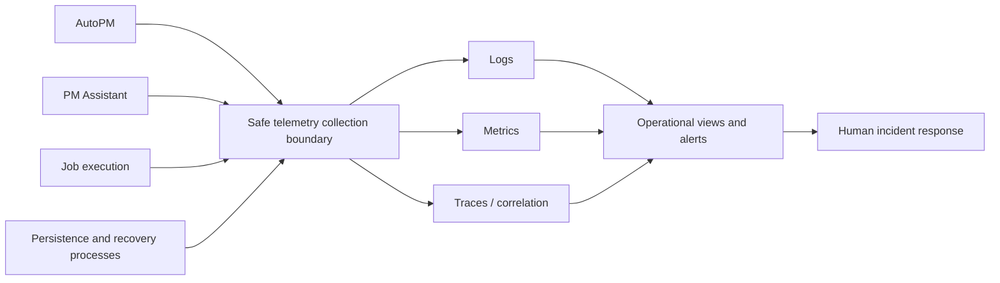
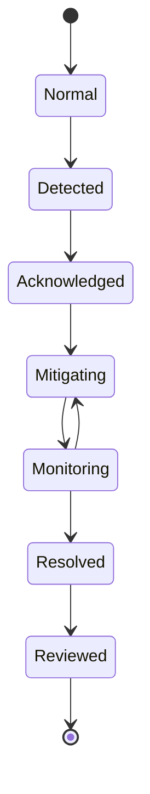

# FleetOS Monitoring and Logging

## Purpose

This document defines proposed operational visibility for FleetOS v1.0. It does not select or configure a logging, metrics, tracing, alerting, incident-management, or retention platform.

## Monitoring and logging requirement registry

| ID | Requirement |
| --- | --- |
| `IOBS-001` | Operational signals distinguish AutoPM, PM Assistant, job execution, notification integration, persistence, and approved infrastructure dependencies. |
| `IOBS-002` | Logs are structured where supported and use explicit timestamp/timezone, severity, service/module, event, result, duration, safe version, and validated correlation where applicable. |
| `IOBS-003` | Credentials, authorization material, cookies, connection strings, raw payloads, notification targets, personal data, paths, and internal topology are excluded or redacted. |
| `IOBS-004` | Liveness, readiness, degradation, and business status remain distinct and expose only coarse safe state. |
| `IOBS-005` | API result and latency, read freshness, imports, identity exceptions, jobs, notifications, persistence, backups, restores, deployments, and security failures have defined visibility. |
| `IOBS-006` | Operational logs and durable business audit remain separate where purpose, access, immutability, or retention differs. |
| `IOBS-007` | Alerts have approved conditions, severity, owner, routing, escalation, suppression, maintenance, and recovery behavior before production use. |
| `IOBS-008` | Monitoring failure does not silently become evidence that the monitored service is healthy. |
| `IOBS-009` | Correlation identifiers are diagnostic only, validated before use, and never authenticate, authorize, order, or make an action idempotent. |
| `IOBS-010` | Dashboards distinguish valid empty, stale, unavailable, degraded, and failed states rather than displaying a misleading healthy zero. |
| `IOBS-011` | Telemetry access and retention follow data classification, least privilege, privacy, deletion, and incident requirements. |
| `IOBS-012` | No production monitoring, alerting, or centralized logging capability is claimed until implementation and validation evidence exists. |

## Signal model

The collection and storage products remain `IDEC-008`.

## Minimum visibility

| Area | Target evidence |
| --- | --- |
| API and UI delivery | Result, latency, safe route or asset version, availability, and error class |
| Read models | Source, generation time, `as_of`, freshness, stale state, and unavailable state |
| Identity | Exact, normalized, ambiguous, conflicting, missing, and rejected counts |
| Imports | Batch start/end, safe counts, replay disposition, partial outcome, and failure class |
| Jobs | Registration, ownership, occurrence, acquisition, start/end, duration, misfire, duplicate skip, failure, and recovery |
| Notifications | Intent, attempt, provider result class, retry decision, and terminal outcome |
| Persistence | Readiness, safe transaction failure class, capacity risk, migration state, backup and restore evidence |
| Delivery | Candidate version, environment, deployment result, stabilization, rollback or recovery disposition |
| Security | Authentication/authorization outcome, abuse controls, configuration change, and credential incident without exposed material |

## Probes and service state

- Liveness answers whether the process can execute its minimal loop.
- Readiness answers whether essential approved dependencies can serve the intended responsibility.
- Degraded means an approved non-essential capability is impaired while safe core work remains available.
- Business workflow status is never derived from probe state.
- Probe payloads reveal no engine name, host, schema, path, credential, provider target, or stack trace.

## Alert lifecycle

Thresholds and response times remain unresolved. An alert is useful only when an approved owner can act on it and validate recovery.

## Logging safety

- Prefer stable event names and typed safe error classes over free-form sensitive messages.
- Avoid duplicate exception logging across layers.
- Do not log raw request or response bodies by default.
- Sanitize inbound correlation values before returning or logging them.
- Treat debug logging as subject to the same secret and privacy rules.
- Retain enough safe evidence to connect deployment, request, job, import, notification, and recovery events.

## Validation

Later implementation should test signal emission, field consistency, redaction, correlation propagation, probe disclosure, alert routing, alert recovery, telemetry loss, retention, access control, and incident reconstruction using synthetic or approved sanitized evidence.

## Related documents

- [Network and Security](NETWORK_AND_SECURITY.md)
- [Scaling and High Availability](SCALING_AND_HIGH_AVAILABILITY.md)
- [Disaster Recovery and Rollback](DISASTER_RECOVERY_AND_ROLLBACK.md)
- [Security and Observability Standard](../engineering/SECURITY_AND_OBSERVABILITY_STANDARD.md)

