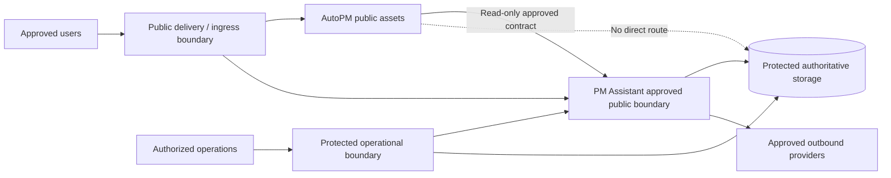

# FleetOS Network and Security

## Purpose

This document defines vendor-neutral network trust boundaries and infrastructure security requirements for FleetOS v1.0. It does not approve a public endpoint, identity provider, firewall product, proxy, certificate authority, or security service.

## Network and security requirement registry

| ID | Requirement |
| --- | --- |
| `INET-001` | Public exposure is limited to explicitly approved user-facing and API boundaries; persistence, backup, and internal operational interfaces are not public by default. |
| `INET-002` | Production traffic uses approved TLS boundaries with documented termination and trusted-proxy behavior. |
| `INET-003` | Authentication and authorization are approved and validated before protected production access is enabled. |
| `INET-004` | Network, service, human, database, backup, migration, and operational permissions follow least privilege and deny-by-default direction. |
| `INET-005` | AutoPM has no database credential, route, schema grant, or direct persistence access. |
| `INET-006` | Browser-delivered assets, URLs, browser storage, logs, and documentation contain no privileged service secret. |
| `INET-007` | Production CORS, methods, headers, request size, rate limits, timeouts, and abuse controls are explicit and tested. |
| `INET-008` | Outbound access is limited to approved dependencies and cannot silently target production services from a lower environment. |
| `INET-009` | Webhook or callback traffic is authenticated or signature-verified where supported and is replay-safe under an approved policy. |
| `INET-010` | Health and operational endpoints disclose only coarse state and no host, engine, schema, path, credential, or internal topology. |
| `INET-011` | Security-relevant access and configuration events produce safe evidence without secrets or unnecessary personal data. |
| `INET-012` | Credential exposure triggers containment, revocation or rotation, impact review, and forward-safe recovery; rollback never restores a revoked credential. |

## Logical trust model

The diagram expresses trust boundaries only. The selected network architecture remains `IDEC-002`.

## Boundary rules

### Public delivery

- Serve only approved static assets, UI routes, APIs, and coarse probes.
- Apply approved TLS, origin, header, body-size, timeout, and abuse controls.
- Do not expose debug routes, stack traces, local files, database diagnostics, or provider details.

### Application-to-storage

- PM Assistant alone receives approved persistence access.
- Credentials are environment-specific and supplied through the secret boundary.
- Migration and backup roles are distinct from runtime roles where supported.
- AutoPM never receives database connectivity.

### Outbound integrations

- Destinations, timeouts, retry, certificate validation, and failure behavior are explicit.
- Notification recipients and callbacks are environment-safe.
- Provider failures are observable and do not grant the provider authority over maintenance state.

### Operational access

- Administrative interfaces are protected separately from public user traffic.
- Access is attributable, reviewed, and removable.
- Emergency actions preserve safe evidence and require post-incident review.

## Threat-oriented controls

| Threat | Required direction |
| --- | --- |
| Credential disclosure | External secret storage, redaction, least privilege, rotation, and no browser exposure |
| Unauthorized maintenance access | Approved authentication, per-operation authorization, safe resource disclosure |
| Direct database coupling | Network and credential denial for AutoPM; approved API/read boundary only |
| Request abuse | Size limits, pagination limits, rate controls, bounded deadlines, safe errors |
| Provider spoofing or replay | Signature or caller verification and approved idempotency/replay policy |
| Diagnostic leakage | Coarse probes, safe errors, no paths/topology/connection details |
| Lower-environment production impact | Environment-specific credentials, destinations, data, and recipient isolation |

## Security validation gates

Later implementation evidence should include:

- trust-boundary review and threat model;
- authentication and authorization failure tests;
- TLS and trusted-proxy validation;
- CORS and browser-boundary tests;
- request, upload, pagination, and rate-limit tests where applicable;
- secret issuance, rotation, revocation, and leak response rehearsal;
- network reachability tests proving prohibited paths remain unavailable;
- logging and error redaction review;
- webhook/callback verification and replay tests where applicable.

## Incident and rollback

Contain exposure first, preserve safe evidence, revoke affected credentials, restrict unsafe paths, and reconcile data and audit records. Application rollback is acceptable only if the last-known-good version is not compromised and does not restore the vulnerability or revoked material.

## Related documents

- [Environment Architecture](ENVIRONMENT_ARCHITECTURE.md)
- [Storage and Backup](STORAGE_AND_BACKUP.md)
- [Monitoring and Logging](MONITORING_AND_LOGGING.md)
- [Disaster Recovery and Rollback](DISASTER_RECOVERY_AND_ROLLBACK.md)
- [Security and Observability Standard](../engineering/SECURITY_AND_OBSERVABILITY_STANDARD.md)

