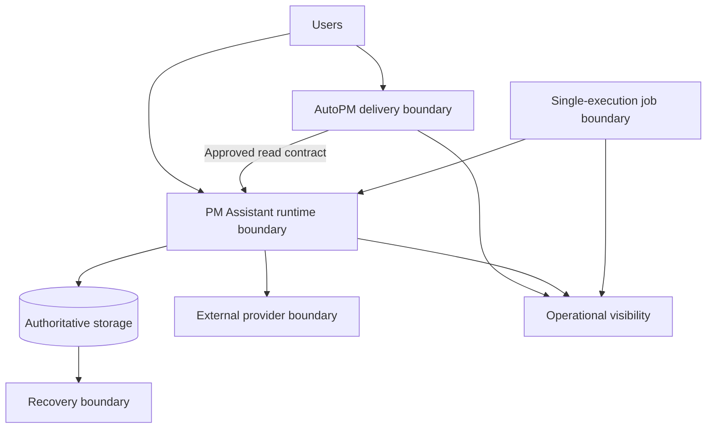

# FleetOS Scaling and High Availability

## Purpose

This document defines vendor-neutral scaling, capacity, availability, resilience, and graceful-degradation requirements for FleetOS v1.0. It does not approve a replica count, load balancer, autoscaler, queue, cache, database replication design, multi-region topology, numerical service level, or cost.

## Scaling and availability requirement registry

| ID | Requirement |
| --- | --- |
| `ISCALE-001` | Scaling is driven by measured workload, latency, error, concurrency, job, storage, and recovery evidence against approved targets. |
| `ISCALE-002` | AutoPM and PM Assistant scale and roll back independently without changing ownership or creating direct database coupling. |
| `ISCALE-003` | PM Assistant replica or process changes do not activate duplicate scheduled work; one approved execution owner or equivalent coordination is proven first. |
| `ISCALE-004` | Application instances avoid relying on unshared local state for authoritative sessions, jobs, files, or business outcomes unless the approved topology deliberately guarantees it. |
| `ISCALE-005` | Persistence capacity, connection behavior, query performance, backup duration, restore duration, and recovery constraints are included in scale planning. |
| `ISCALE-006` | External-provider rate limits, timeouts, retries, circuit behavior, and recipient safety are included in capacity and degradation design. |
| `ISCALE-007` | Failure of AutoPM does not corrupt PM Assistant; failure of an optional provider does not silently invalidate accepted maintenance state. |
| `ISCALE-008` | Valid empty, stale, unavailable, degraded, overloaded, and failed states remain distinguishable to users and operators. |
| `ISCALE-009` | Availability, capacity, latency, error, stabilization, and scaling thresholds remain Product Owner decisions supported by measured evidence. |
| `ISCALE-010` | High availability is not claimed until failure, failover, restart, duplicate-prevention, data consistency, and recovery behavior are tested. |

## Scaling dimensions

| Dimension | Evidence required before change |
| --- | --- |
| Static delivery | Asset size, request volume, cache behavior, geographic need, invalidation, and rollback |
| Application runtime | Request rate, latency, concurrency, memory, CPU, startup, shutdown, and dependency limits |
| Job execution | Frequency, duration, overlap, occurrence identity, acquisition, retry, restart, and duplicate prevention |
| Persistence | Data volume, growth, concurrency, connection pressure, slow queries, migration, backup, and restore |
| Notifications/providers | Provider quotas, timeout, retry, burst, idempotency, target safety, and outage behavior |
| Observability | Signal volume, retention, query needs, alert load, and telemetry failure behavior |

## Logical availability model

Redundancy may be introduced inside a boundary only after the consistency, lifecycle, and recovery effects are approved.

## Graceful degradation

- AutoPM may use only an approved labeled last-known-good read result with visible source and age.
- PM Assistant authoritative work becomes not ready when essential persistence cannot serve safely.
- Notification-provider failure may degrade delivery while preserving separately accepted maintenance actions and recorded intent.
- Optional report or projection failure must not be presented as authoritative zero.
- Capacity protection may reject or defer work using safe explicit errors; it must not silently drop accepted actions.
- Job ownership conflict stops or skips unsafe execution rather than running duplicates.

## Capacity and load validation

Before production scaling decisions, define a representative workload and test:

- steady and burst request volume;
- slow and unavailable dependencies;
- large approved imports and exports;
- job overlap, restart, and long-running execution;
- notification throttling and provider failure;
- storage growth, query patterns, connections, backup, and restore;
- deployment while traffic or jobs are active;
- telemetry volume and alert behavior;
- rollback and recovery under load.

Synthetic data must preserve relevant Thai text, identifier, date, status, and size characteristics without exposing sensitive records.

## High-availability risks

Adding replicas can increase scheduler duplication, transaction conflict, cache inconsistency, migration race, provider duplication, log volume, and operational complexity. High availability must improve measured user outcomes without weakening authoritative consistency or recovery.

## Related documents

- [Storage and Backup](STORAGE_AND_BACKUP.md)
- [Monitoring and Logging](MONITORING_AND_LOGGING.md)
- [CI/CD and Deployment](CI_CD_AND_DEPLOYMENT.md)
- [Disaster Recovery and Rollback](DISASTER_RECOVERY_AND_ROLLBACK.md)

