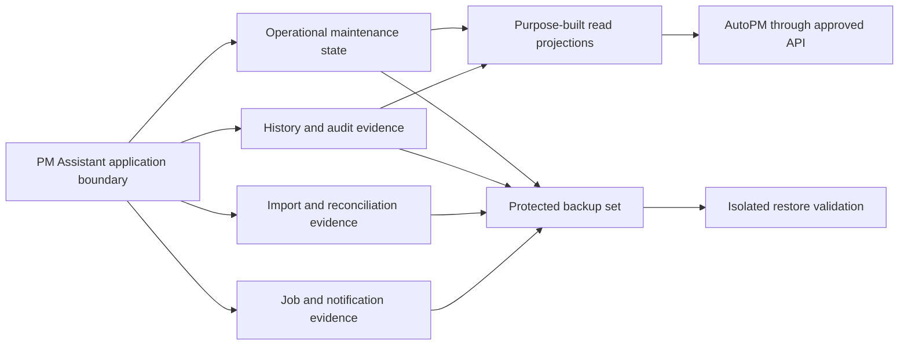

# FleetOS Storage and Backup

## Purpose

This document defines logical storage, durability, backup, restore, retention, and recovery requirements for FleetOS v1.0. It does not select a database engine, object store, backup product, encryption mechanism, retention period, RPO, or RTO.

## Storage and backup requirement registry

| ID | Requirement |
| --- | --- |
| `ISTOR-001` | PM Assistant remains the authoritative maintenance persistence boundary regardless of storage technology. |
| `ISTOR-002` | AutoPM has no direct table, schema, replica, credential, connection, backup, or write access. |
| `ISTOR-003` | Operational state, history, audit, imports, job evidence, notification evidence, and read projections have explicit ownership and retention direction. |
| `ISTOR-004` | Storage technology is selected only after data volume, concurrency, durability, migration, operational, security, and recovery requirements are approved. |
| `ISTOR-005` | Backups are access-controlled, encrypted under an approved design, integrity-checked, and isolated from ordinary application mutation. |
| `ISTOR-006` | Backup success is not claimed until a representative restore is completed and validated in an isolated approved environment. |
| `ISTOR-007` | Restore validation covers schema, counts, relationships, Unicode, dates and timezones, identities, status domains, history, audit, and application compatibility. |
| `ISTOR-008` | Backup frequency, retention, immutability, location, RPO, RTO, ownership, and evidence retention remain explicit Product Owner decisions. |
| `ISTOR-009` | Migrations are versioned, ordered, observable, compatible with the approved deployment sequence, and rehearsed against isolated data. |
| `ISTOR-010` | Recovery preserves accepted identifiers, authoritative business outcomes, original source evidence, history, and audit unless an approved correction process says otherwise. |
| `ISTOR-011` | Sensitive data is minimized in storage, logs, exports, snapshots, and backups, with classification and deletion rules applied consistently. |
| `ISTOR-012` | Storage degradation, capacity risk, replication lag if applicable, backup failure, and restore failure are observable without exposing topology or secret values. |

## Logical storage model

Logical areas may share a physical engine after approval; the diagram does not prescribe schemas, servers, databases, replicas, or products.

## Current and transitional direction

Current repository evidence identifies local SQLite persistence and startup-oriented initialization behavior. It does not prove a production backup, restore, migration, hosted datastore, replication, encryption, or retention capability.

Transition requires:

1. read-only inventory of approved sources, schemas, writers, readers, constraints, sizes, encodings, dates, and sensitive fields;
2. versioned migration and compatibility design after technology approval;
3. isolated backup and restore rehearsal;
4. identity, status, count, Unicode, history, and audit reconciliation;
5. application and job compatibility testing;
6. approved stop/go and rollback or forward-recovery criteria.

## Backup classes

An approved implementation may use full, incremental, snapshot, transaction-log, export, or provider-native mechanisms. Whatever mechanism is selected must document:

- protected source and scope;
- schedule and retention;
- integrity verification;
- access and encryption ownership;
- restore procedure and prerequisites;
- expected recovery point and duration;
- reconciliation and acceptance evidence;
- deletion and legal-hold interaction.

Documentation of a backup command or provider setting is not restore evidence.

## Restore acceptance

A restore is accepted only after:

- the expected backup identity and integrity are verified;
- restoration occurs in an isolated approved destination;
- schema and migration compatibility pass;
- record counts and relationships reconcile;
- Thai and other Unicode values remain valid;
- timestamps, timezones, and date semantics remain correct;
- four separate status domains remain intact;
- accepted plans, history, audit, imports, jobs, and notification outcomes are preserved;
- application reads and approved writes behave correctly;
- discrepancies are classified and resolved or explicitly accepted.

## Retention and deletion

Retention, archival, privacy, deletion, legal hold, audit immutability, and backup expiration remain `IDEC-011`. Deleting an operational record does not automatically prove deletion from backups, logs, exports, or external providers; the approved policy must address each copy.

## Storage rollback

Application rollback should preserve compatible storage. Destructive schema rollback is not assumed. When accepted data changed, forward recovery, compensating correction, restore, or controlled replay must be selected by the approved recovery owner using evidence and reconciliation.

## Related documents

- [Database Blueprint](../database/DATABASE_BLUEPRINT.md)
- [Database Migration Strategy](../database/MIGRATION_STRATEGY.md)
- [Scaling and High Availability](SCALING_AND_HIGH_AVAILABILITY.md)
- [Disaster Recovery and Rollback](DISASTER_RECOVERY_AND_ROLLBACK.md)

