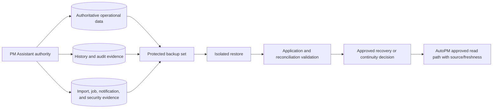
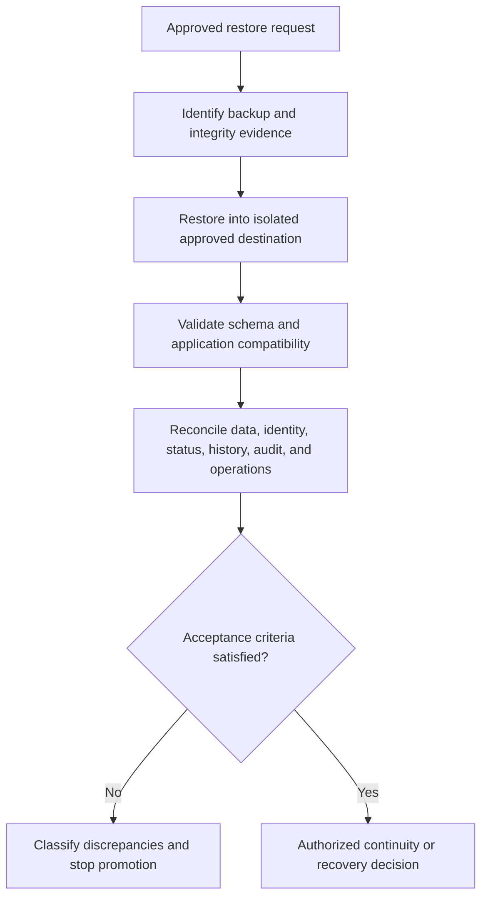

# FleetOS Backup, Restore, and Business Continuity

## Purpose

This document defines proposed backup, restore, business continuity, disaster recovery operations, reconciliation, rehearsal, and recovery ownership for FleetOS v1.0. It selects no storage technology, backup mechanism, location, schedule, retention, immutability method, encryption mechanism, RPO, RTO, or recovery timing.

## Requirement registry

| ID | Requirement |
| --- | --- |
| `BCP-001` | PM Assistant remains the authoritative maintenance persistence boundary throughout backup, restore, continuity, disaster recovery, and rollback. |
| `BCP-002` | AutoPM cache, Google Sheets, CSV, browser state, and operational telemetry are never promoted to authoritative workflow backup or restore sources. |
| `BCP-003` | Backup scope explicitly covers required operational state, identifiers, history, audit, imports, jobs, notifications, security evidence, and applicable configuration references. |
| `BCP-004` | Backups use approved access control, encryption, integrity evidence, isolation from ordinary mutation, retention, and deletion behavior. |
| `BCP-005` | Backup success is not claimed until representative isolated restore and application/data validation pass. |
| `BCP-006` | Restore validation covers schema, relationships, counts, Unicode, dates/timezones, identities, all four status domains, history, audit, imports, jobs, notifications, and application compatibility. |
| `BCP-007` | Recovery classifies accepted, failed, partial, interrupted, duplicate, and uncertain operations before replay. |
| `BCP-008` | Business continuity preserves safe PM Assistant workflows where possible and presents AutoPM fallback only with explicit source and staleness. |
| `BCP-009` | Disaster recovery identifies decision authority, owners, communication, recovery path, stop/go criteria, security checks, and reconciliation. |
| `BCP-010` | Security recovery revokes or rotates compromised material and never restores revoked credentials from an older application, configuration, or backup. |
| `BCP-011` | Recovery objectives and rehearsal expectations are approved from business impact and measured evidence rather than provider claims. |
| `BCP-012` | Backup, restore, continuity, and disaster recovery are not called operational until access, owners, runbooks, monitoring, restore evidence, and rehearsals are validated. |

## Continuity priorities

1. Protect people, approved access, and sensitive information.
2. Contain unsafe exposure or mutation.
3. Preserve PM Assistant authoritative data and required evidence.
4. Classify uncertain business outcomes before replay.
5. Restore essential maintenance responsibility safely.
6. Preserve AutoPM read-only behavior and accurate freshness/fallback presentation.
7. Validate security, data, jobs, imports, notifications, and audit.
8. Communicate confirmed state and residual risk.

Priority detail and service criticality remain `ODEC-003` and `ODEC-010`.

## Logical protection model

The model is conceptual and vendor-neutral.

## Backup scope direction

An approved backup design must identify:

- authoritative source and environment;
- included data, history, audit, security, import, job, and notification evidence;
- excluded derived/transient data and the rebuild process;
- application, schema, contract, mapping, rule, and configuration-reference versions;
- access and execution owner;
- integrity verification;
- encryption and key ownership;
- isolation and compromise resistance;
- retention, expiration, deletion, and legal-hold interaction;
- restore prerequisites and evidence.

A file, snapshot, or successful command alone is not recovery evidence.

## Backup classes

An implementation may later use full, incremental, snapshot, log-based, export, or provider-native mechanisms. This Blueprint selects none. Each selected class must document consistency, scope, dependencies, failure visibility, restoration order, and validation.

## Restore workflow

No production restore is authorized by this workflow.

## Restore acceptance

A representative restore is accepted only after:

- backup identity, scope, and integrity are verified;
- restoration occurs in an isolated approved destination;
- schema and version compatibility pass;
- counts, constraints, and relationships reconcile;
- Thai and other Unicode values remain valid;
- date, time, timezone, measured, received, effective, and recorded semantics remain correct;
- vehicle identity ambiguity remains explicit;
- `pm_mileage_status`, `pm_workflow_status`, `completion_status`, and `notification_status` remain separate;
- accepted plans, completion, history, audit, imports, jobs, notifications, and security evidence are preserved;
- approved application reads and writes behave correctly;
- discrepancies receive an approved disposition.

## Business continuity direction

Continuity modes may include:

- normal operation;
- degraded optional capability;
- PM Assistant essential operation with AutoPM unavailable;
- AutoPM labeled last-known-good presentation while PM Assistant reads are temporarily unavailable;
- controlled suspension of jobs, imports, notifications, or mutations;
- isolated recovery and reconciliation;
- approved alternate environment or provider path after consistency and security checks.

No alternate path may transfer maintenance authority, hide stale data, bypass access control, or report uncertain work as successful.

## Disaster recovery operations

Disaster recovery should distinguish:

| Failure class | Recovery direction |
| --- | --- |
| Application | Compatible rollback or corrected release |
| Configuration | Restore approved safe configuration without restoring revoked secrets |
| Persistence | Stop unsafe writes; restore or forward recover; reconcile |
| Job execution | Stop acquisition; classify occurrences; reconcile before replay |
| Notification provider | Preserve intent/attempts; retry only under approved policy |
| Network/security | Contain, restrict, revoke, investigate, and recover forward safely |
| Data quality | Quarantine, restore mapping/rule version, compensate, and reconcile |
| Platform/location | Use an approved alternate path only after access and consistency checks |
| Telemetry | Mark state unknown; restore visibility; reconstruct gaps |

## Rollback versus forward recovery

Rollback may be appropriate when a known-compatible state exists and accepted data will not be lost or duplicated. Forward recovery may be safer when authoritative writes occurred, compatibility closed, or a security action cannot be undone.

The decision records:

- failure class and stage;
- affected data and users;
- last consistent point;
- accepted and uncertain work;
- backup/restore state;
- compatibility and security implications;
- loss/duplication risk;
- decision owner and approval;
- post-recovery reconciliation.

Destructive storage rollback is not assumed safer. AutoPM fallback is never reverse-synchronized.

## Recovery rehearsal

A rehearsal should validate:

1. detection and escalation;
2. access to protected runbooks and mechanisms;
3. owner and decision availability;
4. backup selection and integrity;
5. isolated restoration;
6. application and contract compatibility;
7. jobs, imports, notifications, and uncertain outcomes;
8. data, history, audit, security, and identity reconciliation;
9. AutoPM source/freshness behavior;
10. communications;
11. return to health and monitoring;
12. lessons, actions, and runbook updates.

Frequency, objectives, participants, and acceptance criteria remain unresolved.

## Recovery completion

Recovery is complete only when:

- unsafe exposure or mutation is contained;
- essential service state is verified;
- authoritative data and evidence reconcile under approved criteria;
- jobs, imports, and notifications have explicit dispositions;
- credentials and access are safe;
- AutoPM displays correct source and freshness;
- monitoring confirms the approved observation requirement;
- residual risk and remaining work are accepted by the authorized owner.

Decisions remain `ODEC-002`, `ODEC-003`, `ODEC-005`, `ODEC-006`, `ODEC-008`, `ODEC-010`, and `ODEC-012`.
