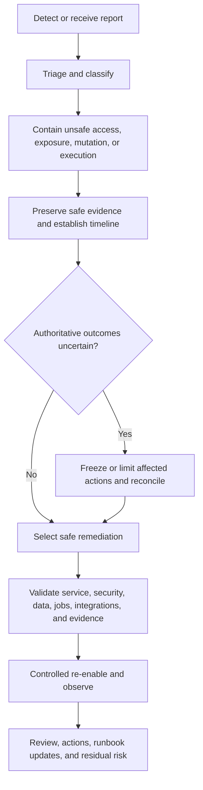

# FleetOS Incident Response and Runbooks

## Purpose

This document defines proposed incident response, escalation, runbook governance, maintenance windows, communications, recovery, and post-incident review for FleetOS v1.0. It does not establish an active incident team, severity system, response commitment, communications channel, or operational runbook execution authority.

## Requirement registry

| ID | Requirement |
| --- | --- |
| `IR-001` | Incidents are classified by affected asset, trust boundary, environment, user/data impact, security impact, authoritative-outcome uncertainty, and recovery complexity. |
| `IR-002` | Incident response preserves PM Assistant authority and never promotes AutoPM cache, legacy feeds, or operational telemetry into authoritative maintenance state. |
| `IR-003` | Every incident has an assigned coordinator role, affected owner roles, decision authority, safe timeline, status, and communication route before operational readiness. |
| `IR-004` | Containment prioritizes stopping unsafe access, exposure, mutation, duplicate work, notification, import, or deployment while preserving evidence. |
| `IR-005` | Credentials or sessions suspected of compromise are revoked, rotated, or invalidated through the approved authority and are never restored by rollback. |
| `IR-006` | Uncertain requests, transactions, imports, jobs, notifications, and migrations are reconciled before replay. |
| `IR-007` | Runbooks identify owner, scope, detection, prerequisites, safety checks, response, stop/go, recovery, rollback, validation, reconciliation, and escalation. |
| `IR-008` | Maintenance windows use approved scope, ownership, communication, health/readiness handling, job controls, evidence checkpoints, and rollback direction. |
| `IR-009` | Incident communications exclude secrets, exploitable detail, unnecessary personal data, and unsupported conclusions. |
| `IR-010` | Recovery completion requires validated service, security, data, jobs, imports, notifications, audit, and monitoring state. |
| `IR-011` | Post-incident review records cause, contributing conditions, decisions, impact, evidence gaps, corrective actions, ownership, and accepted residual risk. |
| `IR-012` | Incident and runbook capability is not called operational until owners, access, routes, procedures, rehearsals, and update governance are validated. |

## Incident lifecycle

The lifecycle is target direction. No response timing or channel is selected.

## Classification direction

Classification considers:

- confidentiality, integrity, availability, authenticity, authorization, privacy, audit, and recoverability;
- actual versus suspected exposure;
- scope and environment;
- ongoing unsafe mutation or duplicate work;
- affected identities, maintenance records, history, imports, jobs, notifications, or providers;
- credential, dependency, supply-chain, storage, backup, or recovery involvement;
- user and business continuity impact;
- evidence completeness and recovery complexity.

Severity names, thresholds, notification obligations, and response expectations remain `ODEC-008`.

## Escalation direction

Proposed role-based escalation:

1. Detector or monitoring path notifies the owning operator role.
2. The owning role establishes triage and an incident coordinator.
3. The coordinator involves PM Assistant, AutoPM, data/recovery, security, integration, or delivery owners according to impact.
4. The Product Owner or approved delegate receives stop/go, accepted-risk, user-impact, release, or recovery decisions.
5. External provider, legal, privacy, customer, or executive communication occurs only under an approved policy.

Named contacts, alternates, support coverage, channels, acknowledgement expectations, and delegation remain unresolved. The Product Owner governance role is not automatically a runtime administrator.

## Containment and evidence

Containment may include disabling an affected read exposure, stopping job acquisition, pausing imports, preventing notification dispatch, withdrawing readiness, limiting writes, restoring approved configuration, or isolating a compromised boundary. Exact actions depend on approved architecture and runbooks.

Preserve:

- application/configuration/contract versions;
- health, monitoring, log, audit, and security-event references;
- job occurrences, import batches, notification intents/attempts, and uncertain outcomes;
- source/freshness and last-known-good state;
- backup/restore identity and reconciliation evidence;
- decisions, owners, approvals, communications, and residual risk.

Evidence excludes secret values and unsafe raw payloads.

## Runbook standard

Every runbook should contain:

1. purpose, scope, status, and owner role;
2. affected services, data, dependencies, and authority boundaries;
3. detection signals and known false-positive/unknown behavior;
4. required access, prerequisites, approvals, and safety warnings;
5. triage and classification;
6. containment;
7. diagnostic evidence and redaction rules;
8. recovery, rollback, or forward-recovery options;
9. uncertain-outcome reconciliation;
10. health, security, data, job, notification, and user validation;
11. stop/go and escalation points;
12. communications direction;
13. evidence package and post-action review;
14. rehearsal, review, supersession, and retirement record.

Runbooks must not embed credentials, private endpoints, production data, or vendor commands before their mechanisms and access are separately approved.

## Proposed runbook catalog

The following are future runbook candidates, not active procedures:

- AutoPM delivery unavailable or stale fallback active;
- PM Assistant live but not ready;
- authoritative persistence unavailable or uncertain;
- read-model freshness or contract failure;
- identity ambiguity/conflict surge or data-quality incident;
- import partial, interrupted, duplicated, or unsafe;
- scheduler ownership conflict, missed occurrence, or uncertain execution;
- notification provider failure or ambiguous delivery;
- sensitive logging, audit, diagnostic, or credential exposure;
- backup failure or missing integrity evidence;
- restore validation failure;
- deployment, configuration, or compatibility rollback;
- telemetry loss or alert-delivery failure;
- disaster recovery and business-continuity activation.

## Maintenance windows

A later approved maintenance plan must identify:

- change purpose, scope, owner, operators, observers, and decision authority;
- affected users, modules, dependencies, jobs, imports, notifications, and integrations;
- maintenance communication and status path;
- writer pause, readiness, draining, and active-work behavior;
- backup/restore and compatibility prerequisites;
- evidence checkpoints and stop/go criteria;
- rollback or forward-recovery decision;
- post-change validation, reconciliation, monitoring, and closure;
- conversion to incident response when impact is unexpected.

Window timing, notice, frequency, freeze periods, emergency changes, and acceptable impact remain `ODEC-009`.

## Communications direction

Communications should state:

- confirmed scope and state;
- user-visible impact and safe workaround where approved;
- source/freshness implications;
- current containment or recovery phase;
- decision owner and next update rule after approval;
- recovery validation and remaining risk.

Communications must distinguish facts from hypotheses and avoid credentials, exploit details, raw personal data, provider targets, or unsupported recovery promises.

## Recovery and closure

Before closure:

- unsafe exposure or mutation is contained;
- essential health/readiness is verified;
- authoritative data and audit reconcile under approved criteria;
- jobs, imports, and notifications have explicit dispositions;
- access and credentials are safe;
- AutoPM shows accurate source and freshness;
- monitoring and alerting have recovered;
- residual risk and follow-up are accepted by the authorized owner.

## Rehearsal and review

Rehearsals should use isolated approved environments and synthetic or approved sanitized data. They validate detection, escalation, access, decision availability, runbook correctness, backup/restore, uncertain work, communications, reconciliation, rollback, and return to normal monitoring.

Frequency, participants, evidence retention, and success criteria remain `ODEC-008`, `ODEC-009`, and `ODEC-012`.
