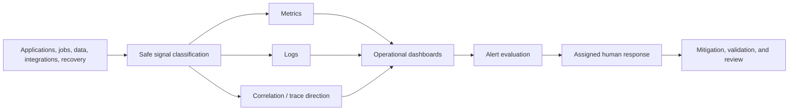
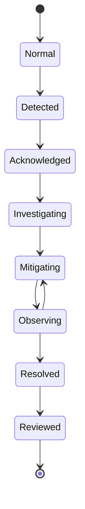

# FleetOS Monitoring and Alerting

## Purpose

This document defines proposed monitoring, tracing direction, dashboards, alerts, signal loss, and maintenance handling for FleetOS v1.0. It does not select or configure any telemetry, dashboard, notification, or incident-management product.

## Requirement registry

| ID | Requirement |
| --- | --- |
| `MON-001` | Monitoring distinguishes AutoPM, PM Assistant, API/read boundaries, jobs, imports, notifications, persistence, backup/restore, delivery, and security dependencies. |
| `MON-002` | Signals identify environment, FleetOS module, component, safe version, event or metric meaning, result, and explicit-timezone observation time where applicable. |
| `MON-003` | Monitoring preserves valid empty, stale, degraded, unavailable, failed, partial, skipped, and uncertain states. |
| `MON-004` | Tracing direction uses validated correlation and approved causation references without treating them as security, ordering, or idempotency. |
| `MON-005` | Operational dashboards show source, scope, freshness, missing telemetry, and definition/version context. |
| `MON-006` | Alerts require an approved condition, owner, route, context, severity model, acknowledgement, escalation, suppression, recovery, and review process. |
| `MON-007` | Alert thresholds, windows, evaluation frequency, and response expectations remain unresolved until evidence and Product Owner approval exist. |
| `MON-008` | Monitoring loss or delayed telemetry is visible and never represented as healthy service state. |
| `MON-009` | Maintenance suppression is scoped, approved, time-bounded by later policy, visible, and unable to conceal unrelated failure or security evidence. |
| `MON-010` | Monitoring excludes credentials, raw payloads, raw notification targets, sensitive import rows, unnecessary personal data, paths, and internal topology. |
| `MON-011` | Operational dashboards remain separate from AutoPM business dashboards and unapproved business KPI calculations. |
| `MON-012` | No alerting or monitoring capability is called operational before routing, recovery, access, redaction, and failure behavior are validated. |

## Monitoring model

Products, transport, storage, sampling, retention, and access remain unresolved.

## Minimum monitoring scope

| Area | Proposed visibility |
| --- | --- |
| AutoPM delivery | Asset/client version, read result, error class, cache/fallback use, source, freshness, and unavailable state |
| PM Assistant runtime | Startup, live/ready/degraded transitions, request outcomes, dependency state, shutdown, and unsafe configuration failure |
| API/read models | Safe route template, result class, duration, correlation, source, `as_of`, stale state, unavailable state, and contract version |
| Identity | Exact, normalized, ambiguous, conflicting, missing, rejected, and quarantined counts |
| Imports/synchronization | Batch start/end, outcome, safe counts, partial state, replay disposition, versions, freshness, and exceptions |
| Background jobs | Definition, occurrence, acquisition, duplicate skip, start/end, duration, result, interruption, and recovery disposition |
| Notifications | Intent, attempt, provider result class, retry decision, terminal state, and ambiguous outcome without recipient or body exposure |
| Persistence | Readiness, transaction failure class, migration state, capacity risk direction, backup result, and restore result |
| Delivery/change | Candidate version, environment, validation, enablement, stabilization, rollback, and recovery disposition |
| Security | Authentication/authorization classifications when implemented, protected access, configuration change, evidence loss, and credential incident |

## Tracing direction

FleetOS tracing direction is vendor-neutral:

- validate and sanitize inbound correlation identifiers;
- generate safe values when absent or invalid;
- propagate correlation across approved requests, use cases, persistence diagnostics, imports, jobs, notifications, audit, and incidents where applicable;
- use separate causation, job occurrence, import batch, notification intent, and business idempotency references;
- prevent free text, personal data, filenames, targets, or secrets from entering identifiers;
- preserve correlation when a public response maps to protected diagnostics;
- make sampling and trace retention an explicit decision rather than a hidden default.

Correlation does not prove that two events caused one another and never authenticates, authorizes, orders, or deduplicates work.

## Operational dashboard direction

Proposed dashboard families:

1. FleetOS service overview.
2. AutoPM delivery, read, cache, and freshness.
3. PM Assistant runtime, API, and dependency health.
4. Jobs, imports, and synchronization.
5. Notification delivery and ambiguous outcomes.
6. Persistence, backup, restore, and recovery evidence.
7. Security and protected operational access.
8. Release, rollout, rollback, and stabilization.

Every view should identify its population, units, time basis, environment, definition version, freshness, missing-signal behavior, and owner. A blank view, missing series, or collection failure must not appear as a healthy zero.

## Alert lifecycle

The lifecycle is conceptual. Severity names, timings, automation, and staffing are not selected.

## Alert design

An alert definition requires:

- affected service/capability and safe environment identity;
- signal definition and dependency on telemetry availability;
- approved condition and recovery condition;
- user, data, security, and operational impact direction;
- owning role, acknowledgement route, escalation route, and fallback route;
- links to the approved runbook and safe dashboard context;
- suppression and maintenance behavior;
- duplicate/noise review and retirement criteria;
- post-incident or post-alert tuning evidence.

Examples of alert candidates, without thresholds, include not-ready authoritative service, stale read model, repeated identity conflict, failed import, unsafe duplicate job acquisition, ambiguous notification outcome, backup failure, restore validation failure, telemetry loss, and protected-access anomaly.

## Maintenance and suppression

Planned maintenance handling must:

- identify the approved change and affected alerts;
- suppress only expected signals for the scoped component;
- preserve health, security, backup, data-integrity, and unrelated failure visibility;
- remain visible to operators;
- end under an approved rule;
- verify signal recovery after maintenance;
- create an incident if actual impact exceeds the approved maintenance expectation.

## Telemetry failure

When signal collection, transport, storage, or query capability fails:

- mark monitoring state unknown or unavailable;
- preserve direct service and audit evidence where possible;
- avoid declaring recovery solely because alerts stopped;
- use an approved secondary detection path where one exists;
- reconcile the evidence gap and assess whether incidents or business outcomes were missed.

## Validation direction

Later implementation should test signal emission, field consistency, high-cardinality control, redaction, correlation propagation, dashboard missing-data behavior, alert routing, acknowledgement, escalation, suppression, recovery, telemetry loss, access control, and incident reconstruction using synthetic or approved sanitized evidence.

Related decisions remain in `ODEC-001`, `ODEC-004` through `ODEC-007`, and `ODEC-009`.
