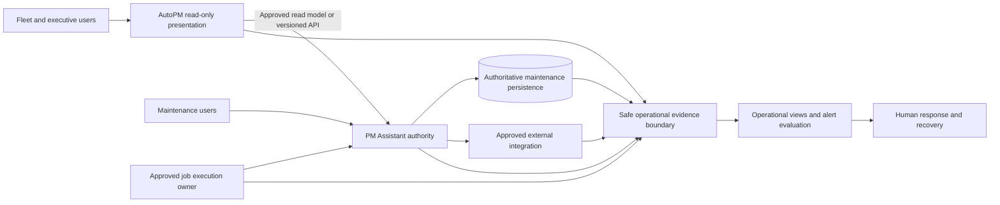

# FleetOS Operations and Observability Blueprint v1.0

## Purpose

This document defines the proposed operating model for FleetOS v1.0. It connects service health, monitoring, metrics, logging, tracing direction, alerting, dashboards, incidents, maintenance, backup, restore, continuity, disaster recovery, validation, rollout, and rollback without selecting products or claiming operational readiness.

## Scope and exclusions

The Blueprint covers:

- operational scope and responsibility boundaries;
- safe operational evidence across AutoPM and PM Assistant;
- lifecycle detection, response, recovery, and review;
- service health, monitoring, alerting, audit operations, and operational KPIs;
- backup, restore, continuity, disaster recovery, rollout, and rollback direction.

It does not authorize source changes, configuration, deployment, environment changes, data access, migration, credential actions, external-service actions, production operation, or Git operations.

## Operations requirement registry

| ID | Requirement |
| --- | --- |
| `OPS-001` | FleetOS operations preserve AutoPM and PM Assistant as separate bounded modules, deployment units, and rollback units. |
| `OPS-002` | PM Assistant remains authoritative for maintenance workflow information; operational tools and AutoPM never become authoritative writers. |
| `OPS-003` | Operational evidence distinguishes current implementation evidence, transitional direction, target operations, and future capability. |
| `OPS-004` | Every operationally significant component has a proposed owner role, detection path, response path, stop/go authority, recovery path, and evidence requirement before production approval. |
| `OPS-005` | Logs, metrics, traces/correlation, domain audit, security events, and business records remain distinct even when they share references. |
| `OPS-006` | Monitoring failure, missing telemetry, or an empty dashboard never becomes evidence that a component is healthy. |
| `OPS-007` | Liveness, readiness, degradation, availability, stale data, and business workflow status retain separate meanings. |
| `OPS-008` | Operational access follows least privilege, is attributable, and excludes credentials, unsafe payloads, unnecessary personal data, and internal topology. |
| `OPS-009` | Incident, maintenance, recovery, rollout, and rollback actions preserve authoritative data, history, audit, and uncertain-outcome evidence. |
| `OPS-010` | Operational objectives, thresholds, timings, retention, staffing, tools, and escalation commitments remain Product Owner decisions supported by evidence. |
| `OPS-011` | Operational validation uses isolated approved environments and synthetic or approved sanitized data unless separate access is authorized. |
| `OPS-012` | FleetOS operations are not described as production-ready or operational until owners, mechanisms, access, runbooks, monitoring, backup, restore, recovery, and rehearsals are validated. |

## Operating context

The diagram is conceptual. It selects no topology, product, provider, environment, or staffing model.

## State model

### Current implementation evidence

Repository documentation identifies local application logs, implementation-specific diagnostics and health behavior, SQLite persistence, in-process scheduling, notification and import records, browser cache, and source/freshness metadata. It does not prove centralized observability, approved alerting, operational ownership, tested backup/restore, incident readiness, or production service levels.

### Transitional direction

Transition should:

1. inventory safe operational signals and sensitive fields;
2. establish stable event and metric meanings without selecting a storage product;
3. separate liveness, readiness, degradation, and business state;
4. define role-based ownership and escalation candidates;
5. rehearse backup, restore, incident, rollback, and continuity in isolation;
6. compare legacy and target reads while preserving source and freshness;
7. retain current compatible paths until acceptance and rollback evidence pass.

### FleetOS v1.0 target operations

Target operations provide:

- safe, consistent service and module identity;
- observable application, API, job, import, notification, persistence, backup, restore, deployment, and security outcomes;
- protected logs, audit, security evidence, metrics, and correlation;
- actionable alerts with assigned owners and approved conditions;
- tested health, incident, continuity, recovery, rollout, and rollback procedures;
- evidence-based service objectives approved separately.

### Future outside v1.0

Potential future capabilities include dedicated round-the-clock operations, advanced automated remediation, multi-location continuity, enterprise telemetry analytics, automated cross-environment promotion, and predictive capacity management. Each requires separate business need, architecture, cost, security, implementation, and recovery approval.

## Operational ownership direction

Ownership below is role-based direction, not an implemented role or staffing assignment.

| Responsibility | Proposed accountable role | Required collaboration | Boundary |
| --- | --- | --- | --- |
| FleetOS scope, release, stop/go, and accepted risk | Product Owner | Module, security, data, and operations owners | Governance authority is not runtime superuser access. |
| AutoPM delivery, read behavior, cache, freshness, and presentation signals | AutoPM application owner | PM Assistant provider and operations owner | Read-only; no workflow or persistence authority. |
| PM Assistant runtime, authoritative workflows, APIs, jobs, imports, and notifications | PM Assistant application owner | Data, security, integration, and operations owners | Retains maintenance authority. |
| Authoritative persistence, backup, restore, and reconciliation | Data/recovery owner | PM Assistant and security owners | AutoPM receives no database access. |
| Operational signal definitions, dashboards, alerts, and incident coordination | Operations owner | All affected owners | Evidence and coordination only; no business-rule ownership. |
| Security events, containment, credentials, and access review | Security owner | Product Owner and affected owners | Never records or restores compromised secret values. |
| Business communication and user-impact decisions | Product Owner or approved delegate | Incident coordinator and module owners | Channel and delegation remain unresolved. |

Named people, rotations, alternates, emergency access, support hours, and handoff expectations remain `ODEC-002`.

## Operational lifecycle

Every stage must preserve safe evidence and distinguish confirmed, failed, partial, skipped, and uncertain outcomes.

## Evidence boundaries

| Evidence | Primary purpose | Must not become |
| --- | --- | --- |
| Metric | Aggregate measurement and trend | Authoritative business record or proof of cause |
| Operational log | Diagnostic sequence and runtime context | Immutable domain audit by assumption |
| Trace/correlation | Connect related operations | Authentication, authorization, ordering, or idempotency |
| Domain audit | Protected evidence of business-significant action | Debug log or unrestricted analytics feed |
| Security event | Detection and investigation of protected activity | General user-facing history |
| Health probe | Coarse runtime/service state | Business workflow or data-quality status |
| Operational dashboard | Review and response surface | AutoPM business KPI authority |

## Maintenance and change operations

Planned maintenance requires:

- approved scope, owner, affected boundaries, and communication route;
- compatibility, backup, restore, rollback, and forward-recovery review;
- explicit handling of readiness, job acquisition, imports, notifications, and active work;
- observable checkpoints and stop/go decisions;
- post-change validation and reconciliation;
- evidence retention and incident conversion if unexpected impact occurs.

Maintenance timing, frequency, notice, freeze rules, and permitted user impact remain unresolved.

## Future implementation impact

A later approved implementation may add instrumentation, telemetry transport, protected operational views, probes, alert evaluation, backup mechanisms, or incident tooling inside existing boundaries. It must not merge modules, create shared persistence, duplicate PM Assistant business rules, or require a particular vendor. Material changes to trust, persistence, deployment, identity, or integration require architecture and possibly ADR review.

## Unresolved operational decision registry

| ID | Decision required | Blocks or affects |
| --- | --- | --- |
| `ODEC-001` | Operational tooling, telemetry transport/storage, access, tenancy, and environment separation. | Monitoring, logging, metrics, tracing, dashboards, alerts |
| `ODEC-002` | Named owners, delegates, support model, coverage, handoff, emergency access, and escalation chain. | Operational readiness and incident response |
| `ODEC-003` | Service catalog, criticality, essential dependencies, degraded boundaries, and public/internal probe exposure. | Health and readiness |
| `ODEC-004` | Metric definitions, populations, units, labels, cardinality limits, and source-of-measurement rules. | Operational KPIs and SLOs |
| `ODEC-005` | Service objectives, alert conditions, severities, suppression, acknowledgement, recovery, and stabilization criteria. | Alerting, release, and incident operations |
| `ODEC-006` | Log, metric, trace, audit, security-event, incident, and evidence retention and deletion. | Privacy, investigation, cost, and compliance direction |
| `ODEC-007` | Correlation, causation, trace propagation, sampling, and cross-boundary trust behavior. | Diagnostics and incident reconstruction |
| `ODEC-008` | Incident classifications, authority, communications, external notification, review, and exception process. | Incident readiness |
| `ODEC-009` | Maintenance windows, change freezes, notice, approval, user-impact rules, and emergency-change handling. | Planned operations and rollout |
| `ODEC-010` | Backup scope, mechanism, frequency, retention, immutability, encryption, restore owner, RPO, and RTO. | Business continuity and disaster recovery |
| `ODEC-011` | Rollout cohorts, acceptance evidence, stop/go triggers, fallback policy, stabilization, rollback, and legacy retirement. | Operational rollout |
| `ODEC-012` | Runbook storage, access, review, rehearsal, update, and retirement governance. | Incident and recovery execution |

An unresolved decision is not permission to select a convenient default.

## Risks and documentation rollback

Primary risks are operational overclaim, invented targets, ambiguous ownership, telemetry becoming authority, unsafe sensitive-data collection, alert noise, misleading health, untested recovery, and duplicated requirements.

This Blueprint mitigates those risks through explicit states, specialized-document references, decision gates, safe evidence boundaries, and validation requirements. Documentation rollback consists of reverting only the nine files in `docs/operations/`. No runtime or data rollback is required for Phase 4.8.

## Completion direction

The Blueprint is documentation-complete when all nine files exist, required topics are covered, links and identifiers validate, unresolved decisions remain explicit, prohibited operational claims and vendor selections are absent, and no existing file or operational system is changed.
