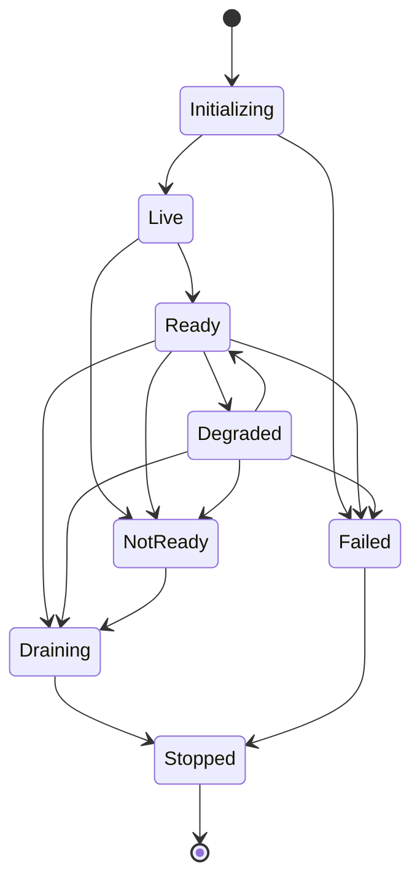

# FleetOS Service Health and Readiness

## Purpose

This document defines proposed health, liveness, readiness, degradation, dependency, startup, shutdown, and probe behavior for FleetOS v1.0. It does not implement an endpoint, select a probe mechanism, or declare any service healthy.

## Requirement registry

| ID | Requirement |
| --- | --- |
| `HEALTH-001` | Liveness answers whether a runtime can execute its minimal loop; it does not imply readiness, dependency availability, or business correctness. |
| `HEALTH-002` | Readiness answers whether essential approved dependencies can serve the component's intended responsibility safely. |
| `HEALTH-003` | Degraded means an approved non-essential capability is impaired while a defined safe subset remains available. |
| `HEALTH-004` | Not ready, unavailable, failed, stale, degraded, valid empty, and business workflow status remain distinct. |
| `HEALTH-005` | Missing authoritative data is never represented as a ready zero-result state. |
| `HEALTH-006` | Probe payloads expose only coarse state and no host, engine, schema, path, credential, target, internal topology, or unrestricted dependency detail. |
| `HEALTH-007` | Probe exposure, authentication, caching, polling, and dependency classification are deliberate approved decisions. |
| `HEALTH-008` | Readiness is withdrawn before planned shutdown or unsafe work where the runtime supports it. |
| `HEALTH-009` | Health transitions produce safe operational evidence and can be correlated with incidents, deployments, and recovery. |
| `HEALTH-010` | Monitoring or probe failure is represented as unknown/unavailable rather than healthy. |
| `HEALTH-011` | AutoPM and PM Assistant health models respect their different responsibilities and independent rollback. |
| `HEALTH-012` | No probe is considered production-ready until disclosure, dependency, failure, recovery, access, and load behavior are validated. |

## Health-state model

These states describe runtime/service condition only. They are never serialized as `pm_mileage_status`, `pm_workflow_status`, `completion_status`, or `notification_status`.

## State definitions

### Initializing

The component establishes safe identity/version, loads configuration references, constructs adapters, validates essential compatibility, and registers work without activating an unapproved duplicate job owner.

### Live

The runtime can execute its minimal loop. Live does not mean that persistence, data, API, authentication, jobs, notifications, or production controls are ready.

### Ready

The component can serve its approved essential responsibility. Essential dependencies and scope remain `ODEC-003`.

### Degraded

A non-essential capability is impaired, but an approved safe subset remains available. Degradation must be visible and must not bypass security, hide stale data, invent zeroes, or report uncertain work as successful.

### Not ready

The component cannot safely serve an essential responsibility. It may remain live for diagnostics, recovery, or controlled draining according to approved exposure and access.

### Draining

New work and job acquisition stop where supported, readiness is withdrawn, active work receives approved handling, and uncertain outcomes are recorded for reconciliation.

### Failed and stopped

Failed indicates unsafe initialization or continuation. Stopped accepts no work and does not delete or reclassify authoritative data, history, jobs, imports, notifications, or audit.

## Module-specific direction

### AutoPM

AutoPM health may include:

- delivery of approved static assets or application shell;
- ability to request the approved read boundary;
- explicit source, freshness, cache, fallback, and unavailable presentation;
- client/version and contract compatibility.

A labeled last-known-good view may be degraded, not current. AutoPM health never grants write authority or proves PM Assistant business correctness.

### PM Assistant

PM Assistant readiness may require:

- valid essential configuration references;
- compatible authoritative persistence/read dependency;
- approved API/application boundaries able to serve safe work;
- absence of unsafe scheduler ownership conflict;
- required security controls after their approval.

An optional notification or report provider may produce degradation rather than total unreadiness only after the exact boundary is approved.

### Background-job execution

Job readiness is distinct from application readiness. It requires approved execution ownership, configuration, occurrence identity, acquisition safety, dependency readiness, and recovery behavior. Application readiness must not silently activate jobs in every process.

## Dependency classification

Each dependency requires:

- owning component and intended responsibility;
- essential, conditionally essential, or optional classification;
- safe check that does not cause mutation or sensitive disclosure;
- failure, timeout, stale, and recovery behavior;
- readiness/degraded consequence;
- evidence and alert direction;
- maintenance and rollback handling.

Classifications, timeouts, check cadence, and dependency names remain unresolved.

## Probe response direction

A coarse response may identify:

- service/module;
- state;
- checked time;
- safe application or contract version where approved;
- optional coarse reason code.

It excludes implementation details and uses deliberate cache behavior. Exact schema remains governed by the proposed API and runtime decisions.

## Startup and shutdown

Startup direction:

1. establish module, version, and environment safely;
2. load and validate configuration without echoing values;
3. construct dependencies;
4. verify compatibility;
5. register routes and job definitions safely;
6. report liveness;
7. report readiness only after essential validation.

Shutdown direction:

1. withdraw readiness;
2. stop accepting or acquiring new work;
3. complete, cancel, checkpoint, or classify active work under approved policy;
4. record interrupted or uncertain outcomes;
5. flush required safe evidence;
6. close dependencies;
7. stop without claiming uncertain work succeeded.

No timing values are selected.

## Validation direction

Later tests should cover initialization success/failure, liveness/readiness distinction, essential and optional dependency loss, stale authoritative data, valid empty data, probe disclosure, access, caching, monitoring loss, recovery transitions, draining, interrupted work, independent module failure, and job-owner conflict.

Health and readiness ownership, dependencies, alerting, and exposure remain `ODEC-003` and `ODEC-005`.
